

# 2.6. Medio abiótico - Hidrología
Keywords: `basin` `basin-limit` `hec-hms` `dem-reconditioning` `fill` `fdr`  

A partir del modelo digital de elevación ESA Copernicus, cree el mapa de relleno de sumideros FIL. Reacondicione el modelo de terreno FIL como RawDEM, utilizando la red hidrográfica del POT (completar drenajes y abrir bucles). A partir del RawDEM, cree el mapa de direcciones de flujo FDR. Con la grilla FDR, cree el mapa de acumulación de flujo FAC. Con la grilla FAC, defina los drenajes con áreas de aportación de 1 km² creando un mapa binarizado. Cree una capa de puntos y a partir de la red de drenaje y del modelo digital de elevación, identifique al menos 3 puntos de control para delimitación de cuencas principales. A partir de los 3 puntos de control y utilizando el mapa FDR, delimite las 3 cuencas hidrográficas, convierta a vectores y analice las áreas obtenidas.

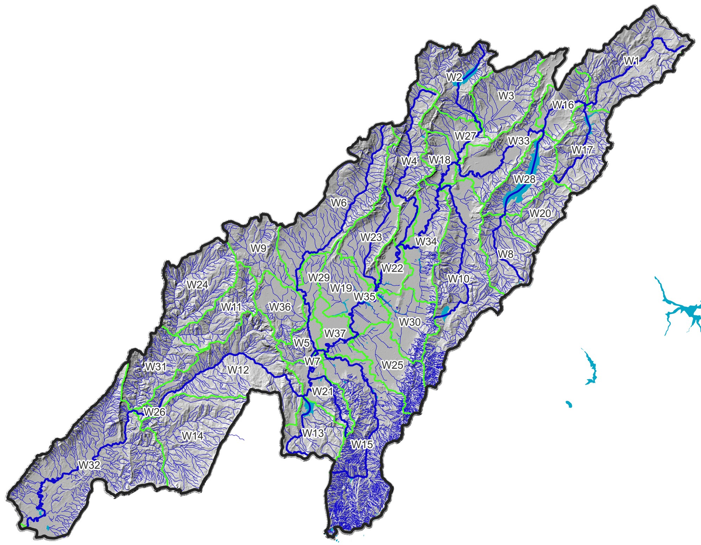

## Objetivos

* Generar el mapa de direcciones y acumulaciones de flujo.
* Delimitar cuencas hidrográficas a partir de puntos de estudio.
* Evaluar la extensión de las subcuencas contenidas en el área de proyecto.

## Requerimientos

Archivos, actividades previas, lecturas y herramientas requeridas para el desarrollo de esta actividad:

| Requerimiento                                                                                                 | Descripción                                                                 |
|:--------------------------------------------------------------------------------------------------------------|:----------------------------------------------------------------------------|
| [:mortar_board:Actividad](../RemoteSensingDL/Readme.md)                                                       | Modelo digital de elevación - DEM a partir de sensores remotos satelitales. |
| [:toolbox:Herramienta](https://qgis.org/)                                                                     | QGIS 4.0 o superior.                                                        |
| [:toolbox:Herramienta](https://www.hec.usace.army.mil/software/hec-hms/)                                      | HEC-HMS 4.12 o superior.                                                    |
| [:date:magna_origen_nacional.zip](../../file/data/ANLA/magna_origen_nacional.zip)                             | Geodatabase ANLA Magna Origen Nacional.                                     |
| [:date:diccionario_datos_geograficos_anla.xlsx](../../file/data/ANLA/diccionario_datos_geograficos_anla.xlsx) | Diccionario de datos geográficos ANLA.                                      |

## 1. Red de drenaje y capas requeridas

Para la delimitación correcta de las subcuencas contenidas en la zona de estudio, son necesarias las líneas de los drenajes para la modificación del modelo digital de elevación.

1. Desde el portal de https://www.colombiaenmapas.gov.co/ y https://datosabiertos.bogota.gov.co, descargue las bases de datos vectoriales y los vectores digitalizados de los drenajes y cuerpos de agua contenidos en la zona de estudio, utilice los siguientes enlaces:

| Elemento                                                                                            | Contiene                                                                                                                                                                                                                                                                                                                                                                                                                                                                                                                                                                                                                                                                                                                                                                                                                                                                                                                                                                                                                                                                                                                                                                                                                                                                                                                                                                                                                                                                                                                                                                                                                                                                                     |
|-----------------------------------------------------------------------------------------------------|----------------------------------------------------------------------------------------------------------------------------------------------------------------------------------------------------------------------------------------------------------------------------------------------------------------------------------------------------------------------------------------------------------------------------------------------------------------------------------------------------------------------------------------------------------------------------------------------------------------------------------------------------------------------------------------------------------------------------------------------------------------------------------------------------------------------------------------------------------------------------------------------------------------------------------------------------------------------------------------------------------------------------------------------------------------------------------------------------------------------------------------------------------------------------------------------------------------------------------------------------------------------------------------------------------------------------------------------------------------------------------------------------------------------------------------------------------------------------------------------------------------------------------------------------------------------------------------------------------------------------------------------------------------------------------------------|
| [GDB Esc. 1:500k IGAC](https://www.colombiaenmapas.gov.co/?u=0&t=23&servicio=204)                   | Instituto Geográfico Agustín Codazzi - IGAC, 2014. Cartografía vectorial a escala 1:500.000 con cobertura total de la República de Colombia. Contiene información sobre entidades territoriales, transporte terrestre y fluvial, hidrografía, relieve, orografía, construcciones. Referido al sistema de coordenadas MAGNA-SIRGAS, se genera a partir de la interpretación de objetos en una imagen ortorectificada provenientes de plataformas satelitales o aerotransportadas, disponible en los siguientes formatos: Geodatabase , Shapefile, PostGis , GeoPackage y servicios (WMS y WFS).                                                                                                                                                                                                                                                                                                                                                                                                                                                                                                                                                                                                                                                                                                                                                                                                                                                                                                                                                                                                                                                                                               |
| [GDB Esc. 1:100k IGAC](https://www.colombiaenmapas.gov.co/?u=0&t=23&servicio=205)                   | Instituto Geográfico Agustín Codazzi - IGAC, 2022. Cartografía vectorial a escala 1:100.000 con cobertura total de la República de Colombia. Contiene información sobre entidades territoriales, transporte terrestre y fluvial, hidrografía, relieve, orografía, construcciones. Se genera a partir de la interpretación de objetos en una imagen ortorectificada provenientes de plataformas satelitales o aerotransportadas.                                                                                                                                                                                                                                                                                                                                                                                                                                                                                                                                                                                                                                                                                                                                                                                                                                                                                                                                                                                                                                                                                                                                                                                                                                                              |
| [GDB Esc. 1:25k IGAC](https://www.colombiaenmapas.gov.co/?u=0&t=23&servicio=206)                    | Instituto Geográfico Agustín Codazzi - IGAC, 2018. Producto cartográfico básico actualizado a escala concertada, contiene elementos altimétricos y planimétricos de cartografía existente que se editan de acuerdo a la interpretación de objetos en una imagen ortorectificada provenientes de plataformas satelitales o aerotransportadas.                                                                                                                                                                                                                                                                                                                                                                                                                                                                                                                                                                                                                                                                                                                                                                                                                                                                                                                                                                                                                                                                                                                                                                                                                                                                                                                                                 |
| [Corrientes de agua EAAB](https://datosabiertos.bogota.gov.co/dataset/corriente-de-agua-bogota-d-c) | Empresa de Acueducto y Alcantarillado de Bogotá. Corriente de agua de origen natural o artificial de forma permanente o periódica que debido a la escala de su visualización es representada a través de geometrías tipo línea. Tiene como categorías; Canal sencillo: Cauce artificial abierto cuya sección transversal tiene una forma generalmente constante, claramente diferenciado, que contiene agua en movimiento, de forma permanente o periódica. Quebrada: Curso de agua de origen natural, de primer o segundo orden, con un caudal intermitente o permanente y un comportamiento generalmente torrencial. Las quebradas canalizadas continúan considerándose como quebradas. Río sencillo: Corriente natural de agua que fluye con continuidad, de tercer orden o superior, posee un caudal determinado y desemboca en el mar, en un lago o en otro río, en cuyo caso se denomina afluente. Los tramos de ríos que han sido revestidos y o rectificados, continúan considerándose ríos y no canales. Caño: Conductos que sirven para conducir fluidos. Drenaje: Todo aquel cauce o curso de agua no clasificado dentro de los otros tipos de drenaje.                                                                                                                                                                                                                                                                                                                                                                                                                                                                                                                           |
| [Cuerpos de agua EAAB](https://datosabiertos.bogota.gov.co/dataset/cuerpo-de-agua-bogota-d-c)       | Empresa de Acueducto y Alcantarillado de Bogotá. Área o extensión de agua sobre la tierra, de origen natural o artificial que debido a la escala de su visualización es representada a través de geometrías tipo polígono. Tiene como categorías; Río: Corriente natural de agua que fluye con continuidad, de tercer orden o superior, posee un caudal determinado y desemboca en el mar, en un lago o en otro río, en cuyo caso se denomina afluente. Los tramos de ríos que han sido revestidos y o rectificados, continúan considerándose ríos y no canales. Canal: Cauce artificial abierto cuya sección transversal tiene una forma generalmente constante, claramente diferenciado, que contiene agua en movimiento, de forma permanente o periódica. Laguna: Depósito de agua generalmente dulce. Humedal: Ecosistemas de gran valor natural y cultural, constituidos por un cuerpo de agua permanente o estacional de escasa profundidad, una franja a su alrededor que puede cubrirse por inundaciones periódicas (ronda hidráulica) y una franja de terreno no inundable, llamada zona de manejo y preservación ambiental. Embalse: Emplazamiento natural o artificial, usado para el almacenamiento la generación de energía eléctrica, regulación o control de recursos hídricos, abastecimiento de agua, riego o fines turísticos. Pantano: Capa de aguas estancadas y poco profundas en la cual crece una vegetación acuática a veces muy densa.Quebrada: Curso de agua de origen natural, de primer o segundo orden, con un caudal intermitente o permanente y un comportamiento generalmente torrencial. Las quebradas canalizadas continúan considerándose como quebradas. |

> Tenga en cuenta que los vectores en escala 1:25.000, deben ser descargados individualmente a partir de hojas cartográficas o masívamente a través de los servicios WFS o REST. Guarde y descomprima en las carpetas [/data/IGAC](../../data/IGAC) y [/data/EAAB](../../data/EAAB).

2. En QGIS, abra el mapa _/map/CaseStudy.qgz_ y guarde como _/map/BasinLimit.qgz_. Cargue las capas de índices de mapas para identificación de hojas cartográficas, drenajes sencillos y corrientes de agua de las diferentes fuentes obtenidas y evalué su precisión a partir de las imágenes satelitales disponibles en los mapas base. 

> Para facilitar el proceso de cargue y análisis, la compilación de los vectores de kos drenajes sencillos de Colombia se encuentran publicados en https://github.com/rcfdtools/R.IAMB/releases/tag/DrenajeSencilloIGAC.

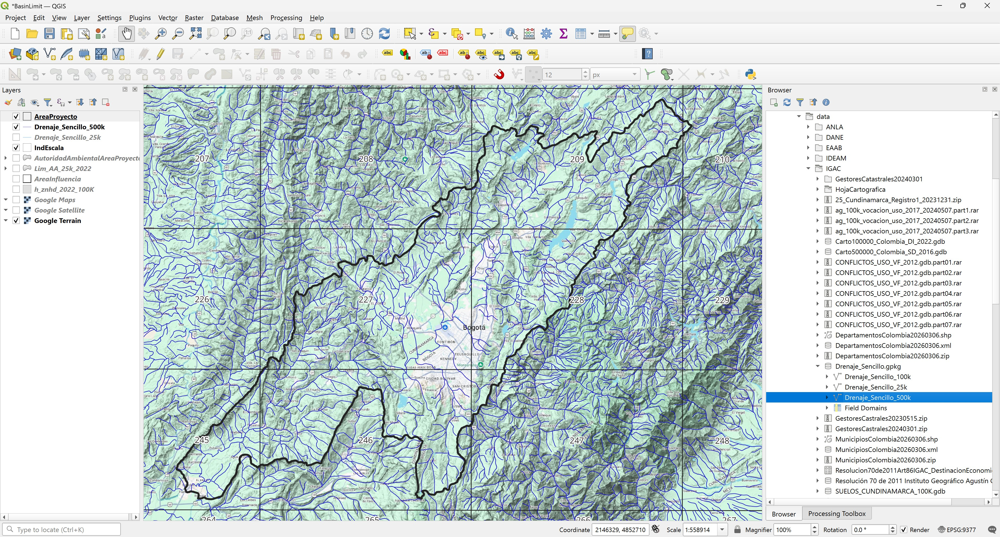Drenajes IGAC Escala 1:500k
 

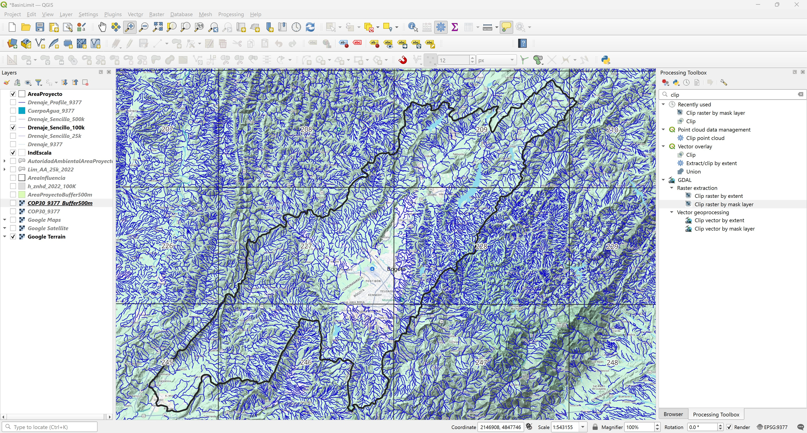Drenajes IGAC Escala 1:100k
 

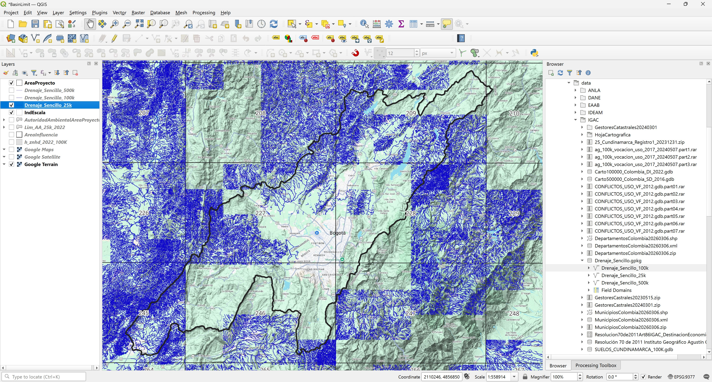Drenajes IGAC Escala 1:25k
 

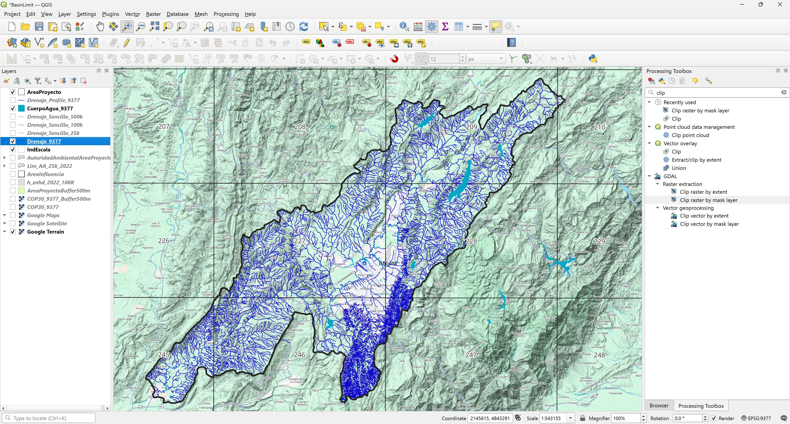Drenajes y cuerpos de agua EAAB
 

> Como observa, la red de drenaje a escala 1:25k del IGAC contiene una representación detallada los vectores requeridos para la delimitación de las cuencas requeridas, sin embargo, existe ausencia de múltiples planchas vigentes. Puede descargar versiones anteriores de las hojas cartográficas en las zonas faltantes, directamente desde https://www.colombiaenmapas.gov.co/. 

3. A partir de las diferentes versiones de las capas de drenajes obtenidas, identifique los ríos principales dentro de la zona de estudio y cree la capa geográfica _/shp/Drenaje_Profile_9377.shp_. Identifique los cauces por su nombre y calcule su longitud en metros.

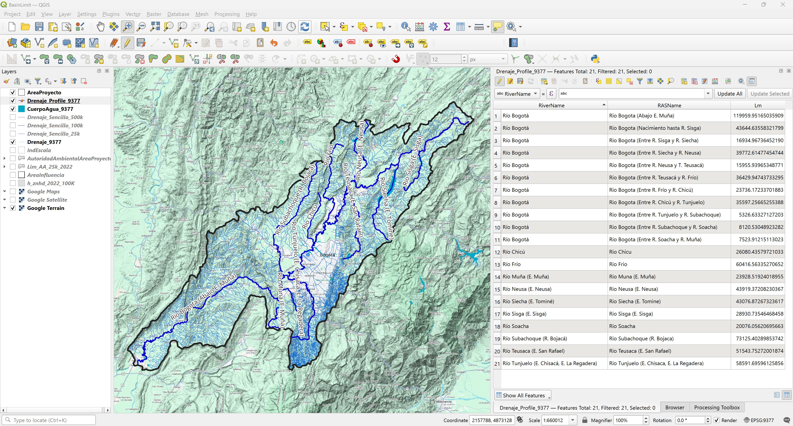

4. Agregue al mapa el modelo digital de elevación DEM /dem/COP30_9377.tif

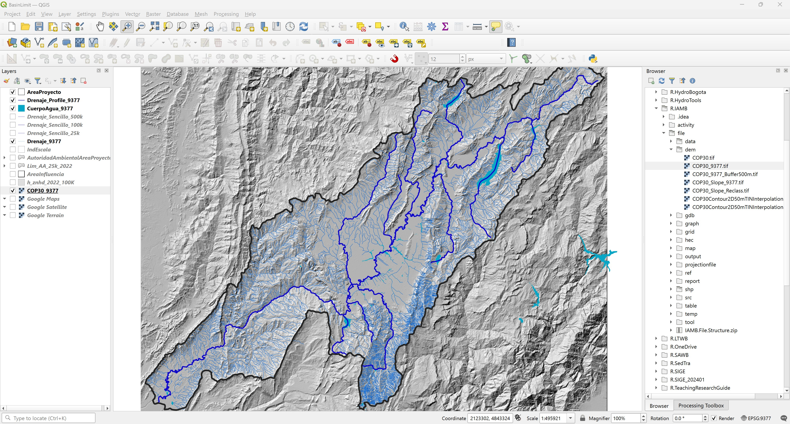

5. Utilizando la herramienta Vector _Geometry / Buffer_, cree un polígono con aferencia alrededor del área de proyecto, guarde como _/shp/AreaProyectoBuffer500m.shp_.

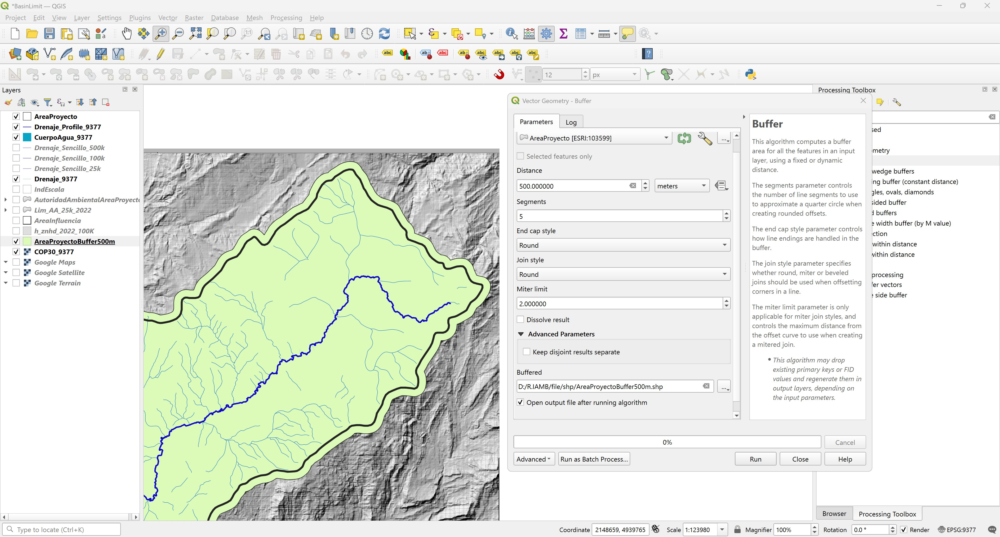

6. Utilizando la herramienta _GDAL / Raster Extraction / Clip Raster by Mask Layer_, recorte el DEM hasta el límite del buffer asignando `NoData = 0`, guarde como _/dem/COP30_9377_Buffer500m.tif_.   

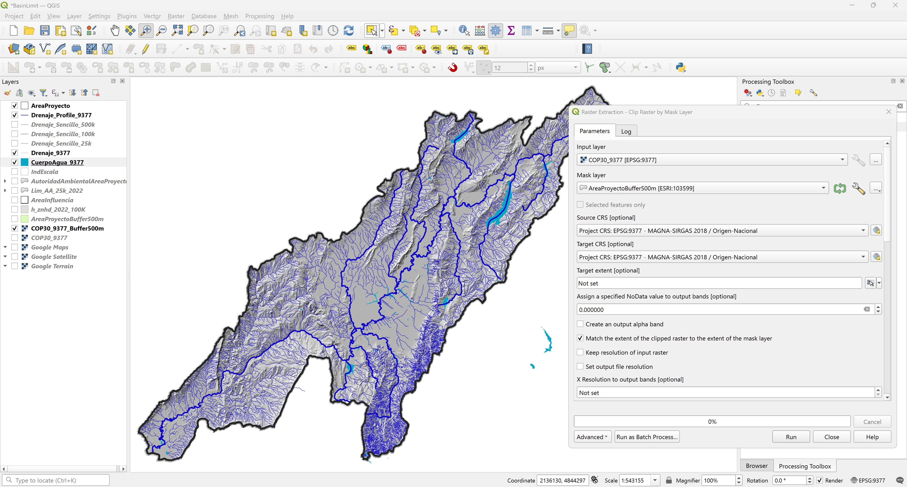

## 2. Delimitación de cuencas en HEC-HMS

1. En HEC-HMS, cree un proyecto nuevo en blanco definiendo _Metric_ en el sistema de unidades por defecto, guardar como _HECHMS_v0_ en la carpeta _/hec/_.

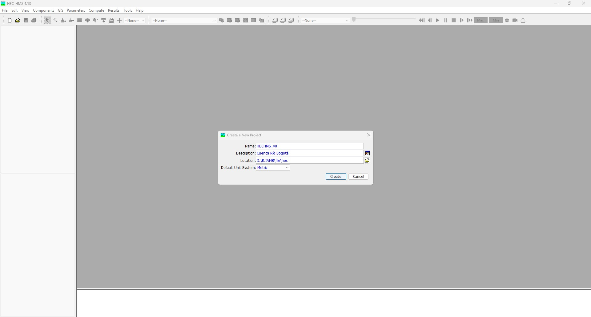

Automáticamente, obtendrá una carpeta con la estructura de directorios y archivos requeridos por este modelo, que para la versión 4.13 contendrá:

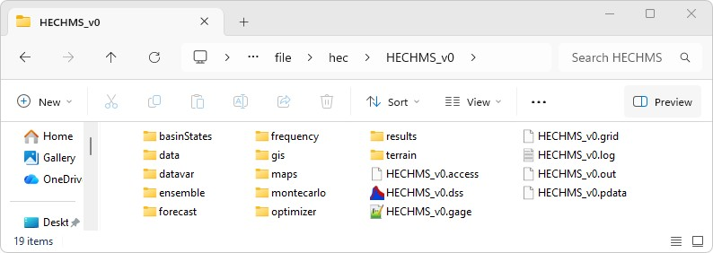

Dentro de la carpeta de proyecto cree un nuevo folder con el nombre _projectionfile_ y copie dentro el archivo de proyección de coordenadas [MAGNA_OrigenNacional.prj](../../file/projectionfile) correspondiente al CRS 9377. 

2. En el menú _Components / Create Component / Basin Model_, cree un modelo de cuenca y nómbrelo como _RioBogota_.

> Evite utilizar caracteres especiales diferentes a los utilizados en el idioma inglés, tales como eñes y tildes.

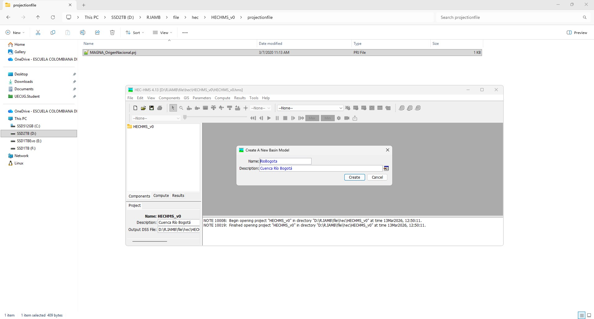

3. En la tabla de contenido localizada a la izquierda, seleccione _HECHMS_v0 / Basin Models / RioBogota_, luego en el menú _GIS – Coordinate System_ seleccione el sistema de proyección de coordenadas _9377.prj_ localizado en el directorio _D:\R.SIGE\file\HECHMS\projectionfile_. 

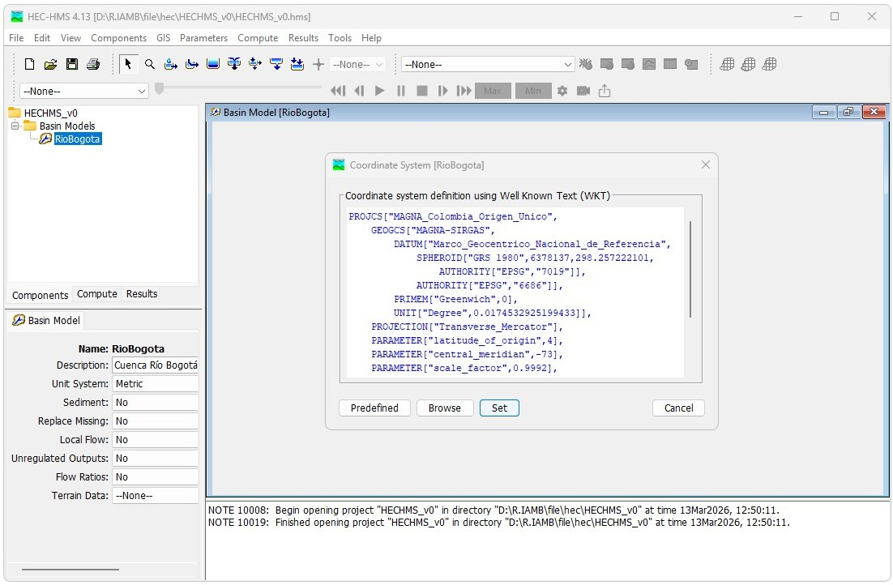

4. En el menú _Components / Create Component / Terrain Data_, cree el terreno a partir del modelo digital de elevación - DEM Copernicus almacenado en la ruta [/dem/COP30_9377_Buffer500m.tif](../../file/dem), seleccionando unidades verticales en metros, nombrar como _COP30.

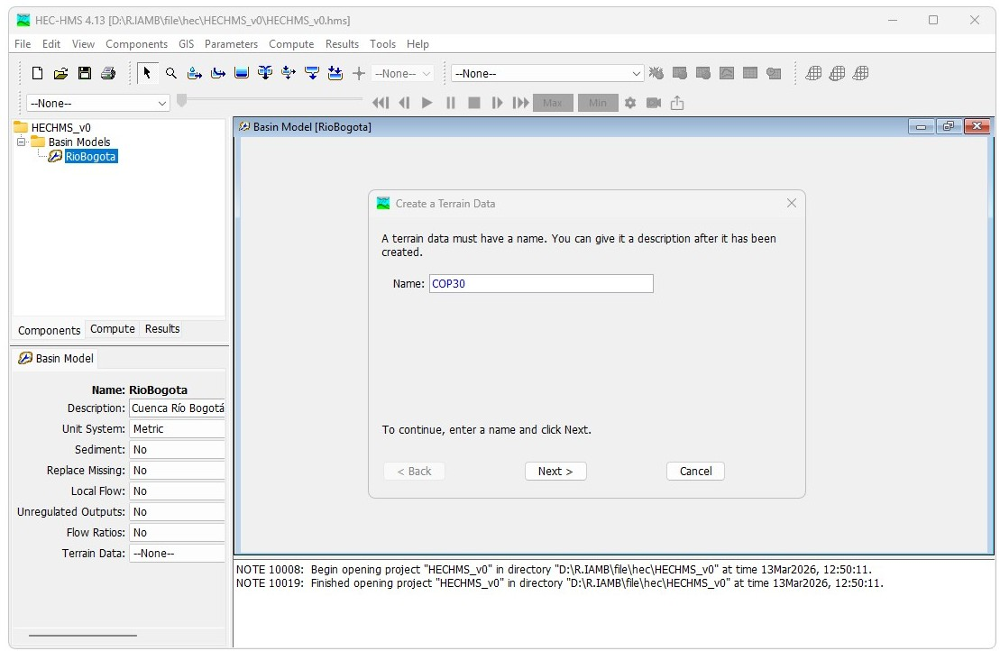

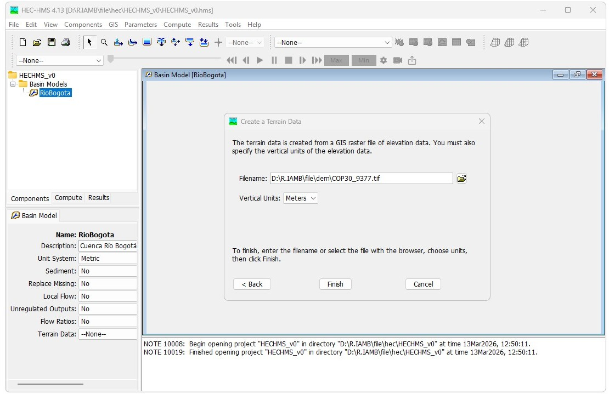

Automáticamente, el modelo de terreno será copiado en la carpeta `/hec/HECHMS_v0/terrain/`.

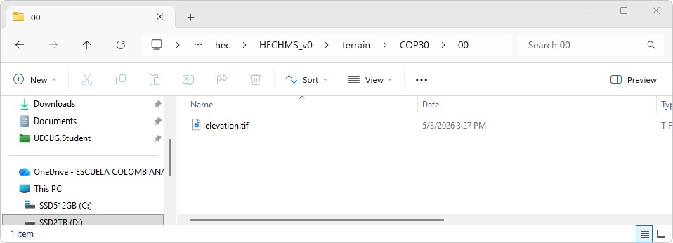

5. En la tabla de contenido, seleccione _HECHMS_v0 / Basin Models / RioBogota_ y en la parte inferior asocie el terreno creado al modelo de cuencas.

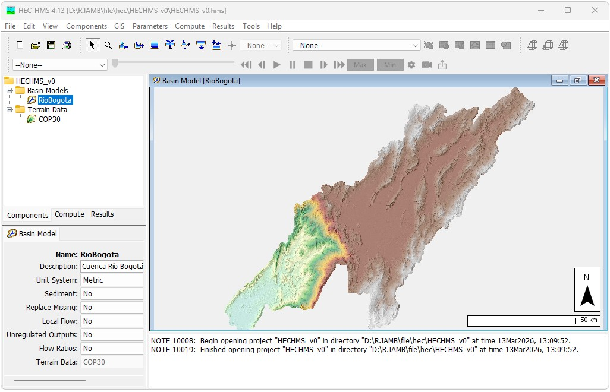

6. En la tabla de contenido, seleccione _HECHMS_v0 / Basin Models / RioBogota_ y en el menú _GIS_, seleccione la opción _Terrain Reconditioning_. El primer paso (Step 1) permite crear paredes perimetrales de confinamiento utilizando el borde de una cuenca previamente digitalizada, utilice la capa _/shp/AreaProyecto.shp_ establezca:

* Smooth raise cell buffer: 3
* Smooth raise height: 100
* Sharp raise height: 100
 

El segundo paso (Step 2) permite modificar el terreno incrustando los drenajes, para ello, utilice la capa _/shp/Drenaje_Profile_9377.shp_ y defina:

* Número de celdas aferentes o _Smooth drop cell buffer_: 5
* Profundidad de suavizado lateral o _Smooth drop height_: 10
* Profundidad de incrustación en el cauce o _Sharp drop height_: 1000 para garantizar que en el relleno de sumideros se mantenga la localización de las celdas correspondientes a los drenajes marcados)

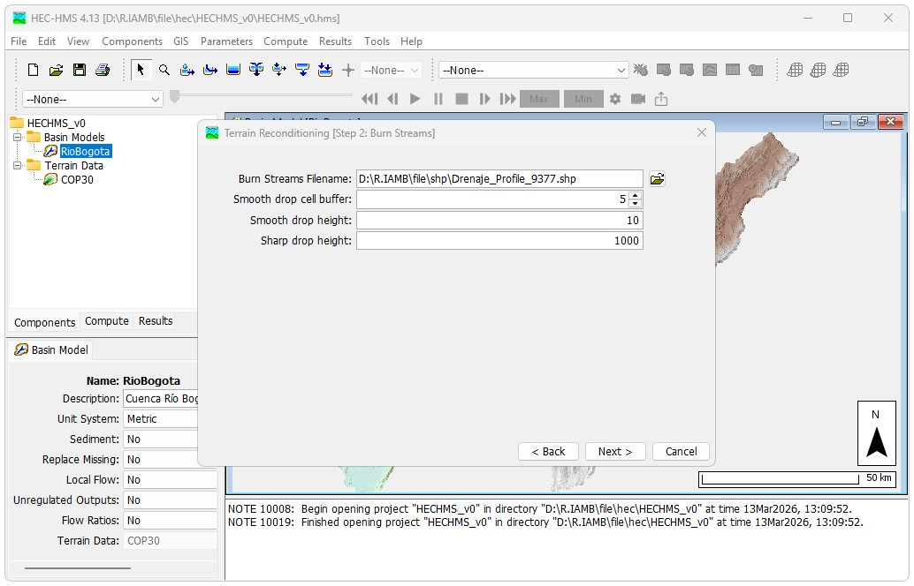

Luego de terminada la ejecución podrá observar que ahora el DEM contiene la localización de las paredes perimetrales y de los drenajes en el terreno.

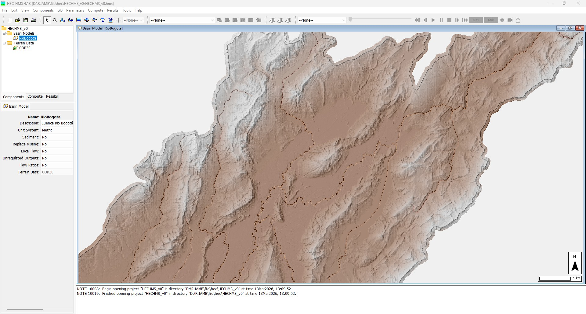

7. En la tabla de contenido, seleccione _HECHMS_v0 / Basin Models / RioBogota_ y en el menú _GIS_, seleccione la opción `Preprocess Sinks` que identificará y rellenara los sumideros o zonas bajas donde el flujo puede confinarse y no drenar.

> Este proceso es especialmente importante debido a que garantiza que todas las celdas del DEM drenen hacia un punto más bajo.

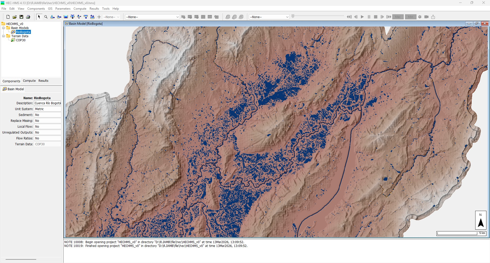

Podrá observar que al desplazarse por el mapa se visualizan momentáneamente los mapas previamente generados, para visualizar únicamente el último mapa creado, de clic derecho sobre el mapa, seleccione la opción _Map Layers_ y deje activo solo los mapas Sink.

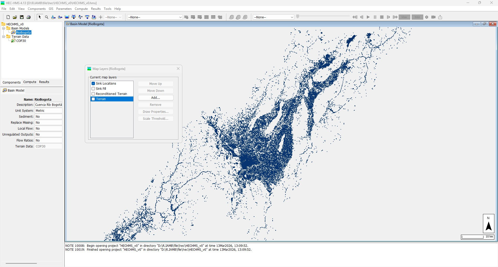

8. En la tabla de contenido, seleccione _HECHMS_v0 / Basin Models / RioBogota_ y en el menú _GIS_, seleccione la opción `Preprocess Drainage` que le permitirá conocer en detalle como drena el flujo sobre el modelo de terreno.

> Para mejorar la interpretación de los drenajes identificados, agregue en _Map Layers_ las capas del área de proyecto y drenajes desde la carpeta _/shp/_.

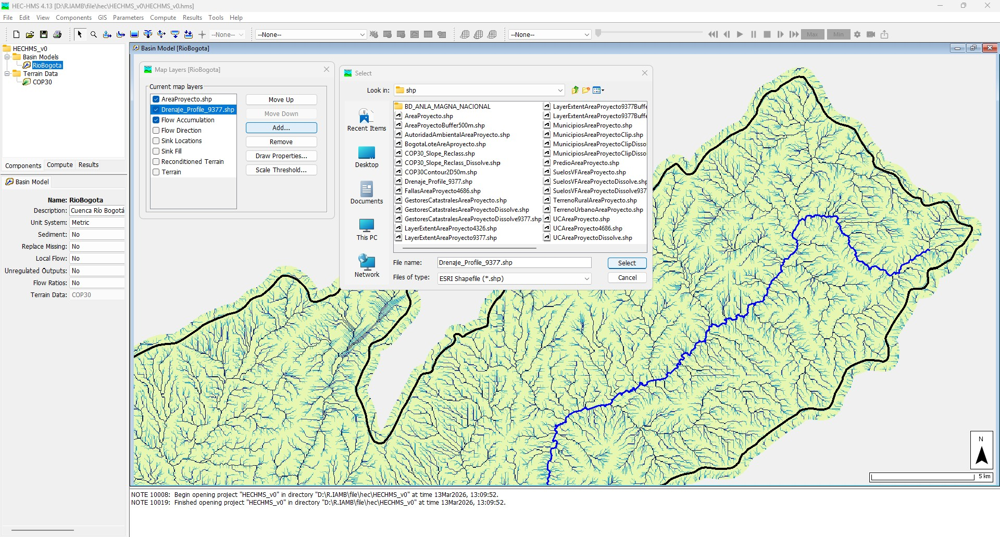

Dando clic derecho en el mapa, desactive el mapa _Flow Acumulation_ y visualice el mapa _Flow Direction_.

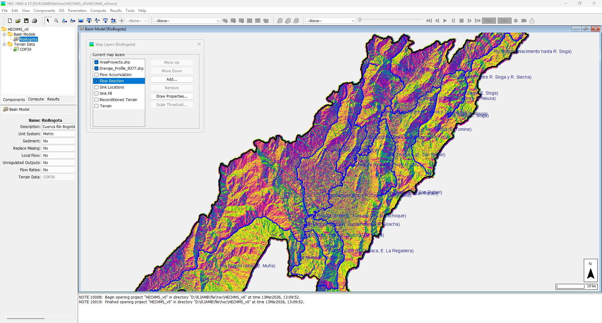

9. En la tabla de contenido, seleccione _HECHMS_v0 / Basin Models / RioBogota_ y en el menú _GIS_, seleccione la opción `Identify Stream` que le permitirá definir el área de aportación (100 km²) a partir de la cual obtendrá o generará las cuencas del modelo. Visualice el resultado utilizando como fondo el modelo de terreno.

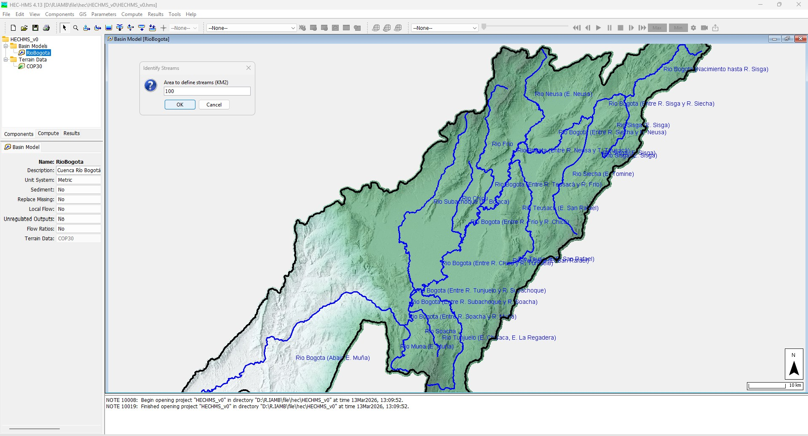

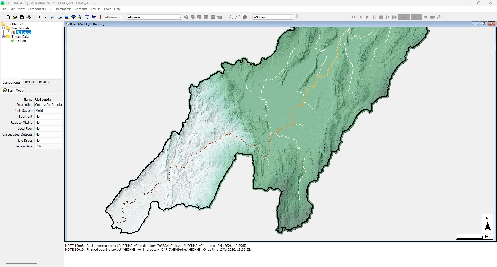

10. Utilizando la herramienta _Break Point Creation Tool_ cree un punto de extracción o sifón de cuenca en la parte baja del Río Bogotá.

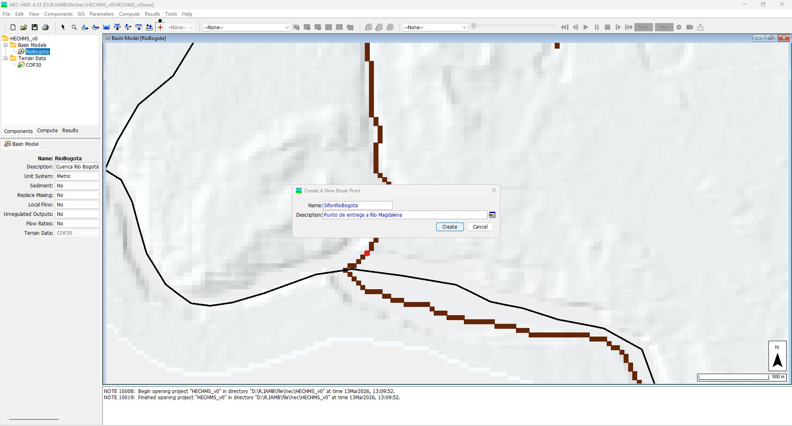

11. En la tabla de contenido, seleccione _HECHMS_v0 / Basin Models / RioBogota_ y en el menú _GIS_, seleccione la opción `Delineate Elements` que le permitirá extraer las cuencas y drenajes hasta el punto de estudio definido. Utilice los prefijos W, R, J.

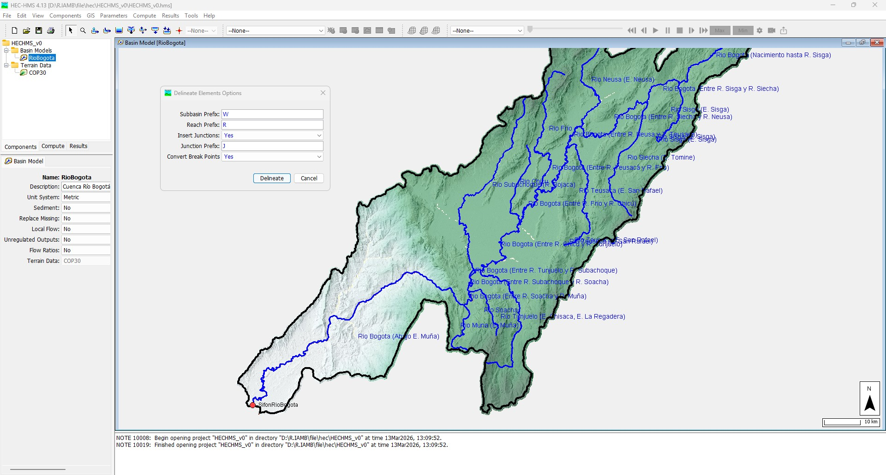

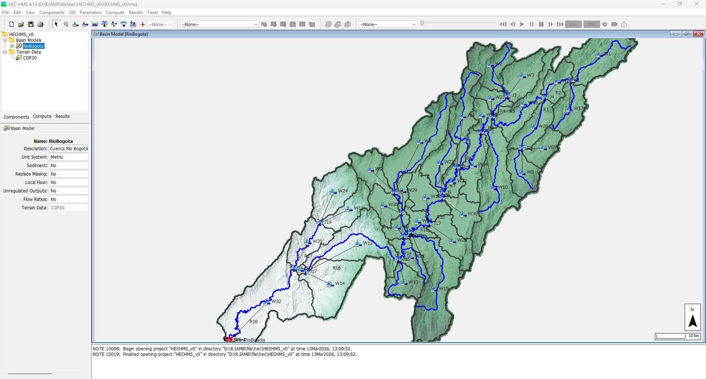

12. En la tabla de contenido, seleccione _HECHMS_v0 / Basin Models / RioBogota_ y en el menú _GIS_, seleccione la opción `Export Layers` que le permitirá exportar uno a uno los elementos generados. Exporte las subcuencas y los drenajes obtenidos junto con sus propiedades en la carpeta `/shp/' como _RioBogotaCuencas.shp_ y _RioBogotaDrenajes.shp_.

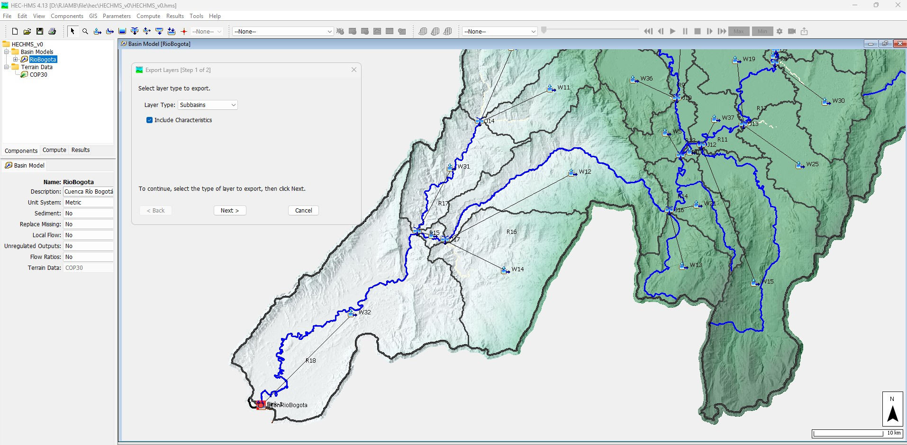

## 3. Visualización de cuencas y grillas

1. En el mapa _BasinLimit_ de QGIS, cargue desde la carpeta `/shp/` las capas `RioBogotaCuencas.shp` y `RioBogotaDrenajes.shp` generadas desde HEC-HMS.

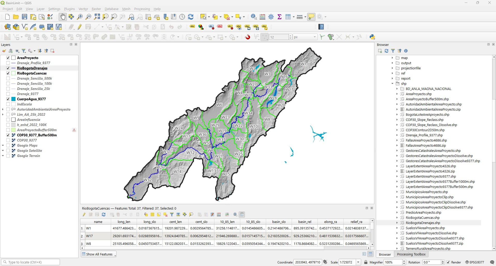

> Tenga en cuenta que el límite de la cuenca obtenido puede ser ligeramente diferente al de la subzona hidrográfica del IDEAM.

2. Cargue y visualice los diferentes mapas ráster generados en HEC-HMS.

Modelo digital de terreno ajustado con drenajes  

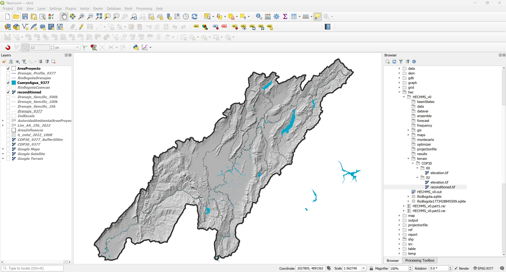

Relleno y localización de sumideros  

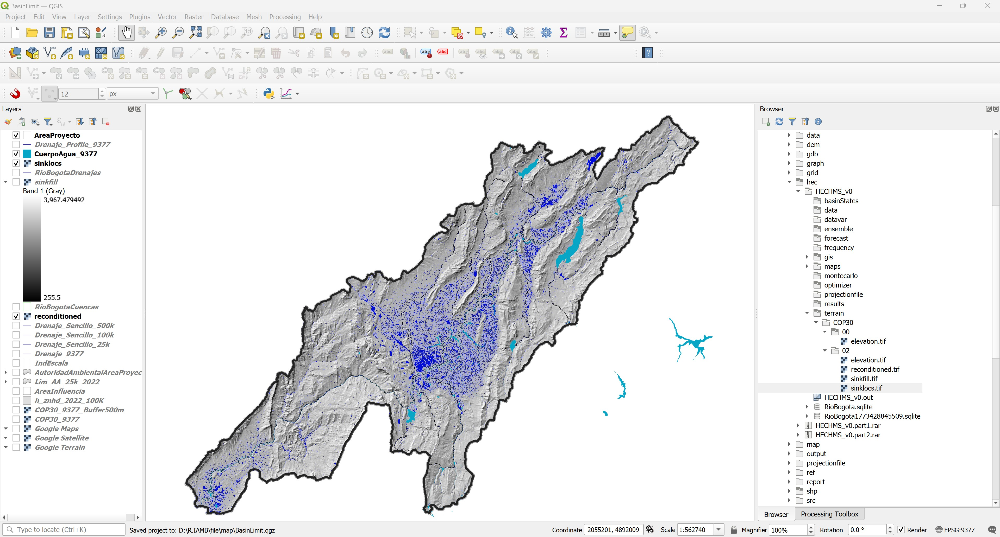

Acumulación de flujo  

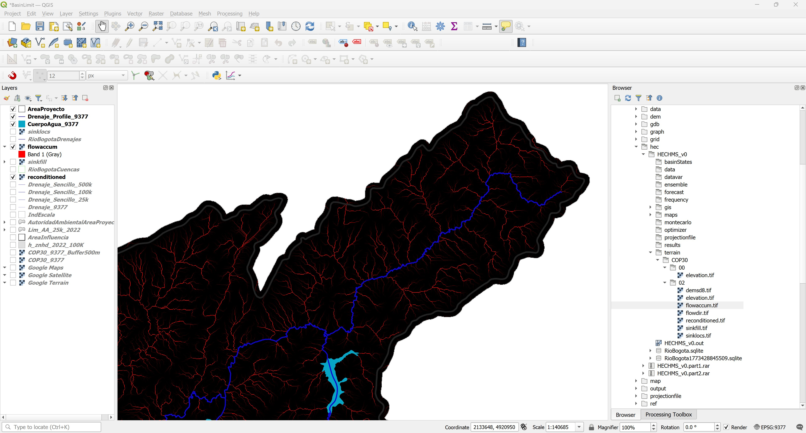

Dirección de flujo  

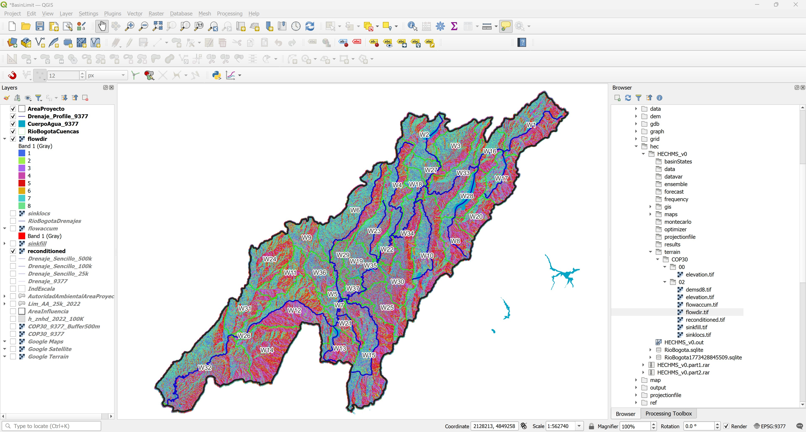

:pencil2:**Tarea:** Homologue y cargue el análisis realizado en la capa _CuencaHidrografica_ del modelo ANLA.

## Referencias

* [HEC-HMS Technical Reference Manual](https://www.hec.usace.army.mil/confluence/hmsdocs/hmstrm)
* [HEC-HMS User's Manual](https://www.hec.usace.army.mil/confluence/hmsdocs/hmsum/latest)

##

_R.IAMB es de uso libre para fines académicos, conoce nuestra licencia, cláusulas, condiciones de uso y como referenciar los contenidos publicados en este repositorio, dando [clic aquí](../../LICENSE.md)._

_¡Encontraste útil este repositorio!, apoya su difusión marcando este repositorio con una ⭐ o síguenos dando clic en el botón Follow de [rcfdtools](https://github.com/rcfdtools) en GitHub._

| [◄ Anterior](../RemoteSensingDL/Readme.md) | [:house: Inicio](../../README.md) | [:beginner: Ayuda / Colabora](https://github.com/rcfdtools/R.IAMB/discussions/1) | [Siguiente ►](../xxxx/Readme.md) |
|-------------------------------------|-----------------------------------|----------------------------------------------------------------------------------|----------------------------------|

[^1]:
