

# 2.7. Medio abiótico - Clima - Estación meteorológica
Keywords: `ideam` `weather-station` `display-xy-Data` `buffer` `merge` `bar-graph` `select-by-location` `statistics`

A partir de las tablas del Catálogo Nacional de Estaciones del IDEAM y otras entidades, cree un catálogo integrado de estaciones. A partir del límite de las sub-zonas hidrográfica, seleccione y analice las estaciones con cubrimiento y alrededor de la zona de estudio.

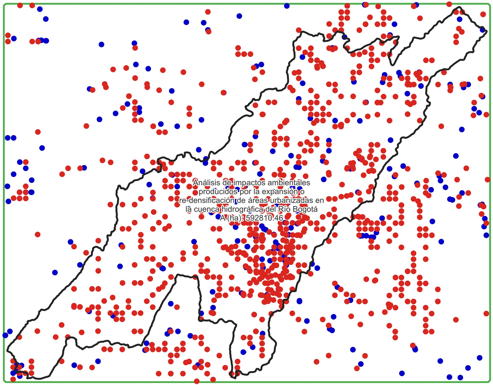

## Objetivos

* Descargar el catálogo nacional de estaciones - CNE del IDEAM y de otras entidades de Colombia.
* Conocer las categorías de las estaciones hidro-climatológicas y qué tipo de observaciones realizan.
* Conocer los estados, tecnologías y niveles de aprobación de los datos en estaciones.
* Identificar los atributos contenidos en el catálogo de objetos del CNE.
* A partir de un polígono envolvente, seleccionar, exportar e integrar las estaciones del IDEAM y de otras entidades en un único catálogo.
* Calcular la longitud hipotética de las series a partir de la fecha de instalación y suspensión de las estaciones utilizando Python Script.
* Calcular la longitud hipotética de las series dentro de una ventana de tiempo establecida a partir de las estaciones utilizando Python Script.

## Requerimientos

Archivos, actividades previas, lecturas y herramientas requeridas para el desarrollo de esta actividad:

| Requerimiento                                                                                                 | Descripción                                                                                        |
|:--------------------------------------------------------------------------------------------------------------|:---------------------------------------------------------------------------------------------------|
| [:toolbox:Herramienta](https://qgis.org/)                                                                     | QGIS 4.0 o superior.                                                                               |
| [:package:magna_origen_nacional.zip](../../file/data/ANLA/magna_origen_nacional.zip)                             | Geodatabase ANLA Magna Origen Nacional.                                                            |
| [:date:diccionario_datos_geograficos_anla.xlsx](../../file/data/ANLA/diccionario_datos_geograficos_anla.xlsx) | Diccionario de datos geográficos ANLA.                                                             |
| [:round_pushpin:qgis_station_len_years.py](../../file/src/qgis_station_len_years.py)                          | Script en Python para análisis de longitud hipotética de series en estaciones hidroclimatológicas. |

## 1. Conceptos generales

### 1.1. Conceptos y atributos que componen el catálogo nacional de estaciones y especificaciones

El [Instituto de Hidrología, Meteorología y Estudios Ambientales - IDEAM](http://www.ideam.gov.co/) de Colombia, adscrito al [Ministerio de Medio Ambiente - Minambiente](https://www.minambiente.gov.co/), es la entidad nacional encargada registrar y mantener la información hidrometeorológica del país, incluida la localización y clasificación de la red de estaciones que hace parte del [Catálogo Nacional de Estaciones - CNE](http://dhime.ideam.gov.co/). A través del portal [DHIME](http://dhime.ideam.gov.co/atencionciudadano/) del IDEAM desde la pestaña _Recursos_, personas naturales o jurídicas, pueden obtener no solamente los catálogos, sino también las capas geográficas y los registros discretos registrados en cada estación.

Tomados directamente del catálogo de objetos del archivo [CNE_IDEAM.xls](http://dhime.ideam.gov.co/) v20240702 y tipos devueltos por Python / Pandas.

| Atributo             | Tipo        | Descripción                                                                                                                                                                                                                                    |
|:---------------------|:------------|:-----------------------------------------------------------------------------------------------------------------------------------------------------------------------------------------------------------------------------------------------|
| OBJECTID             | int64       | Identificador de objeto espacial proveniente de la GDB IDEAM.                                                                                                                                                                                  |
| CODIGO               | int64       | Código de la estación.                                                                                                                                                                                                                         |
| nombre               | object      | Nombre de la estación. Incluye el código de la estación entre corchetes.                                                                                                                                                                       |
| CATEGORIA            | object      | Categoría de la estación: Pluviométrica, Limnimétrica, Limnigráfica, Climática Ordinaria, Climática Principal, Pluviográfica, Meteorológica Especial, Agrometeorológica, Sinóptica Principal, Radio Sonda, Mareográfica, Sinóptica Secundaria. |
| TECNOLOGIA           | object      | Tecnología para captura, registro y transmisión: Convencional, Automática con Telemetría, Automática sin Telemetría.                                                                                                                           |
| ESTADO               | object      | Estado de funcionamiento: Activa, Suspendida, En Mantenimiento.                                                                                                                                                                                |
| FECHA_INSTALACION    | datetime64  | Fecha de instalación. FECHA_INST en archivos Shapefile.                                                                                                                                                                                        |
| altitud              | int64       | Altitud o cota sobre el nivel del mar en metros.                                                                                                                                                                                               |
| latitud              | float64     | Latitud en grados decimales.                                                                                                                                                                                                                   |
| longitud             | float64     | Longitud en grados decimales.                                                                                                                                                                                                                  |
| DEPARTAMENTO         | object      | Departamento o zonificación política. Equivalente a estados en otros países. DEPARTAMEN en archivos Shapefile.                                                                                                                                 |
| MUNICIPIO            | object      | Municipio o subzonificación política. Equivalente a condado en otros países.                                                                                                                                                                   |
| AREA_OPERATIVA       | object      | Área operativa que administra la estación. AREA_OPERA en archivos Shapefile.                                                                                                                                                                   |
| AREA_HIDROGRAFICA    | object      | Área hidrográfica a la cual pertenece. AREA_HIDRO en archivos Shapefile.                                                                                                                                                                       |
| ZONA_HIDROGRAFICA    | object      | Zona hidrográfica a la cual pertenece. ZONA_HIDRO en archivos Shapefile.                                                                                                                                                                       |
| observacion          | object      | Observaciones generales. observacio en archivos Shapefile.                                                                                                                                                                                     |
| CORRIENTE            | object      | Corriente, cauce o río próximo o sobre la cuál está localizada la estación.                                                                                                                                                                    |
| FECHA_SUSPENSION     | datetime64  | Fecha de suspensión. FECHA_SUSP en archivos Shapefile.                                                                                                                                                                                         |
| SUBZONA_HIDROGRAFICA | object      | Subzona hidrográfica a la cual pertenece.SUBZONA_HI en archivos Shapefile.                                                                                                                                                                     |
| ENTIDAD              | object      | Entidad encargada.                                                                                                                                                                                                                             |
| subred               | object      | Subred a la cual pertenece.                                                                                                                                                                                                                    |

> Los atributos presentados en la tabla, su tipo de escritura y notación han sido tomados del archivo original y no se encuentran normalizados a 11 caracteres para garantizar la compatibilidad con el formato .dbf. Se puede observar que los datos volcados en el archivo CNE_IDEAM.xls han sido generados utilizando la herramienta _Table to Table_ de ArcGIS desde una Geodatabase que permite la definición de atributos con más de 11 caracteres. 
> 
> Los atributos del catálogo nacional de estaciones y de otras entidades son equivalentes. Catálogos exportados a archivos de formas Shapefile utilizan máximo 10 caracteres en la definición de atributos.

### 1.2. Categorías de las estaciones

Definiciones generales del catálogo nacional de estaciones tomado de [Anexo 2 - Definiciones CNE](http://www.ideam.gov.co/documents/10182/557765/Definiciones+CNE.pdf) del IDEAM.

| Categoría                        | Abrv. | Descripción                                                                                                                                                                                                                                                                                                                                                                                                                                                                                                         |
|:---------------------------------|:-----:|---------------------------------------------------------------------------------------------------------------------------------------------------------------------------------------------------------------------------------------------------------------------------------------------------------------------------------------------------------------------------------------------------------------------------------------------------------------------------------------------------------------------|
| Estación Agrometeorológica       |  AM   | En esta estación se realizan observaciones meteorológicas y otras observaciones que ayudan a determinar las relaciones entre el clima, por una parte y la vida de las plantas y los animales por la otra. Incluye el mismo programa de observaciones de la estación climatológica principal, más registros de temperatura a varias profundidades (hasta un metro) y en la capa cercana al suelo (0, 10 y 20 cm sobre el suelo).                                                                                     |
| Estación Climatológica Ordinaria |  CO   | Es aquella en la cual se hacen observaciones de precipitación, temperatura del aire, temperaturas máxima y mínima a 2 metros y humedad primordialmente. Poseen muy poco instrumental registrador. Algunas llevan instrumentos adicionales tales como tanque de evaporación, heliógrafo y anemómetro.                                                                                                                                                                                                                |
| Estación Climatológica Principal |  CP   | Es aquella en la cual se hacen observaciones de precipitación, temperatura del aire, temperaturas máxima y mínima a 2 metros, humedad, viento, radiación, brillo solar, evaporación, temperaturas extremas del tanque de evaporación, cantidad de nubes y fenómenos especiales. Gran parte de estos parámetros se obtienen de instrumentos registradores.                                                                                                                                                           |
| Estación Limnigráfica            |  LG   | Estación donde se mide el nivel de una corriente hídrica mediante un aparato registrador de nivel y que grafica una curva llamada limnigrama.                                                                                                                                                                                                                                                                                                                                                                       |
| Estación Limnimétrica            |  LM   | Estación donde se mide el nivel de una corriente hídrica mediante un aparato (mira dividida en centímetros) que mide altura del agua, sin registrarla. Una persona toma el dato y lo registra en una libreta.                                                                                                                                                                                                                                                                                                       |
| Estación Mareográfica            |  MG   | Estaciones para observación del estado del mar. Mide nivel, temperatura y salinidad de las aguas marinas.                                                                                                                                                                                                                                                                                                                                                                                                           |
| Estación Meteorológica especial  |  ME   | Estación instalada para realizar seguimiento a un fenómeno o un fin específico, por ejemplo, las heladas.                                                                                                                                                                                                                                                                                                                                                                                                           |
| Estación Pluviográfica           |  PG   | Es aquella que registra en forma mecánica y continua la precipitación, en una gráfica que permite conocer la cantidad, duración, intensidad y periodo en que ha ocurrido la lluvia. Actualmente se utilizan los pluviógrafos de registro diario.                                                                                                                                                                                                                                                                    |
| Estación Pluviométrica           |  PM   | Es una estación meteorológica dotada de un pluviómetro o recipiente que permite medir la cantidad de lluvia caída entre dos observaciones consecutivas.                                                                                                                                                                                                                                                                                                                                                             |
| Estación Radio Sonda             |  RS   | La estación de radiosonda tiene por finalidad la medición directa de parámetros atmosféricos tales como temperatura del aire, presión atmosférica, humedad relativa y dirección y velocidad del viento en las capas altas de la atmósfera (tropósfera y baja estratósfera), mediante el rastreo, por medios electrónicos, de la trayectoria de un globo meteorológico que asciende libremente y que lleva un dispositivo con los sensores que miden y transmiten la señal con los datos.                            |
| Estación Sinóptica Principal     |  SP   | En este tipo de estación se efectúan observaciones de los principales elementos meteorológicos en horas convenidas internacionalmente. Los datos se toman horariamente y corresponden a nubosidad, dirección y velocidad de los vientos, presión atmosférica, temperatura del aire, tipo y altura de las nubes, visibilidad, fenómenos especiales, características de humedad, precipitación, temperaturas extremas, capas significativas de nubes, recorrido del viento y secuencia de los fenómenos atmosféricos. |
| Estación Sinóptica Secundaria    |  SS   | Al igual que en la estación anterior, las observaciones se realizan a horas convenidas internacionalmente y los datos corresponden comúnmente a visibilidad, fenómenos especiales, tiempo atmosférico, nubosidad, estado del suelo, precipitación, temperatura del aire, humedad del aire, presión y viento.                                                                                                                                                                                                        |
> Las abreviaturas contenidas en la columna Abrv., han sido definidas por [rcfdtools](https://github.com/rcfdtools) con el propósito de simplificar las cabeceras incluidas en la tabla de observaciones por tipo de estación.

### 1.3. Observaciones según la categoría de la estación :new:

En la siguiente tabla preliminar desarrollada por [rcfdtools](https://github.com/rcfdtools), se presentan los tipos de observaciones que pueden ser realizadas por las estaciones dependiendo de su categoría.

| Observación / Categoría                        | AM  | CO  | CP  | LG  | LM  | MG  | ME  | PG  | PM  | RS  | SP  | SS  |
|:-----------------------------------------------|-----|-----|-----|-----|-----|-----|-----|-----|-----|-----|-----|-----|
| Precipitación                                  | ✓   | ✓   | ✓   |     |     |     |     | ✓   | ✓   |     | ✓   | ✓   |
| Temperatura del aire cerca al suelo            | ✓   | ✓   | ✓   |     |     |     |     |     |     |     | ✓   | ✓   |
| Temperatura máxima del aire a 2 metros         | ✓   | ✓   | ✓   |     |     |     |     |     |     |     |     |     |
| Temperatura mínima del aire a 2 metros         | ✓   | ✓   | ✓   |     |     |     |     |     |     |     |     |     |
| Temperatura del aire en capa alta de atmósfera |     |     |     |     |     |     |     |     |     | ✓   |     |     |
| Temperatura extrema del tanque de evaporación  | ✓   |     | ✓   |     |     |     |     |     |     |     |     |     |
| Temperatura del suelo a varias profundidades   | ✓   |     |     |     |     |     |     |     |     |     |     |     |
| Temperatura del agua                           |     |     |     |     |     | ✓   |     |     |     |     |     |     |
| Temperaturas extremas                          |     |     |     |     |     |     |     |     |     |     | ✓   |     |
| Evaporación                                    | ✓   | ✓   | ✓   |     |     |     |     |     |     |     |     |     |
| Brillo solar                                   | ✓   |     | ✓   |     |     |     |     |     |     |     |     |     |
| Radiación solar                                | ✓   |     | ✓   |     |     |     |     |     |     |     |     |     |
| Humedad del aire cerca al suelo                | ✓   | ✓   | ✓   |     |     |     |     |     |     |     | ✓   | ✓   |
| Humedad relativa en capa alta de atmósfera     |     |     |     |     |     |     |     |     |     | ✓   |     |     |
| Humedad - Características                      |     |     |     |     |     |     |     |     |     |     | ✓   |     |
| Viento - Dirección                             | ✓   |     | ✓   |     |     |     |     |     |     |     | ✓   | ✓   |
| Viento - Velocidad                             | ✓   |     | ✓   |     |     |     |     |     |     |     | ✓   | ✓   |
| Viento - Recorrido                             | ✓   |     | ✓   |     |     |     |     |     |     |     | ✓   | ✓   |
| Viento - Dirección en capa alta de atmósfera   |     |     |     |     |     |     |     |     |     | ✓   |     |     |
| Viento - Velocidad en capa alta de atmósfera   |     |     |     |     |     |     |     |     |     | ✓   |     |     |
| Presión en capa alta de atmósfera              |     |     |     |     |     |     |     |     |     | ✓   |     |     |
| Presión atmosférica cercana al suelo           |     |     |     |     |     |     |     |     |     |     | ✓   | ✓   |
| Nubosidad - Octas                              | ✓   |     | ✓   |     |     |     |     |     |     |     | ✓   | ✓   |
| Nubosidad - Tipo                               |     |     |     |     |     |     |     |     |     |     | ✓   |     |
| Nubosidad - Altura de nubes                    |     |     |     |     |     |     |     |     |     |     | ✓   |     |
| Nubosidad - Capas significativas               |     |     |     |     |     |     |     |     |     |     | ✓   |     |
| Visibilidad                                    |     |     |     |     |     |     |     |     |     |     | ✓   | ✓   |
| Nivel lámina agua                              |     |     |     | ✓   | ✓   | ✓   |     |     |     |     |     |     |
| Heladas                                        |     |     |     |     |     |     | ✓   |     |     |     |     |     |
| Secuencia fenómenos atmosféricos               |     |     |     |     |     |     |     |     |     |     | ✓   | ✓   |
| Tiempo atmosférico                             |     |     |     |     |     |     |     |     |     |     |     | ✓   |
| Estado del suelo                               |     |     |     |     |     |     |     |     |     |     |     | ✓   |
| Salinidad agua marina                          |     |     |     |     |     | ✓   |     |     |     |     |     |     |
| Fenómenos especiales                           | ✓   |     | ✓   |     |     |     | ✓   |     |     |     | ✓   | ✓   |
| Tanque evaporación (no siempre)                |     | ✓   | ✓   |     |     |     |     |     |     |     |     |     |
| Heliógrafo (no siempre)                        |     | ✓   |     |     |     |     |     |     |     |     |     |     |
| Anenómetro (no siempre)                        |     | ✓   |     |     |     |     |     |     |     |     |     |     |

### 1.4. Estado de la estación

| Estado           | Descripción                                                                                                                                                                                 |
|:-----------------|:--------------------------------------------------------------------------------------------------------------------------------------------------------------------------------------------|
| Activa           | Estación que se encuentra en operación y registra datos automáticos o tomados por un observador.                                                                                            |
| En mantenimiento | Estación que se encuentra en operación pero que temporalmente no registra datos automáticos o tomados por un observador por problemas en los equipos o como consecuencia de un siniestro.   |
| Suspendida       | Estación que se encuentra fuera de servicio de manera definitiva y no registra datos automáticos o tomados por un observador. Solo se puede consultar datos históricos en estas estaciones. |

### 1.5. Tecnología de la estación

| Tecnología                | Descripción                                                                                                                                                                                                                                                                                                                                 |
|:--------------------------|:--------------------------------------------------------------------------------------------------------------------------------------------------------------------------------------------------------------------------------------------------------------------------------------------------------------------------------------------|
| Convencional              | Estación donde la toma del dato la efectúa un observador y la registra en una libreta para luego enviarla a los técnicos para que se capture y procesen estos datos.                                                                                                                                                                        |
| Automática con telemetría | Estación que obtiene los datos de manera automática mediante sensores de diferente tipo y que tiene la capacidad de enviarlos de manera automática al centro de recepción por diferentes medios de transmisión (satelital, radiofrecuencia, GPRS, etc.)                                                                                     |
| Automática sin telemetría | Estación que obtiene los datos de manera automática mediante sensores de diferente tipo y que tiene la capacidad de almacenarlos en un dispositivo dentro de la misma estación. No puede enviar los datos de manera automática. Los datos debes ser obtenidos por una persona que se conecta al sitio donde la estación almacena los datos. |

> De acuerdo a la nota del Anexo 2 del IDEAM: se debe tener en cuenta que la red es de tipo dinámico; es decir, a través de su operación se han instalado y suspendido estaciones a lo largo del territorio nacional, conservando en todo caso los datos históricos registrados. Esto significa que la sumatoria de las estaciones del Catálogo corresponde al número total de estaciones que han hecho parte de la red a través de su historia de operación y registro de información.

## 2. Creación de catálogo nacional integrado

1. Ingresar al portal _http://dhime.ideam.gov.co/atencionciudadano/_, aceptar los términos y condiciones para descargar información del Banco de Datos del IDEAM, dar clic en la pestaña de recursos y descargar el Catálogo nacional de estaciones en formato Microsoft Excel, el Catálogo nacional de otras entidades y el Glosario de variables. Guarde los archivos de Microsoft Excel _CNE_IDEAM.xls y CNE_OE.xls en el directorio _/data/IDEAM/_.

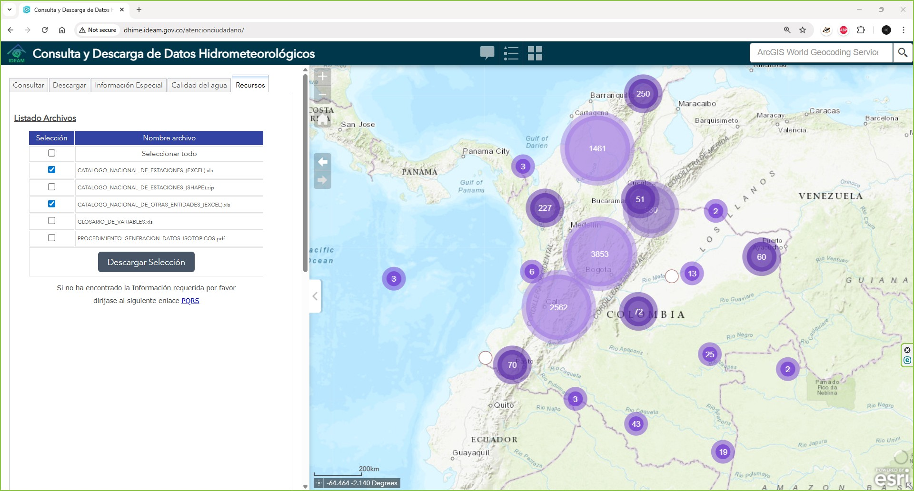

> Para identificar versión de los archivos descargados, al final del nombre puede incluir en formato aaaammdd, la fecha correspondiente a la descarga. Para este ejemplo, utilizaremos 20260318. 

2. Desde Microsoft Excel, abra los archivos _CNE_IDEAM_20260318.xls y CNE_OE_20260318.xls, revise las cabeceras de estos archivos. Asegúrese de que en los archivos, la secuencia de las columnas y los nombres sean idénticos. Podrá observar que existen 4516 y 4843 estaciones.

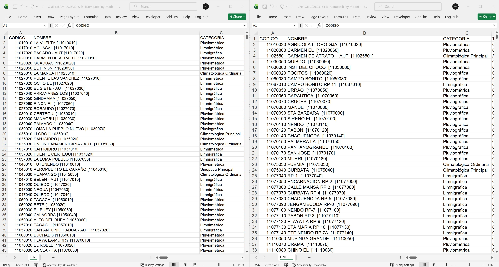

3. Cree un nuevo archivo de Excel y guárdelo como _/table/CNE_Colombia_20260318.xlsx_, renombre la hoja como _CNE_Colombia_20260318_, agregue una columna al inicio con el nombre _CNESource_, copie en la misma hoja los registros de las dos tablas de atributos y normalice los nombres de las cabeceras a 10 caracteres. La tabla final deberá contener 9360 registros, incluída la cabecera.

Utilice los siguientes nombres: `CNESource`, `Codigo`, `Nombre`, `Categoria`, `Tecnologia`, `Estado`, `FechaInst`, `FechaSusp`, `Altitud`, `LatDD`, `LongDD`, `Depto`, `Municipio`, `AreaOperat`, `Entidad`, `AH`, `ZH`, `SZH`, `Corriente`, `Observ`, `Subred`.

> Tenga en cuenta que en la unión de las dos tablas, debe incluir la cabecera una única vez y que en la columna `CNESource` debe ingresar _CNE_ o _CNE_OE_ dependiendo de la fuente de catálogo utilizada.
> 
> La normalización a 10 caracteres es requerida para que en la creación de la capa geográfica, no se pierdan caracteres en los nombres de los atributos.
> 
> Para la correcta interpretación de cuando fueron instaladas y/o suspendidas las estaciones, asegúrese de establecer formato fecha en las columnas `FechaInst` y `FechaSusp`.
> 
> En las columnas `LatDD` y `LongDD`, reemplace las comas por puntos.

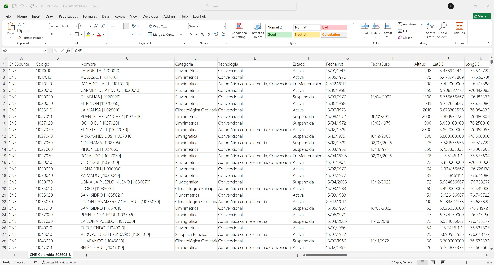

4. Realice las siguientes verificaciones en la tabla integrada:

* La columna `Codigo`, debe ser establecida en formato de texto.
* En los campos `FechaInst`, `FechaSusp`, `Altitud`, `LatDD`, `LongDD`, no deben existir comas, las separaciones decimales deberán ser establecidas en puntos, tanto en la tabla como en la configuración regional del panel de control de su sistema operativo. 
* Los campos `LatDD` y `LongDD` deben contener siempre valores. 

5. En QGIS, abra el mapa _/map/CaseStudy.qgz_ y guarde como _/map/CNEStation.qgz_. Agregue la tabla integrada creada en Excel, verifique que contenga 9359 registros.

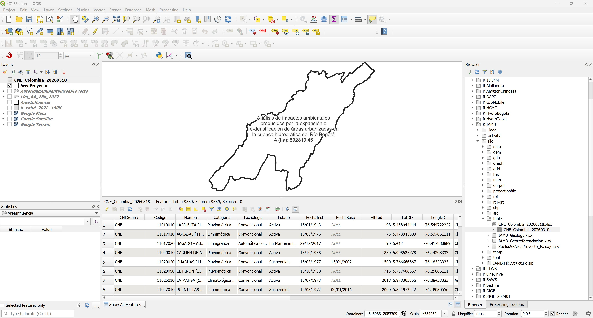

6. Exporte la tabla a formato .csv, guarde como _/table/CNE_Colombia_20260318.csv_ y remueva las tablas del panel _Layers_ del mapa.

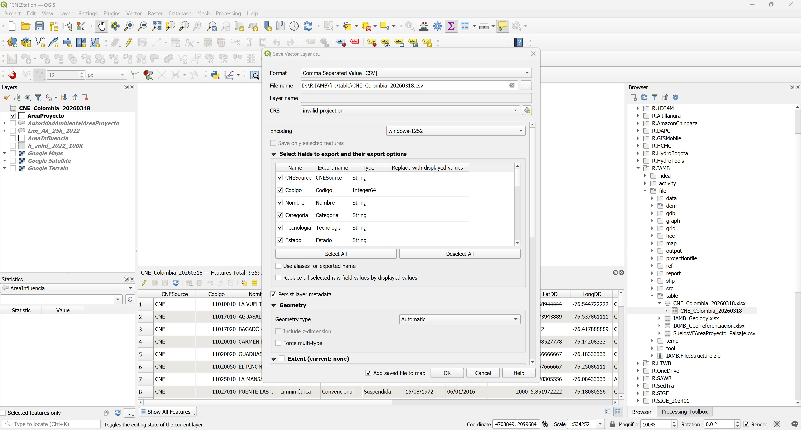

7. Desde el menú _Layer / Add Layer / Add Delimited Text Layer..._ agregue la tabla .csv como una capa temporal. Establezca el campo `Código` como _String_, `FechaInst` y `FechaSusp` como _String_, y los campos `Altitud`, `LatDD` y `LongDD` como _Double_. En _Geometry Definition_, establezca los campos `LatDD`,  `LongDD`, `Altitud` y el CRS 4326.

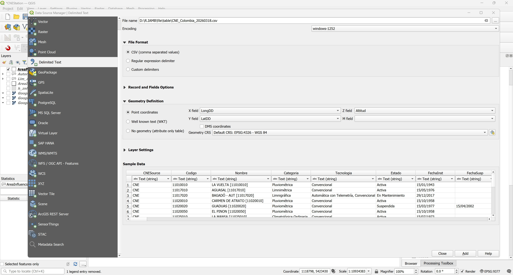

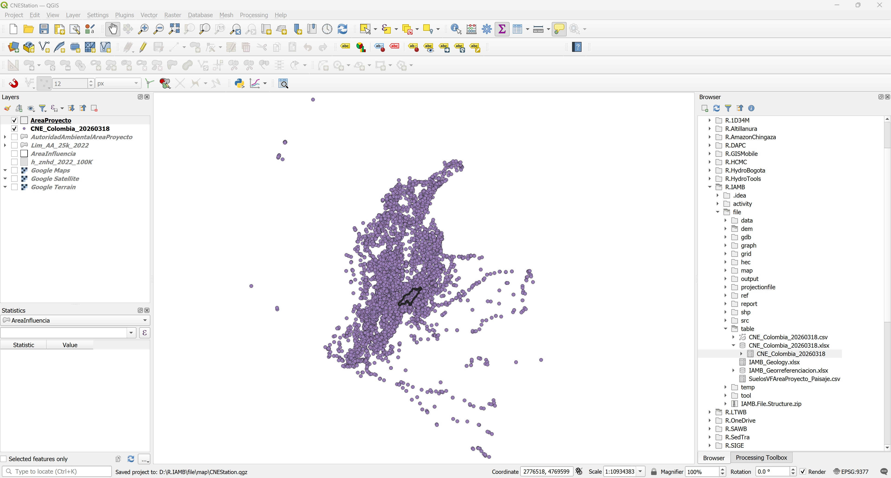

8. Abra la tabla de atributos de la capa geográfica creada y asegúrese de que existen 9359 estaciones y exporte a un archivo shapefile como _/shp/QGIS_CNE_Colombia_20260318b.shp_

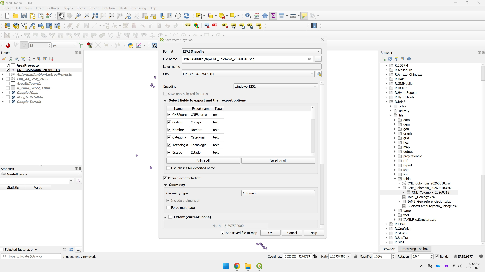

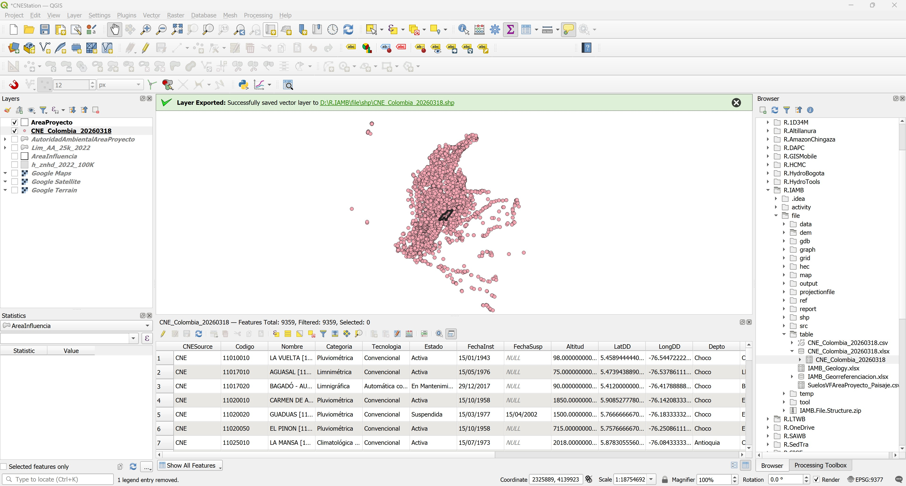

## 3. Extracción y estudio general de estaciones en la zona de estudio

1. Agregue al mapa la capa _/shp/LayerExtentAreaProyecto9377Buffer1000m.shp_ creada en la actividad de descarga de modelos digitales de elevación

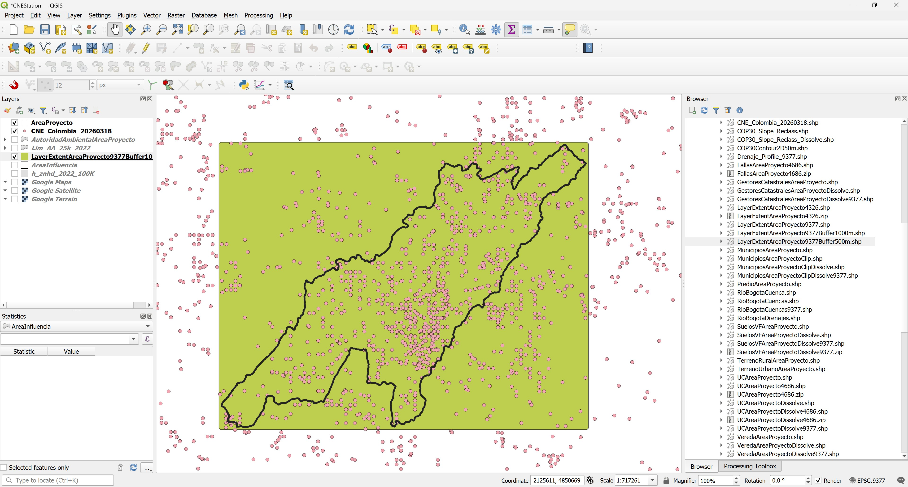

2. Utilizando la herramienta de selección por localización, seleccione todas las estaciones que se intersecan con el polígono envolvente. Podrá observar en la tabla de atributos que se han seleccionado 1315 estaciones.

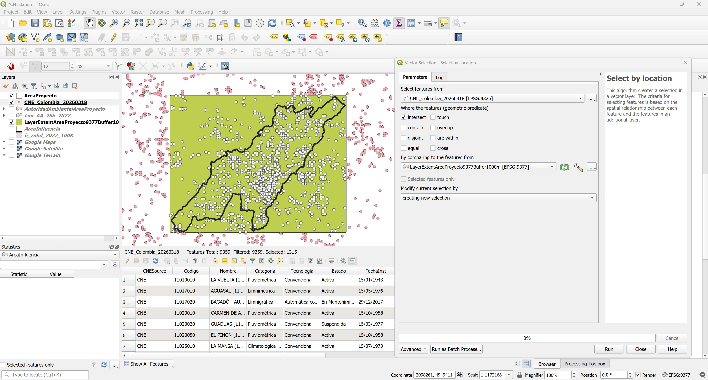

3. Exporte las estaciones seleccionadas a una nueva capa y guarde como _/shp/CNE_Colombia_20260318_ZE.shp_, en la exportación defina el CRS 9377. 

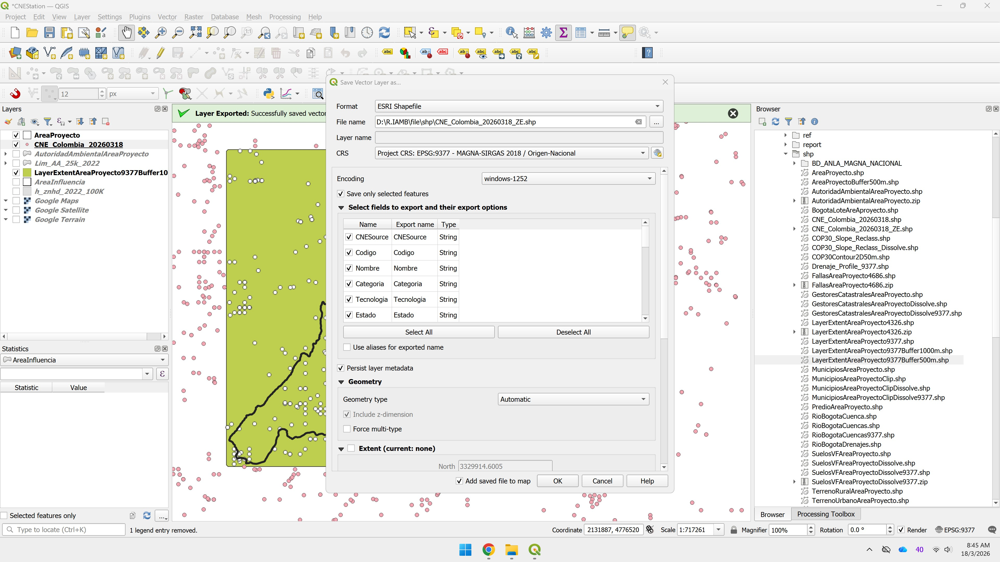

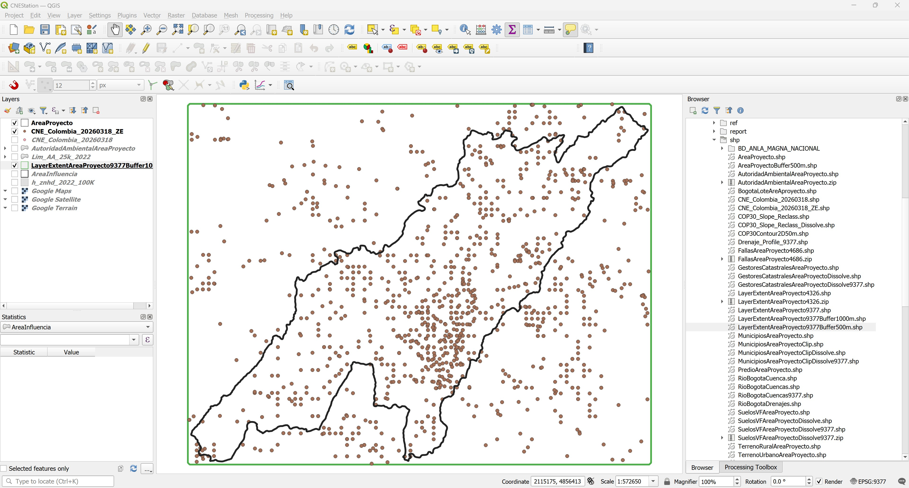

4. A partir de la capa de extracción generada, cree estadísticos y gráficos de análisis evaluando las diferentes variables categóricas contenidas en la tabla de atributos; evalúe altitudes.

En el conteo de estaciones por fuente encontrará que el 79.9% de las estaciones corresponden a otras entidades y el 20.1 a estaciones IDEAM.

Conteo de estaciones por fuente 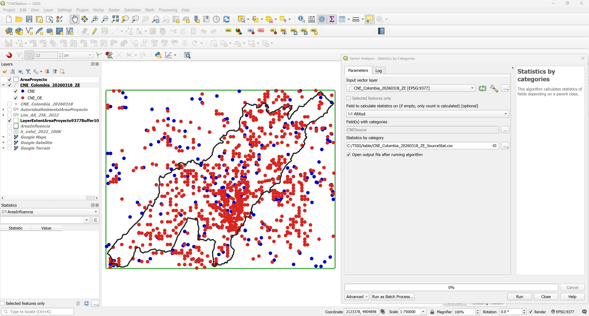
 

Conteo de estaciones por fuente 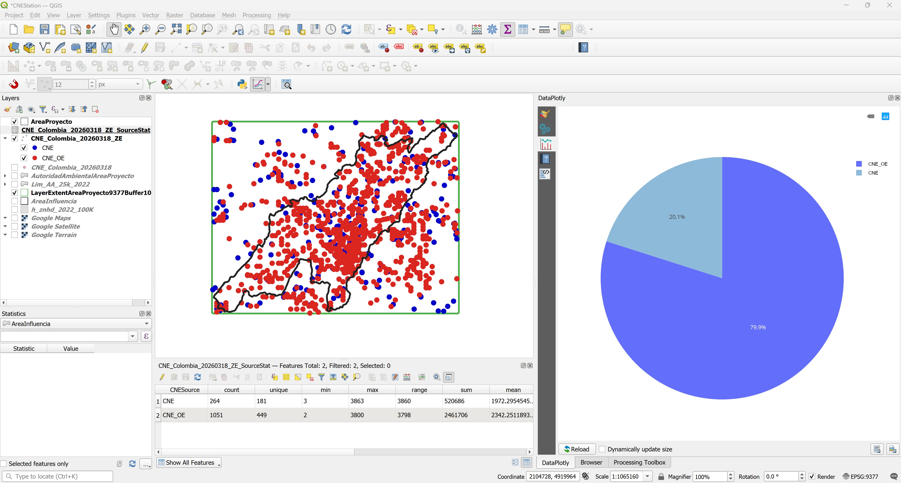
 

Con respecto a las altitudes, el promedio de cotas de las estaciones del IDEAM es de 1973.3 m.s.n.m. y 2342.3 m.s.n.m. para otras entidades.

Análisis de altitudes por fuente 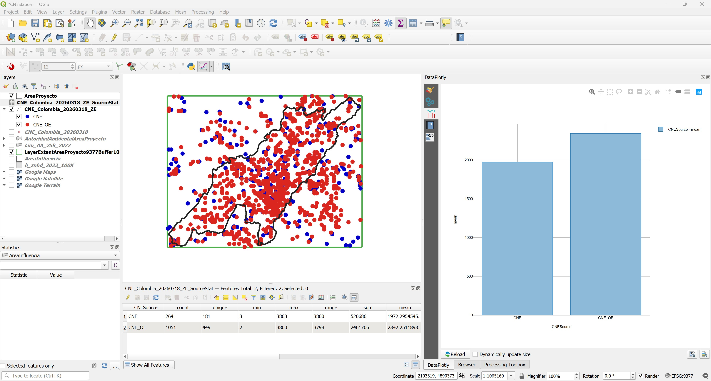
 

## 4. Estudio de longitud hipotética de series

Una vez obtenida la red de estaciones integrada sobre la zona de estudio, es necesario estudiar la longitud hipotética de las series a partir de las fechas de instalación y suspensión registradas en el catálogo. 

> Este procedimiento es importante debido a que para la descarga de las series de datos registradas en las estaciones, es necesario primero conocer la homogeneidad en las longitudes hipotéticas de los registros que deberían tener las estaciones a partir de su fecha de puesta en operación y recolección de datos. Por ejemplo, si la mayoría de las estaciones tienen un registro continuo y actual de al menos 15 o 20 años y en las estaciones de la zona de estudio existen estaciones recientes o antiguas suspendidas con registros cortos (p. ej. 5 años), se podrían descartar estas estaciones del análisis, siempre y cuando no correspondan a estaciones en la zona de frontera geográfica de la zona en estudio.

1. Utilizando el _Field Calculator_, cree los campos de fecha:

* FInst = `to_date("FechaInst",'dd/M/yyyy')`
* FSus = `to_date("FechaSusp",'dd/M/yyyy')`

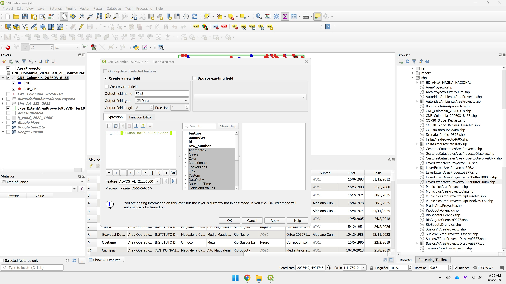

2. En el panel _Layers_, seleccione la capa /shp/CNE_Colombia_20260318_ZE.shp, y ejecute el script _/src/qgis_station_len_years.py_. Establezca como fechas de análisis los siguientes valores:

* `tw_start_date = QDate(1980, 1, 1)`
* `tw_end_date = QDate(2025, 12, 31)`

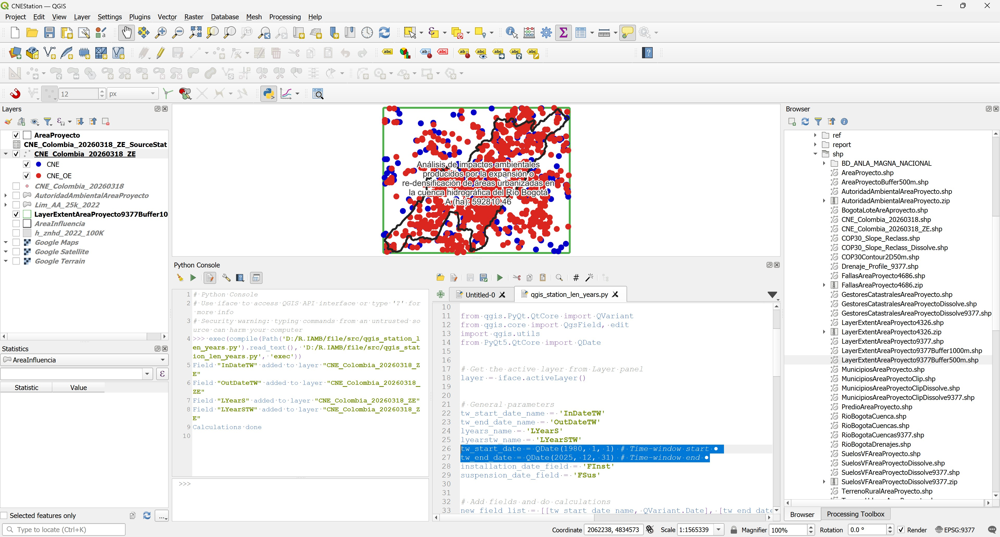

3. Luego de la ejecución serán agregados a la tabla de atributos de la capa de estaciones los campos:

* LYearS: longitud hipotética de series por estación desde la fecha de instalación hasta el 2025/12/31.
* LYearSTW: longitud hipotética de series por estación para la ventana de tiempo establecida de 1980/01/01 a 2025/12/31.

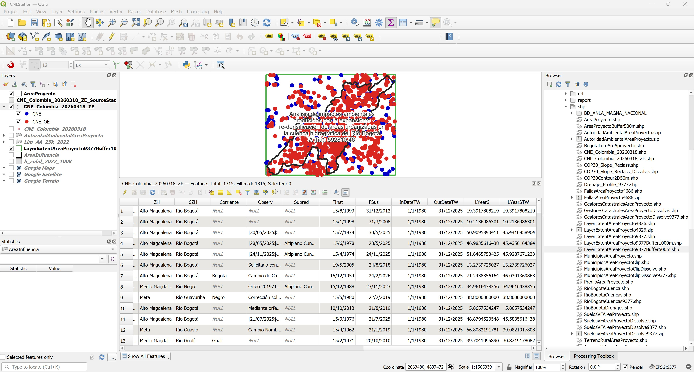

4. Desde el panel Layers, cree una copia de la capa de estaciones, represente en mapas de calor a partir de las longitudes hipotéticas obtenidas y obtenga los estadísticos. Podrá observar que las mayores longitudes se encuentran sobre el área urbana de Bogotá D.C. con un promedio de 31.97 años para longitudes completas y 25.18 años para la ventana de tiempo establecida.

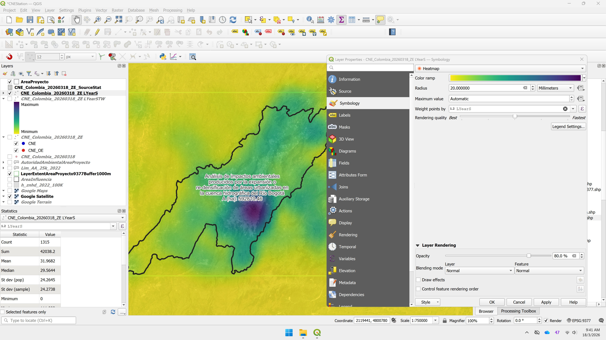

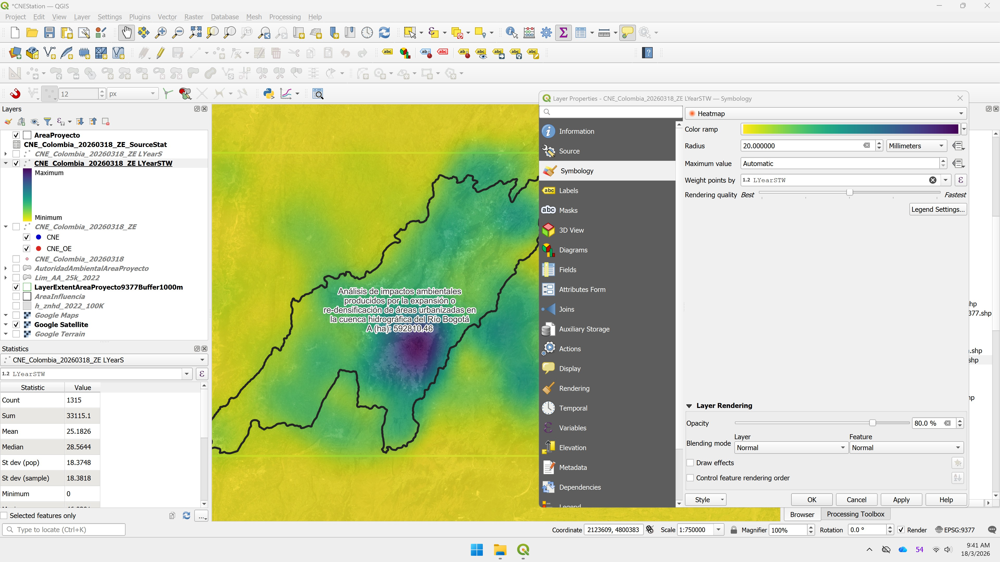

:pencil2:**Tarea:** Homologue y cargue el análisis realizado en la capa _EstacionMeteorologica_ del modelo ANLA.

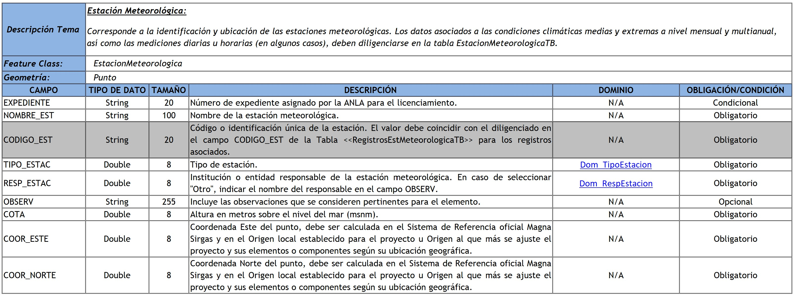

## Referencias

* http://dhime.ideam.gov.co/atencionciudadano/
* http://www.ideam.gov.co/solicitud-de-informacion

##

_R.IAMB es de uso libre para fines académicos, conoce nuestra licencia, cláusulas, condiciones de uso y como referenciar los contenidos publicados en este repositorio, dando [clic aquí](../../LICENSE.md)._

_¡Encontraste útil este repositorio!, apoya su difusión marcando este repositorio con una ⭐ o síguenos dando clic en el botón Follow de [rcfdtools](https://github.com/rcfdtools) en GitHub._

| [◄ Anterior](../BasinLimit/Readme.md) | [:house: Inicio](../../README.md) | [:beginner: Ayuda / Colabora](https://github.com/rcfdtools/R.IAMB/discussions/1) | [Siguiente ►](../xxxx/Readme.md) |
|---------------------------------------|-----------------------------------|----------------------------------------------------------------------------------|----------------------------------|

[^1]:

