

# 2.1. Vectores - Proyecto o caso de estudio
Keywords: `case-study` `base-maps` `project-area` `clip` `statistics` 

En el caso de estudio se ha definido como límite geográfico la cuenca hidrográfica del Río Bogotá, la cual se encuentra incluída en la capa geográfica de [Zonificación Hidrográfica de Colombia](https://www.datos.gov.co/Ambiente-y-Desarrollo-Sostenible/Zonificaci-n-Hidrogr-fica-Colombia/5kjg-nuda/about_data) a escala 1:100k actualizada por el IDEAM en el año 2022.

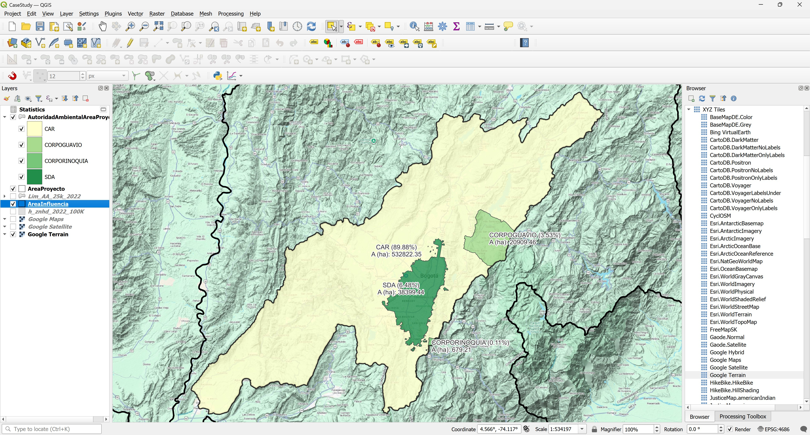

> La actualización en escala 1:100,000 de la capa de zonificación hidrográfica de Colombia a escala 1:500.000 del 2013, utilizada hasta el ENA2018. Esta capa es la unidad de análisis utilizada en el ENA2022. Representa las unidades de análisis hidrográficas para el ordenamiento ambiental del territorio definidas por el IDEAM. La actualización del producto se realizó con base en la información dispuesta por HydroSheds y la edición sobre cartografía básica a escala 1: 100000, dispuesta por el IGAC en el 2016. Es importante mencionar, que en la zonificación hidrográfica del año 2013, con el fin de generar una cobertura de la zonificación hidrográfica en zonas marítimas en las que existen estaciones de IDEAM o de otras entidades como la DIMAR o el INVEMAR, entre otras, las cuales requieren asignación de codificación acorde con su ubicación, se hizo necesario en su momento definir estas sub-zonas hidrográficas, estas no necesariamente implican la generación de productos temáticos específicos. Para la presente actualización de la zonificación hidrográfica del año 2022, no se incluyen las áreas marino-costeras que se delimitan en la zonificación hidrográfica del año 2013, debido a que no se cuenta con información oficial a escala 1:100.000 que permitan su delimitación. [^1]

## Objetivos

* Definir el límite geográfico de la zona de estudio y área de influencia del proyecto.
* Identificar los límites geográficos de las autoridades ambientales dentro de la zona de estudio.

## Requerimientos

Archivos, actividades previas, lecturas y herramientas requeridas para el desarrollo de esta actividad:

| Requerimiento                                                                                                 | Descripción                                                                                                           |
|:--------------------------------------------------------------------------------------------------------------|:----------------------------------------------------------------------------------------------------------------------|
| [:toolbox:Herramienta](https://qgis.org/)                                                                     | QGIS 3.44 o superior.                                                                                                 |
| [:date:magna_origen_nacional.zip](../../file/data/ANLA/magna_origen_nacional.zip)                             | Geodatabase ANLA Magna Origen Nacional.                                                                               |
| [:date:diccionario_datos_geograficos_anla.xlsx](../../file/data/ANLA/diccionario_datos_geograficos_anla.xlsx) | Diccionario de datos geográficos ANLA.                                                                                |
| [:round_pushpin:Zonificacion_Hidrografica_2022.zip](../../file/data/IDEAM/Zonificacion_Hidrografica_2022.zip) | Zonificación Hidrográfica de Colombia a escala 1:100k, IDEAM, 2022.                                                   |
| [:round_pushpin:Lim_AA_25k_2022.zip](../../file/data/MADS/Lim_AA_25k_2022.zip)                                | Zonificación Hidrográfica de Colombia a escala 1:100k, IDEAM, 2022.                                                   |
| [:round_pushpin:qgis_basemaps.py](../../file/src/qgis_basemaps.py)                                            | Script en Python para inclusión de mapas base XYZ en QGIS por [opengeos](https://github.com/opengeos/qgis-basemaps).  |

## 0. Zonificación hidrográfica de Colombia

La zonificación hidrográfica de Colombia desde el punto de vista hidrológico, tiene sus inicios en el HIMAT mediante la Resolución 0337 del 1978, la cual establece que el país está conformado por cinco Áreas hidrográficas (1-Caribe, 2- Magdalena - Cauca, 3- Orinoco, 4- Amazonas y 5-Pacífico) que a su vez están divididas en Zonas Hidrográficas y subdivididas en Sub-zonas Hidrográficas. En ese entonces, el propósito de la zonificación fue de adoptar un sistema de codificación para estaciones Hidrometerológicas. Posteriormente, el IDEAM introduce esta zonificación para otros fines, tales como estudios y análisis hidrológicos relacionados con los informes ambientales, p. ej. el Índice de Aridez, el Escurrimiento y el Rendimiento Hídrico.[^1]

La zonificación de cuencas hidrográficas corresponde a tres niveles de jerarquía: áreas, zonas y sub-zonas hidrográficas. Las áreas hidrográficas corresponden a las regiones hidrográficas o vertientes que, en sentido estricto, son las grandes cuencas que agrupan un conjunto de ríos con sus afluentes que desembocan en un mismo mar. Ahora bien, en Colombia se distinguen cuatro vertientes, dos de ellas asociadas a ríos de importancia continental (vertiente del Orinoco y vertiente del Amazonas) y las vertientes del Atlántico y del Pacífico. Se delimita adicionalmente como áea hidrográfica la cuenca Magdalena-Cauca, que aunque tributa y forma parte de la vertiente del Atlántico, tiene importancia socioeconómica por su alto poblamiento y aporte al producto interno bruto.[^2]

| AH  | Área Hidrográfica |
|-----|-------------------|
| 1   | Caribe            |
| 2   | Magdalena-Cauca   |
| 3   | Orinoco           |
| 4   | Amazonas          |
| 5   | Pacífico          |

Las cuencas hidrográficas que entregan o desembocan sus aguas superficiales directamente de una área hidrográfica se denominaran zonas hidrográficas. Agrupan varias cuencas que se presentan como un subsistema hídrico con características de relieve y drenaje homogéneo y sus aguas tributan a través de un afluente principal hacia un área hidrográfica. Están integradas por cuencas de las partes altas, medias o bajas de una zona hidrográfica que captan agua y sedimentos de los tributarios de diferente orden tales como nacimientos de agua, arroyos, quebradas y ríos. Las cuencas que tributan sus aguas a su vez a las zonas hidrográficas se denomina sub-zonas hidrográficas. Ahora bien, respecto a la toponimia con que se identifican zonas y sub-zonas hidrográficas, a estas unidades se les asignó la toponimia de acuerdo con el nombre de la corriente más representativa o río principal o con el nombre heredado de la zonificación del HIMAT, que puede corresponder al espacio geográfico o región a la cual drenan las aguas superficiales.[^2]

| AH  | Área Hidrográfica | ZH  | Zona Hidrográfica                  |
|-----|-------------------|-----|------------------------------------|
| 1   | Caribe            | 11  | Atrato - Darién                    |
| 1   | Caribe            | 12  | Caribe - Litoral                   |
| 1   | Caribe            | 13  | Sinú                               |
| 1   | Caribe            | 15  | Caribe - La Guajira                |
| 1   | Caribe            | 16  | Catatumbo                          |
| 1   | Caribe            | 17  | Islas del Caribe                   |
| 2   | Magdalena - Cauca | 21  | Alto Magdalena                     |
| 2   | Magdalena - Cauca | 22  | Saldaña                            |
| 2   | Magdalena - Cauca | 23  | Medio Magdalena                    |
| 2   | Magdalena - Cauca | 24  | Sogamoso                           |
| 2   | Magdalena - Cauca | 25  | Bajo Magdalena - Cauca - San Jorge |
| 2   | Magdalena - Cauca | 26  | Cauca                              |
| 2   | Magdalena - Cauca | 27  | Nechí                              |
| 2   | Magdalena - Cauca | 28  | Cesar                              |
| 2   | Magdalena - Cauca | 29  | Bajo Magdalena                     |
| 3   | Orinoco           | 31  | Inírida                            |
| 3   | Orinoco           | 32  | Guaviare                           |
| 3   | Orinoco           | 33  | Vichada                            |
| 3   | Orinoco           | 34  | Tomo                               |
| 3   | Orinoco           | 35  | Meta                               |
| 3   | Orinoco           | 36  | Casanare                           |
| 3   | Orinoco           | 37  | Arauca                             |
| 3   | Orinoco           | 38  | Orinoco Directos                   |
| 3   | Orinoco           | 39  | Apure                              |
| 4   | Amazonas          | 41  | Guainía                            |
| 4   | Amazonas          | 42  | Vaupés                             |
| 4   | Amazonas          | 43  | Apaporis                           |
| 4   | Amazonas          | 44  | Caquetá                            |
| 4   | Amazonas          | 45  | Yarí                               |
| 4   | Amazonas          | 46  | Caguán                             |
| 4   | Amazonas          | 47  | Putumayo                           |
| 4   | Amazonas          | 48  | Amazonas - Directos                |
| 4   | Amazonas          | 49  | Napo                               |
| 5   | Pacífico          | 51  | Mira                               |
| 5   | Pacífico          | 52  | Patía                              |
| 5   | Pacífico          | 53  | Tapaje - Dagua - Directos          |
| 5   | Pacífico          | 54  | San Juan                           |
| 5   | Pacífico          | 55  | Baudó - Directos Pacífico          |
| 5   | Pacífico          | 56  | Pacífico - Directos                |
| 5   | Pacífico          | 57  | Islas del Pacífico                 |

## 1. Zona de estudio 

1. En QGIS, cree un mapa nuevo en blanco con el nombre _/map/CaseStudy.qgz_, agregue la capa [/data/IDEAM/h_znhd_2022_100K.shp](../../file/data/IDEAM/h_znhd_2022_100K.shp) y abra la tabla de atributos, podrá observar que se compone de 316 Sub-zonas Hidrográficas y que la capa utiliza el EPSG 4686. 

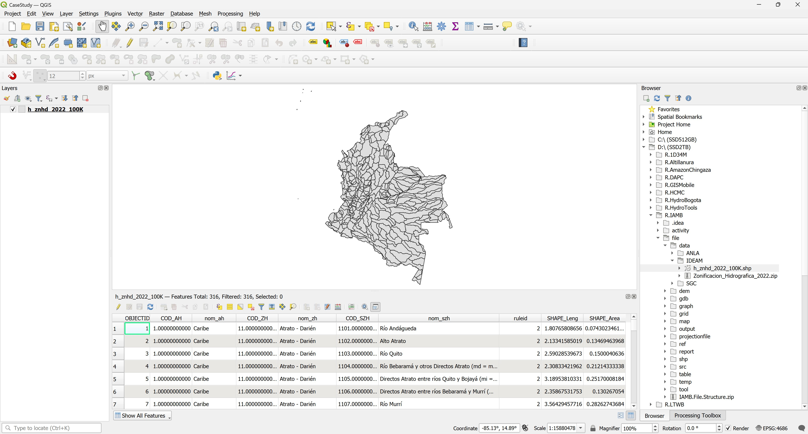

2. Para verificar la localización y geo-referenciación correcta de la capa, ejecute el script [qgis_basemaps.py](../../file/src/qgis_basemaps.py) y agregue el mapa base de Google Maps y Google Satellite. Podrá observar que 

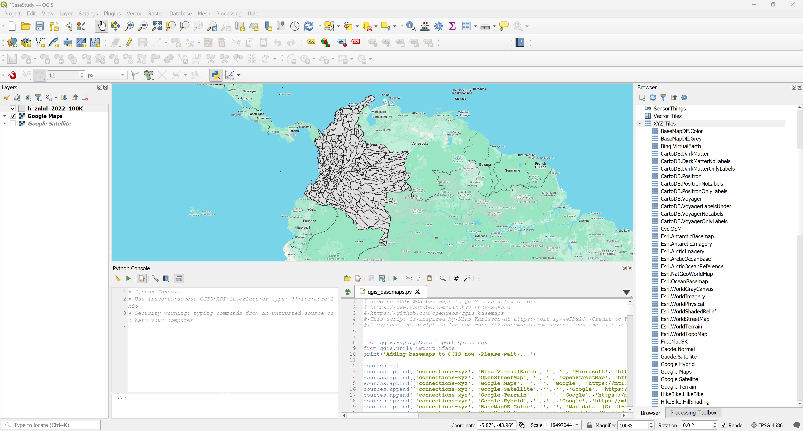

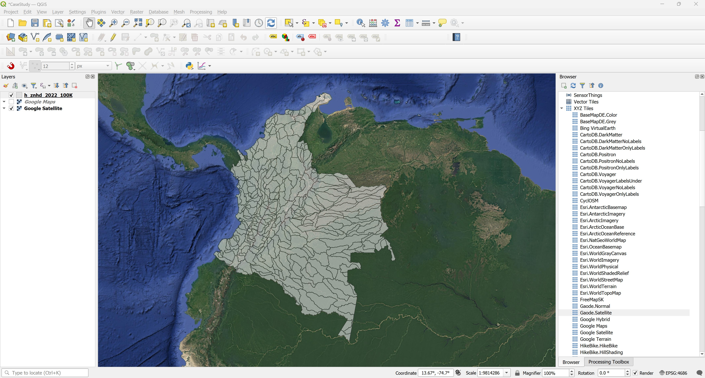

3. Rotule e identifique la Sub-zona Hidrográfica 2120 correspondiente a la Cuenca del Río Bogotá.

Rótulo: `'AH: '  || "COD_AH"  ||  ' - '  ||  "nom_ah"   || '\n'  ||  'ZH: '  ||  "COD_ZH"   ||  ' - '  ||   "nom_zh" || '\n'  ||  'SZH: '  ||  "COD_SZH"   ||  ' - '  ||   "nom_szh"`  

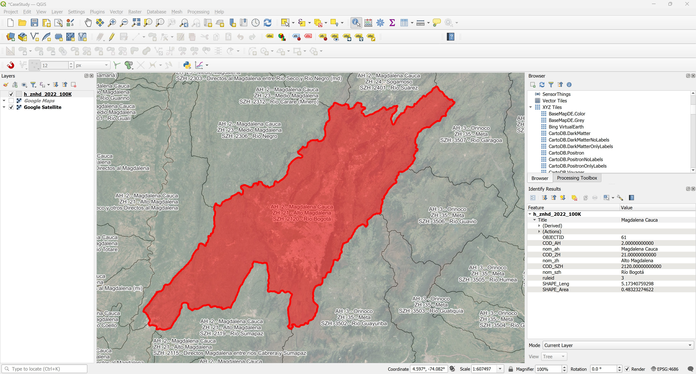

4. Filtre el polígono correspondiente a la Sub-zona Hidrográfica 2120.

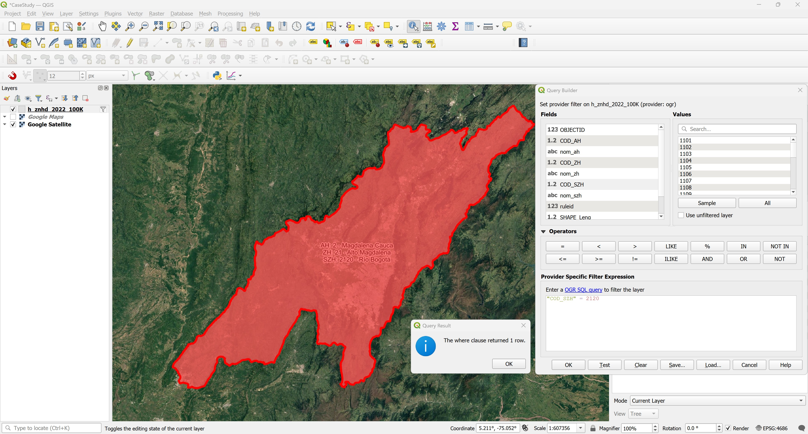

## 2. Incorporación a capa ANLA: AreaProyecto

Área del proyecto objeto de solicitud de licencia. Ej.: Campo, Bloque, Área de Interés, Estación o Refinería (sector de hidrocarburos), Puerto, Aeropuerto, Infraestructura Marina y Costera, Infraestructura Fluvial, Planta de Tratamiento, Relleno Sanitario (sector infraestructura), Hidroeléctricas, Termoeléctricas, Subestaciones, Presas, Represas o Embalses (sector energía), Explotación Minera (sector minería), Plantas de Formulación y/o Producción, Laboratorios, Centros Experimentales (sector agroquímicos).

La capa _AreaProyecto_ del modelo de datos ANLA, requiere de los siguientes atributos y contiene un dominio asociado:

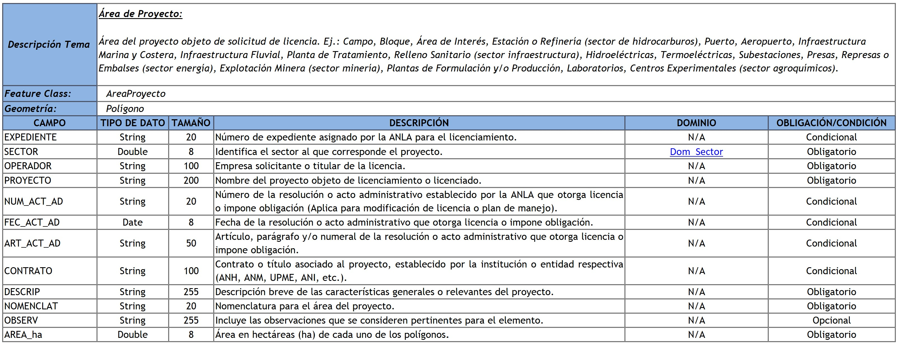

El dominio _Dom_Sector_, contiene los siguientes códigos:

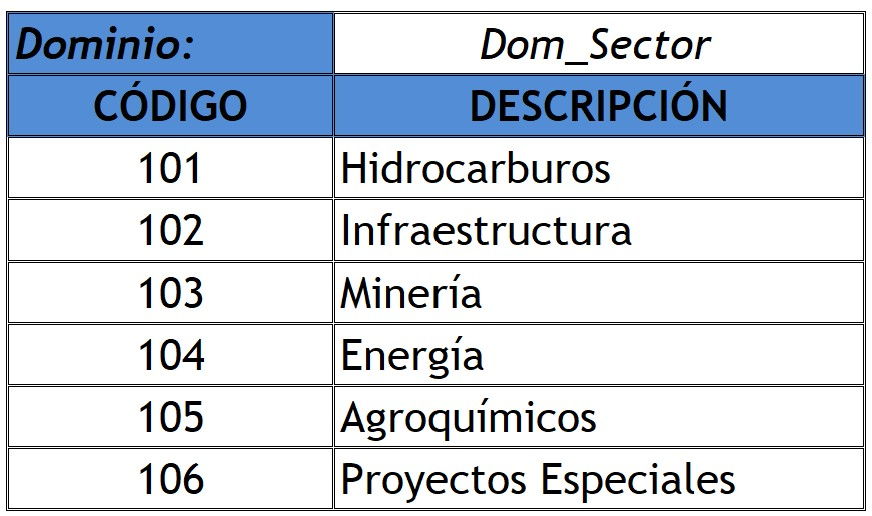

1. En la carpeta [/gdb](../../file/gdb) descomprima la geodatabase [BD_ANLA_MAGNA_NACIONAL.gdb](../../file/data/ANLA/magna_origen_nacional.zip) y cargue al mapa la capa /T_33_Proyecto/AreaProyecto. Active el modo de edición, copie y pegue el polígono correspondiente a la SZH 2120.

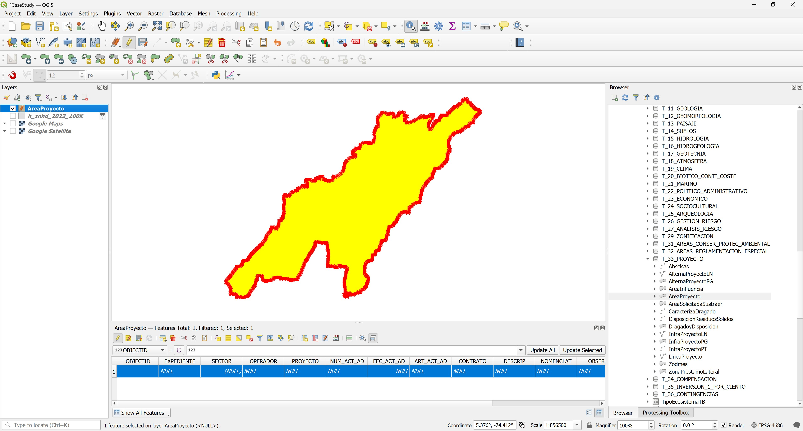

2. Como observa, luego de copiar el polígono, no se homologan automáticamente los campos requeridos por la capa _AreaProyecto_ del ANLA, incluya manualmente los siguientes atributos:

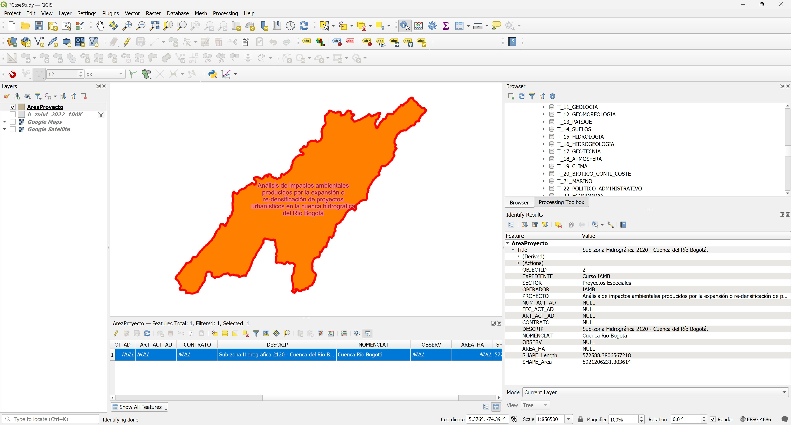

Para la rotulación establezca la siguiente configuración de saltos de línea:

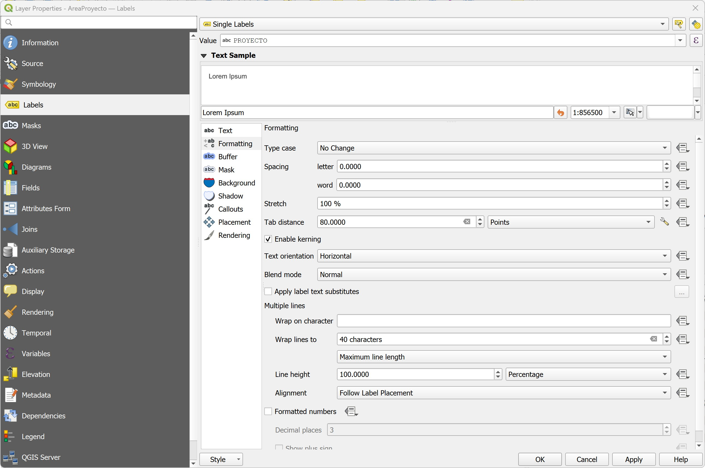

3. En el campo `AREA_HA`, calcule el área geodésica en hectáreas, obtendrá que el área de estudio corresponde a 592810.46 ha.

Expresión: `$area/10000`

Incluya en el rótulo el área calculada.

Expresión: `"PROYECTO"  ||  '\n'  ||  'A (ha): ' || round( "AREA_HA", 2)`

> Debido al tamaño espacial del polígono del área de estudio, realizaremos los cálculos de área geodésica y no los de área planar `area($geometry)`.

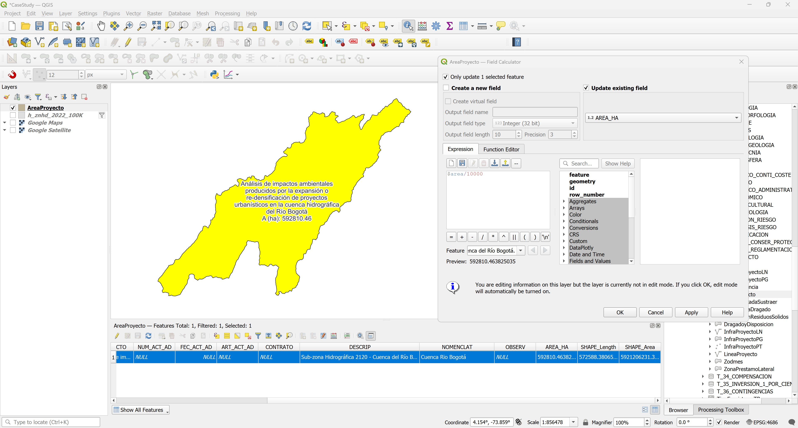

Guarde y detenga el modo de edición de esta capa.

## 3. Incorporación a capa ANLA: AreaInfluencia

Luego de definida el Área de Proyecto, es necesario establecer el Área de Influencia que para el caso de estudio corresponderá a todos los polígonos perimetrales o próximos al área de proyecto y su propia área.

El Área o Áreas de Influencia del Proyecto, comprende la definición del área o de las áreas de influencia, de acuerdo con los impactos identificados en cada una de las etapas del proyecto y las características del espacio geográfico. Pueden presentarse áreas de influencia por "Medio", "Componente" o "Grupo de Componentes".

La capa _AreaProyecto_ del modelo de datos ANLA, requiere de los siguientes atributos y contiene un dominio asociado:

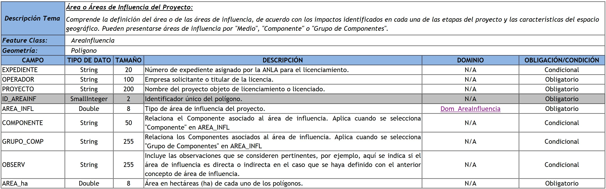

El dominio _Dom_Sector_, contiene los siguientes códigos:

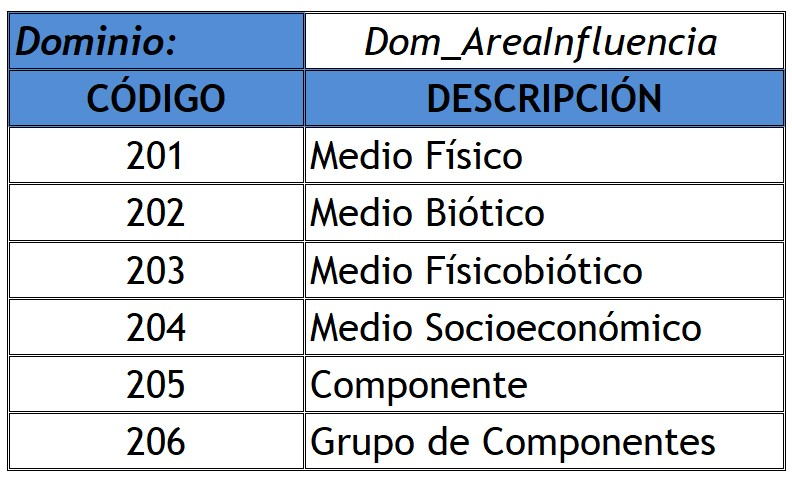

1. Cargue al mapa la capa /T_33_Proyecto/AreaInfluencia. Desactive el filtro realizado en la capa _h_znhd_2022_100K_. Podrá observar que existen múltiples sub-zonas hidrográficas alrededor del polígono de la zona de estudio. 

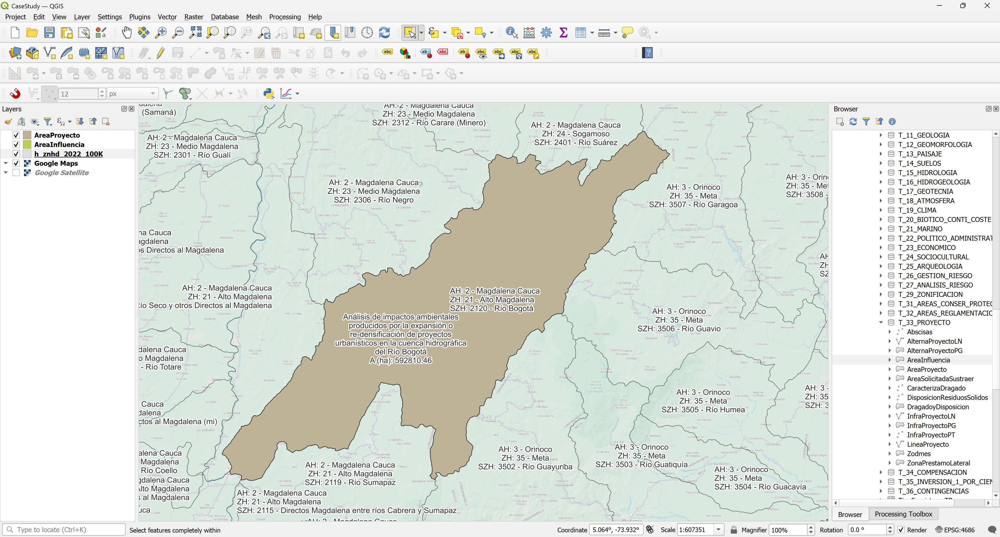

2. Utilizando la herramienta _Select By Location_, seleccione todos los polígonos de las SZH que se intersecan con el polígono del área de estudio. Podrá observar que de los 316 polígonos han sido seleccionados 10 polígonos.

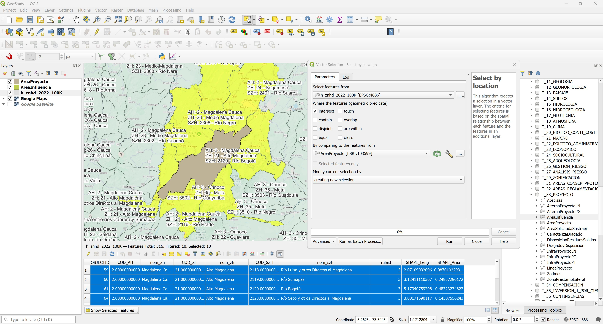

3. Active el modo de edición de la capa _AreaInfluencia_, copie y pegue los polígonos seleccionados.

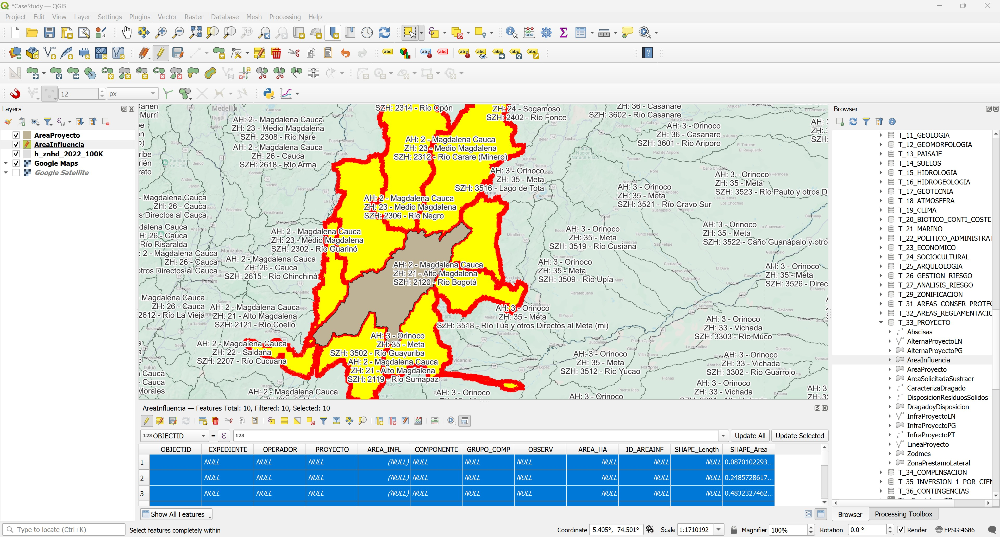

4. Utilizando la herramienta _Merge Selected Features_, disponible en la barra de herramientas _Advanced Digitizing Toolbar_, combine los 10 polígonos en un único polígono.

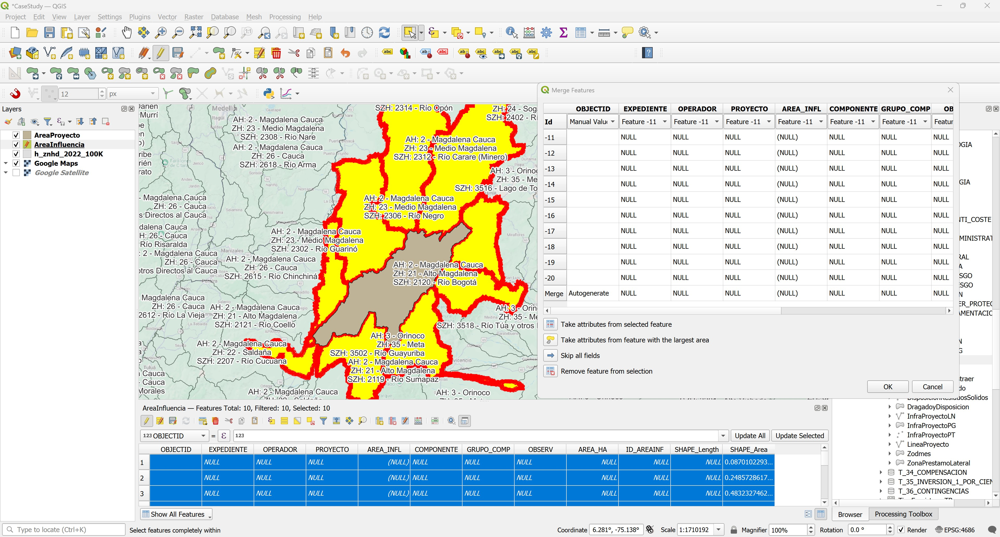

5. Asigne y/o calcule los atributos requeridos.

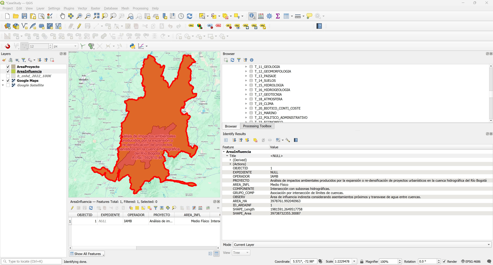

## 3. Límites de autoridades ambientales MADS

Las Corporaciones Autónomas Regionales y de Desarrollo Sostenible, son entes corporativos de carácter público, creados por la ley, integrados por las entidades territoriales que por sus características constituyen geográficamente un mismo ecosistema o conforman una unidad geopolítica, biogeográfica o hidrogeográfica, dotados de autonomía administrativa y financiera, patrimonio propio y personería jurídica, encargados por la ley de administrar, dentro del área de su jurisdicción el medio ambiente y los recursos naturales renovables y propender por su desarrollo sostenible, de conformidad con las disposiciones legales y las políticas del Ministerio del Medio Ambiente. [^2]

Enlaces para descarga:

* https://datos.icde.gov.co/datasets/0fd08ce937034387b33699e8165ffc84
* https://siac-datosabiertos-mads.hub.arcgis.com/datasets/0fd08ce937034387b33699e8165ffc84

1. Cargue al proyecto la capa de [Límites autoridades ambientales de Colombia (versión 2022)](../../file/data/MADS/Lim_AA_25k_2022.zip) del Ministerio de Ambiente y Desarrollo Sostenible.

> La capa contiene de los límites de las Corporaciones Autónomas Regionales, construidos con base en la capa de límites municipales a escala 1:25000 publicados por el Instituto Geográfico Agustí Codazzi – IGAC del año 2018 y de la sinergia con la propuesta de los límites de las corporaciones Autónomas Regionales construido por el IDEAM. Cubre toda la extensión continental del territorio colombiano, además del archipiélago de San Andrés y Providencia.

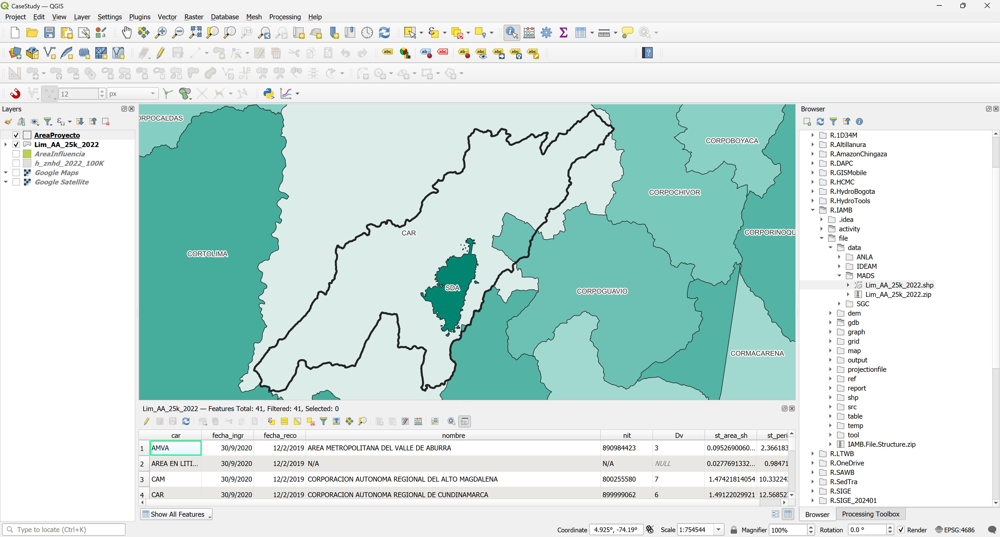

2. Utilizando la herramienta _Vector overlay / Clip_, recorte la capa de Autoridades Ambientales con la capa del área de proyecto, guarde como [/shp/AutoridadAmbientalAreaProyecto.shp](). Simbolice a partir del campo `car`.

> Tenga en cuenta que la capa de Autoridades Ambientales utiliza el CRS 4686 y que el recorte utilizará este mismo sistema de referencia de coordenadas.
> 
> Podrá observar que se han incluido pequeñas fracciones de las autoridades ambientales CORPOCHIVOR y CORTOLIMA, lo anterior debido a las escalas de digitalización utilizadas para la delimitación de las capas utilizadas.    

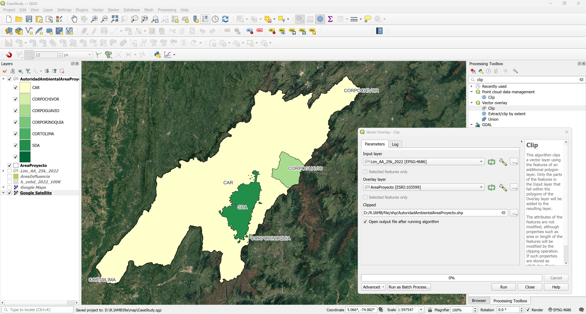

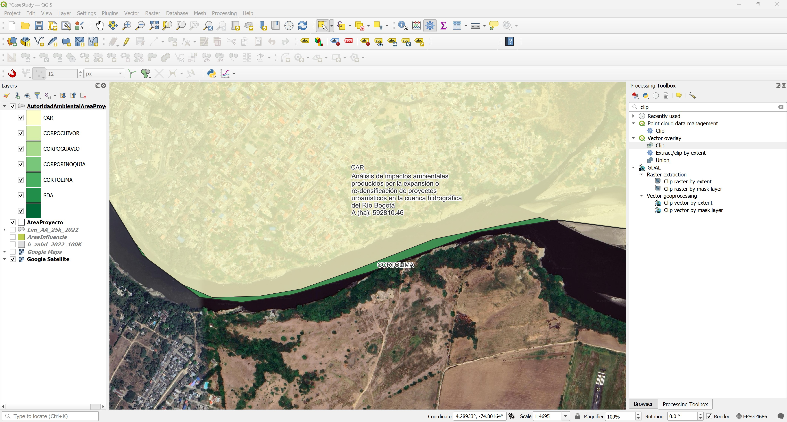

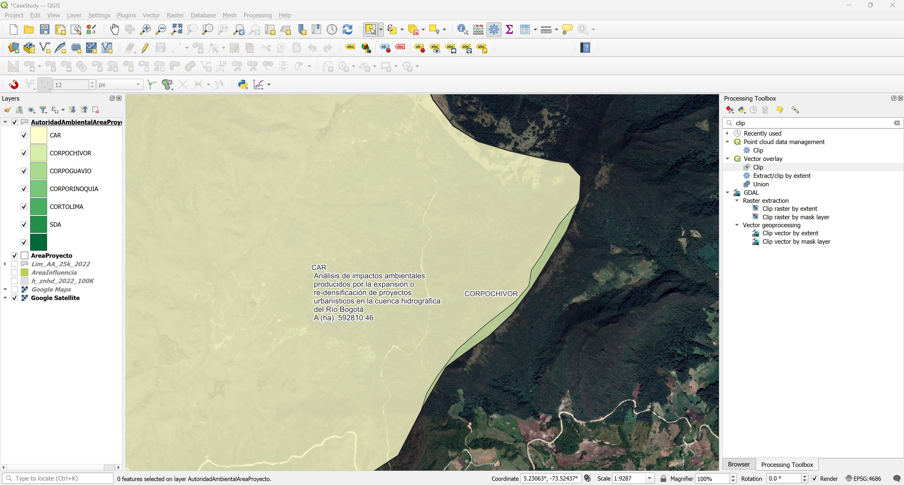

3. Desde el modo de edición, combine las áreas _CORPOCHIVOR_ y _CORTOLIMA_ al polígono _CAR_ y elimine los campos de área y perímetro. En la capa resultante hemos obtenido 4 autoridades ambientales dentro de la zona de estudio.  

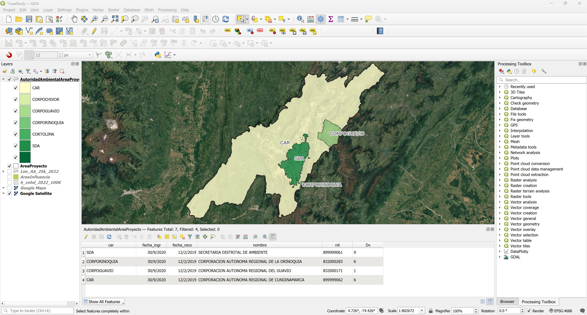

4. Calcule las áreas geográficas de cada polígono en hectáreas y su distribución porcentual con respecto al área total.

Cálculo de áreas

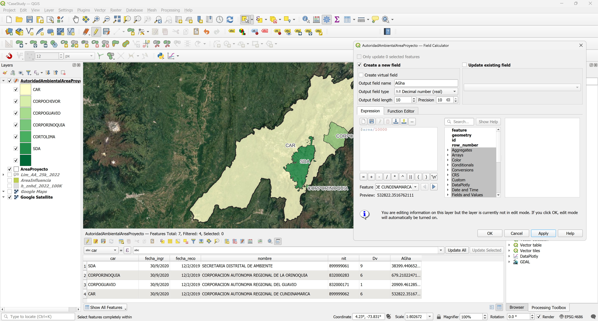

Área total

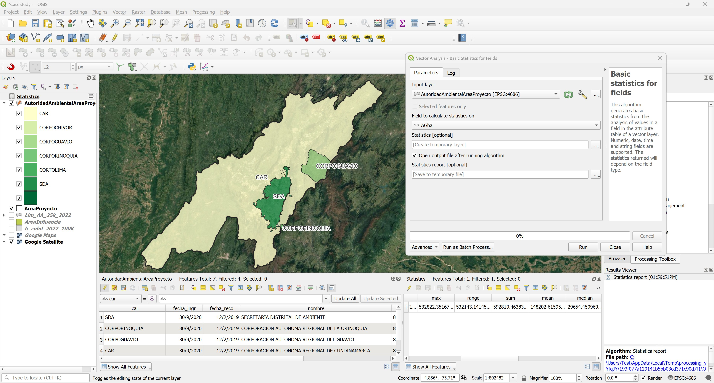

Distribución porcentual

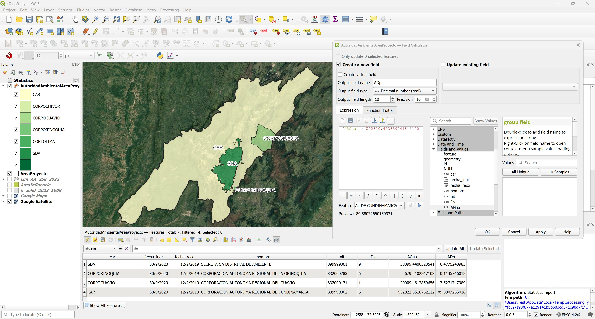

> Con la herramienta _Statistics_, verifique que el % de distribución sea 100.

5. Utilizando el complemento [DataPlotly](https://plugins.qgis.org/plugins/DataPlotly/), cree una gráfica de pastel.

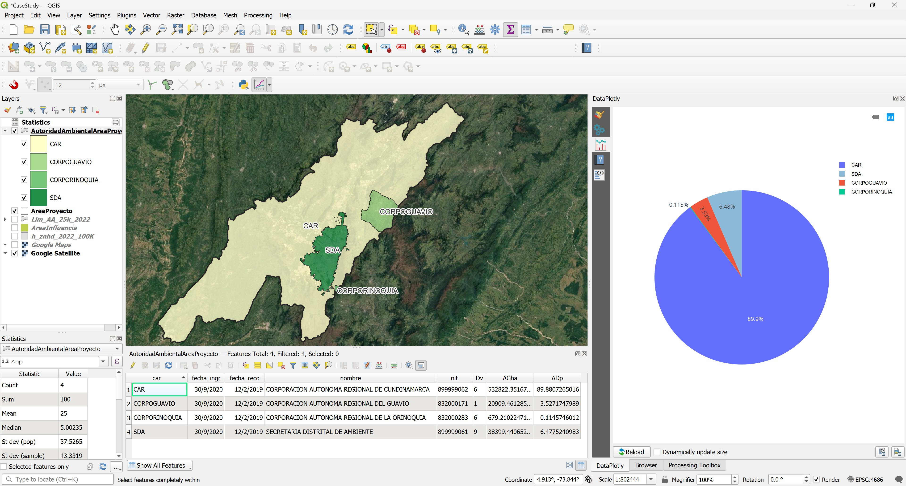

Rótulo: `"car" || ' ('  || round("ADp" ,2) ||  '%)' || '\n'  || 'A (ha): '  ||  round("AGha" ,2)`

Tomando como referencia el límite de la subzona hidrográfica 2120 del IDEAM, las 3 autoridades ambientales con influencia geográfica directa sobre la cuenca del Río Bogotá son:

| Autoridad ambiental - AA | Nombre                                          | Área en cuenca (ha) | % en cuenca  |
|:-------------------------|:------------------------------------------------|:-------------------:|:------------:|
| CAR                      | Corporación Autónoma Regional de Cundinamarca   |      532822.35      |    89.88     |
| CORPOGUAVIO              | Corporación Autónoma Regional del Guavio        |      20909.46       |     3.5      |
| CORPORINOQUIA            | Corporación Autónoma Regional de la Orinoquía   |       679.21        |     0.12     |
| SDA                      | Secretaria Distrital de Ambiente de Bogotá D.C. |      38399.44       |     6.48     |
|                          | Σ                                               |      592810.46      |     100      |

> _**% en cuenca**_: corresponde al porcentaje del área geodésica del límite de la autoridad ambiental, con respecto a toda la cuenca del Río Bogotá.   

## Referencias

* https://docs.qgis.org/3.44/en/docs/user_manual/processing_algs/qgis/vectoranalysis.html#qgisbasicstatisticsforfields
* https://docs.qgis.org/3.44/en/docs/user_manual/processing_algs/qgis/vectoroverlay.html#qgisclip
* https://docs.qgis.org/3.44/en/docs/user_manual/processing_algs/qgis/vectorselection.html#qgisselectbylocation

## Control de versiones

| Versión    | Descripción        | Autor                                      | Horas |
|------------|:-------------------|--------------------------------------------|:-----:|
| 2026.02.13 | Versión inicial.   | [rcfdtools](https://github.com/rcfdtools)  |   6   |

##

_R.IAMB es de uso libre para fines académicos, conoce nuestra licencia, cláusulas, condiciones de uso y como referenciar los contenidos publicados en este repositorio, dando [clic aquí](../../LICENSE.md)._

_¡Encontraste útil este repositorio!, apoya su difusión marcando este repositorio con una ⭐ o síguenos dando clic en el botón Follow de [rcfdtools](https://github.com/rcfdtools) en GitHub._

| [◄ Anterior](../GISBasicEA/Readme.md) | [:house: Inicio](../../README.md) | [:beginner: Ayuda / Colabora](https://github.com/rcfdtools/R.IAMB/discussions/1) | [Siguiente ►](../XXXX/Readme.md) |
|---------------------------------------|-----------------------------------|----------------------------------------------------------------------------------|----------------------------------|

[^1]: https://www.datos.gov.co/Ambiente-y-Desarrollo-Sostenible/Zonificaci-n-Hidrogr-fica-Colombia/5kjg-nuda/about_data 
[^2]: https://archivo.minambiente.gov.co/index.php/noticias/2067

