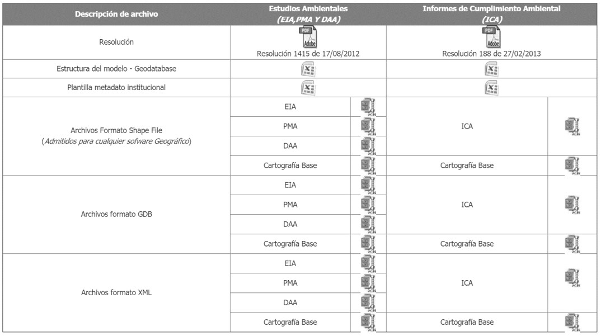
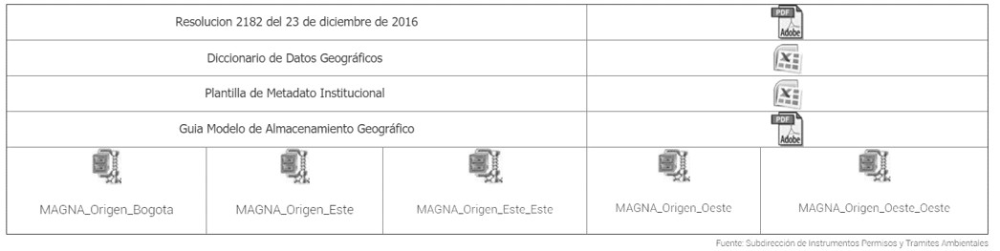
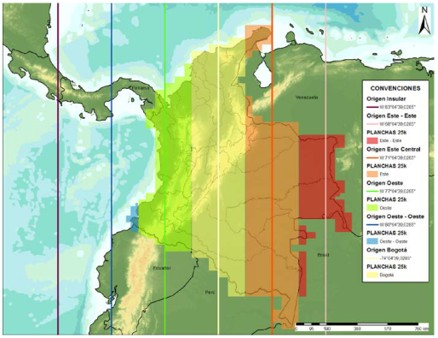
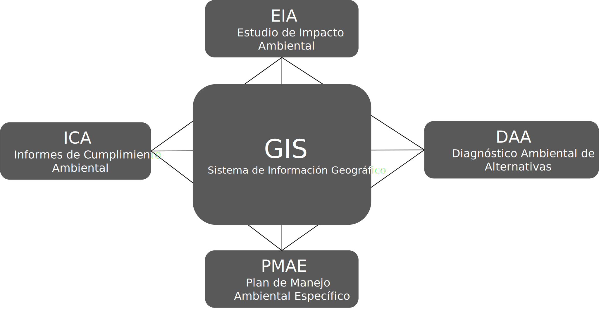
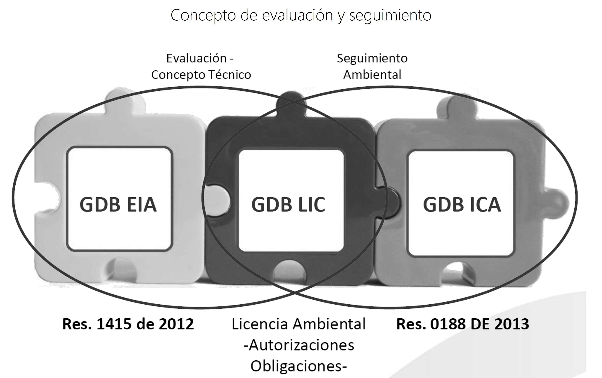
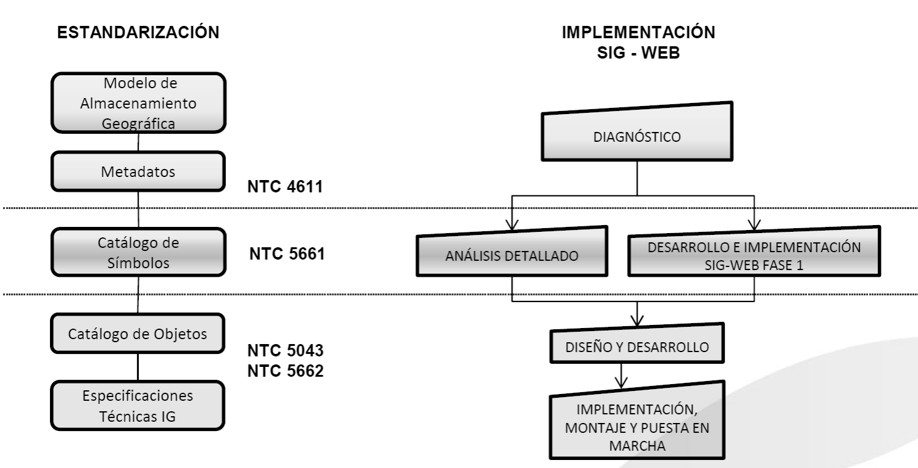
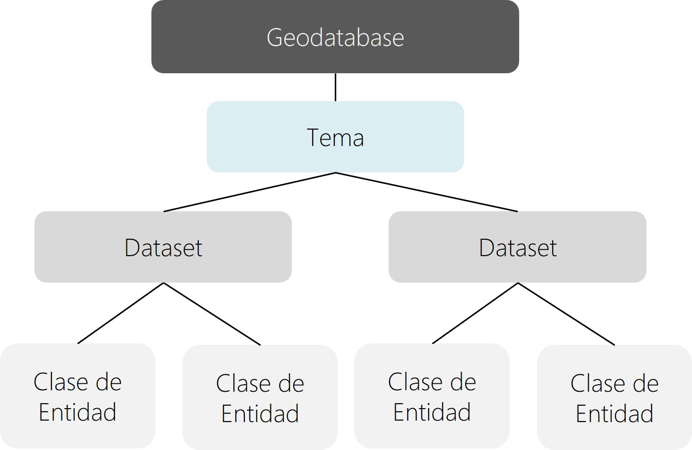
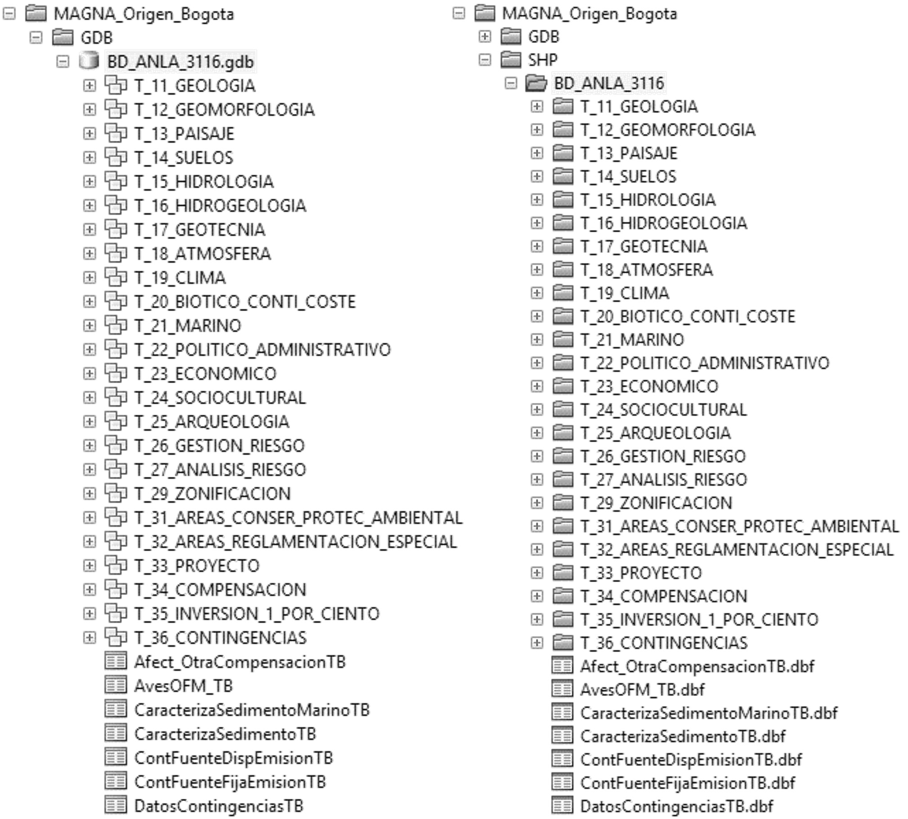
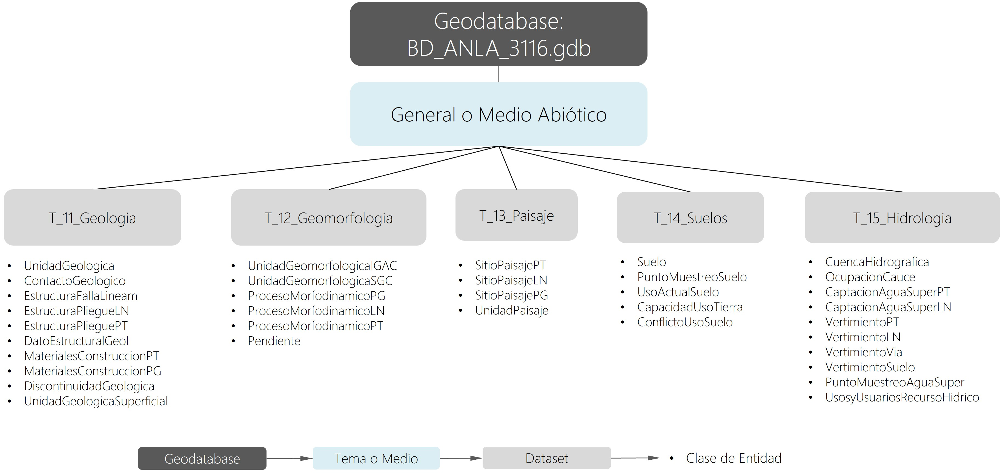
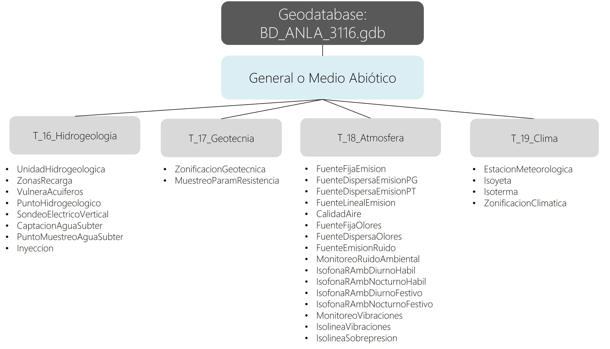

# 1.2. Sistemas de información geográfica y los estudios ambientales 
Keywords: `anla` `eia` `environmental-impact-assessment` `sig`

Mejoras que introducen los SIG a los estudios ambientales:

* Soporte digital de información geográfica y series de datos no espaciales que permite concebir los estudios ambientales, no como un proyecto acabado y rígido, sino como un proyecto abierto a complementarse durante todas las etapas de su desarrollo, adaptándose y dando respuesta a nuevas dinámicas.
* Uso de la tecnología como herramienta de soporte para la toma de decisiones en la que la elección de alternativas va acorde con el conocimiento de todas las áreas profesionales debido a que la información se utiliza de forma transversal y racional.
* Permite contextualizar el proyecto ambiental mediante simulaciones hipotéticas para posteriormente someterlo a diferentes evaluaciones y análisis que pueden inducir al conocimiento de factores sub o sobre estimados.

 Generado con: <a href="https://gemini.google.com/app/001434620896d2dc">https://gemini.google.com</a>  

## Objetivos

* Ofrecer a los participantes un panorama general acerca del uso de los SIG como sistemas complementarios en la elaboración, evaluación y seguimiento de los estudios ambientales.
* Conocer la reglamentación nacional de la Autoridad Nacional de Licencias Ambientales – ANLA y el actual modelo de datos geográfico nacional para la presentación de los Estudios de Impacto Ambiental – EIA, Diagnósticos Ambientales de Alternativas DAA, Planes de Manejo Ambiental – PMA y los Informes de Cumplimiento Ambiental ICA.
* Visualizar un caso de estudio ambiental usando herramientas geográficas SIG.
* Obtener conceptos generales de la aplicación de SIG en la ingeniería ambiental: ordenamiento del territorio, gestión del riesgo, administración de recursos naturales, manejo integrado de cuencas, conservación de especies, salud pública, control de contaminantes atmosféricos, elaboración de estudios de impacto ambiental y zonificación ambiental.

## Requerimientos

Archivos, actividades previas, lecturas y herramientas requeridas para el desarrollo de esta actividad:

| Requerimiento                                                                                       | Descripción                                        |
|:----------------------------------------------------------------------------------------------------|:---------------------------------------------------|
| [:notebook:Lectura](https://es.wikipedia.org/wiki/Forma_de_la_Tierra)                               | Forma de la tierra.                                |
| [:date:IAMB_Georreferenciacion.xlsx](../../file/table/IAMB_Georreferenciacion.xlsx)                 | Cálculos básicos de la forma de la tierra.         |

## 0. Glosario

* GIS: Acrónimo de Geographical Information System
* ANLA: Autoridad Nacional de Licencias Ambientales
* GDB: Geodatabase o base de datos geográfica
* EIA: Estudio de impacto ambiental - “Se entiende por Estudio de Impacto Ambiental el conjunto de la información que deberá presentar ante la autoridad ambiental competente el peticionario de una licencia Ambiental. El estudio de impacto ambiental contendrá información sobre la localización del proyecto, y los elementos abióticos, bióticos y socioeconómicos del medio que puedan sufrir deterioro por la respectiva obra o actividad, para cuya ejecución se pide licencia, y la evaluación de los impactos que puedan producirse. Además, incluirá el diseño de los planes de prevención, corrección y compensación de impactos y el plan de manejo ambiental de la obra o actividad.” ANLA.
* PMA: Plan de manejo ambiental - El Plan de Manejo Ambiental se realizará para mitigar los impactos ambientales que deterioran el medio ambiente y los recursos naturales por efecto de la operación y el funcionamiento del proyecto, desde el punto de vista físico, biótico y social. El Plan de Manejo Ambiental debe establecer el grado de vulnerabilidad de los ecosistemas y comunidades localizados en el área de influencia que se determine para el proyecto. Los impactos deben identificarse, dimensionarse y evaluarse cuantitativa y cualitativamente, de tal manera que se establezcan con la mayor precisión. El plan establece de manera detallada, las acciones que se implementarán para prevenir, mitigar, corregir o compensar los impactos y efectos ambientales negativos que se causen por el desarrollo de un proyecto, obra o actividad. ANLA.

## 1. Marco normativo

### 1.1. Antecedentes

### 1.2. Consolidación

* Mediante la Resolución 1503 de 2010, se adoptó la Metodología de Presentación de Estudios Ambientales, incluyendo por primera vez la estructura de la Geodatabase o GDB (Base de Datos Geográfica), como requerimiento de soporte de la información documental de los proyectos y trámites ambientales presentados ante la Autoridad Ambiental entre los que se incluyen los Estudios de Impacto Ambiental EIA, el Diagnóstico Ambiental de Alternativas DAA y los Planes de Manejo Ambiental PMA. 
* El 17 de agosto de 2012 a través de la Resolución 1415 el Ministerio de Ambiente y Desarrollo Sostenible actualizó y modificó el modelo de almacenamiento geográfico (Geodatabase) contenido en la Metodología General para la presentación de Estudios Ambientales adoptada mediante la Resolución 1503 del 4 de agosto de 2010.
* A través de la Resolución 0188 de febrero 2013, se adopta el Modelo de Almacenamiento Geográfico (Geodatabase) para la entrega de la información geográfica de los Informes de Cumplimiento Ambiental ICA, con el objetivo de complementar y contrastar la base de datos de la GDB de estudios ambientales - presentada por los usuarios mediante Resolución 1415 de 2012 (línea base)-, y la de permisos y licenciamiento (obligaciones y permisos otorgados), logrando así facilitar el seguimiento ambiental de los proyectos licenciados, y el control y cumplimiento de las obligaciones contenidas en la licencia ambiental.

> La Geodatabase GDB es el punto de partida para estandarizar la entrega de los productos geográficos y cartográficos de los proyectos sujetos a permisos y licenciamiento, que servirán como insumos al Sistema de Información Geográfica -SIG-, herramienta en la administración y gestión de la información Georreferenciada de la ANLA, facilitando y agilizando la toma de decisiones de la Autoridad Nacional de Licencias Ambientales.

### 1.3. Bases de datos geográfica año 2013

* La Resolución 2182 de diciembre de 2016 modifica y consolida el Modelo de Almacenamiento Geográfico contenido en la Metodología General para la Presentación de Estudios Ambientales (Diagnóstico Ambiental de Alternativas – DAA y Estudio de Impacto Ambiental – EIA) y el Seguimiento al Plan de Manejo Ambiental Específico de Proyectos – PMAE y los Informes de Cumplimiento Ambiental – ICA para los trámites de que trata el Capítulo 3 – Licencias Ambientales, Sección 1 del Decreto 1076 de 2015.
* El modelo de Almacenamiento Geográfico de esta Resolución _sustituye en su totalidad_ las especificaciones contenidas en las Resoluciones No. 1415 de 2012 y 0188 de 2013.
* Establece además que la Utilización del Modelo de Almacenamiento Geográfico es de carácter _obligatorio para todas las autoridades ambientales competentes_ señaladas en el Decreto 1075 de 2015 y de _obligatoria observancia por parte de los usuarios_.

> Proyectos radicados antes de la publicación de esta resolución no están obligadas a presentar el estudio es este modelo de datos y tienen un plazo de seis meses para su entrega.

### 1.4. Bases de datos geográfica año 2016

### 1.5. Base de datos Único Origen de Coordenadas año 2020 [^1]

Resolución IGAC 471 del 14 de mayo de 2020 y Resolución IGAC 529 del 05 de junio de 2020.

El establecimiento de las condiciones técnicas mínimas que deben tener los productos básicos de cartografía oficial, serán los definidos de conformidad con lo dispuesto por la Resolución 471 del 14 de mayo de 2020 y la posterior Resolución 529 del 05 de junio de 2020, emitidas por el Instituto Geográfico Agustín Codazzi - IGAC, o la norma que la modifique y sustituya, para ello y para garantizar la homogeneidad y continuidad en la representación de los elementos del territorio, así como facilitar los trabajos relacionados con la gestión de coordenadas en el país. En tal sentido, los proyectos, obras o actividades, sujetos al licenciamiento ambiental, deben ajustar su información geográfica a los lineamientos establecidos en la referida normatividad, para la evaluación y seguimiento de los estudios ambientales y/o presentación de los Informes de Cumplimiento Ambiental.

El sistema de proyección cartográfico para Colombia, con un único origen, consiste en una proyección cartográfica Transversa de Mercator Secante, cuyos parámetros están establecidos en el literal i Sistema de Referencia del artículo 4 de la resolución 471 de 2020, los cuales pueden configurarse en software especializado para procesamiento de información geográfica.

MAGNA_Origen_Nacional: https://www.anla.gov.co/documentos/informacion_geografica/magna_origen_nacional.zip

### 1.6. Modelo de Almacenamiento Geográfico Complementario - PPII - YNC año 2021

Circular Externa No. 00002 del 16 de Abril de 2021

En el marco de los Proyectos Piloto de Investigación Integral – PPII sobre Yacimientos No Convencionales – YNC de hidrocarburos con la utilización de la técnica de fracturamiento hidráulico multietapa con perforación horizontal – FH-PH y según los requerimientos y estándares aplicables a estos proyectos, la Autoridad Nacional de Licencias Ambientales – ANLA, ha complementado el modelo de almacenamiento geográfico – MAG.

En aras de garantizar que la información presentada ante la ANLA cumpla con lo consignado en los Términos de Referencia para PPII sobre YNC de hidrocarburos, adoptados mediante Resolución 821 del 24 de septiembre de 2020 expedida por el Ministerio de Ambiente y Desarrollo Sostenible, se comunica a los usuarios y demás autoridades competentes, la estructura de datos complementaria para la presentación de la información geográfica y alfanumérica.

## 2. Modelo nacional para presentación de estudios ambientales - componente geográfico [^1]

La Autoridad Nacional de Licencias Ambientales – ANLA, concibe el Sistema de Información Geográfica - SIG, como una herramienta que le permitirá satisfacer sus necesidades de información a nivel interno y externo, dando soporte a las diferentes instituciones nacionales que conforman el Sistema de Información Nacional Ambiental – SINA, bajo estándares establecidos por la Infraestructura Colombiana de Datos Espaciales – ICDE.

La implementación del Sistema de Información Geográfica – SIG atiende al cumplimiento del Decreto 3573 del 27 de septiembre de 2011, numeral 8 del Art. 14 en el que se expresa la necesidad de diseñar e implementar un Sistema de Información Geográfica, como herramienta informativa para la administración, el manejo y uso de la información como un verdadero instrumento de gestión.

El SIG de la Autoridad Nacional de Licencias Ambientales ANLA, se está alimentado con la información geográfica de los proyectos, obras y actividades que competen a la entidad, la cual es consolidada en una base de datos institucional según los modelos de almacenamiento de la ANLA. De esta manera, la información geográfica de los Estudios de Impacto Ambiental – EIA, Diagnóstico Ambiental de Alternativas – DAA, Planes de Manejo Ambiental - PMA y los Informes de Cumplimiento Ambiental – ICA, así como todo tipo de datos que facilite la evaluación y el seguimiento de los proyectos, harán parte del SIG, integrando la información con los demás sistemas o aplicativos en uso por parte de la ANLA, tales como el Sistema de Información de Licencias Ambientales – SILA, la Ventanilla Integral de Trámites Ambientales en Línea – VITAL y el Registro Único Ambiental – RUA.

Esta meta de la Subdirección de Instrumentos Permisos y Trámites Ambientales, se cumple gracias a la conformación de un Equipo de Geomática integrado por profesionales que atienden la necesidad de creación, alimentación, actualización e implementación del SIG como un único sistema de información bajo criterios de integralidad, uniformidad, eficiencia y eficacia, con la más moderna y avanzada tecnología disponible en el mercado, en armonía con los lineamientos establecidos por la ICDE.

Adicionalmente, la Autoridad Nacional de Licencias Ambientales –ANLA- a partir de la Resolución 1484 de 31 de octubre de 2013 de MADS, es miembro activo del Sistema de Información Ambiental de Colombia - SIAC (link is external), lo cual permitirá el fortalecimiento de lazos interinstitucionales del sector ambiental hacia la consolidación de un trabajo conjunto, en el marco de la normatividad, favoreciendo la gestión de procesos, la coordinación, promoción y generación de instrumentos que garanticen la producción de información geográfica de este sector en el país de manera transparente y eficiente.

El Sistema de Información Ambiental de Colombia (SIAC) “Es el conjunto integrado de actores, políticas, procesos, y tecnologías involucrados en la gestión de información ambiental del país, para facilitar la generación de conocimiento, la toma de decisiones, la educación y la participación social para el desarrollo sostenible”. Con el ánimo de fortalecer el SIAC, la ANLA se encuentra generando, adoptando e implementando estrategias para:

* Incrementar la producción de la información geográfica del sector ambiental
* Establecer y promover la adopción de estándares en la información geográfica
* Avanzar en el fortalecimiento institucional en tecnologías geoespaciales.

### 2.1. ¿Qué es la Geodatabase? 

Es una base de datos geográfica (información cartográfica y alfanumérica o atributos), que permite su manipulación, consulta y análisis a través de plataformas SIG, lo que hace que se convierta en una poderosa herramienta de gestión del conocimiento para toma de decisiones en los procesos de Evaluación y Seguimiento Ambiental. 

> GIS registra la evolución o el cambio espacial y temporal de las variables identificadas en la línea base que requieren de monitoreo

### 2.2. Modelo de datos geográficos ANLA

Es un modelo descriptivo en el que se trata de representar la realidad a través de un inventario preciso y detallado de la información disponible en múltiples áreas.

GIS como sistema transversal de información y análisis en las múltiples etapas de los estudios ambientales.

> Podrá utilizar una base de datos geográfica (Geodatabase en software comercial) o archivos de formas (shapefile en software comercial o libre) individuales para cada uno de los Estudios Ambientales – Modelo de datos descargable desde http://www.anla.gov.co

### 2.3. Concepto de evaluación y seguimiento ANLA

### 2.4. Visión geomática ANLA (febrero 2013)

### 2.5. Estructura genérica de datos ANLA (datos espaciales, tablas y ráster)

> Nota: el subnivel Tema no es visible en la estructura de la Geodatabase o de directorios y solo puede ser observada en el diccionario de datos.

Shapefile: en caso de utilizar archivos de formas, la estructura de directorios o carpetas utilizará el mismo orden jerárquico utilizado en la base de datos o Geodatabase.

**Información vectorial en el Tema General o Medio Abiótico**

## Referencias

* Mª José Rodríguez. Los sistemas de información geográfica: una herramienta de análisis en los estudios de impacto ambiental (EIA).
* Raymundo Montoya Ayala, Juan Carlos García Palomares, Jorge Padilla Ramírez.  (2004): Utilización de un SIG para la determinación del impacto ambiental generado por actividades agrícolas, ganaderas e industriales: el caso del Valle de Zapotitlán en la reserva de la biosfera de Tehuacán Cuicatlán. Boletín de la A.G.E. N.º 38 – julio 2004. México.
* Autoridad Nacional de Licencias Ambientales, www.anla.gov.co, 2013 - 2021, Bogotá. 
* LibroSIG, Aprendiendo a manejar los SIG en la gestión ambiental. 1ª Edición. ISBN: 978-84-691-7370-1. Madrid – España. 2008.

## Control de versiones

| Versión      | Descripción        | Autor                                      | Horas |
|--------------|:-------------------|--------------------------------------------|:-----:|
| 2020.03.18   | Versión inicial.   | [rcfdtools](https://github.com/rcfdtools)  |  12   |
| 2026.02.12   | Versión inicial.   | [rcfdtools](https://github.com/rcfdtools)  |   6   |

##

_R.IAMB es de uso libre para fines académicos, conoce nuestra licencia, cláusulas, condiciones de uso y como referenciar los contenidos publicados en este repositorio, dando [clic aquí](../../LICENSE.md)._

_¡Encontraste útil este repositorio!, apoya su difusión marcando este repositorio con una ⭐ o síguenos dando clic en el botón Follow de [rcfdtools](https://github.com/rcfdtools) en GitHub._

| [◄ Anterior](../GISBasic.md) | [:house: Inicio](../../README.md) | [:beginner: Ayuda / Colabora](https://github.com/rcfdtools/R.IAMB/discussions/1) | [Siguiente ►](../M01A02a/Readme.md) |
|----------------------------|-----------------------------------|----------------------------------------------------------------------------------|---------------------------------------------------|

[^1]: https://www.anla.gov.co/01_anla/entidad/subdirecciones-y-oficinas/instrumentos-permisos-y-tramites-ambientales/sistema-de-informacion-geografica 
