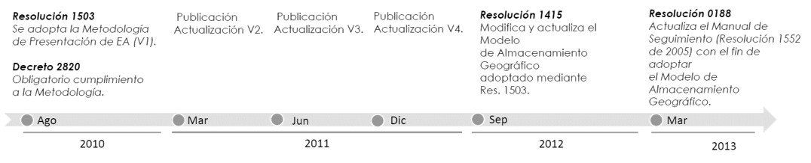
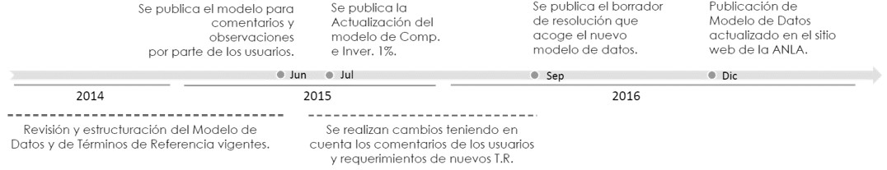

# 1.2. Sistemas de información geográfica y los estudios ambientales 
Keywords: `anla` `eia` `environmental-impact-assessment` `sig`

Mejoras que introducen los SIG a los estudios ambientales:

* Soporte digital de información geográfica y series de datos no espaciales que permite concebir los estudios ambientales, no como un proyecto acabado y rígido, sino como un proyecto abierto a complementarse durante todas las etapas de su desarrollo, adaptándose y dando respuesta a nuevas dinámicas.
* Uso de la tecnología como herramienta de soporte para la toma de decisiones en la que la elección de alternativas va acorde con el conocimiento de todas las áreas profesionales debido a que la información se utiliza de forma transversal y racional.
* Permite contextualizar el proyecto ambiental mediante simulaciones hipotéticas para posteriormente someterlo a diferentes evaluaciones y análisis que pueden inducir al conocimiento de factores sub o sobre estimados.

 Generado con: <a href="https://gemini.google.com/app/001434620896d2dc">https://gemini.google.com</a>  

## Objetivos

* Ofrecer a los participantes un panorama general acerca del uso de los SIG como sistemas complementarios en la elaboración, evaluación y seguimiento de los estudios ambientales.
* * Conocer la reglamentación nacional de la Autoridad Nacional de Licencias Ambientales – ANLA y el actual modelo de datos geográfico nacional para la presentación de los Estudios de Impacto Ambiental – EIA, Diagnósticos Ambientales de Alternativas DAA, Planes de Manejo Ambiental – PMA y los Informes de Cumplimiento Ambiental ICA.
* Visualizar un caso de estudio ambiental usando herramientas geográficas SIG.
* Obtener conceptos generales de la aplicación de SIG en la ingeniería ambiental: ordenamiento del territorio, gestión del riesgo, administración de recursos naturales, manejo integrado de cuencas, conservación de especies, salud pública, control de contaminantes atmosféricos, elaboración de estudios de impacto ambiental y zonificación ambiental.

## Requerimientos

Archivos, actividades previas, lecturas y herramientas requeridas para el desarrollo de esta actividad:

| Requerimiento                                                                                       | Descripción                                        |
|:----------------------------------------------------------------------------------------------------|:---------------------------------------------------|
| [:notebook:Lectura](https://es.wikipedia.org/wiki/Forma_de_la_Tierra)                               | Forma de la tierra.                                |
| [:date:IAMB_Georreferenciacion.xlsx](../../file/table/IAMB_Georreferenciacion.xlsx)                 | Cálculos básicos de la forma de la tierra.         |

## 0. Glosario

* GIS: Acrónimo de Geographical Information System
* ANLA: Autoridad Nacional de Licencias Ambientales
* GDB: Geodatabase o base de datos geográfica
* EIA: Estudio de impacto ambiental - “Se entiende por Estudio de Impacto Ambiental el conjunto de la información que deberá presentar ante la autoridad ambiental competente el peticionario de una licencia Ambiental. El estudio de impacto ambiental contendrá información sobre la localización del proyecto, y los elementos abióticos, bióticos y socioeconómicos del medio que puedan sufrir deterioro por la respectiva obra o actividad, para cuya ejecución se pide licencia, y la evaluación de los impactos que puedan producirse. Además, incluirá el diseño de los planes de prevención, corrección y compensación de impactos y el plan de manejo ambiental de la obra o actividad.” ANLA.
* PMA: Plan de manejo ambiental - El Plan de Manejo Ambiental se realizará para mitigar los impactos ambientales que deterioran el medio ambiente y los recursos naturales por efecto de la operación y el funcionamiento del proyecto, desde el punto de vista físico, biótico y social. El Plan de Manejo Ambiental debe establecer el grado de vulnerabilidad de los ecosistemas y comunidades localizados en el área de influencia que se determine para el proyecto. Los impactos deben identificarse, dimensionarse y evaluarse cuantitativa y cualitativamente, de tal manera que se establezcan con la mayor precisión. El plan establece de manera detallada, las acciones que se implementarán para prevenir, mitigar, corregir o compensar los impactos y efectos ambientales negativos que se causen por el desarrollo de un proyecto, obra o actividad. ANLA.

## 1. Marco normativo

Autoridad nacional de licencias ambientales – ANLA
https://www.anla.gov.co/01_anla/entidad/subdirecciones-y-oficinas/instrumentos-permisos-y-tramites-ambientales/sistema-de-informacion-geografica

Antecedentes

Consolidación

## 1. Metodología nacional para presentación de estudios ambientales - componente geográfico

## Referencias

* Mª José Rodríguez. Los sistemas de información geográfica: una herramienta de análisis en los estudios de impacto ambiental (EIA).
* Raymundo Montoya Ayala, Juan Carlos García Palomares, Jorge Padilla Ramírez.  (2004): Utilización de un SIG para la determinación del impacto ambiental generado por actividades agrícolas, ganaderas e industriales: el caso del Valle de Zapotitlán en la reserva de la biosfera de Tehuacán Cuicatlán. Boletín de la A.G.E. N.º 38 – julio 2004. México.
* Autoridad Nacional de Licencias Ambientales, www.anla.gov.co, 2013 - 2021, Bogotá. 
* LibroSIG, Aprendiendo a manejar los SIG en la gestión ambiental. 1ª Edición. ISBN: 978-84-691-7370-1. Madrid – España. 2008.

## Control de versiones

| Versión      | Descripción        | Autor                                      | Horas |
|--------------|:-------------------|--------------------------------------------|:-----:|
| 2020.03.18   | Versión inicial.   | [rcfdtools](https://github.com/rcfdtools)  |  12   |
| 2026.02.12   | Versión inicial.   | [rcfdtools](https://github.com/rcfdtools)  |   6   |

##

_R.IAMB es de uso libre para fines académicos, conoce nuestra licencia, cláusulas, condiciones de uso y como referenciar los contenidos publicados en este repositorio, dando [clic aquí](../../LICENSE.md)._

_¡Encontraste útil este repositorio!, apoya su difusión marcando este repositorio con una ⭐ o síguenos dando clic en el botón Follow de [rcfdtools](https://github.com/rcfdtools) en GitHub._

| [◄ Anterior](../GISBasic.md) | [:house: Inicio](../../README.md) | [:beginner: Ayuda / Colabora](https://github.com/rcfdtools/R.IAMB/discussions/1) | [Siguiente ►](../M01A02a/Readme.md) |
|----------------------------|-----------------------------------|----------------------------------------------------------------------------------|---------------------------------------------------|

[^1]: 
