<div align="center"></div>

# 2.5. Medio socioeconómico - División geopolítica
Keywords: `state` `county` `remote-sensing` `clip-raster`

Descargue, cree un mosaico y recorte imágenes satelitales hasta el límite de la zona de estudio.

<div align="center"></div>


## Objetivos

* 


## Requerimientos

Archivos, actividades previas, lecturas y herramientas requeridas para el desarrollo de esta actividad:

<div align="center">

| Requerimiento                                                                                                 | Descripción                                                                                                          |
|:--------------------------------------------------------------------------------------------------------------|:---------------------------------------------------------------------------------------------------------------------|
| [:toolbox:Herramienta](https://qgis.org/)                                                                     | QGIS 3.44 o superior.                                                                                                |
| [:date:magna_origen_nacional.zip](../../file/data/ANLA/magna_origen_nacional.zip)                             | Geodatabase ANLA Magna Origen Nacional.                                                                              |
| [:date:diccionario_datos_geograficos_anla.xlsx](../../file/data/ANLA/diccionario_datos_geograficos_anla.xlsx) | Diccionario de datos geográficos ANLA.                                                                               |
| [:round_pushpin:qgis_basemaps.py](../../file/src/qgis_basemaps.py)                                            | Script en Python para inclusión de mapas base XYZ en QGIS por [opengeos](https://github.com/opengeos/qgis-basemaps). |
| [:round_pushpin:qgis_clip_dissolve_reproject_adp.py](../../file/src/qgis_clip_dissolve_reproject_adp.py)      | Script en Python recortar, disolver, reproyectar y calcular distribuciones porcentuales de área.                     |

</div>


## 1. Departamentos

Caracterización de los componentes socioeconómicos a escala departamental. En los casos en que la información que se requiere en detalle deba ser levantada según el tipo de estudio y términos de referencia, y que por algún motivo no pueda ser presentada, los campos numéricos se deben diligenciar con el número 999 y la justificación de la no presentación de la información se debe diligenciar en el campo de observaciones. En los campos alfanuméricos se debe presentar la justificación en el mismo campo.

La capa _Departamento_ del modelo de datos ANLA, requiere de los siguientes atributos y contiene varios dominios asociados:

<div align="center"></div>

Dominios: Dom_Departamento, Dom_MediosComu, Dom_MediosComu, Dom_MediosComu, Dom_Activ_Econo, Dom_Activ_Econo, Dom_Activ_Econo

> Consulte todas las propiedades requeridas en el diccionario de datos del ANLA.

1. Ingrese al portal de https://www.colombiaenmapas.gov.co/ y descargue la capa Shapefile de Departamentos de Colombia.

* Recurso: https://www.colombiaenmapas.gov.co/?u=0&t=29&servicio=609
* Entidad: Instituto Geográfico Agustín Codazzi - IGAC
* Resumen: Son entidades territoriales de la división política - administrativa del Estado, que agrupan municipios, distritos y áreas no municipalizadas; su definición no incluye las fronteras internacionales con otros países, tienen autonomía para la administración de los asuntos seccionales, planificación, promoción del desarrollo económico y social dentro de su territorio, en los términos establecidos por la Constitución y las leyes. Se representan sobre cartografía del IGAC acorde a lo establecido en la Ley 1447 de 2011 y su Decreto Reglamentario 1170 de 2015. Ahora bien, es de anotar que la información sobre límites departamentales está sujeta a las actualizaciones de los resultados de las operaciones administrativas de deslinde y las decisiones tomadas por los competentes (Asambleas departamentales y Congreso de la República).

<div align="center">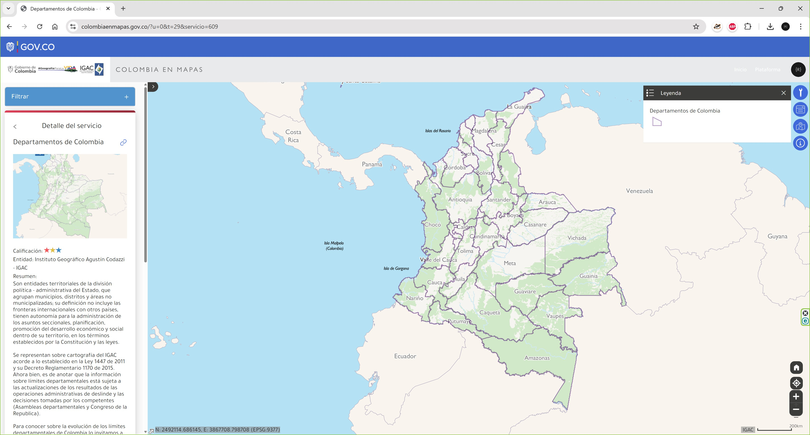</div>

2. En QGIS, abra el mapa _/map/CaseStudy.qgz_ y guarde como  _/map/GeoZone.qgz_. Cargue y rotule la capa [/data/IGAC/DepartamentosColombia20260306.shp](../../file/data/IGAC/DepartamentosColombia20260306.zip). Podrá observar que la zona de estudio se encuentra dentro del Departamento de Cundinamarca y que en los extremos nor-este y sur-oeste, los límites no son completamente coincidentes.

3. Para la generación del polígono requerido por el ANLA, utilice el polígono completo de la zona de estudio agregando los atributos requeridos.

<div align="center">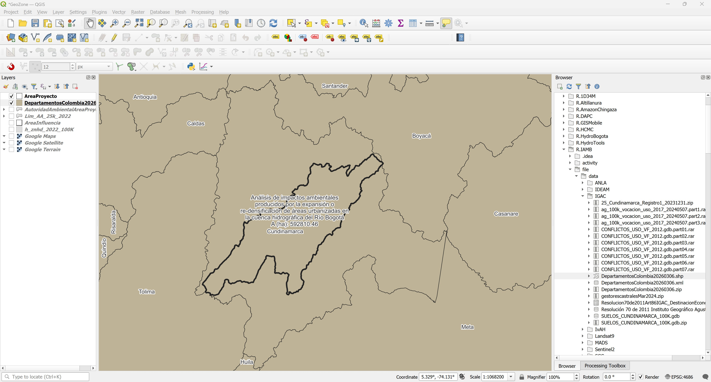</div>
<div align="center">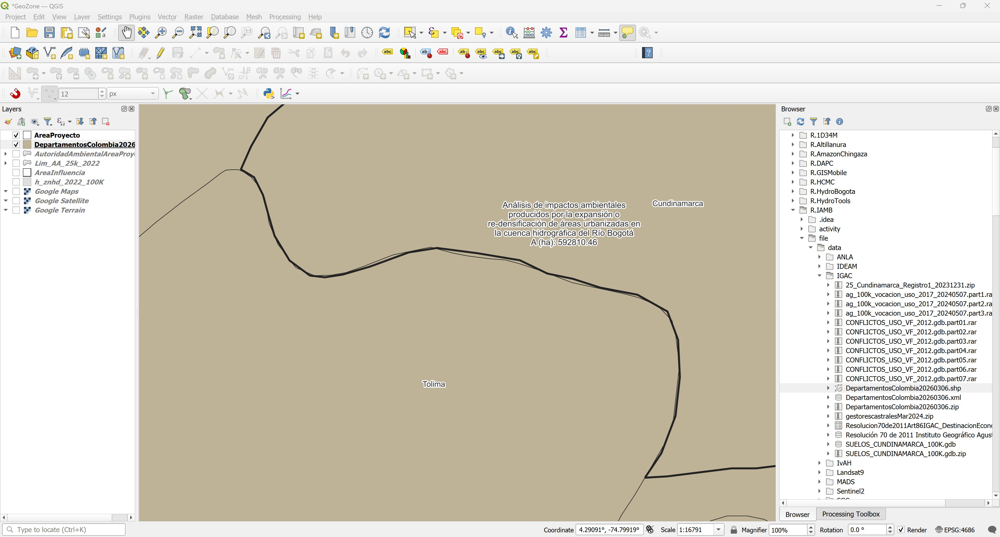</div>

:pencil2:**Tarea:** Homologue y cargue el análisis realizado en la capa correspondiente del modelo ANLA.


## 2. Municipios

Caracterización de los componentes socioeconómicos a escala municipal. En los casos en que la información que se requiere en detalle deba ser levantada según el tipo de estudio y términos de referencia, y que por algún motivo no pueda ser presentada, los campos numéricos se deben diligenciar con el número 999 y la justificación de la no presentación de la información se debe diligenciar en el campo de observaciones. En los campos alfanuméricos se debe presentar la justificación en el mismo campo.

La capa _Municipio_ del modelo de datos ANLA, requiere de los siguientes atributos y contiene varios dominios asociados:

<div align="center"></div>

Dominios: Dom_Municipio, Dom_Departamento, Dom_MediosComu, Dom_MediosComu, Dom_MediosComu, Dom_Activ_Econo, Dom_Activ_Econo, Dom_Activ_Econo.

> Consulte todas las propiedades requeridas en el diccionario de datos del ANLA.

1. Ingrese al portal de https://www.colombiaenmapas.gov.co/ y descargue la capa Shapefile de Municipios, Distritos y Áreas no municipalizadas de Colombia.

* Recurso: https://www.colombiaenmapas.gov.co/?u=0&t=29&servicio=610
* Entidad: Instituto Geográfico Agustín Codazzi - IGAC
* Resumen: Entidades territoriales fundamentales de la división político y administrativa del Estado, integran los departamentos y su definición, no involucra las fronteras internacionales con otros países. Tienen autonomía política, fiscal y administrativa dentro de los límites que, señalados en la Constitución y las leyes, cuya finalidad es el bienestar general y el mejoramiento de la calidad de vida de la población en su respectivo territorio. Se representan sobre cartografía del IGAC, acorde a lo establecido en la Ley 1447 de 2011 y su Decreto Reglamentario 1170 de 2015. Para el caso de los Distritos, la definición y modificación de sus límites está estipulado en la Ley 1617 de 2013. Las áreas No Municipalizadas, hacen parte de la división territorial, pero no son entidades territoriales (artículo 285 y 286 de la Constitución Política de Colombia, 1991); la categorización de cada municipio se establece de conformidad con la Ley 617 de 2000. La información sobre los límites municipales, está sujeta a las actualizaciones de los resultados de las operaciones administrativas de deslinde y las decisiones tomadas por los competentes (Asambleas departamentales y Congreso de la República).

<div align="center">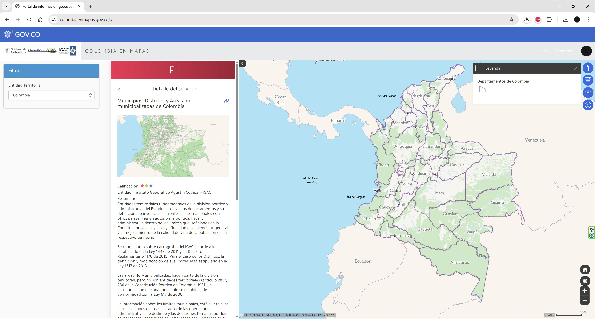</div>

2. En QGIS cargue y rotule la capa [/data/IGAC/MunicipiosColombia20260306.shp](../../file/data/IGAC/MunicipiosColombia20260306.zip). Podrá observar que la zona de estudio interseca o contiene múltiples municipios.

<div align="center">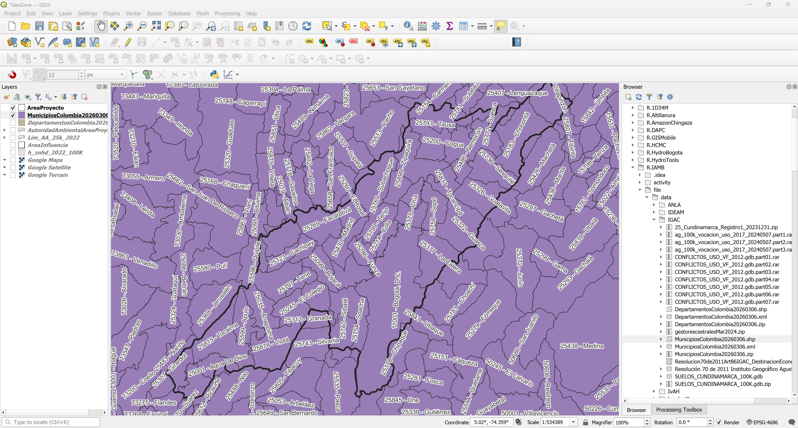</div>

3. Utilizando la herramienta _Vector Selection / Select by location_, seleccione todos los municipios que intersecan el área de estudio. Podrá observar que se han seleccionado 69 municipios.

<div align="center">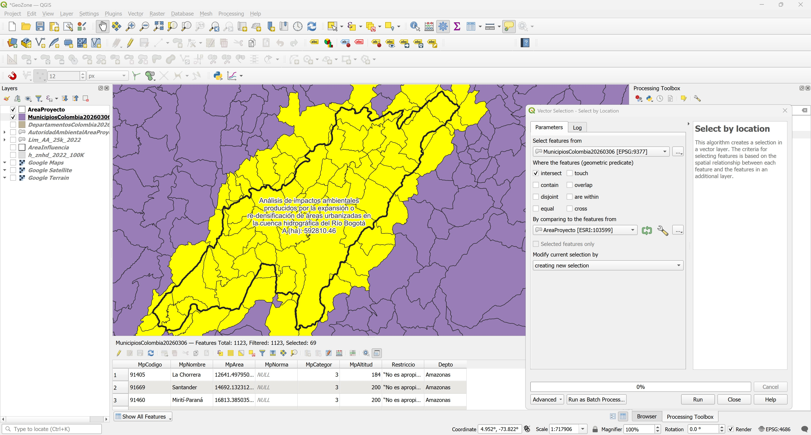</div>

4. Exporte y re-proyecte los municipios seleccionados, guarde como /shp/MunicipiosAreaProyecto.shp.

<div align="center">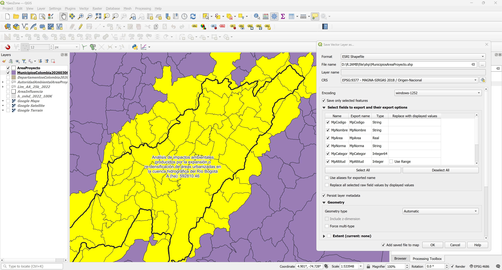</div>
<div align="center">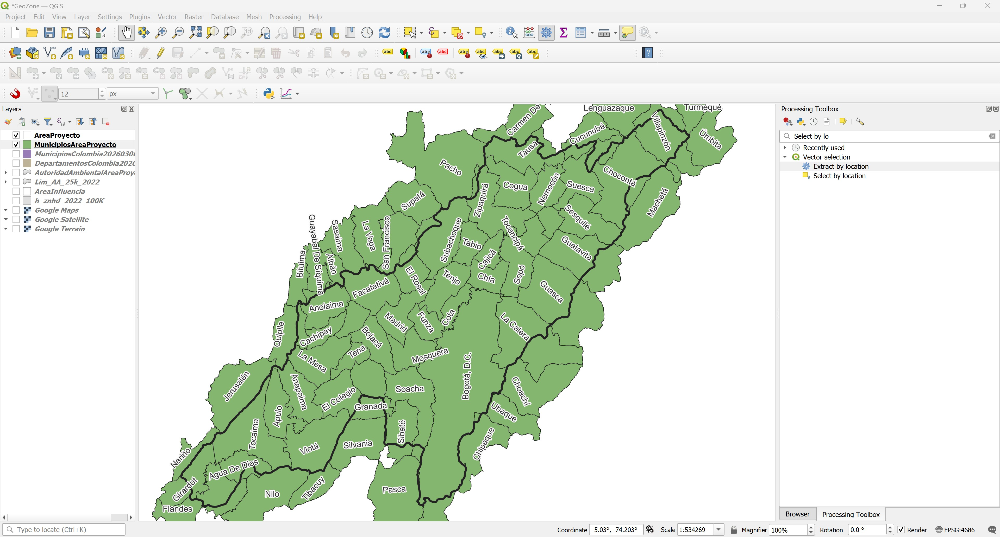</div>

5. Calcule el área total en hectáreas de cada municipio. Nombre el campo como `ATotalha`.

Expresión: `area(@geometry)/10000`

<div align="center">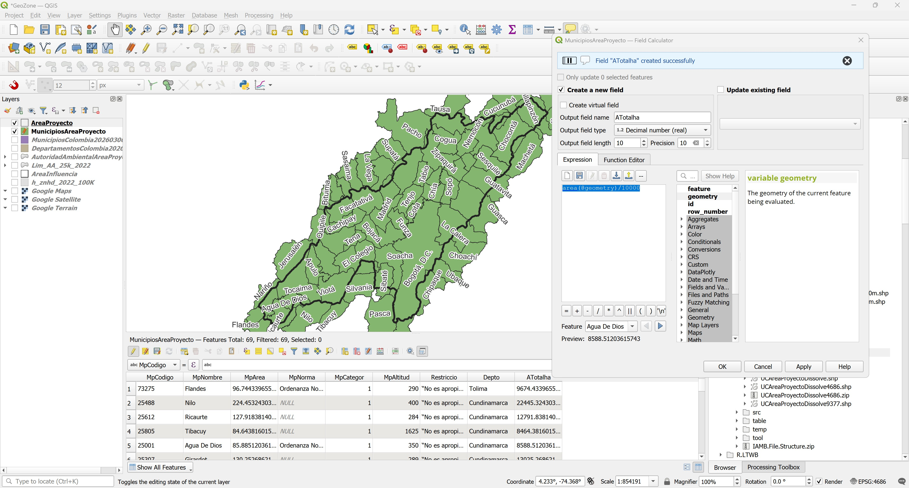</div>

6. Utilizando el script de Python [qgis_clip_dissolve_reproject_adp.py](../../file/src/qgis_clip_dissolve_reproject_adp.py), recorte, disuelva, re-proyecte y calcule la distribución porcentual de los municipios contenidos dentro de la zona de estudio. Podrá observar que dentro del área del proyecto existen 69 municipios contenidos o intersecadps. En la tabla de atributos de la capa disuelta y re-proyectada, elimine los atributos `AREA`, `SHAPE_Leng` y `SHAPE_Area`.

> Antes de ejecutar el script, establezca en Settings / Options / Processing / General / Invalid features filtering / Do not filter.

Parámetros generales
```
input_layer_path = 'C:/IAMB/shp/MunicipiosAreaProyecto.shp'
overlay_layer_path = 'C:/IAMB/gdb/BD_ANLA_MAGNA_NACIONAL.gdb|layername=AreaProyecto'
output_file_clip_name = 'MunicipiosAreaProyectoClip'
dissolve_field = 'MpCodigo'
```

<div align="center">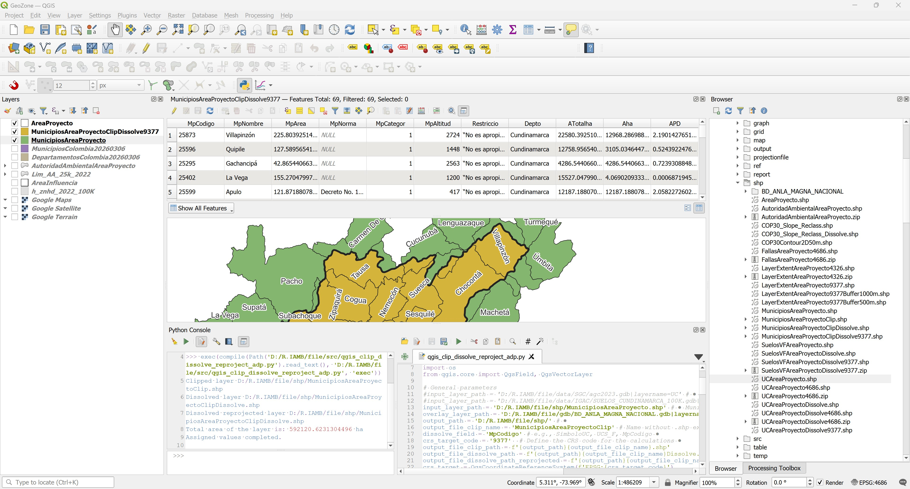</div>

Abra la tabla de atributos y ordene descendentemente por el campo `Aha`, podrá observar que 23 fracciones de municipios perimetrales al área del proyecto han sido incluídos como parte del análisis. Debido a las versiones y escala de digitalización, los municipios con áreas pequeñas `"Aha" <= 1100` no deberían ser incorporados a la base de datos ANLA.

<div align="center">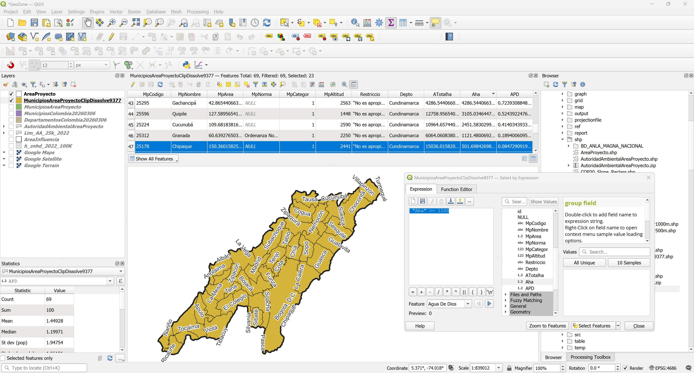</div>

7. Calcule el % de área contenida de cada municipio dentro del área de estudio con respecto al total de su propia área. Nombre el campo de atributos como `APP`.

Expresión: `("Aha" / "ATotalha") * 100`

<div align="center">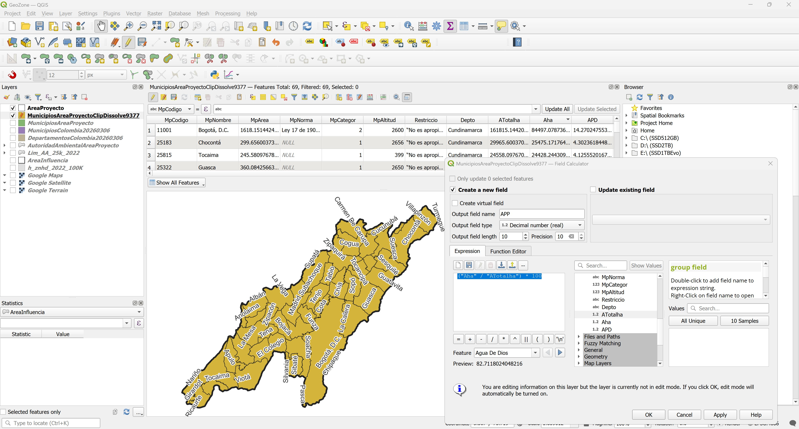</div>

<div align="center">

|   MpCodigo | MpNombre                   |   ATotalha |          Aha |          APD |           APP |
|-----------:|:---------------------------|-----------:|-------------:|-------------:|--------------:|
|      11001 | Bogotá, D.C.               |  161815    | 84497.1      | 14.2702      |  52.2183      |
|      15835 | Turmequé                   |    7957.76 |     0.563379 |  9.5146e-05  |   0.00707962  |
|      15842 | Úmbita                     |   14584.5  |     4.98134  |  0.000841272 |   0.0341552   |
|      25001 | Agua De Dios               |    8588.51 |  7103.71     |  1.19971     |  82.7118      |
|      25019 | Albán                      |    5075.1  |    46.442    |  0.00784333  |   0.915095    |
|      25035 | Anapoima                   |   12383.7  | 12372.5      |  2.08953     |  99.9093      |
|      25040 | Anolaima                   |   12083.1  | 11008.8      |  1.85921     |  91.1086      |
|      25095 | Bituima                    |    6101.69 |    77.7694   |  0.0131341   |   1.27455     |
|      25099 | Bojacá                     |   10220.7  | 10220.7      |  1.72613     | 100           |
|      25123 | Cachipay                   |    5339.58 |  5339.58     |  0.901773    | 100           |
|      25126 | Cajicá                     |    5125.63 |  5125.63     |  0.86564     | 100           |
|      25154 | Carmen De Carupa           |   29814.8  |    25.6659   |  0.00433457  |   0.0860844   |
|      25175 | Chía                       |    8005.16 |  8005.16     |  1.35195     | 100           |
|      25178 | Chipaque                   |   15036    |   501.698    |  0.0847291   |   3.33664     |
|      25181 | Choachí                    |   21213.2  |   123.909    |  0.0209264   |   0.584113    |
|      25183 | Chocontá                   |   29965.6  | 25475.2      |  4.30236     |  85.0147      |
|      25200 | Cogua                      |   13270.1  | 13263.1      |  2.23993     |  99.9469      |
|      25214 | Cota                       |    5367.95 |  5367.95     |  0.906564    | 100           |
|      25224 | Cucunubá                   |   10964.7  |  2451.58     |  0.414034    |  22.359       |
|      25245 | El Colegio                 |   11815.6  | 11810.2      |  1.99455     |  99.9539      |
|      25260 | El Rosal                   |    8712.01 |  7078.98     |  1.19553     |  81.2554      |
|      25269 | Facatativá                 |   15787.9  | 15527.4      |  2.62233     |  98.3496      |
|      25286 | Funza                      |    6997.26 |  6997.26     |  1.18173     | 100           |
|      25295 | Gachancipá                 |    4286.54 |  4286.54     |  0.723931    | 100           |
|      25307 | Girardot                   |   13025.3  |  7605.94     |  1.28453     |  58.3937      |
|      25312 | Granada                    |    6064.06 |  1121.48     |  0.189401    |  18.4939      |
|      25322 | Guasca                     |   36008.4  | 20880.9      |  3.52646     |  57.989       |
|      25326 | Guatavita                  |   25199.8  | 15388.1      |  2.5988      |  61.0642      |
|      25328 | Guayabal De Síquima        |    6183.97 |     0.017005 |  2.87188e-06 |   0.000274985 |
|      25368 | Jerusalén                  |   22167.3  |    63.5232   |  0.0107281   |   0.286563    |
|      25377 | La Calera                  |   32608    | 18919.9      |  3.19528     |  58.0222      |
|      25386 | La Mesa                    |   14812.9  | 14805.5      |  2.50041     |  99.9496      |
|      25402 | La Vega                    |   15527    |     4.06902  |  0.000687195 |   0.026206    |
|      25407 | Lenguazaque                |   15539.6  |     5.23275  |  0.00088373  |   0.0336736   |
|      25426 | Machetá                    |   22883.7  |    60.6109   |  0.0102362   |   0.264865    |
|      25430 | Madrid                     |   11944.5  | 11944.5      |  2.01724     | 100           |
|      25473 | Mosquera                   |   10601    | 10601        |  1.79035     | 100           |
|      25483 | Nariño                     |    5508.9  |    39.7      |  0.00670471  |   0.720652    |
|      25486 | Nemocón                    |    9822.99 |  9822.99     |  1.65895     | 100           |
|      25488 | Nilo                       |   22445.3  |    37.6378   |  0.00635645  |   0.167687    |
|      25513 | Pacho                      |   40214.7  |    28.5494   |  0.00482156  |   0.0709925   |
|      25535 | Pasca                      |   27137.7  |   220.332    |  0.0372107   |   0.811904    |
|      25596 | Quipile                    |   12759    |  3105.03     |  0.524392    |  24.3361      |
|      25599 | Apulo                      |   12187.2  | 12187.2      |  2.05823     | 100           |
|      25612 | Ricaurte                   |   12791.8  |  8506.34     |  1.43659     |  66.4982      |
|      25645 | San Antonio Del Tequendama |    8847.41 |  8827.72     |  1.49087     |  99.7775      |
|      25658 | San Francisco              |   11861.6  |    33.7277   |  0.00569609  |   0.284345    |
|      25718 | Sasaima                    |   11150.7  |    10.0266   |  0.00169334  |   0.0899194   |
|      25736 | Sesquilé                   |   14098.7  | 14086.5      |  2.37899     |  99.9131      |
|      25740 | Sibaté                     |   12585.9  |  9856.33     |  1.66458     |  78.3127      |
|      25743 | Silvania                   |   16278.5  |   129.19     |  0.0218181   |   0.79362     |
|      25754 | Soacha                     |   18330.6  | 17221.6      |  2.90846     |  93.9502      |
|      25758 | Sopó                       |   11115    | 11115        |  1.87715     | 100           |
|      25769 | Subachoque                 |   20896.7  | 18942.6      |  3.19912     |  90.6488      |
|      25772 | Suesca                     |   17301.9  | 13592.3      |  2.29553     |  78.5596      |
|      25777 | Supatá                     |   13023.8  |    10.4672   |  0.00176775  |   0.0803699   |
|      25785 | Tabio                      |    7512.98 |  7512.98     |  1.26883     | 100           |
|      25793 | Tausa                      |   20191.6  | 13727.1      |  2.31829     |  67.984       |
|      25797 | Tena                       |    5138.37 |  5138.37     |  0.86779     | 100           |
|      25799 | Tenjo                      |   11401    | 11401        |  1.92545     | 100           |
|      25805 | Tibacuy                    |    8464.38 |    14.684    |  0.0024799   |   0.17348     |
|      25815 | Tocaima                    |   24558.1  | 24428.2      |  4.12555     |  99.4712      |
|      25817 | Tocancipá                  |    7314.81 |  7314.81     |  1.23536     | 100           |
|      25841 | Ubaque                     |   10695    |    52.738    |  0.00890663  |   0.493108    |
|      25873 | Villapinzón                |   22580.4  | 12968.3      |  2.19014     |  57.4316      |
|      25878 | Viotá                      |   20110.4  | 20092.3      |  3.39327     |  99.91        |
|      25898 | Zipacón                    |    5414.08 |  5414.08     |  0.914354    | 100           |
|      25899 | Zipaquirá                  |   19458.1  | 18167.8      |  3.06826     |  93.3687      |
|      73275 | Flandes                    |    9674.43 |     1.94023  |  0.000327675 |   0.0200553   |

</div>

:pencil2:**Tarea:** Homologue y cargue el análisis realizado en la capa correspondiente del modelo ANLA.

## 3. Veredas

Caracterización de los componentes socioeconómicos a nivel de la(s) unidad(es) territorial(es) que está(n) dentro de un municipio pero que son más grandes que un asentamiento o que pueden contener más de un asentamiento, como son la Vereda, el Sector de Vereda o el Corregimiento (incluye el área rural). Se debe diligenciar la información para cada unidad territorial. Para la caracterización de los asentamientos se deberá diligenciar la capa geográfica "Asentamiento". En los casos en que la información que se requiere en detalle deba ser levantada según el tipo de estudio y términos de referencia, y que por algún motivo no pueda ser presentada, los campos numéricos se deben diligenciar con el número 999 y la justificación de la no presentación de la información se debe diligenciar en el campo de observaciones. En los campos alfanuméricos se debe presentar la justificación en el mismo campo.

La capa _UnidadTerritorial_ del modelo de datos ANLA, requiere de los siguientes atributos y contiene varios dominios asociados:

<div align="center"></div>

Dominios: Dom_UnidTerr, Dom_Municipio, Dom_Departamento, Dom_PoblaDesplaz, Dom_TransPublico, Dom_MediosComu, Dom_MediosComu, Dom_MediosComu, Dom_MediosComu, Dom_Activ_Econo, Dom_Activ_Econo, Dom_Activ_Econo, Dom_DesEconom, Dom_DesEconom, Dom_DesEconom, Dom_DesEconom, Dom_Boolean.

> Consulte todas las propiedades requeridas en el diccionario de datos del ANLA.

1. Ingrese al portal de https://www.colombiaenmapas.gov.co/ y descargue la capa Veredas de Colombia.

* Recurso: https://www.colombiaenmapas.gov.co/?u=0&t=29&servicio=690
* Entidad: Departamento Administrativo Nacional de Estadística - DANE
* Resumen: Veredas de Colombia delimitadas por el DANE dentro del Marco Geoestadístico Nacional año 2020 y actualizadas con fines estadísticos a los límites de departamentos y municipios del IGAC (Mayo 2016). Las veredas son una división territorial de carácter administrativo en el área rural de los municipios, establecidas mediante acuerdo municipal. Se conforman principalmente por la agrupación de predios delimitados por accidentes geográficos y vías principales.
* Fecha de elaboración: 15-02-2025
* Fecha de insumos: 30-11-2024

<div align="center">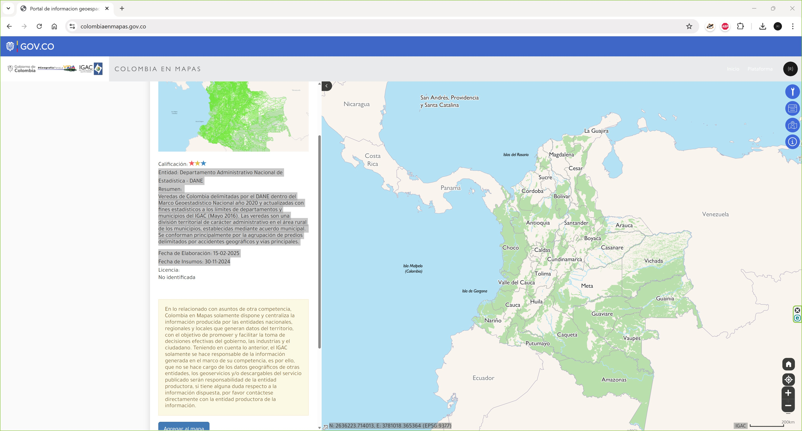</div>

2. En QGIS cargue y rotule la capa [/data/DANE/VeredasColombia20260306.shp](../../file/data/DANE/VeredasColombia20260306.zip). Podrá observar que la zona de estudio interseca o contiene múltiples veredas.

> Tenga en cuenta que esta capa no contiene los polígonos de las áreas urbanas.

<div align="center">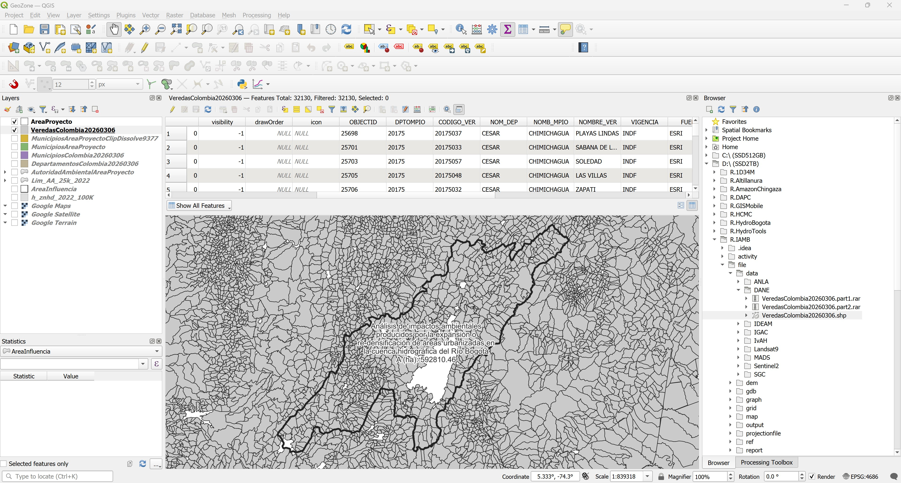</div>

3. Utilizando el script de Python [qgis_clip_dissolve_reproject_adp.py](../../file/src/qgis_clip_dissolve_reproject_adp.py), recorte, disuelva, re-proyecte y calcule la distribución porcentual de los municipios contenidos dentro de la zona de estudio. Podrá observar que dentro del área del proyecto existen 69 municipios contenidos o intersecadps. En la tabla de atributos de la capa disuelta y re-proyectada, elimine los atributos `AREA`, `SHAPE_Leng` y `SHAPE_Area`.

> Antes de ejecutar el script, establezca en Settings / Options / Processing / General / Invalid features filtering / Do not filter.

Parámetros generales

```
input_layer_path = 'C:/IAMB/shp/VeredasColombia20260306.shp'
overlay_layer_path = 'C:/IAMB/gdb/BD_ANLA_MAGNA_NACIONAL.gdb|layername=AreaProyecto'
output_file_clip_name = 'VeredaAreaProyecto'
dissolve_field = 'CODIGO_VER'
```

<div align="center"></div>

<div align="center">

|   CODIGO_VER | NOMBRE_VER                   | NOMB_MPIO                  | NOM_DEP      |           Aha |         APD |
|-------------:|:-----------------------------|:---------------------------|:-------------|--------------:|------------:|
|     11001001 | ARRAYAN                      | BOGOTÁ, D.C.               | BOGOTÁ, D.C. | 1456.38       | 0.273393    |
|     11001005 | CHISACA                      | BOGOTÁ, D.C.               | BOGOTÁ, D.C. | 2073.34       | 0.389211    |
|     11001009 | CONEJERA                     | BOGOTÁ, D.C.               | BOGOTÁ, D.C. | 2463.93       | 0.462533    |
|     11001010 | CURUBITAL                    | BOGOTÁ, D.C.               | BOGOTÁ, D.C. |  133.476      | 0.0250564   |
|     11001011 | EL BAGAZAL                   | BOGOTÁ, D.C.               | BOGOTÁ, D.C. |  478.046      | 0.0897396   |
|     11001012 | EL BOSQUE SURORIENTAL        | BOGOTÁ, D.C.               | BOGOTÁ, D.C. |  326.524      | 0.0612957   |
|     11001013 | EL HATO                      | BOGOTÁ, D.C.               | BOGOTÁ, D.C. |  823.056      | 0.154505    |
|     11001016 | EL UVAL                      | BOGOTÁ, D.C.               | BOGOTÁ, D.C. |  914.718      | 0.171712    |
|     11001017 | HOYA SAN CRISTOBAL           | BOGOTÁ, D.C.               | BOGOTÁ, D.C. | 1328.73       | 0.249432    |
|     11001018 | HOYA TEUSACA                 | BOGOTÁ, D.C.               | BOGOTÁ, D.C. | 3124.97       | 0.586624    |
|     11001019 | INGEMAR ORIENTAL             | BOGOTÁ, D.C.               | BOGOTÁ, D.C. |  288.925      | 0.0542374   |
|     11001020 | ITSMO                        | BOGOTÁ, D.C.               | BOGOTÁ, D.C. | 2663.19       | 0.499937    |
|     11001021 | LA REGADERA                  | BOGOTÁ, D.C.               | BOGOTÁ, D.C. | 1602.36       | 0.300797    |
|     11001027 | LAS MARGARITAS               | BOGOTÁ, D.C.               | BOGOTÁ, D.C. | 1086.2        | 0.203903    |
|     11001028 | LAS MERCEDES                 | BOGOTÁ, D.C.               | BOGOTÁ, D.C. | 1605.03       | 0.301298    |
|     11001032 | LAS VIOLETAS                 | BOGOTÁ, D.C.               | BOGOTÁ, D.C. |  553.946      | 0.103988    |
|     11001033 | LOS ANDES                    | BOGOTÁ, D.C.               | BOGOTÁ, D.C. |  895.856      | 0.168172    |
|     11001034 | LOS ARRAYANES                | BOGOTÁ, D.C.               | BOGOTÁ, D.C. | 2050.21       | 0.384868    |
|     11001036 | MOCHUELO ALTO                | BOGOTÁ, D.C.               | BOGOTÁ, D.C. | 1389.71       | 0.260878    |
|     11001037 | MOCHUELO II                  | BOGOTÁ, D.C.               | BOGOTÁ, D.C. |  914.827      | 0.171733    |
|     11001040 | OLARTE                       | BOGOTÁ, D.C.               | BOGOTÁ, D.C. | 2014.56       | 0.378177    |
|     11001041 | PARAMO I                     | BOGOTÁ, D.C.               | BOGOTÁ, D.C. |  740.313      | 0.138973    |
|     11001042 | PARQUE NAL ORIENTAL          | BOGOTÁ, D.C.               | BOGOTÁ, D.C. | 1579.06       | 0.296424    |
|     11001043 | PASQUILLA                    | BOGOTÁ, D.C.               | BOGOTÁ, D.C. | 2391.23       | 0.448886    |
|     11001044 | PASQUILLITA                  | BOGOTÁ, D.C.               | BOGOTÁ, D.C. |  676.255      | 0.126948    |
|     11001046 | QUIBA ALTO                   | BOGOTÁ, D.C.               | BOGOTÁ, D.C. |  914.808      | 0.171729    |
|     11001047 | QUIBA BAJO                   | BOGOTÁ, D.C.               | BOGOTÁ, D.C. |  996.183      | 0.187005    |
|     11001050 | SAN BENITO                   | BOGOTÁ, D.C.               | BOGOTÁ, D.C. | 1350.22       | 0.253465    |
|     11001053 | SAN LUIS                     | BOGOTÁ, D.C.               | BOGOTÁ, D.C. |  182.912      | 0.0343365   |
|     11001054 | SANTA BARBARA                | BOGOTÁ, D.C.               | BOGOTÁ, D.C. |  434.849      | 0.0816306   |
|     11001055 | SANTA ROSA                   | BOGOTÁ, D.C.               | BOGOTÁ, D.C. |  279.993      | 0.0525607   |
|     11001056 | SANTA ROSA ALTA              | BOGOTÁ, D.C.               | BOGOTÁ, D.C. |   19.8651     | 0.0037291   |
|     11001059 | SIBERIA                      | BOGOTÁ, D.C.               | BOGOTÁ, D.C. |  517.329      | 0.0971139   |
|     11001060 | TABACO                       | BOGOTÁ, D.C.               | BOGOTÁ, D.C. |   56.3692     | 0.0105817   |
|     11001062 | TIBABITA                     | BOGOTÁ, D.C.               | BOGOTÁ, D.C. |  229.968      | 0.0431699   |
|     11001063 | TIBAQUE                      | BOGOTÁ, D.C.               | BOGOTÁ, D.C. | 2192.28       | 0.411539    |
|     11001064 | TORCA                        | BOGOTÁ, D.C.               | BOGOTÁ, D.C. |  890.061      | 0.167084    |
|     11001065 | TUNA                         | BOGOTÁ, D.C.               | BOGOTÁ, D.C. |  993.87       | 0.186571    |
|     11001068 | AURORA ALTA                  | BOGOTÁ, D.C.               | BOGOTÁ, D.C. |  586.447      | 0.110089    |
|     15835004 | GUANZAQUE                    | TURMEQUÉ                   | BOYACÁ       |    0.563375   | 0.000105758 |
|     15842006 | JUPAL                        | ÚMBITA                     | BOYACÁ       |    2.18539    | 0.000410246 |
|     15842007 | LOMA GORDA                   | ÚMBITA                     | BOYACÁ       |    2.57419    | 0.000483231 |
|     15842009 | NUEVE PILAS                  | ÚMBITA                     | BOYACÁ       |    0.221759   | 4.1629e-05  |
|     25001001 | AGUA FRIA                    | AGUA DE DIOS               | CUNDINAMARCA |  677.095      | 0.127105    |
|     25001002 | CENTRO                       | AGUA DE DIOS               | CUNDINAMARCA | 1738.58       | 0.326368    |
|     25001003 | IBAÑES                       | AGUA DE DIOS               | CUNDINAMARCA |  574.699      | 0.107883    |
|     25001004 | LA BALSITA                   | AGUA DE DIOS               | CUNDINAMARCA |  227.469      | 0.0427009   |
|     25001005 | LAS LOMAS                    | AGUA DE DIOS               | CUNDINAMARCA |  954.197      | 0.179123    |
|     25001006 | LA ESMERALDA                 | AGUA DE DIOS               | CUNDINAMARCA |  344.018      | 0.0645796   |
|     25001007 | LA PUNA                      | AGUA DE DIOS               | CUNDINAMARCA |  625.398      | 0.117401    |
|     25001008 | LETICIA                      | AGUA DE DIOS               | CUNDINAMARCA |  641.439      | 0.120412    |
|     25001010 | MANUEL NORTE                 | AGUA DE DIOS               | CUNDINAMARCA |  297.32       | 0.0558135   |
|     25001011 | SAN JOSÉ                     | AGUA DE DIOS               | CUNDINAMARCA |  800.924      | 0.150351    |
|     25019007 | JAVA                         | ALBÁN                      | CUNDINAMARCA |    0.21799    | 4.09214e-05 |
|     25019009 | LOS ALPES                    | ALBÁN                      | CUNDINAMARCA |   18.6743     | 0.00350558  |
|     25019013 | SAN RAFAEL                   | ALBÁN                      | CUNDINAMARCA |   27.5496     | 0.00517165  |
|     25035001 | ANDALUCIA                    | ANAPOIMA                   | CUNDINAMARCA |  593.516      | 0.111416    |
|     25035002 | APICATA                      | ANAPOIMA                   | CUNDINAMARCA |  249.29       | 0.0467972   |
|     25035003 | CALICHANA                    | ANAPOIMA                   | CUNDINAMARCA |  316.096      | 0.059338    |
|     25035004 | CIRCANIA                     | ANAPOIMA                   | CUNDINAMARCA |  365.109      | 0.0685389   |
|     25035005 | EL CABRAL                    | ANAPOIMA                   | CUNDINAMARCA |  995.888      | 0.18695     |
|     25035006 | EL CONSUELO                  | ANAPOIMA                   | CUNDINAMARCA |  220.839      | 0.0414562   |
|     25035007 | EL HIGUERÓN                  | ANAPOIMA                   | CUNDINAMARCA |  318.819      | 0.0598493   |
|     25035008 | EL ROSARIO                   | ANAPOIMA                   | CUNDINAMARCA |  474.596      | 0.0890919   |
|     25035009 | EL VERGEL                    | ANAPOIMA                   | CUNDINAMARCA |  507.373      | 0.0952448   |
|     25035010 | GOLCONDA                     | ANAPOIMA                   | CUNDINAMARCA |  345.982      | 0.0649484   |
|     25035011 | GUASIMA                      | ANAPOIMA                   | CUNDINAMARCA |  354.163      | 0.066484    |
|     25035012 | LA CHICA                     | ANAPOIMA                   | CUNDINAMARCA |  849.12       | 0.159398    |
|     25035013 | LA ESMERALDA                 | ANAPOIMA                   | CUNDINAMARCA |  419.336      | 0.0787184   |
|     25035014 | LA ESPERANZA                 | ANAPOIMA                   | CUNDINAMARCA |  153.208      | 0.0287604   |
|     25035015 | LAS MERCEDES                 | ANAPOIMA                   | CUNDINAMARCA |  158.544      | 0.0297621   |
|     25035016 | LUTAIMA                      | ANAPOIMA                   | CUNDINAMARCA |  562.766      | 0.105643    |
|     25035017 | PALMICHERA                   | ANAPOIMA                   | CUNDINAMARCA |  491.719      | 0.0923063   |
|     25035018 | PANAMÁ                       | ANAPOIMA                   | CUNDINAMARCA |  611.447      | 0.114782    |
|     25035019 | PROVIDENCIA GARCIA           | ANAPOIMA                   | CUNDINAMARCA |  384.995      | 0.0722719   |
|     25035020 | PROVIDENCIA MAYOR            | ANAPOIMA                   | CUNDINAMARCA |  354.428      | 0.0665338   |
|     25035021 | SAN ANTONIO                  | ANAPOIMA                   | CUNDINAMARCA |  829.757      | 0.155763    |
|     25035022 | SAN JOSÉ                     | ANAPOIMA                   | CUNDINAMARCA |  428.861      | 0.0805064   |
|     25035023 | SAN JUDAS                    | ANAPOIMA                   | CUNDINAMARCA |  151.16       | 0.028376    |
|     25035024 | SANTA ANA                    | ANAPOIMA                   | CUNDINAMARCA |  279.189      | 0.0524098   |
|     25035025 | SANTA BÁRBARA                | ANAPOIMA                   | CUNDINAMARCA |  233.917      | 0.0439114   |
|     25035026 | SANTA LUCIA                  | ANAPOIMA                   | CUNDINAMARCA |  860.751      | 0.161582    |
|     25035027 | SANTA ROSA                   | ANAPOIMA                   | CUNDINAMARCA |  311.484      | 0.0584723   |
|     25040001 | BALSILLAS                    | ANOLAIMA                   | CUNDINAMARCA |  202.102      | 0.037939    |
|     25040002 | CALANDAIMA                   | ANOLAIMA                   | CUNDINAMARCA |  153.126      | 0.0287451   |
|     25040003 | CAPREA                       | ANOLAIMA                   | CUNDINAMARCA |  309.367      | 0.0580748   |
|     25040004 | CHINIATA                     | ANOLAIMA                   | CUNDINAMARCA |   25.3533     | 0.00475936  |
|     25040005 | CORAMA                       | ANOLAIMA                   | CUNDINAMARCA |  337.672      | 0.0633883   |
|     25040006 | EL DESCANSO                  | ANOLAIMA                   | CUNDINAMARCA |   19.8216     | 0.00372095  |
|     25040007 | EL RETIRO                    | ANOLAIMA                   | CUNDINAMARCA |  201.022      | 0.0377361   |
|     25040008 | EL RETIRO                    | ANOLAIMA                   | CUNDINAMARCA |  337.36       | 0.0633297   |
|     25040009 | LA ESMERALDA                 | ANOLAIMA                   | CUNDINAMARCA |  262.945      | 0.0493605   |
|     25040010 | LA ESPERANZA                 | ANOLAIMA                   | CUNDINAMARCA |  127.161      | 0.0238709   |
|     25040011 | LA LAGUNA                    | ANOLAIMA                   | CUNDINAMARCA |  264.592      | 0.0496696   |
|     25040012 | LIMONAL                      | ANOLAIMA                   | CUNDINAMARCA |   87.1552     | 0.0163609   |
|     25040013 | LOS BALSOS                   | ANOLAIMA                   | CUNDINAMARCA |  332.515      | 0.0624203   |
|     25040014 | LUCHIMA                      | ANOLAIMA                   | CUNDINAMARCA |  193.417      | 0.0363086   |
|     25040015 | MATIMA                       | ANOLAIMA                   | CUNDINAMARCA |  395.042      | 0.074158    |
|     25040016 | MESITAS DE CABALLERO         | ANOLAIMA                   | CUNDINAMARCA |  150.208      | 0.0281974   |
|     25040017 | MESITAS                      | ANOLAIMA                   | CUNDINAMARCA |  495.544      | 0.0930243   |
|     25040018 | MILAN                        | ANOLAIMA                   | CUNDINAMARCA |  107.023      | 0.0200904   |
|     25040019 | MONTE LARGO                  | ANOLAIMA                   | CUNDINAMARCA |  231.248      | 0.0434103   |
|     25040020 | PLATANAL                     | ANOLAIMA                   | CUNDINAMARCA |  511.269      | 0.0959762   |
|     25040021 | POZO HONDO                   | ANOLAIMA                   | CUNDINAMARCA |  581.858      | 0.109227    |
|     25040022 | PRIMAVERA DE MATIMA          | ANOLAIMA                   | CUNDINAMARCA | 1400.98       | 0.262994    |
|     25040023 | PUENTE TIERRA                | ANOLAIMA                   | CUNDINAMARCA |  126.711      | 0.0237863   |
|     25040024 | SAM JERONIMO                 | ANOLAIMA                   | CUNDINAMARCA |  552.283      | 0.103675    |
|     25040025 | SAN AGUSTIN                  | ANOLAIMA                   | CUNDINAMARCA |  272.977      | 0.0512437   |
|     25040026 | SAN CAYETANO                 | ANOLAIMA                   | CUNDINAMARCA |  162.361      | 0.0304786   |
|     25040027 | SAN ISIDRO                   | ANOLAIMA                   | CUNDINAMARCA |  395.687      | 0.074279    |
|     25040028 | SAN JUANITO                  | ANOLAIMA                   | CUNDINAMARCA |  306.377      | 0.0575136   |
|     25040029 | SAN RAFAEL                   | ANOLAIMA                   | CUNDINAMARCA | 1030.89       | 0.193519    |
|     25040030 | SANTA ANA                    | ANOLAIMA                   | CUNDINAMARCA |  232.392      | 0.043625    |
|     25040031 | SANTA BARBARA                | ANOLAIMA                   | CUNDINAMARCA |  501.107      | 0.0940686   |
|     25040032 | SANTO DOMINGO                | ANOLAIMA                   | CUNDINAMARCA |  610.161      | 0.11454     |
|     25095013 | PROGRESO                     | BITUIMA                    | CUNDINAMARCA |    0.972341   | 0.000182529 |
|     25095014 | RINCON SANTO                 | BITUIMA                    | CUNDINAMARCA |   76.7371     | 0.0144052   |
|     25099001 | BARRO BLANCO                 | BOJACÁ                     | CUNDINAMARCA | 1935.07       | 0.363254    |
|     25099002 | BOBACE                       | BOJACÁ                     | CUNDINAMARCA |  750.4        | 0.140866    |
|     25099003 | CHILCAL                      | BOJACÁ                     | CUNDINAMARCA | 1248.03       | 0.234283    |
|     25099004 | CORTES                       | BOJACÁ                     | CUNDINAMARCA | 1168.17       | 0.21929     |
|     25099005 | CUBIA                        | BOJACÁ                     | CUNDINAMARCA | 1490.66       | 0.279829    |
|     25099006 | FUTE                         | BOJACÁ                     | CUNDINAMARCA |  815.911      | 0.153164    |
|     25099007 | ROBLEHUECO                   | BOJACÁ                     | CUNDINAMARCA |  587.947      | 0.11037     |
|     25099008 | SAN ANTONIO                  | BOJACÁ                     | CUNDINAMARCA | 1427.19       | 0.267915    |
|     25099009 | SANTA BÁRBARA                | BOJACÁ                     | CUNDINAMARCA |  679.58       | 0.127572    |
|     25123001 | BAIVEN                       | CACHIPAY                   | CUNDINAMARCA |  329.541      | 0.0618621   |
|     25123002 | CALANDAIMA BAJA              | CACHIPAY                   | CUNDINAMARCA |  276.391      | 0.0518846   |
|     25123003 | CAYUNDA                      | CACHIPAY                   | CUNDINAMARCA |  334.572      | 0.0628064   |
|     25123004 | EL PROGRESO                  | CACHIPAY                   | CUNDINAMARCA |   70.7613     | 0.0132834   |
|     25123005 | LA LAGUNA                    | CACHIPAY                   | CUNDINAMARCA |  522.496      | 0.0980837   |
|     25123006 | EL RETIRO                    | CACHIPAY                   | CUNDINAMARCA |  416.727      | 0.0782286   |
|     25123007 | LA UCHUTA                    | CACHIPAY                   | CUNDINAMARCA |  429.935      | 0.0807082   |
|     25123008 | MESITAS SANTA INES           | CACHIPAY                   | CUNDINAMARCA |  236.281      | 0.044355    |
|     25123009 | NARANJAL                     | CACHIPAY                   | CUNDINAMARCA |  326.353      | 0.0612635   |
|     25123010 | PATALUMA ALTA                | CACHIPAY                   | CUNDINAMARCA |  341.456      | 0.0640986   |
|     25123011 | PATALUMA BAJA                | CACHIPAY                   | CUNDINAMARCA |  125.551      | 0.0235686   |
|     25123012 | PEÑA NEGRA                   | CACHIPAY                   | CUNDINAMARCA |  124.084      | 0.0232932   |
|     25123013 | PUERTO LOPEZ                 | CACHIPAY                   | CUNDINAMARCA |   54.6616     | 0.0102612   |
|     25123014 | RECEBERA                     | CACHIPAY                   | CUNDINAMARCA |  114.483      | 0.021491    |
|     25123015 | SAN ANTONIO ALTO             | CACHIPAY                   | CUNDINAMARCA |  226.474      | 0.0425141   |
|     25123016 | SAN ANTONIO BAJO             | CACHIPAY                   | CUNDINAMARCA |  312.036      | 0.0585759   |
|     25123017 | SAN JOSÉ                     | CACHIPAY                   | CUNDINAMARCA |  140.173      | 0.0263136   |
|     25123018 | SAN MATEO                    | CACHIPAY                   | CUNDINAMARCA |  137.155      | 0.0257469   |
|     25123019 | SAN PEDRO                    | CACHIPAY                   | CUNDINAMARCA |  167.836      | 0.0315064   |
|     25123020 | TOCAREMA ALTA                | CACHIPAY                   | CUNDINAMARCA |  272.647      | 0.0511817   |
|     25123021 | TOCAREMA BAJA                | CACHIPAY                   | CUNDINAMARCA |  143.507      | 0.0269394   |
|     25123022 | TOLU                         | CACHIPAY                   | CUNDINAMARCA |  160.788      | 0.0301833   |
|     25126001 | CALAHORRA                    | CAJICÁ                     | CUNDINAMARCA |  628.161      | 0.117919    |
|     25126002 | CANELON                      | CAJICÁ                     | CUNDINAMARCA | 1335.28       | 0.250661    |
|     25126003 | CHUNTAME                     | CAJICÁ                     | CUNDINAMARCA | 1892.27       | 0.355219    |
|     25126004 | RIO GRANDE                   | CAJICÁ                     | CUNDINAMARCA |  683.691      | 0.128344    |
|     25154018 | SALINAS                      | CARMEN DE CARUPA           | CUNDINAMARCA |   25.6658     | 0.00481803  |
|     25175001 | CERCA DE PIEDRA              | CHÍA                       | CUNDINAMARCA |  357.929      | 0.0671909   |
|     25175002 | FAGUA                        | CHÍA                       | CUNDINAMARCA |  515.82       | 0.0968307   |
|     25175003 | FONQUETA                     | CHÍA                       | CUNDINAMARCA |  372.833      | 0.0699888   |
|     25175004 | FUSCA                        | CHÍA                       | CUNDINAMARCA | 1549.82       | 0.290935    |
|     25175005 | LA BALSA                     | CHÍA                       | CUNDINAMARCA |  358.809      | 0.0673563   |
|     25175007 | TIQUIZA                      | CHÍA                       | CUNDINAMARCA |  480.281      | 0.0901591   |
|     25175008 | YERBABUENA                   | CHÍA                       | CUNDINAMARCA | 2439.96       | 0.458034    |
|     25175009 | CALAHORRA 1                  | CHÍA                       | CUNDINAMARCA |   16.9026     | 0.00317298  |
|     25178003 | AREA CON CONFLICTO CATASTRAL | CHIPAQUE                   | CUNDINAMARCA |   27.7547     | 0.00521015  |
|     25178004 | CALDERA                      | CHIPAQUE                   | CUNDINAMARCA |   10.8118     | 0.00202961  |
|     25178005 | CALDERITAS                   | CHIPAQUE                   | CUNDINAMARCA |   36.1502     | 0.00678618  |
|     25178007 | CEREZOS GRANDES              | CHIPAQUE                   | CUNDINAMARCA |    7.1289     | 0.00133825  |
|     25178011 | FRUTICAS                     | CHIPAQUE                   | CUNDINAMARCA |    0.683037   | 0.000128221 |
|     25178015 | MARILANDIA                   | CHIPAQUE                   | CUNDINAMARCA |    0.0197741  | 3.71203e-06 |
|     25178019 | NIZAME                       | CHIPAQUE                   | CUNDINAMARCA |    8.09663    | 0.00151991  |
|     25178021 | QUENTE                       | CHIPAQUE                   | CUNDINAMARCA |    0.794225   | 0.000149093 |
|     25178023 | RONDALLA                     | CHIPAQUE                   | CUNDINAMARCA |  410.268      | 0.0770162   |
|     25181007 | CARTAGENA                    | CHOACHÍ                    | CUNDINAMARCA |   11.8039     | 0.00221585  |
|     25181033 | SAN FRANCISCO                | CHOACHÍ                    | CUNDINAMARCA |  112.105      | 0.0210446   |
|     25183001 | APOSENTOS                    | CHOCONTÁ                   | CUNDINAMARCA |  907.764      | 0.170407    |
|     25183002 | BOQUERON                     | CHOCONTÁ                   | CUNDINAMARCA |  186.563      | 0.035022    |
|     25183003 | CALIENTE                     | CHOCONTÁ                   | CUNDINAMARCA |  679.591      | 0.127574    |
|     25183004 | CAPELLANÍA                   | CHOCONTÁ                   | CUNDINAMARCA |  334.071      | 0.0627123   |
|     25183005 | CHINATA                      | CHOCONTÁ                   | CUNDINAMARCA | 1000.41       | 0.187799    |
|     25183006 | CHINGACIO                    | CHOCONTÁ                   | CUNDINAMARCA | 1556.64       | 0.292214    |
|     25183007 | CRUCES                       | CHOCONTÁ                   | CUNDINAMARCA | 1122.58       | 0.210733    |
|     25183008 | GUANGUITA                    | CHOCONTÁ                   | CUNDINAMARCA |  735.508      | 0.138071    |
|     25183009 | HATO FIERO                   | CHOCONTÁ                   | CUNDINAMARCA |  927.406      | 0.174094    |
|     25183010 | MANACÁ                       | CHOCONTÁ                   | CUNDINAMARCA |  286.828      | 0.0538438   |
|     25183011 | MOCHILA                      | CHOCONTÁ                   | CUNDINAMARCA |  294.374      | 0.0552603   |
|     25183012 | PUEBLO VIEJO                 | CHOCONTÁ                   | CUNDINAMARCA | 1540.72       | 0.289226    |
|     25183013 | RETIRO DE BLANCOS            | CHOCONTÁ                   | CUNDINAMARCA | 1287.75       | 0.241738    |
|     25183014 | RETIRO DE INDIOS             | CHOCONTÁ                   | CUNDINAMARCA | 1483.41       | 0.278467    |
|     25183015 | SANTA BARBARA                | CHOCONTÁ                   | CUNDINAMARCA | 1222.6        | 0.229509    |
|     25183016 | SAUCÍO                       | CHOCONTÁ                   | CUNDINAMARCA | 1695.57       | 0.318295    |
|     25183017 | SOATAMA                      | CHOCONTÁ                   | CUNDINAMARCA |    0.00835604 | 1.56861e-06 |
|     25183018 | TABLÓN                       | CHOCONTÁ                   | CUNDINAMARCA |  365.082      | 0.0685337   |
|     25183020 | TEJAR                        | CHOCONTÁ                   | CUNDINAMARCA |  663.893      | 0.124627    |
|     25183021 | TILATA                       | CHOCONTÁ                   | CUNDINAMARCA | 8164.75       | 1.5327      |
|     25183022 | TURMAL                       | CHOCONTÁ                   | CUNDINAMARCA |  461.991      | 0.0867258   |
|     25183023 | VERACRUZ                     | CHOCONTÁ                   | CUNDINAMARCA |  408.741      | 0.0767295   |
|     25200001 | CARDONAL                     | COGUA                      | CUNDINAMARCA |  931.411      | 0.174846    |
|     25200002 | CASA BLANCA                  | COGUA                      | CUNDINAMARCA | 1148.05       | 0.215514    |
|     25200003 | MORTIÑO                      | COGUA                      | CUNDINAMARCA | 1135.27       | 0.213114    |
|     25200004 | NEUSA                        | COGUA                      | CUNDINAMARCA | 1486.33       | 0.279017    |
|     25200005 | PARAMO ALTO                  | COGUA                      | CUNDINAMARCA | 2185.47       | 0.41026     |
|     25200006 | PATASICA                     | COGUA                      | CUNDINAMARCA | 1025.17       | 0.192447    |
|     25200007 | QUEBRADA HONDA               | COGUA                      | CUNDINAMARCA | 2195.58       | 0.412158    |
|     25200008 | RINCON SANTO                 | COGUA                      | CUNDINAMARCA |  375.491      | 0.0704878   |
|     25200009 | RODAMONTAL                   | COGUA                      | CUNDINAMARCA | 2310.76       | 0.43378     |
|     25200010 | SUSAGUA BAJA                 | COGUA                      | CUNDINAMARCA |  276.861      | 0.0519728   |
|     25200011 | SUSAGUA ALTA                 | COGUA                      | CUNDINAMARCA |  117.714      | 0.0220975   |
|     25214001 | CETIME                       | COTA                       | CUNDINAMARCA |  404.015      | 0.0758424   |
|     25214002 | EL ABRA                      | COTA                       | CUNDINAMARCA |  183.748      | 0.0344934   |
|     25214003 | LA MOYA                      | COTA                       | CUNDINAMARCA |  432.231      | 0.0811391   |
|     25214004 | PARCELAS                     | COTA                       | CUNDINAMARCA |  520.907      | 0.0977854   |
|     25214005 | PUEBLO VIEJO                 | COTA                       | CUNDINAMARCA |  695.032      | 0.130473    |
|     25214007 | ROZO                         | COTA                       | CUNDINAMARCA |  426.339      | 0.0800331   |
|     25214008 | SIBERIA                      | COTA                       | CUNDINAMARCA | 1368.36       | 0.256871    |
|     25214009 | VUELTA GRANDE                | COTA                       | CUNDINAMARCA | 1014.41       | 0.190426    |
|     25224001 | ALTO DE AIRE                 | CUCUNUBÁ                   | CUNDINAMARCA | 1137.96       | 0.21362     |
|     25224002 | APOSENTOS                    | CUCUNUBÁ                   | CUNDINAMARCA |   22.6823     | 0.00425796  |
|     25224003 | ATRAVIESAS                   | CUCUNUBÁ                   | CUNDINAMARCA |   21.7865     | 0.0040898   |
|     25224005 | CARRIZAL                     | CUCUNUBÁ                   | CUNDINAMARCA |  524.575      | 0.0984741   |
|     25224006 | CHAPALA                      | CUCUNUBÁ                   | CUNDINAMARCA |   64.1347     | 0.0120395   |
|     25224012 | LA LAGUNA                    | CUCUNUBÁ                   | CUNDINAMARCA |  664.642      | 0.124768    |
|     25224016 | PEÑAS                        | CUCUNUBÁ                   | CUNDINAMARCA |   15.803      | 0.00296657  |
|     25245001 | ANTIOQUIA                    | EL COLEGIO                 | CUNDINAMARCA |  450.15       | 0.0845028   |
|     25245002 | ARCADIA                      | EL COLEGIO                 | CUNDINAMARCA |  245.077      | 0.0460062   |
|     25245003 | CAMPOS                       | EL COLEGIO                 | CUNDINAMARCA |  780.745      | 0.146563    |
|     25245004 | CARMELO                      | EL COLEGIO                 | CUNDINAMARCA |  346.552      | 0.0650553   |
|     25245005 | CUCUTA                       | EL COLEGIO                 | CUNDINAMARCA |  291.136      | 0.0546525   |
|     25245006 | EL PORVENIR                  | EL COLEGIO                 | CUNDINAMARCA |  334.473      | 0.0627879   |
|     25245007 | EL TIGRE                     | EL COLEGIO                 | CUNDINAMARCA |  333.138      | 0.0625372   |
|     25245008 | EL TRIUNFO                   | EL COLEGIO                 | CUNDINAMARCA |  301.547      | 0.0566069   |
|     25245009 | ENTRERIOS                    | EL COLEGIO                 | CUNDINAMARCA |  561.207      | 0.105351    |
|     25245010 | FRANCIA                      | EL COLEGIO                 | CUNDINAMARCA |  428.396      | 0.0804192   |
|     25245011 | GRANJAS                      | EL COLEGIO                 | CUNDINAMARCA |  320.605      | 0.0601844   |
|     25245012 | GUACACHA                     | EL COLEGIO                 | CUNDINAMARCA |  238.873      | 0.0448417   |
|     25245013 | HONDURAS                     | EL COLEGIO                 | CUNDINAMARCA |  471.517      | 0.0885139   |
|     25245014 | JUNCA                        | EL COLEGIO                 | CUNDINAMARCA |  308.361      | 0.057886    |
|     25245015 | LA FLECHA                    | EL COLEGIO                 | CUNDINAMARCA |  242.4        | 0.0455037   |
|     25245016 | LA VICTORIA                  | EL COLEGIO                 | CUNDINAMARCA |   70.8289     | 0.0132961   |
|     25245017 | LA VIRGINIA                  | EL COLEGIO                 | CUNDINAMARCA |  382.39       | 0.0717829   |
|     25245018 | LAS PALMAS                   | EL COLEGIO                 | CUNDINAMARCA |   51.5815     | 0.00968296  |
|     25245019 | LUCERNA                      | EL COLEGIO                 | CUNDINAMARCA |  535.476      | 0.10052     |
|     25245020 | MARSELLA                     | EL COLEGIO                 | CUNDINAMARCA |  233.499      | 0.0438328   |
|     25245021 | MISIONES                     | EL COLEGIO                 | CUNDINAMARCA |  312.163      | 0.0585997   |
|     25245022 | PITALA                       | EL COLEGIO                 | CUNDINAMARCA |  237.49       | 0.044582    |
|     25245023 | PRADILLA                     | EL COLEGIO                 | CUNDINAMARCA |  153.693      | 0.0288515   |
|     25245024 | SAN JOSÉ                     | EL COLEGIO                 | CUNDINAMARCA |  352.042      | 0.0660859   |
|     25245025 | SAN PEDRO                    | EL COLEGIO                 | CUNDINAMARCA |  197.98       | 0.0371651   |
|     25245026 | SAN RAMON                    | EL COLEGIO                 | CUNDINAMARCA |   98.5625     | 0.0185023   |
|     25245027 | SANTA CRUZ                   | EL COLEGIO                 | CUNDINAMARCA |  242.366      | 0.0454973   |
|     25245028 | SANTA ISABEL                 | EL COLEGIO                 | CUNDINAMARCA |  399.118      | 0.074923    |
|     25245029 | SANTA MARTHA                 | EL COLEGIO                 | CUNDINAMARCA |  270.963      | 0.0508656   |
|     25245030 | SANTA RITA                   | EL COLEGIO                 | CUNDINAMARCA |  229.935      | 0.0431638   |
|     25245031 | SANTO DOMINGO                | EL COLEGIO                 | CUNDINAMARCA |  373.633      | 0.0701391   |
|     25245032 | SANTO TOMAS                  | EL COLEGIO                 | CUNDINAMARCA |  169.656      | 0.0318481   |
|     25245033 | SEVILLA                      | EL COLEGIO                 | CUNDINAMARCA |  291.318      | 0.0546867   |
|     25245034 | SOLEDAD                      | EL COLEGIO                 | CUNDINAMARCA |  369.103      | 0.0692886   |
|     25245035 | SUBIA                        | EL COLEGIO                 | CUNDINAMARCA |  406.696      | 0.0763457   |
|     25245036 | TRINIDAD                     | EL COLEGIO                 | CUNDINAMARCA |  446.088      | 0.0837403   |
|     25245037 | TRUJILLO                     | EL COLEGIO                 | CUNDINAMARCA |  101.23       | 0.0190031   |
|     25245038 | ZADEN                        | EL COLEGIO                 | CUNDINAMARCA |   60.7511     | 0.0114043   |
|     25260001 | BUENAVISTA                   | EL ROSAL                   | CUNDINAMARCA |  477.218      | 0.0895841   |
|     25260002 | CAMPO ALEGRE                 | EL ROSAL                   | CUNDINAMARCA |  388.568      | 0.0729425   |
|     25260003 | CRUZ VERDE                   | EL ROSAL                   | CUNDINAMARCA |  691.736      | 0.129854    |
|     25260004 | EL CAUCHO                    | EL ROSAL                   | CUNDINAMARCA |  423.611      | 0.0795209   |
|     25260005 | EL RODEO                     | EL ROSAL                   | CUNDINAMARCA | 1165.68       | 0.218824    |
|     25260006 | LA CUESTA                    | EL ROSAL                   | CUNDINAMARCA |  733.49       | 0.137692    |
|     25260007 | LA HONDURA CHINGAFRIO        | EL ROSAL                   | CUNDINAMARCA |    7.41505    | 0.00139197  |
|     25260008 | LA HONDURA TIBAGOTA          | EL ROSAL                   | CUNDINAMARCA |    3.52632    | 0.000661967 |
|     25260009 | LA PIÑUELA                   | EL ROSAL                   | CUNDINAMARCA |  944.239      | 0.177254    |
|     25260010 | SAN ANTONIO                  | EL ROSAL                   | CUNDINAMARCA |  548.227      | 0.102914    |
|     25260011 | SANTA BARBARA                | EL ROSAL                   | CUNDINAMARCA |  753.074      | 0.141368    |
|     25260012 | TIBAGOTA                     | EL ROSAL                   | CUNDINAMARCA |  846.465      | 0.1589      |
|     25269001 | CORITO                       | FACATATIVÁ                 | CUNDINAMARCA |  613.391      | 0.115147    |
|     25269002 | CUATRO ESQUINAS DE BERMEO    | FACATATIVÁ                 | CUNDINAMARCA |  987.661      | 0.185405    |
|     25269003 | EL CORZO                     | FACATATIVÁ                 | CUNDINAMARCA |  426.094      | 0.079987    |
|     25269004 | LA SELVA                     | FACATATIVÁ                 | CUNDINAMARCA | 1328.04       | 0.249301    |
|     25269005 | LA TRIBUNA                   | FACATATIVÁ                 | CUNDINAMARCA | 1155.35       | 0.216885    |
|     25269006 | LOS MANZANOS                 | FACATATIVÁ                 | CUNDINAMARCA |  834.011      | 0.156562    |
|     25269007 | MANCILLA                     | FACATATIVÁ                 | CUNDINAMARCA | 2463.06       | 0.46237     |
|     25269008 | MOYANO                       | FACATATIVÁ                 | CUNDINAMARCA | 2104.93       | 0.395141    |
|     25269009 | PASO ANCHO                   | FACATATIVÁ                 | CUNDINAMARCA | 1268.39       | 0.238105    |
|     25269010 | PRADO                        | FACATATIVÁ                 | CUNDINAMARCA | 1298.31       | 0.24372     |
|     25269011 | PUEBLO VIEJO                 | FACATATIVÁ                 | CUNDINAMARCA |  586.165      | 0.110036    |
|     25269012 | SAN RAFAEL                   | FACATATIVÁ                 | CUNDINAMARCA |  983.412      | 0.184608    |
|     25269013 | TIERRA GRATA                 | FACATATIVÁ                 | CUNDINAMARCA |  108.848      | 0.0204331   |
|     25269014 | TIERRA MORADA                | FACATATIVÁ                 | CUNDINAMARCA |  602.615      | 0.113124    |
|     25286001 | CACIQUE                      | FUNZA                      | CUNDINAMARCA | 1513.26       | 0.284071    |
|     25286002 | COCLI                        | FUNZA                      | CUNDINAMARCA |  958.675      | 0.179964    |
|     25286003 | EL HATO                      | FUNZA                      | CUNDINAMARCA |  504.379      | 0.0946829   |
|     25286004 | FLORIDA                      | FUNZA                      | CUNDINAMARCA | 1046.59       | 0.196468    |
|     25286005 | LA ISLA                      | FUNZA                      | CUNDINAMARCA | 1841.57       | 0.345703    |
|     25286006 | SIETETROJES                  | FUNZA                      | CUNDINAMARCA |  125.935      | 0.0236407   |
|     25295001 | EL ROBLE                     | GACHANCIPÁ                 | CUNDINAMARCA |  553.728      | 0.103947    |
|     25295002 | LA AURORA                    | GACHANCIPÁ                 | CUNDINAMARCA |  495.608      | 0.0930363   |
|     25295003 | SAN BARTOLOME                | GACHANCIPÁ                 | CUNDINAMARCA |  171.005      | 0.0321014   |
|     25295004 | SAN JOSÉ                     | GACHANCIPÁ                 | CUNDINAMARCA | 2042.73       | 0.383465    |
|     25295005 | SAN MARTIN                   | GACHANCIPÁ                 | CUNDINAMARCA |  788.632      | 0.148043    |
|     25295006 | SANTA BARBARA                | GACHANCIPÁ                 | CUNDINAMARCA |  144.912      | 0.027203    |
|     25307002 | AGUA BLANCA                  | GIRARDOT                   | CUNDINAMARCA |  549.441      | 0.103142    |
|     25307003 | BARZALOSA                    | GIRARDOT                   | CUNDINAMARCA | 2427.63       | 0.45572     |
|     25307005 | GUABINAL PLAN                | GIRARDOT                   | CUNDINAMARCA | 1386.97       | 0.260364    |
|     25307006 | PIAMONTE                     | GIRARDOT                   | CUNDINAMARCA | 1589.58       | 0.298399    |
|     25312001 | CARRIZAL                     | GRANADA                    | CUNDINAMARCA |  580.019      | 0.108882    |
|     25312004 | GUASIMAL                     | GRANADA                    | CUNDINAMARCA |    1.94606    | 0.000365318 |
|     25312005 | LA PLANADA                   | GRANADA                    | CUNDINAMARCA |   13.3478     | 0.00250566  |
|     25312006 | LA PLAYITA                   | GRANADA                    | CUNDINAMARCA |    1.96477    | 0.00036883  |
|     25312007 | LA VEINTIDOS                 | GRANADA                    | CUNDINAMARCA |    2.54879    | 0.000478462 |
|     25312008 | SABANETA                     | GRANADA                    | CUNDINAMARCA |  456.084      | 0.0856168   |
|     25312009 | SAN JOSÉ                     | GRANADA                    | CUNDINAMARCA |    1.60196    | 0.000300722 |
|     25312010 | SAN JOSÉ BAJO                | GRANADA                    | CUNDINAMARCA |   39.5244     | 0.00741959  |
|     25312011 | SAN RAIMUNDO                 | GRANADA                    | CUNDINAMARCA |   11.2656     | 0.00211479  |
|     25312013 | SANTAFE                      | GRANADA                    | CUNDINAMARCA |   13.0448     | 0.00244878  |
|     25322001 | CONCEPCIÓN                   | GUASCA                     | CUNDINAMARCA |   49.2227     | 0.00924017  |
|     25322002 | FLORES                       | GUASCA                     | CUNDINAMARCA |  504.792      | 0.0947604   |
|     25322003 | LA FLORESTA                  | GUASCA                     | CUNDINAMARCA | 1527.96       | 0.286831    |
|     25322004 | MARIANO OSPINA               | GUASCA                     | CUNDINAMARCA | 1091.76       | 0.204947    |
|     25322005 | PASTOR OSPINA                | GUASCA                     | CUNDINAMARCA | 1534.48       | 0.288055    |
|     25322006 | SALITRE                      | GUASCA                     | CUNDINAMARCA | 1074.94       | 0.20179     |
|     25322007 | SAN ISIDRO                   | GUASCA                     | CUNDINAMARCA |  496.792      | 0.0932586   |
|     25322008 | SAN JOSÉ                     | GUASCA                     | CUNDINAMARCA |  433.274      | 0.0813349   |
|     25322009 | SANTA ANA                    | GUASCA                     | CUNDINAMARCA | 3168.4        | 0.594778    |
|     25322010 | SANTA BARBARA                | GUASCA                     | CUNDINAMARCA | 1888.31       | 0.354476    |
|     25322011 | SANTA ISABEL                 | GUASCA                     | CUNDINAMARCA | 1396.16       | 0.262089    |
|     25322012 | SANTA LUCIA                  | GUASCA                     | CUNDINAMARCA |  628.461      | 0.117976    |
|     25322013 | SANTUARIO                    | GUASCA                     | CUNDINAMARCA | 1826.99       | 0.342966    |
|     25322014 | TRINIDAD                     | GUASCA                     | CUNDINAMARCA | 5124.56       | 0.961991    |
|     25326001 | AMOLADERO                    | GUATAVITA                  | CUNDINAMARCA |    0.0076619  | 1.4383e-06  |
|     25326002 | CARBONERA ALTA               | GUATAVITA                  | CUNDINAMARCA | 1433.05       | 0.269015    |
|     25326003 | CARBONERA BAJA               | GUATAVITA                  | CUNDINAMARCA | 1122          | 0.210623    |
|     25326004 | CHALECHE                     | GUATAVITA                  | CUNDINAMARCA |  794.831      | 0.149207    |
|     25326005 | CHOCHE                       | GUATAVITA                  | CUNDINAMARCA |  346.61       | 0.0650662   |
|     25326006 | CORALES                      | GUATAVITA                  | CUNDINAMARCA | 1611.09       | 0.302437    |
|     25326007 | EMBALSE DEL TOMINE           | GUATAVITA                  | CUNDINAMARCA | 1045.44       | 0.196252    |
|     25326008 | GUANDITA                     | GUATAVITA                  | CUNDINAMARCA | 1637.16       | 0.30733     |
|     25326009 | HATILLO                      | GUATAVITA                  | CUNDINAMARCA |  353.822      | 0.06642     |
|     25326011 | MONQUETIVA                   | GUATAVITA                  | CUNDINAMARCA |   17.7321     | 0.0033287   |
|     25326012 | MONTECILLO                   | GUATAVITA                  | CUNDINAMARCA | 1360.55       | 0.255404    |
|     25326013 | POTRERO LARGO                | GUATAVITA                  | CUNDINAMARCA | 1192.92       | 0.223936    |
|     25326014 | SANTAMARIA                   | GUATAVITA                  | CUNDINAMARCA | 1324.8        | 0.248694    |
|     25326015 | TOMINE DE BLANCOS            | GUATAVITA                  | CUNDINAMARCA | 1215.42       | 0.22816     |
|     25326016 | TOMINE DE INDIOS             | GUATAVITA                  | CUNDINAMARCA | 1849.72       | 0.347232    |
|     25328003 | EL TRIGO                     | GUAYABAL DE SÍQUIMA        | CUNDINAMARCA |    0.0170047  | 3.19215e-06 |
|     25368001 | ALTO DEL ROBLE               | JERUSALÉN                  | CUNDINAMARCA |    0.0940693  | 1.76588e-05 |
|     25368002 | ALTO DEL TRIGO               | JERUSALÉN                  | CUNDINAMARCA |    9.50505    | 0.0017843   |
|     25368003 | ANDORRA                      | JERUSALÉN                  | CUNDINAMARCA |    2.21485    | 0.000415775 |
|     25368005 | CAFETO                       | JERUSALÉN                  | CUNDINAMARCA |    1.45952    | 0.000273984 |
|     25368013 | GALLINAZO                    | JERUSALÉN                  | CUNDINAMARCA |    0.0609699  | 1.14454e-05 |
|     25368015 | LA COLORADA                  | JERUSALÉN                  | CUNDINAMARCA |    4.345      | 0.000815651 |
|     25368017 | LA PARADA                    | JERUSALÉN                  | CUNDINAMARCA |   37.7679     | 0.00708985  |
|     25368021 | SAN JOSÉ                     | JERUSALÉN                  | CUNDINAMARCA |    5.06635    | 0.000951064 |
|     25368022 | SANTUARIO                    | JERUSALÉN                  | CUNDINAMARCA |    3.0095     | 0.000564949 |
|     25377001 | ALTAMAR                      | LA CALERA                  | CUNDINAMARCA |  249.155      | 0.0467718   |
|     25377002 | AURORA ALTA                  | LA CALERA                  | CUNDINAMARCA | 1310.47       | 0.246003    |
|     25377003 | AURORA BAJA                  | LA CALERA                  | CUNDINAMARCA |  259.188      | 0.0486551   |
|     25377004 | BUENOS AIRES LA EPIFANIA     | LA CALERA                  | CUNDINAMARCA |  527.711      | 0.0990628   |
|     25377005 | BUENOS AIRES LOS PINOS       | LA CALERA                  | CUNDINAMARCA |  844.742      | 0.158576    |
|     25377006 | CAMINO ALMETA                | LA CALERA                  | CUNDINAMARCA |  386.862      | 0.0726223   |
|     25377007 | EL HATO                      | LA CALERA                  | CUNDINAMARCA | 1149.74       | 0.21583     |
|     25377008 | EL LIBANO                    | LA CALERA                  | CUNDINAMARCA |  474.823      | 0.0891346   |
|     25377010 | EL RODEO                     | LA CALERA                  | CUNDINAMARCA |  714.598      | 0.134146    |
|     25377011 | EL SALITRE                   | LA CALERA                  | CUNDINAMARCA | 1356.18       | 0.254585    |
|     25377012 | EL VOLCÁN                    | LA CALERA                  | CUNDINAMARCA |  836.758      | 0.157078    |
|     25377013 | FRAILEJONAL                  | LA CALERA                  | CUNDINAMARCA |  996.819      | 0.187125    |
|     25377014 | JERUSALEN                    | LA CALERA                  | CUNDINAMARCA |    3.18545    | 0.000597977 |
|     25377019 | LA PORTADA                   | LA CALERA                  | CUNDINAMARCA |  311.925      | 0.058555    |
|     25377020 | LA TOMA                      | LA CALERA                  | CUNDINAMARCA |  394.499      | 0.0740561   |
|     25377022 | MARQUEZ                      | LA CALERA                  | CUNDINAMARCA | 2029.88       | 0.381052    |
|     25377025 | SAN CAYETANO                 | LA CALERA                  | CUNDINAMARCA | 1543.69       | 0.289783    |
|     25377026 | SAN JOSÉ DE LA CONCEPCIÓN    | LA CALERA                  | CUNDINAMARCA | 1132.23       | 0.212544    |
|     25377027 | SAN JOSÉ DEL TRIUNFO         | LA CALERA                  | CUNDINAMARCA |  505.709      | 0.0949325   |
|     25377028 | SAN RAFAEL                   | LA CALERA                  | CUNDINAMARCA | 1568.03       | 0.294354    |
|     25377029 | SANTA HELENA                 | LA CALERA                  | CUNDINAMARCA | 2172.15       | 0.407759    |
|     25386001 | ALTO DE FLORES               | LA MESA                    | CUNDINAMARCA |  578.084      | 0.108519    |
|     25386002 | ALTO DE FRISOL               | LA MESA                    | CUNDINAMARCA |  439.193      | 0.0824461   |
|     25386003 | ALTO DEL TIGRE               | LA MESA                    | CUNDINAMARCA |   96.6049     | 0.0181348   |
|     25386004 | ANATOLI                      | LA MESA                    | CUNDINAMARCA |  502.384      | 0.0943083   |
|     25386005 | BUENAVISTA                   | LA MESA                    | CUNDINAMARCA |  365.498      | 0.0686119   |
|     25386006 | CALUCATA                     | LA MESA                    | CUNDINAMARCA |  309.684      | 0.0581343   |
|     25386007 | CAMPO SANTO                  | LA MESA                    | CUNDINAMARCA |  421.299      | 0.0790869   |
|     25386008 | CAPATA                       | LA MESA                    | CUNDINAMARCA |  570.721      | 0.107137    |
|     25386009 | DOIMA                        | LA MESA                    | CUNDINAMARCA |  738.131      | 0.138563    |
|     25386010 | EL ESPINAL                   | LA MESA                    | CUNDINAMARCA |  478.446      | 0.0898147   |
|     25386011 | EL ESPINO                    | LA MESA                    | CUNDINAMARCA |  533.241      | 0.100101    |
|     25386012 | EL TIGRE                     | LA MESA                    | CUNDINAMARCA |  137.296      | 0.0257735   |
|     25386013 | ESPERANZA                    | LA MESA                    | CUNDINAMARCA |  486.874      | 0.0913967   |
|     25386014 | FLORIAN                      | LA MESA                    | CUNDINAMARCA |  170.012      | 0.0319149   |
|     25386015 | GUAYABAL                     | LA MESA                    | CUNDINAMARCA |  116.595      | 0.0218874   |
|     25386016 | GUAYABAL BAJO                | LA MESA                    | CUNDINAMARCA |  150.412      | 0.0282355   |
|     25386017 | HATO NORTE                   | LA MESA                    | CUNDINAMARCA |  369.521      | 0.0693671   |
|     25386018 | HONDURAS                     | LA MESA                    | CUNDINAMARCA |  207.517      | 0.0389555   |
|     25386019 | HOSPICIO                     | LA MESA                    | CUNDINAMARCA |  190.948      | 0.0358451   |
|     25386020 | HUNGRIA                      | LA MESA                    | CUNDINAMARCA |  382.995      | 0.0718965   |
|     25386021 | LA CONCHA                    | LA MESA                    | CUNDINAMARCA |  125.6        | 0.0235778   |
|     25386022 | LA TRINIDAD                  | LA MESA                    | CUNDINAMARCA |  755.337      | 0.141793    |
|     25386023 | LA TRINITA                   | LA MESA                    | CUNDINAMARCA |  466.85       | 0.0876379   |
|     25386024 | LA VEGA                      | LA MESA                    | CUNDINAMARCA |  297.105      | 0.055773    |
|     25386025 | LAGUNA VERDE                 | LA MESA                    | CUNDINAMARCA |  478.117      | 0.0897529   |
|     25386026 | LAGUNAS PARTE ALTA           | LA MESA                    | CUNDINAMARCA |  389.329      | 0.0730855   |
|     25386027 | LAGUNAS  PARTE BAJA          | LA MESA                    | CUNDINAMARCA |  518.366      | 0.0973086   |
|     25386028 | MARGARITA                    | LA MESA                    | CUNDINAMARCA |  409.953      | 0.076957    |
|     25386029 | OJO DE AGUA                  | LA MESA                    | CUNDINAMARCA |  608.176      | 0.114168    |
|     25386030 | PARAÍSO                      | LA MESA                    | CUNDINAMARCA |  190.583      | 0.0357766   |
|     25386031 | PAYACAL                      | LA MESA                    | CUNDINAMARCA |  400.218      | 0.0751295   |
|     25386032 | SAN ANDRES                   | LA MESA                    | CUNDINAMARCA |  275.167      | 0.0516547   |
|     25386033 | SAN ESTEBÁN                  | LA MESA                    | CUNDINAMARCA |  285.494      | 0.0535934   |
|     25386034 | SAN JAVIER                   | LA MESA                    | CUNDINAMARCA |  331.921      | 0.0623087   |
|     25386035 | SAN LORENZO                  | LA MESA                    | CUNDINAMARCA |  140.724      | 0.0264169   |
|     25386036 | SAN MARTÍN                   | LA MESA                    | CUNDINAMARCA |  109.22       | 0.0205029   |
|     25386037 | SAN NICOLAS                  | LA MESA                    | CUNDINAMARCA |  177.649      | 0.0333486   |
|     25386038 | SAN NICOLÁS BAJO             | LA MESA                    | CUNDINAMARCA |  158.024      | 0.0296646   |
|     25386039 | SAN PABLO                    | LA MESA                    | CUNDINAMARCA |  233.668      | 0.0438646   |
|     25386040 | SANTA BÁRBARA                | LA MESA                    | CUNDINAMARCA |  253.77       | 0.0476382   |
|     25386041 | SANTA LUCÍA                  | LA MESA                    | CUNDINAMARCA |  223.606      | 0.0419756   |
|     25386042 | ZAPATA                       | LA MESA                    | CUNDINAMARCA |  334.766      | 0.0628428   |
|     25402009 | EL DINTEL                    | LA VEGA                    | CUNDINAMARCA |    4.06901    | 0.000763841 |
|     25407008 | FARACÍA - RETAMO             | LENGUAZAQUE                | CUNDINAMARCA |    5.23275    | 0.000982301 |
|     25426002 | CASADILLAS ALTO              | MACHETÁ                    | CUNDINAMARCA |   53.9007     | 0.0101183   |
|     25426003 | CASADILLAS BAJO              | MACHETÁ                    | CUNDINAMARCA |    0.0805898  | 1.51285e-05 |
|     25426015 | SAN BERNABE                  | MACHETÁ                    | CUNDINAMARCA |    7.83099    | 0.00147005  |
|     25430001 | BEBEDEROS                    | MADRID                     | CUNDINAMARCA |  382.805      | 0.0718608   |
|     25430002 | BOYERO                       | MADRID                     | CUNDINAMARCA |  646.937      | 0.121444    |
|     25430003 | CARRASQUILLA                 | MADRID                     | CUNDINAMARCA |  474.249      | 0.0890269   |
|     25430004 | CHAUTA                       | MADRID                     | CUNDINAMARCA |  783.043      | 0.146994    |
|     25430005 | EL CORZO                     | MADRID                     | CUNDINAMARCA | 1496.33       | 0.280894    |
|     25430006 | LA CUESTA                    | MADRID                     | CUNDINAMARCA |  623.885      | 0.117117    |
|     25430007 | LA ESTANCIA                  | MADRID                     | CUNDINAMARCA | 1251.37       | 0.234909    |
|     25430008 | LA PUNTA                     | MADRID                     | CUNDINAMARCA |  126.375      | 0.0237232   |
|     25430009 | LAGUNA LARGA                 | MADRID                     | CUNDINAMARCA |  751.56       | 0.141084    |
|     25430010 | LAS MERCEDES                 | MADRID                     | CUNDINAMARCA |  144.712      | 0.0271656   |
|     25430011 | LOS ARBOLES                  | MADRID                     | CUNDINAMARCA | 1624.23       | 0.304903    |
|     25430012 | MOYANO                       | MADRID                     | CUNDINAMARCA |  328.845      | 0.0617313   |
|     25430013 | POTRERO GRANDE               | MADRID                     | CUNDINAMARCA | 1012.56       | 0.19008     |
|     25430014 | CENTRO POBLADO PABLO VI      | MADRID                     | CUNDINAMARCA |  647.717      | 0.12159     |
|     25430015 | SANTA CRUZ                   | MADRID                     | CUNDINAMARCA |  384.552      | 0.0721888   |
|     25430016 | VALLE DEL ABRA               | MADRID                     | CUNDINAMARCA |  520.941      | 0.0977919   |
|     25473001 | BALSILLAS                    | MOSQUERA                   | CUNDINAMARCA | 3578.3        | 0.671725    |
|     25473003 | SAN FRANCISCO                | MOSQUERA                   | CUNDINAMARCA | 1360.36       | 0.255369    |
|     25473004 | SAN JORGE                    | MOSQUERA                   | CUNDINAMARCA |  160.277      | 0.0300875   |
|     25473005 | SAN JOSÉ                     | MOSQUERA                   | CUNDINAMARCA | 3849.44       | 0.722622    |
|     25473007 | SIETETROJES                  | MOSQUERA                   | CUNDINAMARCA |  110.667      | 0.0207746   |
|     25473008 | SAN JORGE 1                  | MOSQUERA                   | CUNDINAMARCA |   69.1208     | 0.0129755   |
|     25483001 | BUSCAVIDAS                   | NARIÑO                     | CUNDINAMARCA |    4.28069    | 0.000803578 |
|     25483004 | LA REFORMA                   | NARIÑO                     | CUNDINAMARCA |   20.9838     | 0.00393911  |
|     25483005 | LOS ESCAÑOS                  | NARIÑO                     | CUNDINAMARCA |    0.665952   | 0.000125014 |
|     25483006 | ORIENTE                      | NARIÑO                     | CUNDINAMARCA |   13.7696     | 0.00258486  |
|     25486001 | AGUA CLARA                   | NEMOCÓN                    | CUNDINAMARCA | 1149.19       | 0.215728    |
|     25486002 | ASTORGA                      | NEMOCÓN                    | CUNDINAMARCA |  626.341      | 0.117578    |
|     25486003 | CASA BLANCA                  | NEMOCÓN                    | CUNDINAMARCA | 1742.44       | 0.327094    |
|     25486004 | CERRO VERDE                  | NEMOCÓN                    | CUNDINAMARCA | 1511.16       | 0.283677    |
|     25486005 | CHECUA                       | NEMOCÓN                    | CUNDINAMARCA |  686.73       | 0.128914    |
|     25486006 | LA PUERTA                    | NEMOCÓN                    | CUNDINAMARCA |  642.127      | 0.120541    |
|     25486007 | MOGUA                        | NEMOCÓN                    | CUNDINAMARCA |  869.055      | 0.16314     |
|     25486008 | ORATORIO                     | NEMOCÓN                    | CUNDINAMARCA |  754.309      | 0.1416      |
|     25486009 | PATIO BONITO                 | NEMOCÓN                    | CUNDINAMARCA |  888.702      | 0.166829    |
|     25486010 | PERICO                       | NEMOCÓN                    | CUNDINAMARCA |  350.469      | 0.0657907   |
|     25486011 | SUSATA                       | NEMOCÓN                    | CUNDINAMARCA |  521.889      | 0.0979698   |
|     25488005 | BELLAVISTA                   | NILO                       | CUNDINAMARCA |    1.02754    | 0.000192892 |
|     25488006 | BUENOS AIRES                 | NILO                       | CUNDINAMARCA |    6.37769    | 0.00119723  |
|     25488014 | MARGARITAS                   | NILO                       | CUNDINAMARCA |    0.26362    | 4.94872e-05 |
|     25488015 | PAJAS BLANCAS                | NILO                       | CUNDINAMARCA |   11.0249     | 0.00206962  |
|     25488016 | PRADITO                      | NILO                       | CUNDINAMARCA |    4.09721    | 0.000769135 |
|     25488018 | SAN JERONIMO                 | NILO                       | CUNDINAMARCA |   13.2969     | 0.00249611  |
|     25513008 | CANADA                       | PACHO                      | CUNDINAMARCA |    4.29726    | 0.000806688 |
|     25513013 | EL BOSQUE                    | PACHO                      | CUNDINAMARCA |    0.672387   | 0.000126222 |
|     25513014 | EL CABRERO                   | PACHO                      | CUNDINAMARCA |    3.37732    | 0.000633996 |
|     25513053 | NEGRETE                      | PACHO                      | CUNDINAMARCA |   20.2026     | 0.00379246  |
|     25535004 | COLORADOS ALTO               | PASCA                      | CUNDINAMARCA |   97.2334     | 0.0182528   |
|     25535006 | CORRALES                     | PASCA                      | CUNDINAMARCA |    2.18254    | 0.00040971  |
|     25535011 | EL TENDIDO                   | PASCA                      | CUNDINAMARCA |   31.9325     | 0.00599443  |
|     25535017 | LA CAJITA                    | PASCA                      | CUNDINAMARCA |   88.9838     | 0.0167042   |
|     25596005 | EL DIAMANTE                  | QUIPILE                    | CUNDINAMARCA |  242.165      | 0.0454596   |
|     25596007 | EL LIMONAL                   | QUIPILE                    | CUNDINAMARCA |  743.031      | 0.139483    |
|     25596009 | EL SINAI GRANDE              | QUIPILE                    | CUNDINAMARCA |    0.431666   | 8.1033e-05  |
|     25596012 | GUADALUPE                    | QUIPILE                    | CUNDINAMARCA |  384.434      | 0.0721666   |
|     25596014 | LA ARGENTINA                 | QUIPILE                    | CUNDINAMARCA |  570.515      | 0.107098    |
|     25596016 | LA CANDELARIA                | QUIPILE                    | CUNDINAMARCA |  652.308      | 0.122452    |
|     25596018 | LA JOYA                      | QUIPILE                    | CUNDINAMARCA |  303.425      | 0.0569594   |
|     25596022 | LA VIRGEN                    | QUIPILE                    | CUNDINAMARCA |   49.9371     | 0.00937427  |
|     25596023 | ORIENTE                      | QUIPILE                    | CUNDINAMARCA |   41.8283     | 0.00785207  |
|     25596028 | SAN MATEO                    | QUIPILE                    | CUNDINAMARCA |  112.237      | 0.0210694   |
|     25599001 | BEJUCAL                      | APULO                      | CUNDINAMARCA |  767.895      | 0.14415     |
|     25599002 | CHONTADURO                   | APULO                      | CUNDINAMARCA |  722.188      | 0.13557     |
|     25599003 | NARANJAL                     | APULO                      | CUNDINAMARCA | 1590.42       | 0.298556    |
|     25599004 | NARANJALITO                  | APULO                      | CUNDINAMARCA | 1404.35       | 0.263627    |
|     25599005 | PALENQUE                     | APULO                      | CUNDINAMARCA | 1305.89       | 0.245144    |
|     25599006 | PALOQUEMAO                   | APULO                      | CUNDINAMARCA |  234.993      | 0.0441133   |
|     25599007 | SALCEDO                      | APULO                      | CUNDINAMARCA | 1140.57       | 0.214109    |
|     25599008 | SAN ANTONIO                  | APULO                      | CUNDINAMARCA | 1326.41       | 0.248995    |
|     25599009 | SOCOTA                       | APULO                      | CUNDINAMARCA | 1052.49       | 0.197575    |
|     25599010 | TRUENO                       | APULO                      | CUNDINAMARCA | 2501.65       | 0.469614    |
|     25612001 | CALLEJON                     | RICAURTE                   | CUNDINAMARCA |   44.9812     | 0.00844395  |
|     25612003 | CUMACA                       | RICAURTE                   | CUNDINAMARCA |   19.8334     | 0.00372315  |
|     25612004 | EL PASO                      | RICAURTE                   | CUNDINAMARCA |   16.2496     | 0.0030504   |
|     25612006 | LA CARRERA                   | RICAURTE                   | CUNDINAMARCA |  802.006      | 0.150554    |
|     25612007 | LA VIRGINIA                  | RICAURTE                   | CUNDINAMARCA |   25.6001     | 0.0048057   |
|     25612008 | LAS VARAS                    | RICAURTE                   | CUNDINAMARCA | 1132.28       | 0.212553    |
|     25612009 | LIMONCITOS                   | RICAURTE                   | CUNDINAMARCA |  464.449      | 0.0871871   |
|     25612010 | LLANO POZO                   | RICAURTE                   | CUNDINAMARCA |  609.464      | 0.11441     |
|     25612011 | MANUEL DEL SUR               | RICAURTE                   | CUNDINAMARCA | 1287.6        | 0.24171     |
|     25612012 | MANUEL NORTE                 | RICAURTE                   | CUNDINAMARCA |  420.777      | 0.0789889   |
|     25612013 | SAN FRANCISCO                | RICAURTE                   | CUNDINAMARCA | 1055.78       | 0.198193    |
|     25612014 | TETILLA                      | RICAURTE                   | CUNDINAMARCA | 1651.21       | 0.309967    |
|     25645001 | ARRACACHAL                   | SAN ANTONIO DEL TEQUENDAMA | CUNDINAMARCA | 1157.1        | 0.217212    |
|     25645002 | CAICEDO                      | SAN ANTONIO DEL TEQUENDAMA | CUNDINAMARCA |  137.251      | 0.025765    |
|     25645003 | CHICAQUE                     | SAN ANTONIO DEL TEQUENDAMA | CUNDINAMARCA | 1026.44       | 0.192684    |
|     25645004 | COLOMBIA                     | SAN ANTONIO DEL TEQUENDAMA | CUNDINAMARCA |  281.494      | 0.0528425   |
|     25645005 | CUSIO                        | SAN ANTONIO DEL TEQUENDAMA | CUNDINAMARCA |  300.071      | 0.0563297   |
|     25645006 | EL CAJÓN                     | SAN ANTONIO DEL TEQUENDAMA | CUNDINAMARCA |  510.364      | 0.0958063   |
|     25645007 | LA MARIA                     | SAN ANTONIO DEL TEQUENDAMA | CUNDINAMARCA |  133.727      | 0.0251034   |
|     25645008 | LA RAMBLA                    | SAN ANTONIO DEL TEQUENDAMA | CUNDINAMARCA |  647.065      | 0.121468    |
|     25645009 | LA RAPIDA                    | SAN ANTONIO DEL TEQUENDAMA | CUNDINAMARCA |  945.582      | 0.177506    |
|     25645010 | LAGUNA GRANDE                | SAN ANTONIO DEL TEQUENDAMA | CUNDINAMARCA |  488.129      | 0.0916324   |
|     25645011 | LAS ANGUSTIAS                | SAN ANTONIO DEL TEQUENDAMA | CUNDINAMARCA |  346.212      | 0.0649915   |
|     25645012 | NAPOLES                      | SAN ANTONIO DEL TEQUENDAMA | CUNDINAMARCA |  190.612      | 0.035782    |
|     25645013 | PATIO DE BOLAS               | SAN ANTONIO DEL TEQUENDAMA | CUNDINAMARCA |  204.762      | 0.0384382   |
|     25645014 | POCHOS                       | SAN ANTONIO DEL TEQUENDAMA | CUNDINAMARCA |   97.2136     | 0.0182491   |
|     25645015 | QUEBRADA GRANDE              | SAN ANTONIO DEL TEQUENDAMA | CUNDINAMARCA |  439.392      | 0.0824834   |
|     25645016 | SAN ISIDRO                   | SAN ANTONIO DEL TEQUENDAMA | CUNDINAMARCA |  374.396      | 0.0702823   |
|     25645017 | SAN JOSÉ                     | SAN ANTONIO DEL TEQUENDAMA | CUNDINAMARCA |  274.498      | 0.0515292   |
|     25645018 | SANTAFE                      | SAN ANTONIO DEL TEQUENDAMA | CUNDINAMARCA |  305.325      | 0.0573162   |
|     25645019 | SANTIVAR                     | SAN ANTONIO DEL TEQUENDAMA | CUNDINAMARCA |  325.023      | 0.0610138   |
|     25645020 | SARAGOZA                     | SAN ANTONIO DEL TEQUENDAMA | CUNDINAMARCA |  405.222      | 0.076069    |
|     25645021 | VANCOVER                     | SAN ANTONIO DEL TEQUENDAMA | CUNDINAMARCA |  216.694      | 0.0406781   |
|     25658005 | LA LAJA                      | SAN FRANCISCO              | CUNDINAMARCA |    1.11709    | 0.000209702 |
|     25658008 | SABANETA                     | SAN FRANCISCO              | CUNDINAMARCA |   32.6091     | 0.00612142  |
|     25718010 | LA CANDELARIA                | SASAIMA                    | CUNDINAMARCA |    3.74679    | 0.000703353 |
|     25718014 | LA VICTORIA                  | SASAIMA                    | CUNDINAMARCA |    0.661929   | 0.000124258 |
|     25718025 | SINAI                        | SASAIMA                    | CUNDINAMARCA |    5.61787    | 0.0010546   |
|     25736001 | BOITA                        | SESQUILÉ                   | CUNDINAMARCA | 1191.06       | 0.223588    |
|     25736002 | BOITIVA                      | SESQUILÉ                   | CUNDINAMARCA |  612.997      | 0.115073    |
|     25736003 | CHALECHE                     | SESQUILÉ                   | CUNDINAMARCA | 2520.73       | 0.473196    |
|     25736004 | ESPIGAS                      | SESQUILÉ                   | CUNDINAMARCA |  833.72       | 0.156507    |
|     25736005 | GOBERNADOR                   | SESQUILÉ                   | CUNDINAMARCA |  315.618      | 0.0592484   |
|     25736006 | NESCUATA                     | SESQUILÉ                   | CUNDINAMARCA |  905.794      | 0.170037    |
|     25736007 | RANCHERA                     | SESQUILÉ                   | CUNDINAMARCA | 2756.49       | 0.517454    |
|     25736008 | EL HATO                      | SESQUILÉ                   | CUNDINAMARCA | 1066.73       | 0.200249    |
|     25736009 | SALINAS                      | SESQUILÉ                   | CUNDINAMARCA |  807.863      | 0.151653    |
|     25736010 | SAN JOSÉ                     | SESQUILÉ                   | CUNDINAMARCA |  674.446      | 0.126608    |
|     25736011 | TIERRA NEGRA                 | SESQUILÉ                   | CUNDINAMARCA | 2323.67       | 0.436204    |
|     25740001 | ALTO CHARCO                  | SIBATÉ                     | CUNDINAMARCA |  516.258      | 0.0969127   |
|     25740002 | BRADAMONTE                   | SIBATÉ                     | CUNDINAMARCA |    0.0229766  | 4.31321e-06 |
|     25740003 | CHACUA                       | SIBATÉ                     | CUNDINAMARCA |  359.186      | 0.067427    |
|     25740004 | DELICIAS                     | SIBATÉ                     | CUNDINAMARCA |  784.661      | 0.147298    |
|     25740005 | EL JAZMÍN                    | SIBATÉ                     | CUNDINAMARCA |  123.793      | 0.0232387   |
|     25740006 | EL PEÑON                     | SIBATÉ                     | CUNDINAMARCA |  397.448      | 0.0746097   |
|     25740007 | EL PROGRESO                  | SIBATÉ                     | CUNDINAMARCA |   71.4304     | 0.013409    |
|     25740008 | JULIO CESAR BELTRÁN          | SIBATÉ                     | CUNDINAMARCA |  117.131      | 0.021988    |
|     25740009 | LA HONDA                     | SIBATÉ                     | CUNDINAMARCA |  126.143      | 0.0236797   |
|     25740010 | LA MACARENA                  | SIBATÉ                     | CUNDINAMARCA |  311.409      | 0.0584581   |
|     25740011 | LA UNIÓN                     | SIBATÉ                     | CUNDINAMARCA | 1674.92       | 0.314418    |
|     25740012 | PERICO                       | SIBATÉ                     | CUNDINAMARCA |  696.647      | 0.130776    |
|     25740013 | PIE DE ALTO                  | SIBATÉ                     | CUNDINAMARCA |   94.644      | 0.0177667   |
|     25740014 | ROMERAL                      | SIBATÉ                     | CUNDINAMARCA |  518.748      | 0.0973802   |
|     25740015 | SAN BENITO                   | SIBATÉ                     | CUNDINAMARCA |  295.306      | 0.0554354   |
|     25740016 | SAN EUGENIO                  | SIBATÉ                     | CUNDINAMARCA |  126.99       | 0.0238389   |
|     25740017 | SAN FORTUNATO                | SIBATÉ                     | CUNDINAMARCA | 1239.41       | 0.232663    |
|     25740018 | SAN MIGUEL                   | SIBATÉ                     | CUNDINAMARCA |  428.934      | 0.0805202   |
|     25740019 | SAN RAFAEL                   | SIBATÉ                     | CUNDINAMARCA |  653.332      | 0.122645    |
|     25740020 | SANTA ROSA                   | SIBATÉ                     | CUNDINAMARCA |  191.144      | 0.0358818   |
|     25740021 | USABA                        | SIBATÉ                     | CUNDINAMARCA |  391.152      | 0.0734277   |
|     25740022 | ZONA INDUSTRIAL              | SIBATÉ                     | CUNDINAMARCA |  156.943      | 0.0294615   |
|     25743001 | AGUA BONITA                  | SILVANIA                   | CUNDINAMARCA |   63.4179     | 0.0119049   |
|     25743002 | AZAFRANAL                    | SILVANIA                   | CUNDINAMARCA |    3.29504    | 0.00061855  |
|     25743004 | JALISCO                      | SILVANIA                   | CUNDINAMARCA |   18.0193     | 0.00338261  |
|     25743005 | LOMA ALTA                    | SILVANIA                   | CUNDINAMARCA |   16.4575     | 0.00308943  |
|     25743007 | PANAMA                       | SILVANIA                   | CUNDINAMARCA |    1.92879    | 0.000362075 |
|     25743008 | QUEBRADA HONDA               | SILVANIA                   | CUNDINAMARCA |    3.57386    | 0.000670891 |
|     25743009 | SAN JOSÉ DEL CHOCHO          | SILVANIA                   | CUNDINAMARCA |    4.28682    | 0.000804728 |
|     25743012 | SUBIA CENTRAL                | SILVANIA                   | CUNDINAMARCA |    9.81955    | 0.00184334  |
|     25743014 | YAYATA                       | SILVANIA                   | CUNDINAMARCA |    0.647026   | 0.000121461 |
|     25754001 | AL DE LA CRUZ                | SOACHA                     | CUNDINAMARCA | 2070.14       | 0.388611    |
|     25754002 | ALTO DE CABRA                | SOACHA                     | CUNDINAMARCA | 1516.92       | 0.284758    |
|     25754003 | BOSATAMA                     | SOACHA                     | CUNDINAMARCA | 2959.24       | 0.555514    |
|     25754004 | CANOAS                       | SOACHA                     | CUNDINAMARCA | 1257.83       | 0.236123    |
|     25754005 | FUSUNGA                      | SOACHA                     | CUNDINAMARCA |  917.978      | 0.172324    |
|     25754006 | PANAMA                       | SOACHA                     | CUNDINAMARCA |  734.596      | 0.1379      |
|     25754007 | HUNGRIA                      | SOACHA                     | CUNDINAMARCA | 1917.55       | 0.359966    |
|     25754008 | LA CHACUA                    | SOACHA                     | CUNDINAMARCA | 1099.88       | 0.206471    |
|     25754009 | ROMERAL                      | SOACHA                     | CUNDINAMARCA |  512.265      | 0.0961632   |
|     25754010 | SAN FRANCISCO                | SOACHA                     | CUNDINAMARCA |  387.335      | 0.0727111   |
|     25754011 | SAN JORGE                    | SOACHA                     | CUNDINAMARCA |  621.202      | 0.116613    |
|     25754012 | TINZUQUE                     | SOACHA                     | CUNDINAMARCA |  481.723      | 0.0904298   |
|     25758001 | AGUA CALIENTE                | SOPÓ                       | CUNDINAMARCA |  386.492      | 0.0725528   |
|     25758002 | APOSENTOS                    | SOPÓ                       | CUNDINAMARCA |  840.795      | 0.157835    |
|     25758003 | BELLA VISTA                  | SOPÓ                       | CUNDINAMARCA |   58.4334     | 0.0109692   |
|     25758004 | APOSENTOS PARTE ALTA         | SOPÓ                       | CUNDINAMARCA | 1367.27       | 0.256665    |
|     25758005 | CHUSCAL                      | SOPÓ                       | CUNDINAMARCA |   49.7068     | 0.00933105  |
|     25758006 | GRATAMIRA                    | SOPÓ                       | CUNDINAMARCA |  700.826      | 0.13156     |
|     25758007 | HATOGRANDE                   | SOPÓ                       | CUNDINAMARCA | 1119.48       | 0.210151    |
|     25758008 | LA CAROLINA                  | SOPÓ                       | CUNDINAMARCA |  175.382      | 0.0329229   |
|     25758009 | LA DIANA                     | SOPÓ                       | CUNDINAMARCA |  478.778      | 0.089877    |
|     25758010 | LA VIOLETA                   | SOPÓ                       | CUNDINAMARCA | 1078.3        | 0.20242     |
|     25758011 | MERCENARIO                   | SOPÓ                       | CUNDINAMARCA | 1105.73       | 0.207569    |
|     25758012 | MEUSA                        | SOPÓ                       | CUNDINAMARCA | 1345.37       | 0.252555    |
|     25758013 | PUEBLO VIEJO                 | SOPÓ                       | CUNDINAMARCA |  200.882      | 0.0377099   |
|     25758014 | SAN GABRIEL                  | SOPÓ                       | CUNDINAMARCA | 1448.81       | 0.271973    |
|     25758015 | CENTRO ALTO                  | SOPÓ                       | CUNDINAMARCA |  475.994      | 0.0893545   |
|     25769001 | ALTANIA                      | SUBACHOQUE                 | CUNDINAMARCA |  893.51       | 0.167731    |
|     25769002 | CANICA ALTA                  | SUBACHOQUE                 | CUNDINAMARCA |  258.769      | 0.0485765   |
|     25769003 | CANICA BAJA                  | SUBACHOQUE                 | CUNDINAMARCA | 1495.01       | 0.280647    |
|     25769004 | CASCAJAL                     | SUBACHOQUE                 | CUNDINAMARCA | 1167.53       | 0.219171    |
|     25769005 | EL CENTRO (LLANITOS)         | SUBACHOQUE                 | CUNDINAMARCA |  736.836      | 0.13832     |
|     25769006 | PANTANO DE ARCE              | SUBACHOQUE                 | CUNDINAMARCA |  928.504      | 0.1743      |
|     25769007 | EL GUAMAL                    | SUBACHOQUE                 | CUNDINAMARCA | 3205.51       | 0.601743    |
|     25769008 | EL PARAMO                    | SUBACHOQUE                 | CUNDINAMARCA | 1211.11       | 0.227352    |
|     25769009 | EL TOBAL                     | SUBACHOQUE                 | CUNDINAMARCA |  716.607      | 0.134523    |
|     25769010 | EL VALLE                     | SUBACHOQUE                 | CUNDINAMARCA |  503.465      | 0.0945113   |
|     25769011 | GALDAMEZ                     | SUBACHOQUE                 | CUNDINAMARCA | 1427.17       | 0.26791     |
|     25769012 | LA UNION                     | SUBACHOQUE                 | CUNDINAMARCA |  768.202      | 0.144208    |
|     25769013 | LA YEGUERA                   | SUBACHOQUE                 | CUNDINAMARCA |  892.071      | 0.167461    |
|     25769014 | RINCON SANTO                 | SUBACHOQUE                 | CUNDINAMARCA | 1938.7        | 0.363936    |
|     25769015 | SANTA ROSA                   | SUBACHOQUE                 | CUNDINAMARCA |  433.416      | 0.0813615   |
|     25769016 | SANTUARIO LA CUESTA          | SUBACHOQUE                 | CUNDINAMARCA | 1235.87       | 0.231999    |
|     25769017 | TIBAGOTA                     | SUBACHOQUE                 | CUNDINAMARCA | 1061.64       | 0.199293    |
|     25772001 | AGUA CLARA                   | SUESCA                     | CUNDINAMARCA |    0.151222   | 2.83876e-05 |
|     25772002 | ARRAYANES                    | SUESCA                     | CUNDINAMARCA |  725.193      | 0.136134    |
|     25772003 | BARRANCAS                    | SUESCA                     | CUNDINAMARCA |  758.992      | 0.142479    |
|     25772004 | CACICAZGO                    | SUESCA                     | CUNDINAMARCA |  597.858      | 0.112231    |
|     25772005 | CHITIVA ALTO                 | SUESCA                     | CUNDINAMARCA | 1037.88       | 0.194832    |
|     25772006 | CHITIVA BAJO                 | SUESCA                     | CUNDINAMARCA |  614.435      | 0.115343    |
|     25772007 | CUAYÁ                        | SUESCA                     | CUNDINAMARCA | 1141.37       | 0.214259    |
|     25772008 | GUITA                        | SUESCA                     | CUNDINAMARCA |  263.1        | 0.0493895   |
|     25772009 | HATILLO                      | SUESCA                     | CUNDINAMARCA |  676.911      | 0.127071    |
|     25772010 | HATOGRANDE                   | SUESCA                     | CUNDINAMARCA |  290.859      | 0.0546006   |
|     25772011 | OVEJERAS                     | SUESCA                     | CUNDINAMARCA |  235.422      | 0.0441938   |
|     25772012 | PALMIRA                      | SUESCA                     | CUNDINAMARCA | 1253.05       | 0.235224    |
|     25772013 | PEÑA NEGRA                   | SUESCA                     | CUNDINAMARCA |  565.629      | 0.106181    |
|     25772014 | PIEDRAS LARGAS               | SUESCA                     | CUNDINAMARCA | 1394.61       | 0.261799    |
|     25772015 | SAN VICENTE                  | SUESCA                     | CUNDINAMARCA | 1283.35       | 0.240912    |
|     25772016 | SANTA ROSA                   | SUESCA                     | CUNDINAMARCA |  476.457      | 0.0894413   |
|     25772017 | SUSATA                       | SUESCA                     | CUNDINAMARCA |  834.321      | 0.15662     |
|     25772018 | TAUSAQUIRA                   | SUESCA                     | CUNDINAMARCA | 1021.47       | 0.191753    |
|     25772019 | TENERIA                      | SUESCA                     | CUNDINAMARCA |  297.287      | 0.0558071   |
|     25777017 | SANTA BARBARA                | SUPATÁ                     | CUNDINAMARCA |   10.4668     | 0.00196485  |
|     25785001 | EL CENTRO                    | TABIO                      | CUNDINAMARCA |  181.024      | 0.0339821   |
|     25785002 | EL SALITRE                   | TABIO                      | CUNDINAMARCA |  686.731      | 0.128914    |
|     25785003 | JUAICA                       | TABIO                      | CUNDINAMARCA |  899.886      | 0.168928    |
|     25785004 | LOURDES                      | TABIO                      | CUNDINAMARCA |  423.212      | 0.0794461   |
|     25785005 | PALO VERDE                   | TABIO                      | CUNDINAMARCA |  431.575      | 0.081016    |
|     25785006 | RIO FRI OOCCIDENTAL          | TABIO                      | CUNDINAMARCA | 2530.07       | 0.47495     |
|     25785007 | RIO FRIO ORIENTAL            | TABIO                      | CUNDINAMARCA | 2256.97       | 0.423682    |
|     25793001 | CHORRILLO                    | TAUSA                      | CUNDINAMARCA |  384.55       | 0.0721883   |
|     25793002 | EL SALITRE                   | TAUSA                      | CUNDINAMARCA | 2720.9        | 0.510772    |
|     25793003 | LA FLORIDA                   | TAUSA                      | CUNDINAMARCA | 1660.41       | 0.311696    |
|     25793004 | LADERA GRANDE                | TAUSA                      | CUNDINAMARCA |  902.826      | 0.16948     |
|     25793005 | LAGUNITAS                    | TAUSA                      | CUNDINAMARCA |  539.088      | 0.101199    |
|     25793006 | LLANO GRANDE                 | TAUSA                      | CUNDINAMARCA | 1760.26       | 0.330438    |
|     25793008 | PAJARITO                     | TAUSA                      | CUNDINAMARCA |  847.761      | 0.159143    |
|     25793009 | PARAMO ALTO                  | TAUSA                      | CUNDINAMARCA |   16.9577     | 0.00318333  |
|     25793010 | PARAMO BAJO                  | TAUSA                      | CUNDINAMARCA | 1320.72       | 0.247928    |
|     25793011 | PUEBLO VIEJO                 | TAUSA                      | CUNDINAMARCA |   39.2957     | 0.00737666  |
|     25793012 | RASGATA ALTO                 | TAUSA                      | CUNDINAMARCA |  246.707      | 0.0463123   |
|     25793013 | RASGATA BAJO                 | TAUSA                      | CUNDINAMARCA |  488.976      | 0.0917913   |
|     25793014 | REPRESA DEL NEUSA            | TAUSA                      | CUNDINAMARCA |  860.754      | 0.161582    |
|     25793015 | SABANEQUE                    | TAUSA                      | CUNDINAMARCA |   77.8478     | 0.0146137   |
|     25793016 | SAN ANTONIO                  | TAUSA                      | CUNDINAMARCA | 1860.02       | 0.349165    |
|     25797001 | BETULIA                      | TENA                       | CUNDINAMARCA |  245.56       | 0.0460968   |
|     25797002 | CATALAMONTE                  | TENA                       | CUNDINAMARCA |  555.547      | 0.104288    |
|     25797003 | CATIVA                       | TENA                       | CUNDINAMARCA |  387.407      | 0.0727247   |
|     25797004 | EL ROSARIO                   | TENA                       | CUNDINAMARCA |  684.646      | 0.128523    |
|     25797005 | ESCALANTE                    | TENA                       | CUNDINAMARCA |  769.545      | 0.14446     |
|     25797006 | GUASIMAL                     | TENA                       | CUNDINAMARCA |  516.914      | 0.097036    |
|     25797007 | LA GUNETA                    | TENA                       | CUNDINAMARCA |  166.002      | 0.0311621   |
|     25797008 | LA HONDA                     | TENA                       | CUNDINAMARCA |  234.089      | 0.0439436   |
|     25797009 | LAGUNETA                     | TENA                       | CUNDINAMARCA |  593.914      | 0.111491    |
|     25797010 | PEÑA NEGRA                   | TENA                       | CUNDINAMARCA |  354.535      | 0.0665539   |
|     25797011 | SANTA BARBARA                | TENA                       | CUNDINAMARCA |  610.453      | 0.114595    |
|     25799001 | CARRASQUILLA                 | TENJO                      | CUNDINAMARCA | 1236.34       | 0.232087    |
|     25799002 | CHACAL                       | TENJO                      | CUNDINAMARCA | 1413.24       | 0.265295    |
|     25799003 | CHINCHE                      | TENJO                      | CUNDINAMARCA | 1057.92       | 0.198594    |
|     25799004 | CHITASUGA                    | TENJO                      | CUNDINAMARCA | 1245.26       | 0.233762    |
|     25799005 | CHUCUA                       | TENJO                      | CUNDINAMARCA |  201.752      | 0.0378732   |
|     25799006 | CHURUGUACO                   | TENJO                      | CUNDINAMARCA |  233.244      | 0.043785    |
|     25799007 | EL ESTANCO                   | TENJO                      | CUNDINAMARCA |  535.49       | 0.100523    |
|     25799008 | GUANGATA                     | TENJO                      | CUNDINAMARCA |  452.917      | 0.0850223   |
|     25799009 | JACALITO                     | TENJO                      | CUNDINAMARCA |  503.279      | 0.0944764   |
|     25799010 | JUAICA                       | TENJO                      | CUNDINAMARCA |  200.835      | 0.037701    |
|     25799011 | LA PUNTA                     | TENJO                      | CUNDINAMARCA | 1581.73       | 0.296925    |
|     25799012 | MARTIN ESPINO                | TENJO                      | CUNDINAMARCA |  736.906      | 0.138333    |
|     25799013 | POVEDA 1                     | TENJO                      | CUNDINAMARCA |  375.845      | 0.0705542   |
|     25799014 | POVEDA 2                     | TENJO                      | CUNDINAMARCA |  645.601      | 0.121193    |
|     25799015 | SANTA CRUZ                   | TENJO                      | CUNDINAMARCA |  825.768      | 0.155015    |
|     25805009 | LA CAJITA                    | TIBACUY                    | CUNDINAMARCA |    1.79076    | 0.000336164 |
|     25805010 | LA ESCUELA                   | TIBACUY                    | CUNDINAMARCA |    1.57775    | 0.000296178 |
|     25805011 | LA GLORIA                    | TIBACUY                    | CUNDINAMARCA |    0.967992   | 0.000181713 |
|     25805016 | SAN FRANCISCO                | TIBACUY                    | CUNDINAMARCA |    5.19594    | 0.00097539  |
|     25805017 | SAN JOSÉ                     | TIBACUY                    | CUNDINAMARCA |    5.15158    | 0.000967062 |
|     25815001 | ACUATA                       | TOCAIMA                    | CUNDINAMARCA |  242.208      | 0.0454677   |
|     25815002 | ALTO DE LA VIGA              | TOCAIMA                    | CUNDINAMARCA |  547.777      | 0.10283     |
|     25815003 | ARMENIA                      | TOCAIMA                    | CUNDINAMARCA |  252.774      | 0.0474512   |
|     25815004 | ASOMADERO                    | TOCAIMA                    | CUNDINAMARCA |  287.214      | 0.0539163   |
|     25815005 | CAPOTES                      | TOCAIMA                    | CUNDINAMARCA |  986.8        | 0.185244    |
|     25815006 | CATARNICA                    | TOCAIMA                    | CUNDINAMARCA |  674.792      | 0.126673    |
|     25815007 | CERRO DE LA MATA             | TOCAIMA                    | CUNDINAMARCA | 1014.67       | 0.190476    |
|     25815008 | COPO                         | TOCAIMA                    | CUNDINAMARCA |  851.837      | 0.159908    |
|     25815009 | EL RECREO                    | TOCAIMA                    | CUNDINAMARCA | 2145.3        | 0.402719    |
|     25815010 | GUACANA                      | TOCAIMA                    | CUNDINAMARCA | 1619.46       | 0.304007    |
|     25815011 | ISNA                         | TOCAIMA                    | CUNDINAMARCA | 1157.43       | 0.217274    |
|     25815012 | LA COLORADA                  | TOCAIMA                    | CUNDINAMARCA | 1113.65       | 0.209056    |
|     25815013 | LA GLORIA                    | TOCAIMA                    | CUNDINAMARCA |  714.484      | 0.134124    |
|     25815014 | LA TETE                      | TOCAIMA                    | CUNDINAMARCA |  742.064      | 0.139301    |
|     25815015 | LAS MERCEDES                 | TOCAIMA                    | CUNDINAMARCA |  251.686      | 0.047247    |
|     25815016 | MALBERTO                     | TOCAIMA                    | CUNDINAMARCA |  523.423      | 0.0982578   |
|     25815017 | MORRO AZUL                   | TOCAIMA                    | CUNDINAMARCA |  628.904      | 0.118059    |
|     25815018 | PALACIO                      | TOCAIMA                    | CUNDINAMARCA |  794.748      | 0.149191    |
|     25815019 | PUBENZA                      | TOCAIMA                    | CUNDINAMARCA | 1820.61       | 0.341768    |
|     25815020 | SALADA                       | TOCAIMA                    | CUNDINAMARCA |  416.457      | 0.078178    |
|     25815021 | SAN PABLO                    | TOCAIMA                    | CUNDINAMARCA | 2685.77       | 0.504178    |
|     25815022 | SANTA ROSA                   | TOCAIMA                    | CUNDINAMARCA |  593.773      | 0.111464    |
|     25815023 | SOLETO                       | TOCAIMA                    | CUNDINAMARCA |  550.471      | 0.103335    |
|     25815024 | VÁSQUEZ                      | TOCAIMA                    | CUNDINAMARCA | 1206.92       | 0.226565    |
|     25815025 | VERDAL                       | TOCAIMA                    | CUNDINAMARCA | 1027.53       | 0.19289     |
|     25815026 | VILA                         | TOCAIMA                    | CUNDINAMARCA |   92.2282     | 0.0173132   |
|     25815027 | ZELANDIA                     | TOCAIMA                    | CUNDINAMARCA | 1173.37       | 0.220267    |
|     25817001 | CANAVITA                     | TOCANCIPÁ                  | CUNDINAMARCA | 1686.9        | 0.316668    |
|     25817002 | EL PORVENIR                  | TOCANCIPÁ                  | CUNDINAMARCA | 1372.41       | 0.257631    |
|     25817003 | ESMERALDA                    | TOCANCIPÁ                  | CUNDINAMARCA |  937.626      | 0.176013    |
|     25817004 | LA FUENTE                    | TOCANCIPÁ                  | CUNDINAMARCA | 1057.89       | 0.19859     |
|     25817005 | TIBITO                       | TOCANCIPÁ                  | CUNDINAMARCA | 1490.42       | 0.279785    |
|     25817006 | VERGANZO                     | TOCANCIPÁ                  | CUNDINAMARCA |  606.885      | 0.113925    |
|     25841004 | CRUZ VERDE                   | UBAQUE                     | CUNDINAMARCA |   21.6834     | 0.00407045  |
|     25841018 | SAN ROQUE                    | UBAQUE                     | CUNDINAMARCA |   31.0543     | 0.00582957  |
|     25873001 | BOSAVITA                     | VILLAPINZÓN                | CUNDINAMARCA |   60.4768     | 0.0113528   |
|     25873002 | CASA BLANCA                  | VILLAPINZÓN                | CUNDINAMARCA |  464.181      | 0.0871369   |
|     25873003 | CHASQUEZ                     | VILLAPINZÓN                | CUNDINAMARCA | 2589.74       | 0.48615     |
|     25873004 | CHIGUALA                     | VILLAPINZÓN                | CUNDINAMARCA |  636.416      | 0.119469    |
|     25873005 | CHINQUIRA                    | VILLAPINZÓN                | CUNDINAMARCA |  180.576      | 0.0338981   |
|     25873006 | EL SALITRE                   | VILLAPINZÓN                | CUNDINAMARCA |  844.395      | 0.158511    |
|     25873007 | GUAGUITA                     | VILLAPINZÓN                | CUNDINAMARCA |  547.884      | 0.10285     |
|     25873008 | LA JOYA                      | VILLAPINZÓN                | CUNDINAMARCA |  330.767      | 0.0620921   |
|     25873009 | LA MERCED                    | VILLAPINZÓN                | CUNDINAMARCA | 2120.95       | 0.398148    |
|     25873010 | LLANO GRANDE                 | VILLAPINZÓN                | CUNDINAMARCA |  676.156      | 0.126929    |
|     25873011 | NEMOCONCITO                  | VILLAPINZÓN                | CUNDINAMARCA |  632.617      | 0.118756    |
|     25873012 | REATOVA                      | VILLAPINZÓN                | CUNDINAMARCA |  635.166      | 0.119234    |
|     25873013 | SAN PEDRO                    | VILLAPINZÓN                | CUNDINAMARCA | 1281.48       | 0.240561    |
|     25873014 | SOATAMA                      | VILLAPINZÓN                | CUNDINAMARCA |  136.139      | 0.0255562   |
|     25873015 | SONSA                        | VILLAPINZÓN                | CUNDINAMARCA | 1407.06       | 0.264136    |
|     25873016 | TIBITA                       | VILLAPINZÓN                | CUNDINAMARCA |  242.27       | 0.0454793   |
|     25878001 | ARABIA                       | VIOTÁ                      | CUNDINAMARCA |  695.417      | 0.130545    |
|     25878002 | ARGELIA                      | VIOTÁ                      | CUNDINAMARCA |  586.672      | 0.110131    |
|     25878003 | ARGENTINA                    | VIOTÁ                      | CUNDINAMARCA |  836.636      | 0.157055    |
|     25878004 | ATALA                        | VIOTÁ                      | CUNDINAMARCA | 1223.99       | 0.22977     |
|     25878005 | BALCONES                     | VIOTÁ                      | CUNDINAMARCA |  437.887      | 0.0822009   |
|     25878006 | BRASIL                       | VIOTÁ                      | CUNDINAMARCA |  673.513      | 0.126433    |
|     25878007 | BUENA VISTA                  | VIOTÁ                      | CUNDINAMARCA | 1164.69       | 0.218638    |
|     25878008 | CALANDAIMA                   | VIOTÁ                      | CUNDINAMARCA | 1471.85       | 0.276299    |
|     25878009 | CALIFORNIA                   | VIOTÁ                      | CUNDINAMARCA |  406.843      | 0.0763732   |
|     25878010 | CEILÁN                       | VIOTÁ                      | CUNDINAMARCA | 1280.29       | 0.240339    |
|     25878011 | COSTA RICA                   | VIOTÁ                      | CUNDINAMARCA |  382.88       | 0.0718749   |
|     25878012 | EL PALMAR                    | VIOTÁ                      | CUNDINAMARCA | 1200.36       | 0.225334    |
|     25878013 | FLORENCIA                    | VIOTÁ                      | CUNDINAMARCA |  958.775      | 0.179983    |
|     25878014 | GAROTES                      | VIOTÁ                      | CUNDINAMARCA |  627.966      | 0.117883    |
|     25878015 | GLASGOW                      | VIOTÁ                      | CUNDINAMARCA |  526.829      | 0.0988971   |
|     25878016 | JAVA                         | VIOTÁ                      | CUNDINAMARCA |  909.67       | 0.170765    |
|     25878017 | JAZMÍN                       | VIOTÁ                      | CUNDINAMARCA |  705.426      | 0.132424    |
|     25878018 | LA ESPERANZA                 | VIOTÁ                      | CUNDINAMARCA |  303.052      | 0.0568895   |
|     25878019 | LA FLORIDA                   | VIOTÁ                      | CUNDINAMARCA |  266.658      | 0.0500574   |
|     25878020 | LA MAGDALENA                 | VIOTÁ                      | CUNDINAMARCA |  326.087      | 0.0612136   |
|     25878021 | LAGUNAS                      | VIOTÁ                      | CUNDINAMARCA |  374.62       | 0.0703242   |
|     25878022 | LIBERIA                      | VIOTÁ                      | CUNDINAMARCA |  662.343      | 0.124336    |
|     25878023 | MOGAMBO                      | VIOTÁ                      | CUNDINAMARCA |  211.785      | 0.0397566   |
|     25878024 | OLIVOS                       | VIOTÁ                      | CUNDINAMARCA |  303.67       | 0.0570054   |
|     25878025 | PALESTINA                    | VIOTÁ                      | CUNDINAMARCA |  165.489      | 0.0310659   |
|     25878026 | QUITASOL                     | VIOTÁ                      | CUNDINAMARCA |  625.881      | 0.117491    |
|     25878027 | SAN ANTONIO                  | VIOTÁ                      | CUNDINAMARCA |  783.367      | 0.147055    |
|     25878028 | SAN MARTÍN                   | VIOTÁ                      | CUNDINAMARCA |  549.5        | 0.103153    |
|     25878029 | SAN NICOLAS                  | VIOTÁ                      | CUNDINAMARCA |  557.734      | 0.104699    |
|     25878030 | VICTORIA                     | VIOTÁ                      | CUNDINAMARCA |  683.485      | 0.128305    |
|     25898001 | CHIRCAL                      | ZIPACÓN                    | CUNDINAMARCA |  642.617      | 0.120633    |
|     25898002 | EL CHUSCAL                   | ZIPACÓN                    | CUNDINAMARCA |  967.407      | 0.181603    |
|     25898003 | EL OCASO                     | ZIPACÓN                    | CUNDINAMARCA |  598.847      | 0.112417    |
|     25898004 | PALO QUEMAO - ZELANDIA       | ZIPACÓN                    | CUNDINAMARCA |  812.76       | 0.152573    |
|     25898005 | PUEBLO VIEJO                 | ZIPACÓN                    | CUNDINAMARCA | 1546.16       | 0.290247    |
|     25898006 | RINCÓN SANTO                 | ZIPACÓN                    | CUNDINAMARCA |  829.089      | 0.155638    |
|     25899001 | BARANDILLAS                  | ZIPAQUIRÁ                  | CUNDINAMARCA | 1366.78       | 0.256573    |
|     25899002 | BARROBLANCO                  | ZIPAQUIRÁ                  | CUNDINAMARCA | 1653.19       | 0.31034     |
|     25899003 | EL CENTRO                    | ZIPAQUIRÁ                  | CUNDINAMARCA |  172.01       | 0.0322901   |
|     25899004 | EL EMPALIZADO                | ZIPAQUIRÁ                  | CUNDINAMARCA |  551.769      | 0.103579    |
|     25899005 | EL TUNAL                     | ZIPAQUIRÁ                  | CUNDINAMARCA | 1058.33       | 0.198671    |
|     25899006 | LA GRANJA                    | ZIPAQUIRÁ                  | CUNDINAMARCA |  686.736      | 0.128915    |
|     25899007 | PARAMO DE GUERRERO           | ZIPAQUIRÁ                  | CUNDINAMARCA | 3268.77       | 0.613618    |
|     25899008 | PASOANCHO                    | ZIPAQUIRÁ                  | CUNDINAMARCA |  533.69       | 0.100185    |
|     25899009 | PORTACHUELO                  | ZIPAQUIRÁ                  | CUNDINAMARCA | 1123.08       | 0.210826    |
|     25899010 | RIO FRIO                     | ZIPAQUIRÁ                  | CUNDINAMARCA | 1043.08       | 0.195809    |
|     25899011 | SAN ANTONIO                  | ZIPAQUIRÁ                  | CUNDINAMARCA |  636.936      | 0.119567    |
|     25899012 | SAN ISIDRO                   | ZIPAQUIRÁ                  | CUNDINAMARCA | 1575.2        | 0.295699    |
|     25899013 | SAN JORGE                    | ZIPAQUIRÁ                  | CUNDINAMARCA | 1206.3        | 0.22645     |
|     25899014 | VENTALARGA                   | ZIPAQUIRÁ                  | CUNDINAMARCA | 2267.67       | 0.42569     |
|     73275005 | PARADERO 1                   | FLANDES                    | TOLIMA       |    4.10465    | 0.000770532 |

</div>

:pencil2:**Tarea:** Homologue y cargue el análisis realizado en la capa correspondiente del modelo ANLA.


## 4. Predios

Presenta los predios identificados en el área de influencia del proyecto y su caracterización, necesarios para el desarrollo de las diferentes actividades y de los objetivos del proyecto. 

La capa _Predios_ del modelo de datos ANLA, requiere de los siguientes atributos y contiene varios dominios asociados:

<div align="center"></div>

Dominios: Dom_Municipio, Dom_Departamento, Dom_Tenencia.

1.  

:pencil2:**Tarea:** Homologue y cargue el análisis realizado en la capa correspondiente del modelo ANLA.


## Referencias

*


## Control de versiones

| Versión     | Descripción                                 | Autor                                      | Horas |
|-------------|:--------------------------------------------|--------------------------------------------|:-----:|
| 2026.03.06 | Versión inicial con alcance de la actividad | [rcfdtools](https://github.com/rcfdtools)  |   9   |


##

_R.IAMB es de uso libre para fines académicos, conoce nuestra licencia, cláusulas, condiciones de uso y como referenciar los contenidos publicados en este repositorio, dando [clic aquí](../../LICENSE.md)._

_¡Encontraste útil este repositorio!, apoya su difusión marcando este repositorio con una ⭐ o síguenos dando clic en el botón Follow de [rcfdtools](https://github.com/rcfdtools) en GitHub._


| [◄ Anterior](../RemoteSensingDL/Readme.md) | [:house: Inicio](../../README.md) | [:beginner: Ayuda / Colabora](https://github.com/rcfdtools/R.IAMB/discussions/1) | [Siguiente ►](../XXXX/Readme.md) |
|-------------------------------------|-----------------------------------|----------------------------------------------------------------------------------|----------------------------------|

[^1]: https://learn.arcgis.com/es/arcgis-imagery-book/chapter2/
