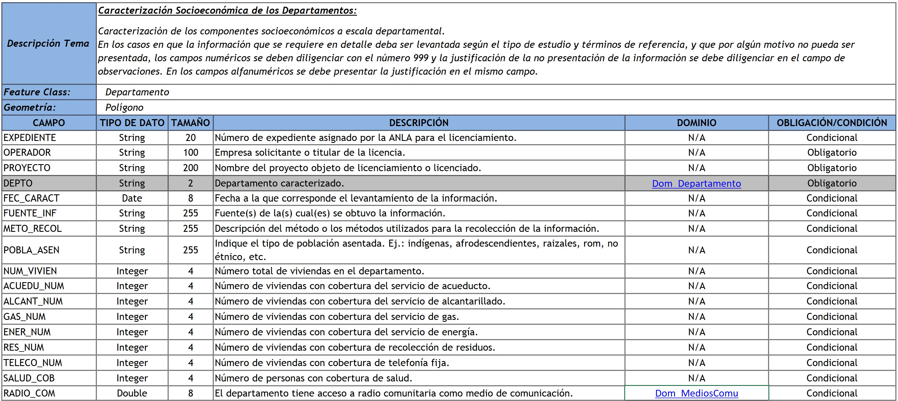
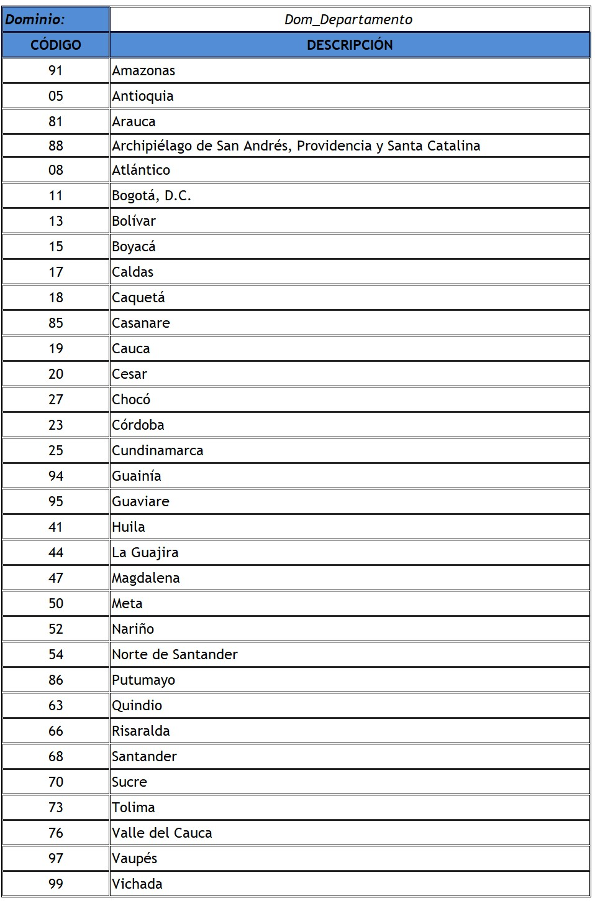
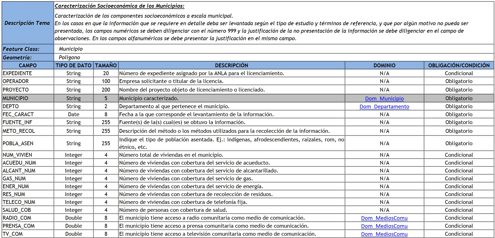
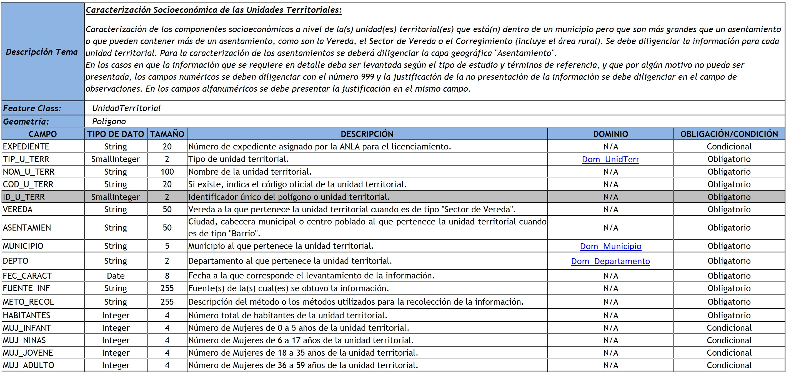
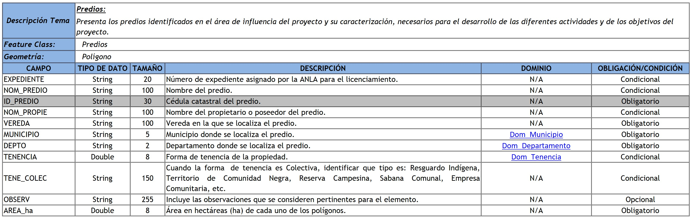

# 2.5. Medio socioeconómico - División geopolítica
Keywords: `state` `county` `remote-sensing` `clip-raster`

Descargue, cree un mosaico y recorte imágenes satelitales hasta el límite de la zona de estudio.

## Objetivos

* 

## Requerimientos

Archivos, actividades previas, lecturas y herramientas requeridas para el desarrollo de esta actividad:

| Requerimiento                                                                                                 | Descripción                                                                                                          |
|:--------------------------------------------------------------------------------------------------------------|:---------------------------------------------------------------------------------------------------------------------|
| [:toolbox:Herramienta](https://qgis.org/)                                                                     | QGIS 3.44 o superior.                                                                                                |
| [:date:magna_origen_nacional.zip](../../file/data/ANLA/magna_origen_nacional.zip)                             | Geodatabase ANLA Magna Origen Nacional.                                                                              |
| [:date:diccionario_datos_geograficos_anla.xlsx](../../file/data/ANLA/diccionario_datos_geograficos_anla.xlsx) | Diccionario de datos geográficos ANLA.                                                                               |
| [:round_pushpin:qgis_basemaps.py](../../file/src/qgis_basemaps.py)                                            | Script en Python para inclusión de mapas base XYZ en QGIS por [opengeos](https://github.com/opengeos/qgis-basemaps). |

## 1. Departamentos

Caracterización de los componentes socioeconómicos a escala departamental. En los casos en que la información que se requiere en detalle deba ser levantada según el tipo de estudio y términos de referencia, y que por algún motivo no pueda ser presentada, los campos numéricos se deben diligenciar con el número 999 y la justificación de la no presentación de la información se debe diligenciar en el campo de observaciones. En los campos alfanuméricos se debe presentar la justificación en el mismo campo.

La capa _Departamento_ del modelo de datos ANLA, requiere de los siguientes atributos y contiene varios dominios asociados:

Dominios: Dom_Departamento, Dom_MediosComu, Dom_MediosComu, Dom_MediosComu, Dom_Activ_Econo, Dom_Activ_Econo, Dom_Activ_Econo

> Consulte todas las propiedades requeridas en el diccionario de datos del ANLA.

:pencil2:**Tarea:** Homologue y cargue el análisis realizado en la capa correspondiente del modelo ANLA.

## 2. Municipios

Caracterización de los componentes socioeconómicos a escala municipal. En los casos en que la información que se requiere en detalle deba ser levantada según el tipo de estudio y términos de referencia, y que por algún motivo no pueda ser presentada, los campos numéricos se deben diligenciar con el número 999 y la justificación de la no presentación de la información se debe diligenciar en el campo de observaciones. En los campos alfanuméricos se debe presentar la justificación en el mismo campo.

La capa _Municipio_ del modelo de datos ANLA, requiere de los siguientes atributos y contiene varios dominios asociados:

Dominios: Dom_Municipio, Dom_Departamento, Dom_MediosComu, Dom_MediosComu, Dom_MediosComu, Dom_Activ_Econo, Dom_Activ_Econo, Dom_Activ_Econo.

> Consulte todas las propiedades requeridas en el diccionario de datos del ANLA.

:pencil2:**Tarea:** Homologue y cargue el análisis realizado en la capa correspondiente del modelo ANLA.

## 3. Veredas

Caracterización de los componentes socioeconómicos a nivel de la(s) unidad(es) territorial(es) que está(n) dentro de un municipio pero que son más grandes que un asentamiento o que pueden contener más de un asentamiento, como son la Vereda, el Sector de Vereda o el Corregimiento (incluye el área rural). Se debe diligenciar la información para cada unidad territorial. Para la caracterización de los asentamientos se deberá diligenciar la capa geográfica "Asentamiento". En los casos en que la información que se requiere en detalle deba ser levantada según el tipo de estudio y términos de referencia, y que por algún motivo no pueda ser presentada, los campos numéricos se deben diligenciar con el número 999 y la justificación de la no presentación de la información se debe diligenciar en el campo de observaciones. En los campos alfanuméricos se debe presentar la justificación en el mismo campo.

La capa _UnidadTerritorial_ del modelo de datos ANLA, requiere de los siguientes atributos y contiene varios dominios asociados:

Dominios: Dom_UnidTerr, Dom_Municipio, Dom_Departamento, Dom_PoblaDesplaz, Dom_TransPublico, Dom_MediosComu, Dom_MediosComu, Dom_MediosComu, Dom_MediosComu, Dom_Activ_Econo, Dom_Activ_Econo, Dom_Activ_Econo, Dom_DesEconom, Dom_DesEconom, Dom_DesEconom, Dom_DesEconom, Dom_Boolean.

> Consulte todas las propiedades requeridas en el diccionario de datos del ANLA.

:pencil2:**Tarea:** Homologue y cargue el análisis realizado en la capa correspondiente del modelo ANLA.

## 4. Predios

Presenta los predios identificados en el área de influencia del proyecto y su caracterización, necesarios para el desarrollo de las diferentes actividades y de los objetivos del proyecto. 

La capa _Predios_ del modelo de datos ANLA, requiere de los siguientes atributos y contiene varios dominios asociados:

Dominios: Dom_Municipio, Dom_Departamento, Dom_Tenencia.

 

:pencil2:**Tarea:** Homologue y cargue el análisis realizado en la capa correspondiente del modelo ANLA.

## Referencias

*

## Control de versiones

| Versión     | Descripción                                 | Autor                                      | Horas |
|-------------|:--------------------------------------------|--------------------------------------------|:-----:|
| 2026.03.06 | Versión inicial con alcance de la actividad | [rcfdtools](https://github.com/rcfdtools)  |   9   |

##

_R.IAMB es de uso libre para fines académicos, conoce nuestra licencia, cláusulas, condiciones de uso y como referenciar los contenidos publicados en este repositorio, dando [clic aquí](../../LICENSE.md)._

_¡Encontraste útil este repositorio!, apoya su difusión marcando este repositorio con una ⭐ o síguenos dando clic en el botón Follow de [rcfdtools](https://github.com/rcfdtools) en GitHub._

| [◄ Anterior](../RemoteSensingDL/Readme.md) | [:house: Inicio](../../README.md) | [:beginner: Ayuda / Colabora](https://github.com/rcfdtools/R.IAMB/discussions/1) | [Siguiente ►](../XXXX/Readme.md) |
|-------------------------------------|-----------------------------------|----------------------------------------------------------------------------------|----------------------------------|

[^1]: https://learn.arcgis.com/es/arcgis-imagery-book/chapter2/
