

# 2.2. Vectores - Medio abiótico - Geología
Keywords: `geology` `geological-map` `mot` `uc` `geological-fail` `volcanic` `unidad-geologica` `contacto-geologico` `estructura-falla-lineam`

Descargue el Mapa Geológico de Colombia del [Servicio Geológico Colombiano - SGC](https://www2.sgc.gov.co/MGC/Paginas/mgc_1_5M2023.aspx) y recorte las líneas de falla y unidades cronoestratigráficas hasta el límite municipal del mapa MOT del POT. Describa y explique las fallas y unidades presentes en la zona de estudio. Utilizando la herramienta de geoprocesamiento Intersect, combine el modelo de ocupación territorial MOT con la capa de unidades cronoestratigráficas y a través de un resumen estadístico, obtenga por cada categoría del MOT, las unidades cronoestratigráficas presentes y sus áreas. 

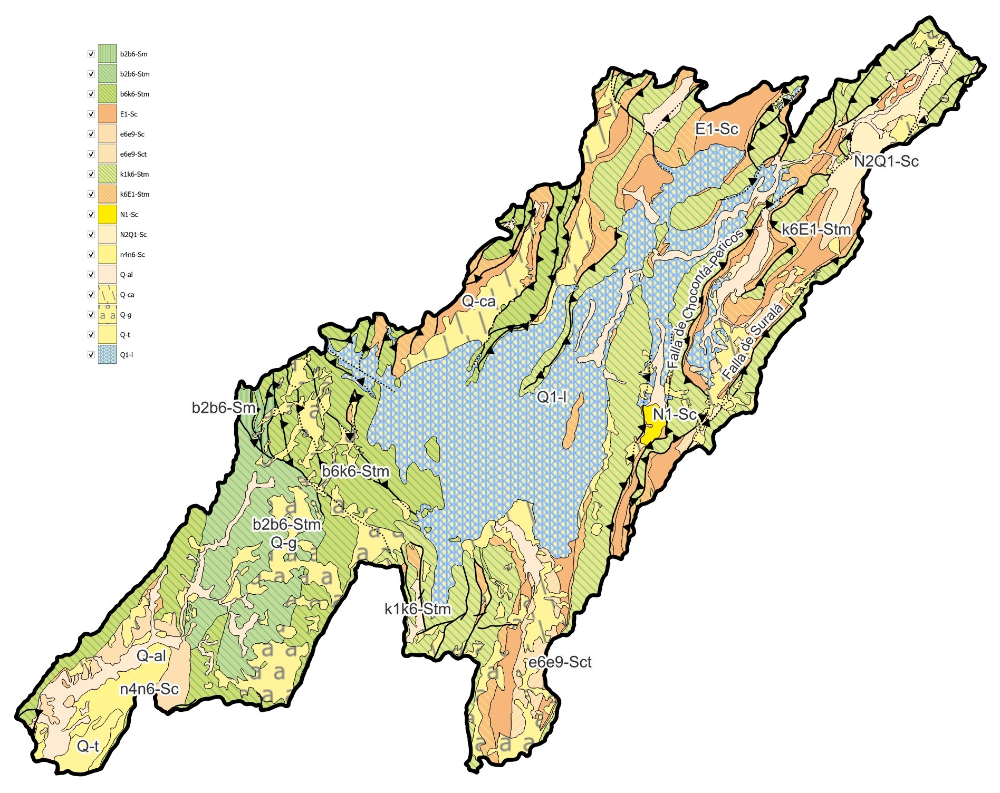

## Objetivos

* Estudiar la geología de la zona de estudio.
* Estudiar la composición de las [unidades cronoestratigráficas](https://stratigraphy.org/).

## Requerimientos

Archivos, actividades previas, lecturas y herramientas requeridas para el desarrollo de esta actividad:

| Requerimiento                                                                                                 | Descripción                                                                                                           |
|:--------------------------------------------------------------------------------------------------------------|:----------------------------------------------------------------------------------------------------------------------|
| [:toolbox:Herramienta](https://qgis.org/)                                                                     | QGIS 3.44 o superior.                                                                                                 |
| [:date:magna_origen_nacional.zip](../../file/data/ANLA/magna_origen_nacional.zip)                             | Geodatabase ANLA Magna Origen Nacional.                                                                               |
| [:date:diccionario_datos_geograficos_anla.xlsx](../../file/data/ANLA/diccionario_datos_geograficos_anla.xlsx) | Diccionario de datos geográficos ANLA.                                                                                |
| [:round_pushpin:Zonificacion_Hidrografica_2022.zip](../../file/data/IDEAM/Zonificacion_Hidrografica_2022.zip) | Zonificación Hidrográfica de Colombia a escala 1:100k, IDEAM, 2022.                                                   |
| [:round_pushpin:qgis_basemaps.py](../../file/src/qgis_basemaps.py)                                            | Script en Python para inclusión de mapas base XYZ en QGIS por [opengeos](https://github.com/opengeos/qgis-basemaps).  |

## 1. Atlas geológico de Colombia - AGC

1. Ingrese al sitio del [Servicio Geológico Colombiano - SGC](https://www2.sgc.gov.co/MGC/Paginas/mgc_1_5M2023.aspx) y descargue la File Geodatabase del Atlas Geológico de Colombia versión 2023 a escala 1:500K (_agc2023.gdb.zip_) y el archivo de estilos (_agc2023.style_). Guarde y descomprima en la carpeta [/data/SGC/](../../file/data/SGC). 

> El Mapa Geológico de Colombia (MGC) es una representación unificada de gran escala que sintetiza la geología del país, mientras que el Atlas Geológico de Colombia (AGC) es una compilación detallada de múltiples mapas, con leyendas basadas en códigos (edad + litología) y descripciones más exhaustivas. 

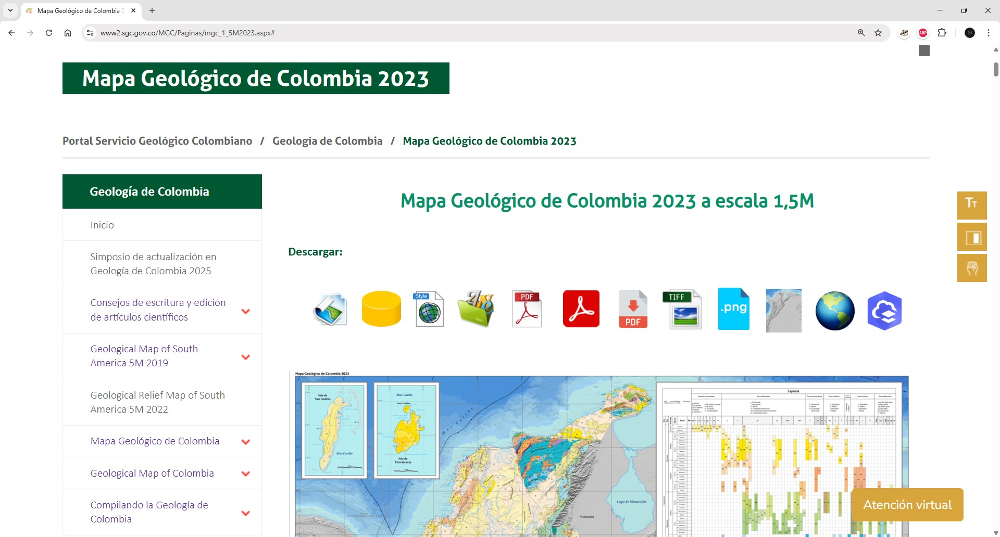

2. En QGIS, cree un nuevo mapa de proyecto y guarde como _/map/Geology.qgz_ y establezca el CRS 4686. Agregue al mapa la capa de unidades cronoestratigráficas (_UC_ y _UCAnot_)contenidas en la GDB `/data/SGC/agc2023.gdb/Geologia/` y ajuste la simbología a valores únicos representando el campo de atributos `Simbolo_UC`. Podrá observar que los colores de representación no se ajustan a los definidos en la [Tabla Cronoestratigráfica Internacional](../../file/ref/ChronostratChart2023-04SpanishAmer.pdf)[^1]. Rotule a partír de las localizaciones definidas en _UCAnot_ desactivando la visualización del rectángulo envolvente al rótulo.

> Opcionalmente, puede abrir el mapa creado en la actividad [CaseStudy](../CaseStudy) y guardar como Geology. 

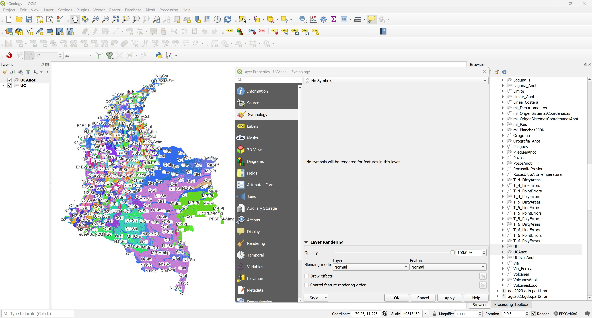

3. Para incorporar en QGIS los estilos contenidos en el archivo _agc2023.style_ del SGC diseñados para ArcGIS, es necesario convertir el archivo .style a formato XML. Desde el menú _Plugins / Manage and Install Plugins..._, instale SLYR (Community Edition).

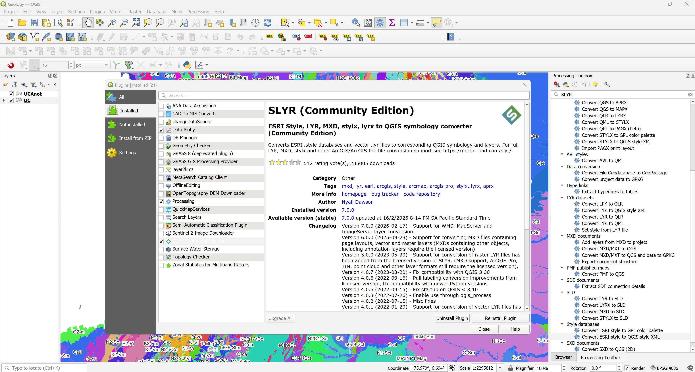

Descargue desde https://github.com/lsgunth/mdbtools-win/archive/master.zip, el gestor de bases de datos _mdbtools_ para Windows y descomprima en la carpeta [/tools/](../../file/tools).

En el panel del Processing Tool o desde las propiedades del proyecto QGIS, acceda a las opciones de configuración y en la pestaña SLYR realice la asociación de ruta a MDB Tools.

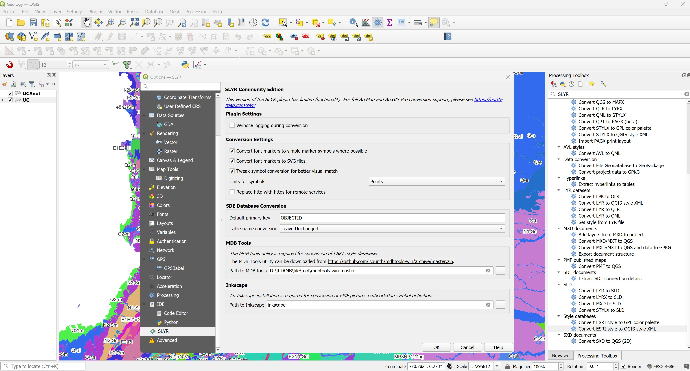

Ejecute el Processing Toolbox / SLYR / Style databases / Convert ESRI style to QGIS style XML, así obtendrá el archivo de estilos en formato XML, guarde como [/data/SGC/agc2023.xml](../../file/data/SGC/agc2023.xml).

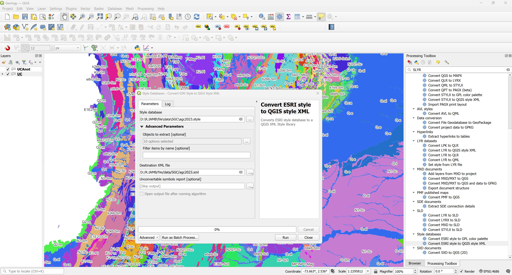

4. Desde el menú _Settings_ de QGIS, ejecute el _Style Manager_ e importe todos los estilos contenidos en el archivo XML convertido.

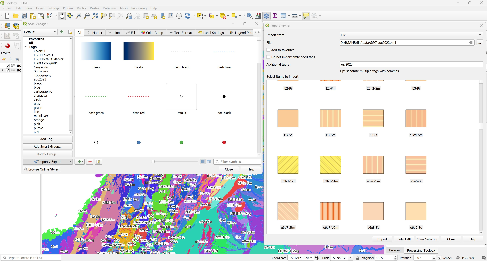

Verifique los estilos importados como agc2023 en el grupo Tags.

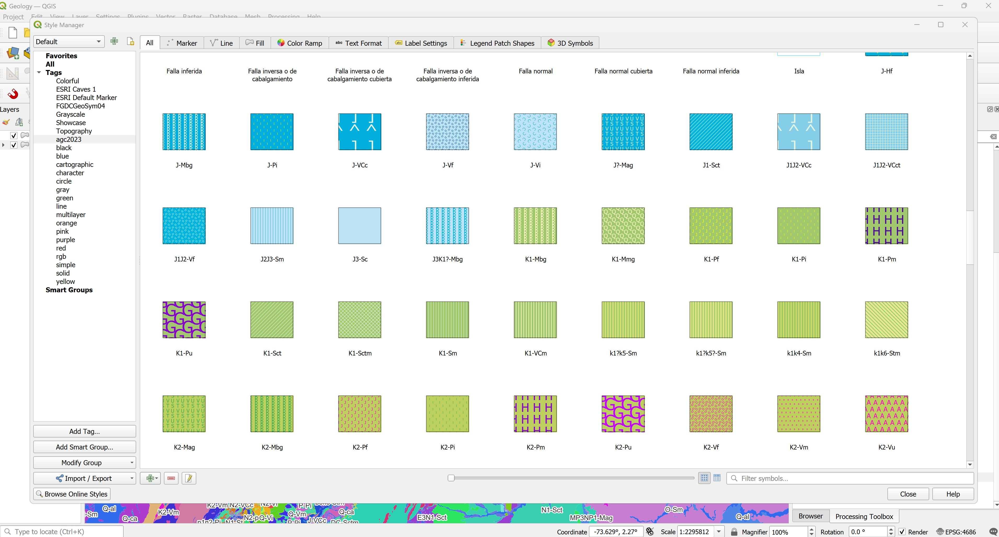

> La importación de los estilos no actualiza automáticamente los colores aplicados a las unidades cronoestratigráficas, su aplicación puede ser realizada manualmente utilizando los códigos y colores importados.

Para aplicar un estilo, en la tabla de contenido de clic sobre una de las UC (p. ej., C-Pi), en el panel de simbología podrá observar que se ha incluido un grupo de estilo nuevo, denominado _agc2023_. Para aplicar el estilo _C-Pi_, correspondiente a _Dioritas, granodioritas, cuarzodioritas, tonalitas y gabros_, seleccione el símbolo correspondiente.

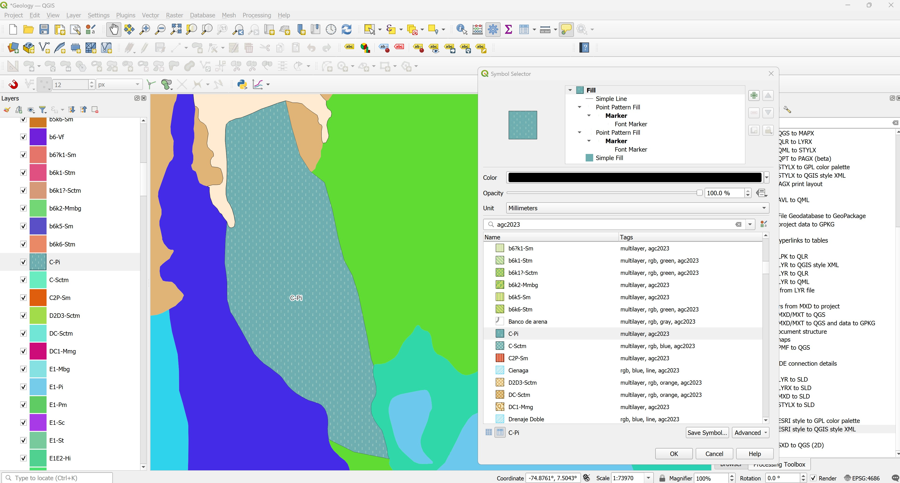

5. Agregue al mapa, la capa del límite del área del proyecto desde _/gdb/BD_ANLA_MAGNA_NACIONAL.gdb/T33_PROYECTO/AreaProyecto_. Ajuste la simbología utilizando solo contornos, acérquese y rotule el mapa geológico a partir del campo `Simbolo_UC`.

6. Utilizando la herramienta de geo-procesamiento _Vector overlay / Clip_, recorte el mapa geológico hasta el límite del área de proyecto. Nombre la capa resultante como `/shp/UCAreaProyecto4686.shp`. Simbolice y rotule por _SimboloUC_, podrá observar que para el caso de estudio, existen 16 diferentes unidades cronoestratigráficas y que en la tabla de atributos existen 290 polígonos independientes.

> Para realizar correctamente el recorte, defina en Advanced / Algorithm Setting / Invalid feature filtering / Do not Filter (Better Performance).

Unidades encontradas  

| Símbolo UC  | Descripción                                                                                                                                                            | Edad                        | UG integradas         |
|-------------|------------------------------------------------------------------------------------------------------------------------------------------------------------------------|-----------------------------|-----------------------|
| b2b6-Sm     | Shales con yeso, cherts, calizas y arenitas.                                                                                                                           | Valanginiano-Albiano        |                       |
| b2b6-Stm    | Shales calcáreos o silíceos; cherts; cuarzoarenitas y arenitas líticas; conglomerados gradados, y calizas arrecifales.                                                 | Valanginiano-Albiano        |                       |
| b6k6-Stm    | Shales, calizas, arenitas, cherts y fosforitas                                                                                                                         | Albiano-Maastrichtiano      |                       |
| E1-Sc       | Conglomerados intercalados con arenitas de grano medio a grueso y lodolitas carbonosas                                                                                 | Paleoceno                   |                       |
| e6e9-Sc     | Intercalaciones de capas rojas de conglomerados, arenitas líticas conglomeráticas y arcillolitas.                                                                      | Bartoniano-Chattiano        | Formación Barzalosa   |
| e6e9-Sct    | Arenitas de grano fino a conglomeráticas interestratificadas con arcillolitas y limolitas. Ocasionalmente, lentes de hierro oolítico y carbón.                         | Bartoniano-Chattiano        | Formación La Regadera |
| k1k6-Stm    | Shales, calizas, fosforitas, cherts y cuarzoarenitas. Predominio de facies finas al norte del Cocuy y facies más arenosas al sur.                                      | Cenomaniano-Maastrichtiano  |                       |
| k6E1-Stm    | Arcillolitas rojizas con intercalaciones de cuarzoarenitas de grano fino. Mantos de carbón a la base.                                                                  | Maastrichtiano-Paleoceno    | Formación Guaduas     |
| N1-Sc       | Conglomerados y arenitas poco consolidados con matriz ferruginosa y arcillosa. También, arcillolitas con intercalaciones de limolitas, lodolitas arenosas y arenitas.  | Mioceno                     | Formación Marichuela  |
| N2Q1-Sc     | Conglomerados de bloques a guijos con intercalaciones de arcillas y arenitas de grano fino a grueso.                                                                   | Plioceno-Pleistoceno        |                       |
| n4n6-Sc     | Arenitas líticas con intercalaciones de arcillolitas de color gris verdoso y conglomerados                                                                             | Serravaliano-Mesiniano      | Grupo Honda           |
| Q-al        | Depósitos aluviales y de llanuras aluviales                                                                                                                            | Cuaternario                 |                       |
| Q-ca        | Abanicos aluviales y depósitos coluviales                                                                                                                              | Cuaternario                 |                       |
| Q-g         | Depósitos glaciares                                                                                                                                                    | Cuaternario                 |                       |
| Q-t         | Terrazas aluviales                                                                                                                                                     | Cuaternario                 |                       |
| Q1-l        | Arcillas, turbas, y arcillas arenosas con niveles delgados de gravas. Localmente, capas de depósitos de diatomeas.                                                     | Pleistoceno                 |                       |

7. Disuelva las unidades obtenidas para obtener 16 polígonos multiparte, guarde como _/shp/UCAreaProyectoDissolve4686.shp_. Elimine los campos geométricos y de Objeto.

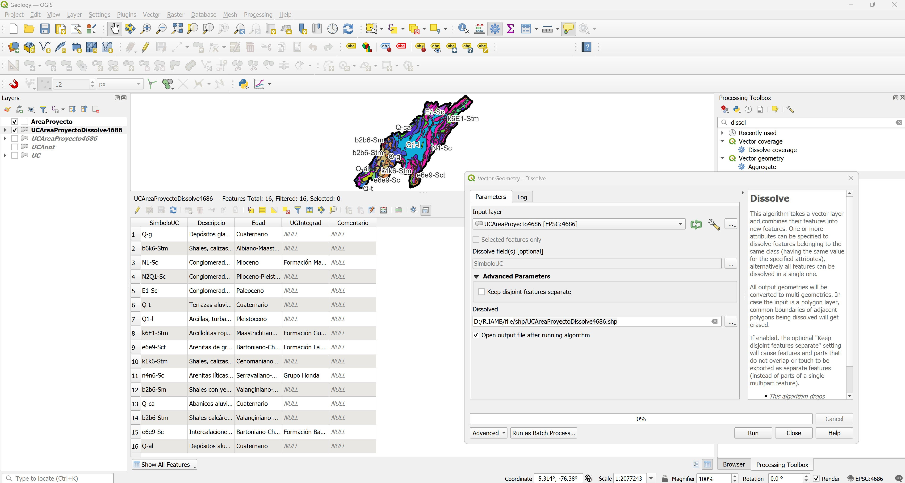

8. Ajuste la simbología del mapa recortado utilizando los estilos importados.

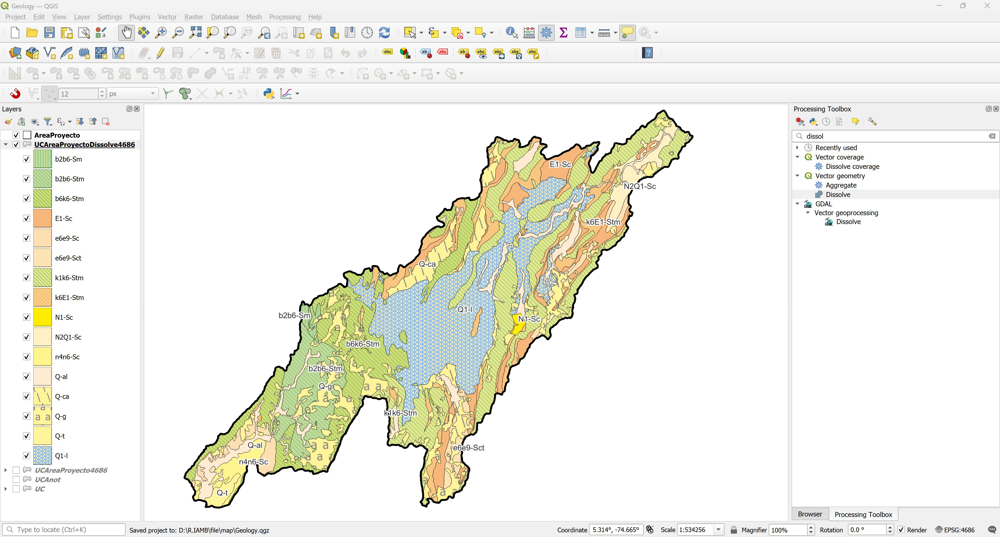

9. Calcule el área geodésica en hectáreas de cada Unidad encontrada, nombre el campo como `AREA_ha`.

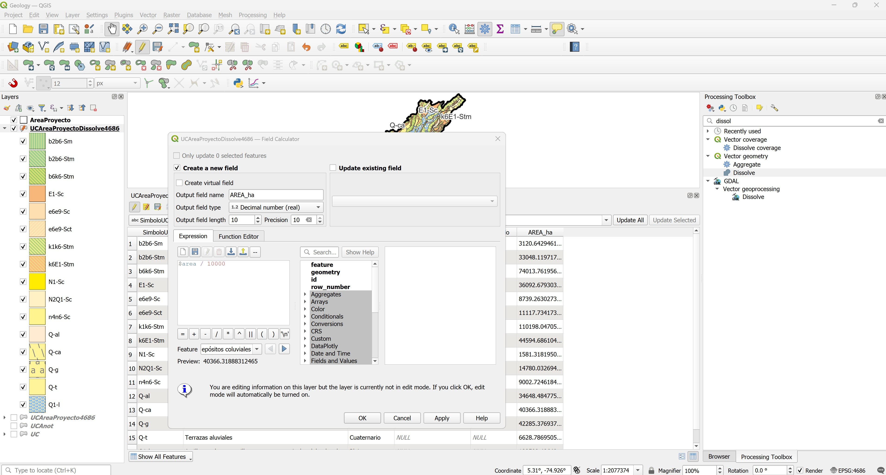

10. A partir de la capa de recorte, cree un gráfico de barras para analizar la distribución de áreas por cada unidad estratigráfica, podrá observar que la clase dominante es _Q1-l_, correspondiente a _Arcillas, turbas, y arcillas arenosas con niveles delgados de gravas. Localmente, capas de depósitos de diatomeas_, con más de 120k hectáreas.

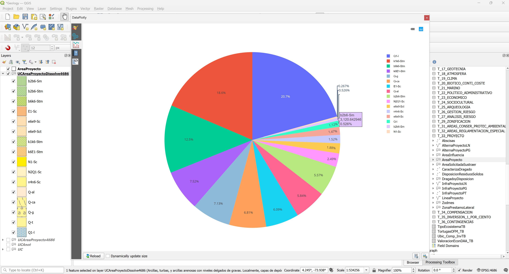

## 2. Incorporación a capa ANLA: UnidadGeologica

Las unidades geológicas comprenden la delimitación y clasificación de una formación geológica que representa la estructura e historia del desarrollo de la corteza terrestre y sus capas más profundas.

La capa _UnidadGeologica_ del modelo de datos ANLA, requiere de los siguientes atributos y contiene varios dominios asociados:

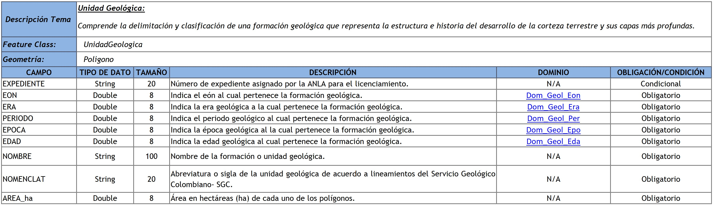

Dominios: Dom_Geol_Eon, Dom_Geol_Era, Dom_Geol_Per, Dom_Geol_Epo, Dom_Geol_Eda

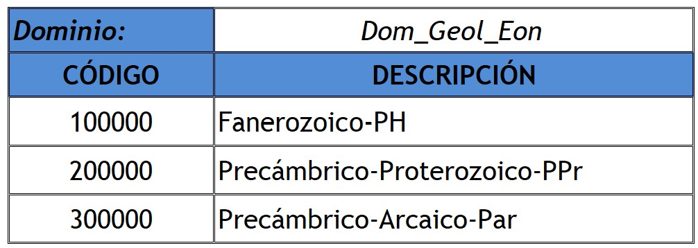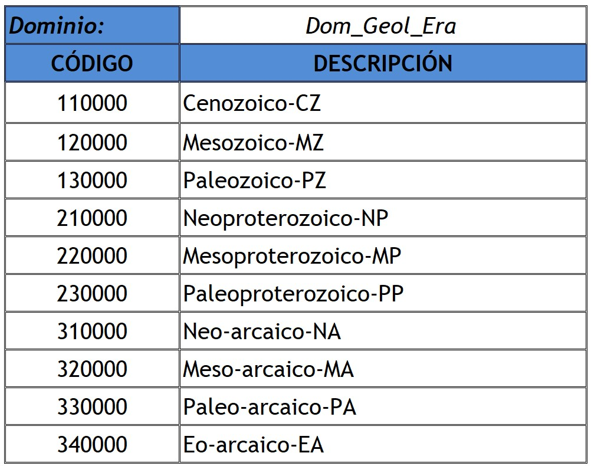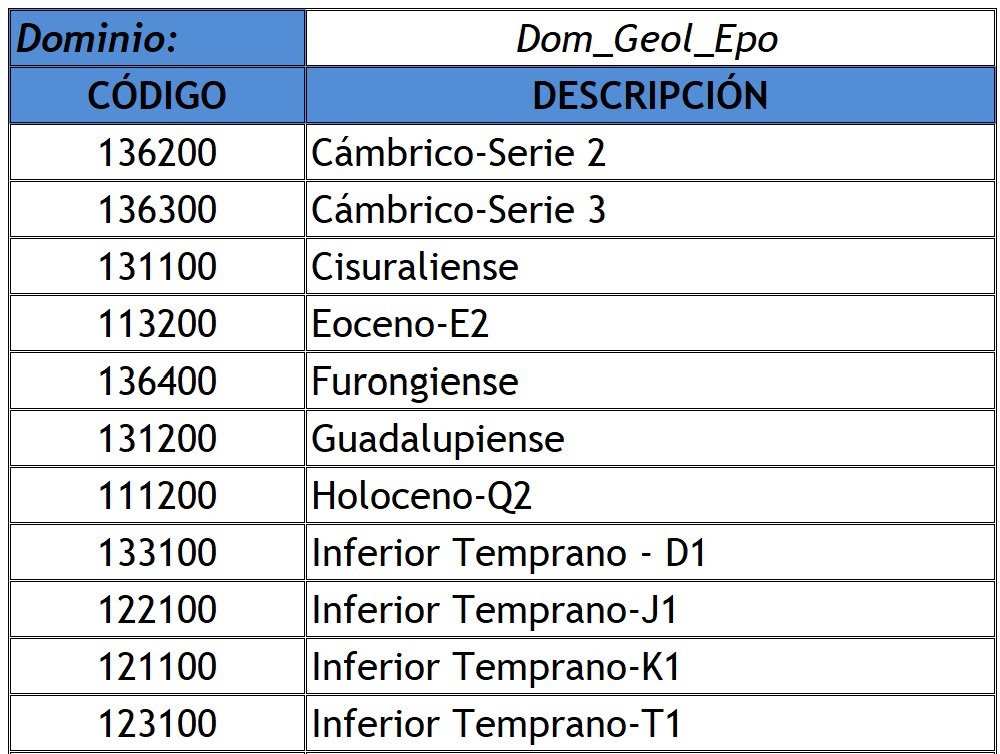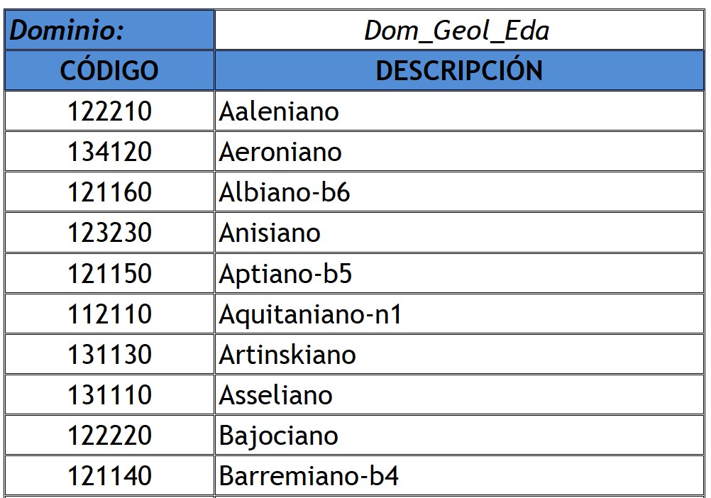

> Para los dominios Dom_Geol_Epo y Dom_Geol_Eda, solo se ha incluido en las ilustraciones, una muestra de los primeros valores codificados. Consulte la lista completa de valores en el diccionario de datos.

1. Agregue el mapa base de Google Terrain y represente en color negro, establezca transparencia de 60% en la capa UC. Agregue al mapa la capa _/gdb/BD_ANLA_MAGNA_NACIONAL.gdb/T_11_GEOLOGIA/UnidadGeologica_ y consulte la tabla de atributos.

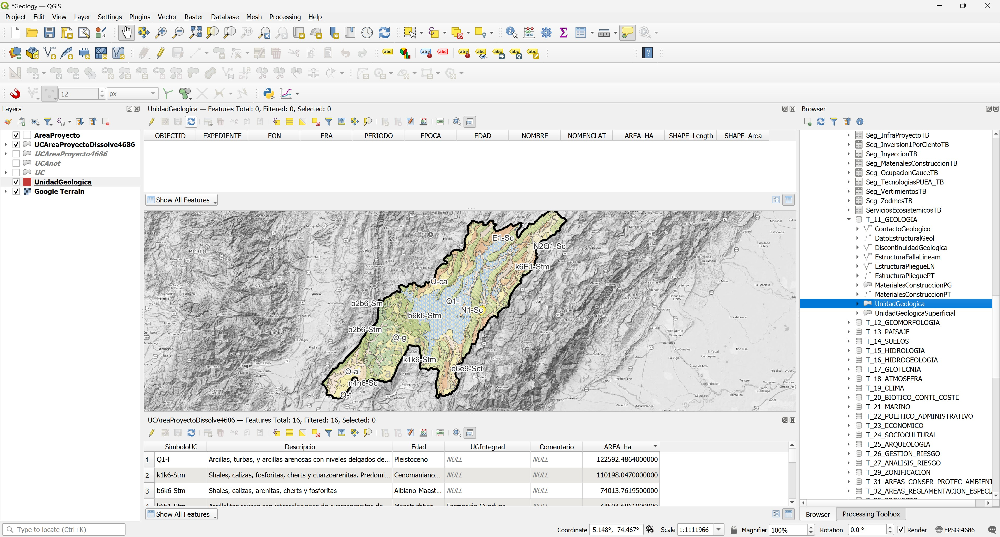

Como observa, los nombres de atributos contenidos en la capa _UCAreaProyectoDissolve4686_ del AGC son diferentes a los utilizados por el ANLA, requiriendo las siguientes homologaciones:

| Atributo ANLA  | Atributo AGC     | Homologación                                                                                                                                                                                               |
|----------------|------------------|------------------------------------------------------------------------------------------------------------------------------------------------------------------------------------------------------------|
| EON (Real)     | (No disponible)  | A partir de tabla cronoestratigrafica internacional.                                                                                                                                                       |
| ERA (Real)     | (No disponible)  | A partir de tabla cronoestratigrafica internacional.                                                                                                                                                       |
| PERIODO (Real) | (No disponible)  | A partir de tabla cronoestratigrafica internacional.                                                                                                                                                       |
| EPOCA (Real)   | (No disponible)  | A partir de tabla cronoestratigrafica internacional.                                                                                                                                                       |
| EDAD (Real)    | Edad             | Holomogación manual debido a que los nombres disponibles en UC no tienen están asociados a códigos de dominio y no tienen correspondencia directa con los nombres o códigos del dominio ANLA Dom_Geol_Eda. |
| NOMBRE (100)   | Descripcio (255) | Homologación por cambio de nombre de atributo y truncando longitud a 100 caracteres.                                                                                                                       |
| NOMENCLAT (20) | SimboloUC        | Homologación por cambio de nombre de atributo.                                                                                                                                                             |
Para la homologación, será necesario manualmente renombrar el campo `Edad` de la capa UC como `EdadTxt`, crear en la capa _UCAreaProyectoDissolve4686_ los diferentes campos de homologación, asignar los valores existentes a los campos `NOMBRE`, `NOMENCLAT` y asignar manualmente los valores de los campos `EON`, `ERA`, `PERIODO` y `EPOCA` a partir de las definiciones contenidas en la [Tabla Cronoestratigráfica Internacional](https://stratigraphy.org/). Los valores de referencia para homologación se encuentran en la tabla [/table/IAMB_Geology.xlsx](../../file/table/IAMB_Geology.xlsx)

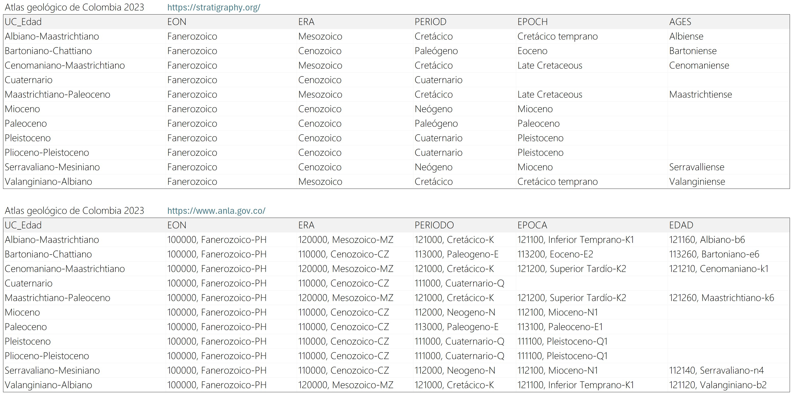

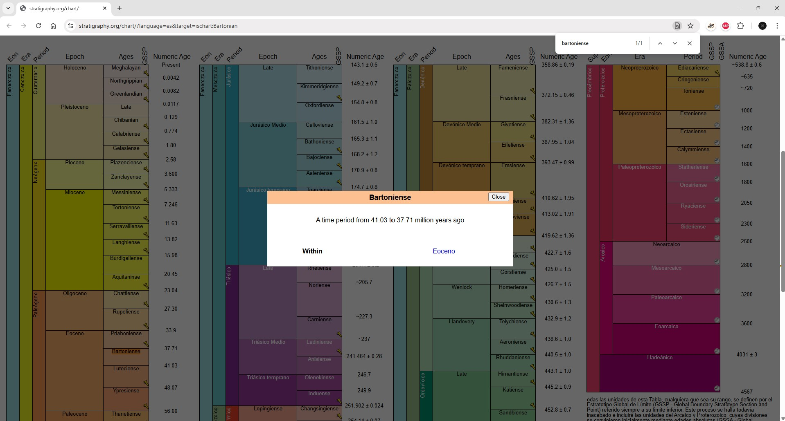

Para simplificar el proceso de homologación, utilice el script de Python [/src/qgis_unidadgeologica_homologador.py](../../file/src/qgis_unidadgeologica_homologador.py).

## 2. ContactoGeologico

2. En QGIS, cree un nuevo mapa de proyecto y guarde como _/map/Geology.qgz_ y establezca el CRS 9377. Agregue al mapa la capa de unidades cronoestratigráficas (_UC_ y _UCAnot_) y fallas geológicas (_Fallas_ y _FallasAnot_) contenidas en la GDB `/data/SGC/agc2023.gdb/Geologia/` y ajuste la simbología a valores únicos representando el campo de atributos `Simbolo_UC`.

## 3. EstructuraFallaLineam

## Referencias

* [Atlas Geológico de Colombia 2023 a escala 500K.](https://www2.sgc.gov.co/MGC/Paginas/agc_500K2023.aspx)
* [Memoria explicativa del Mapa Geológico de Colombia, Geological Map of Colombia y Atlas Geológico de Colombia 2023.](https://www2.sgc.gov.co/MGC/Documents/MGC_2023/Memoria_mgc_gmc_agc_2023.pdf)
* https://opengislab.com/blog/2019/3/16/converting-esri-styles-to-qgis-styles-using-slyr
* https://stratigraphy.org/

## Control de versiones

| Versión    | Descripción        | Autor                                      | Horas |
|------------|:-------------------|--------------------------------------------|:-----:|
| 2026.02.19 | Versión inicial.   | [rcfdtools](https://github.com/rcfdtools)  |   6   |

##

_R.IAMB es de uso libre para fines académicos, conoce nuestra licencia, cláusulas, condiciones de uso y como referenciar los contenidos publicados en este repositorio, dando [clic aquí](../../LICENSE.md)._

_¡Encontraste útil este repositorio!, apoya su difusión marcando este repositorio con una ⭐ o síguenos dando clic en el botón Follow de [rcfdtools](https://github.com/rcfdtools) en GitHub._

| [◄ Anterior](../CaseStudy/Readme.md) | [:house: Inicio](../../README.md) | [:beginner: Ayuda / Colabora](https://github.com/rcfdtools/R.IAMB/discussions/1) | [Siguiente ►](../XXXX/Readme.md) |
|---------------------------------------|-----------------------------------|----------------------------------------------------------------------------------|----------------------------------|

[^1]: Cohen, K.M., Finney, S.C., Gibbard, P.L. y Fan, J.-X. (2013; actualizado) The ICS International Chronostratigraphic Chart. Episodes 36: 199-204. 
[^2]: 

