<div align="center"></div>

# 2.3. Medio abiótico - Suelos
Keywords: `land-soil` `land-conflict` `land-potential-use` `moorland`

Descargue, recorte, cree, analice y homologue los mapas vectoriales de suelos, vocación de uso, conflictos de uso, uso actual del suelo, zonas de páramo y ecosistemas presentes en la zona de estudio.

<div align="center">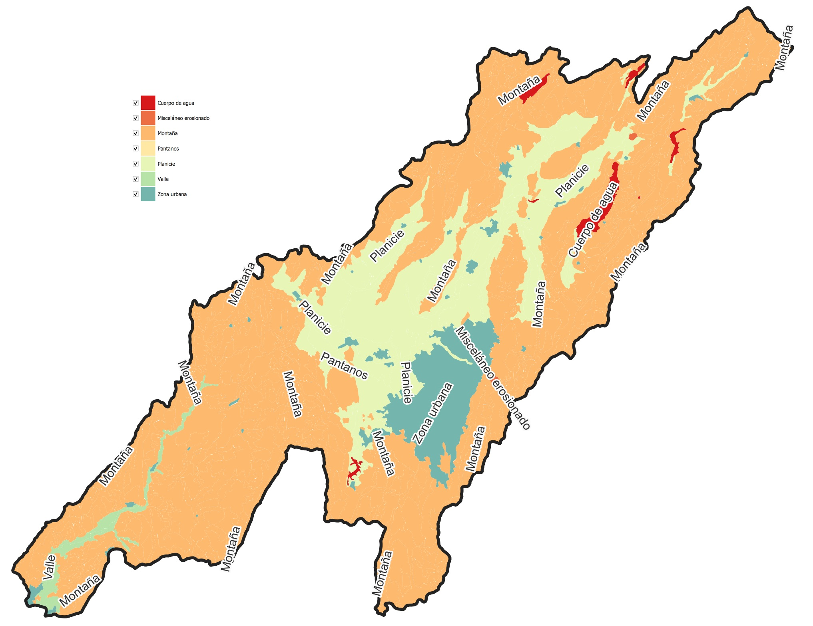</div>


## Objetivos

* Estudiar los tipos de suelos presentes en la zona de estudio, sus vocaciones principales y los conflictos identificados por la autoridad catastral nacional.
* Calcular la distribución porcentual de los diferentes suelos identificados en la zona de estudio.
* Aplicar los conceptos y habilidades de homologación de atributos.


## Requerimientos

Archivos, actividades previas, lecturas y herramientas requeridas para el desarrollo de esta actividad:

<div align="center">

| Requerimiento                                                                                                 | Descripción                                                                                                          |
|:--------------------------------------------------------------------------------------------------------------|:---------------------------------------------------------------------------------------------------------------------|
| [:toolbox:Herramienta](https://qgis.org/)                                                                     | QGIS 3.44 o superior.                                                                                                |
| [:package:magna_origen_nacional.zip](../../file/data/ANLA/magna_origen_nacional.zip)                             | Geodatabase ANLA Magna Origen Nacional.                                                                              |
| [:date:diccionario_datos_geograficos_anla.xlsx](../../file/data/ANLA/diccionario_datos_geograficos_anla.xlsx) | Diccionario de datos geográficos ANLA.                                                                               |
| [:round_pushpin:qgis_basemaps.py](../../file/src/qgis_basemaps.py)                                            | Script en Python para inclusión de mapas base XYZ en QGIS por [opengeos](https://github.com/opengeos/qgis-basemaps). |
| [:round_pushpin:qgis_clip_dissolve_reproject_adp.py](../../file/src/qgis_clip_dissolve_reproject_adp.py)      | Script en Python recortar, disolver, reproyectar y calcular distribuciones porcentuales de área.                     |

</div>


## 1. Mapa de suelos

El mapa de suelos del Departamento de Cundinamarca, ha sido creado por el [Instituto Geográfico Agustín Codazzi](https://www.igac.gov.co/) - Subdirección de Agrología - Grupo Interno de Trabajo Geomática - Carrera 30 # 48 - 51 – Sede Central, Bogotá D.C, Departamento de Cundinamarca, 111321, República de Colombia. Autor: german.alvarez@igac.gov.co (Subdirector de Agrología), +57 1 3694100 Ext. 91007

Este mapa temático representa la distribución de las características del suelo, determinadas mediante el levantamiento general de suelos del departamento de Cundinamarca a escala 1:100.000, publicado en el año 2000. Suministra información importante acerca del recurso suelo, a través de la descripción e interpretación de sus ambientes edafogenéticos, sus características físicas, químicas, mineralógicas y morfológicas, su taxonomía y distribución espacial, como base para la determinación de sus potenciales productivos, describiendo las limitantes de uso.

Los Levantamientos Generales de Suelos de los departamentos del Territorio Colombiano suministran información importante acerca del recurso suelo; a través de la descripción e interpretación de su génesis, características físicas, químicas, mineralógicas, morfológicas, taxonomía y distribución, como base para la determinación de sus potencialidades y limitaciones de uso.

**Estirpe**: la generación del Mapa Digital de Suelos, para el levantamiento general de suelos, escala 1:100.000, se realizó a partir de los parámetros definidos por la Subdirección de Agrología del Instituto Geográfico Agustín Codazzi, para el objeto: Suelos. Para la elaboración del levantamiento, el GIT de Levantamientos de Suelos y Aplicaciones Agrológicas, en la etapa de precampo recopiló información secundaria proveniente de estudios de suelos anteriores, e investigaciones sobre los factores formadores del suelo, tales como clima, geología y geomorfología, los cuales se interpretan con el apoyo de insumos de cartografía, sensores remotos y fotointerpretación. Posteriormente, en la etapa de campo se realiza la descripción de las observaciones tipo cajuelas o barrenaje, y calicatas, ajuste a las líneas de interpretación y recolección de muestras que serán analizadas por el Laboratorio Nacional de Suelos. La sistematización y georreferenciación de esta información sirve de apoyo fundamental para el trazo de las líneas de suelos, que son digitalizadas sobre cartografía base, imágenes de sensores remotos, modelos digitales de elevación, entre otros. Finalmente en la etapa de poscampo se consolidó la leyenda de suelos del estudio, la cartografía temática con sus diferentes atributos y la memoria técnica respectiva. 

* Servicio: https://www.colombiaenmapas.gov.co/?b=igac&u=0&t=43&servicio=395
* Fuente: https://www.colombiaenmapas.gov.co/, buscar como _Suelos Cundinamarca_
* Extensión espacial: Departamento de Cundinamarca - Colombia - Suramérica
* Escala: 1:100000
* Sistema de referencia de coordenadas: 3116
* Licencia: este producto adopta la licencia pública internacional de Reconocimiento-CompartirIgual 4.0 de Creative Commons, Creative Commons attribution – ShareAlike 4.0 Internacional. Por tal razón, nuevos productos y servicios derivados de su reutilización deben ser también licenciados bajo las mismas condiciones de uso y disponibilidad que habilitó la licencia antes mencionada. Lo anterior, sin perjuicio de los derechos de autor y propiedad intelectual del Instituto Geográfico Agustín Codazzi, con base en la Ley 23 de 1982 y demás normas concordantes. [CC BY 4.0](https://creativecommons.org/licenses/by/4.0/deed.es)

1. Desde el portal de https://www.colombiaenmapas.gov.co/, busque y descargue en formato GDB, el mapa de suelos del Departamento de Cundinamarca, guarde y descomprima en la ruta `/data/IGAC/SUELOS_CUNDINAMARCA_100K.gdb`.

<div align="center">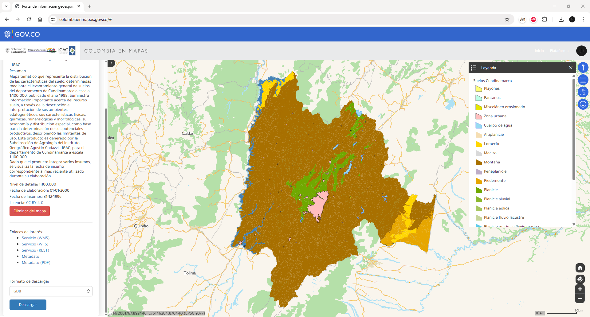</div>

2. En QGIS, abra el mapa de proyecto _CaseStudy.qgz_, creado previamente, guarde como _/map/LandSoil.qgz_ y establezca el CRS 9377. Agregue al mapa la capa _SUELOS_CUNDINAMARCA_VF_, ajuste la simbología a valores únicos representando el campo de atributos `UCS_F` y rotule a partir del mismo campo.  

<div align="center">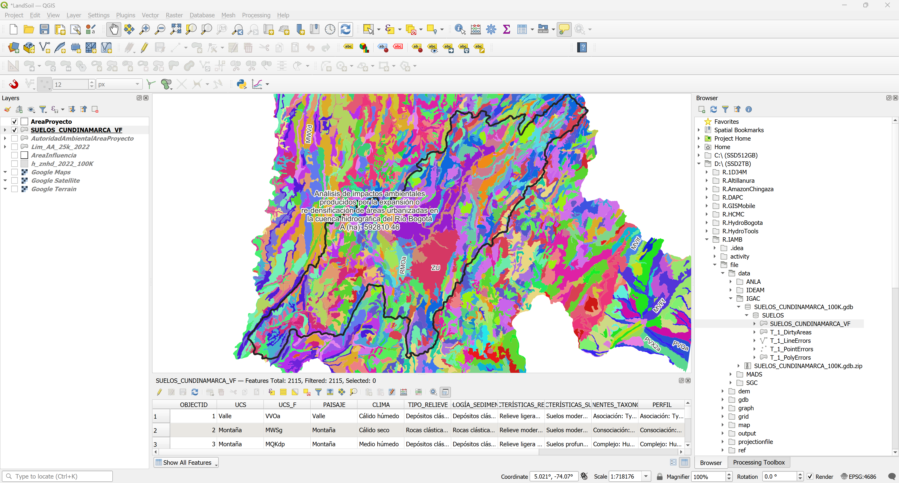</div>

3. Utilizando el script de Python [qgis_clip_dissolve_reproject_adp.py](../../file/src/qgis_clip_dissolve_reproject_adp.py), recorte, disuelva, reproyecte y calcule la distribución porcentual de los suelos contenidos dentro de la zona de estudio. Podrá observar que dentro del área del proyecto existen 97 tipos de suelos diferentes. En la tabla de atributos de la capa disuelta y reproyectada, elimine los atributos `AREA`, `SHAPE_Leng` y `SHAPE_Area`.

> Antes de ejecutar el script, establezca en Settings / Options / Processing / General / Invalid features filtering / Do not filter.

Parámetros generales
```
input_layer_path = 'C:/IAMB/data/IGAC/SUELOS_CUNDINAMARCA_100K.gdb|layername=SUELOS_CUNDINAMARCA_VF'
overlay_layer_path = 'C:/IAMB/gdb/BD_ANLA_MAGNA_NACIONAL.gdb|layername=AreaProyecto'
output_file_clip_name = 'SuelosVFAreaProyecto'
dissolve_field = 'UCS_F'
```

<div align="center">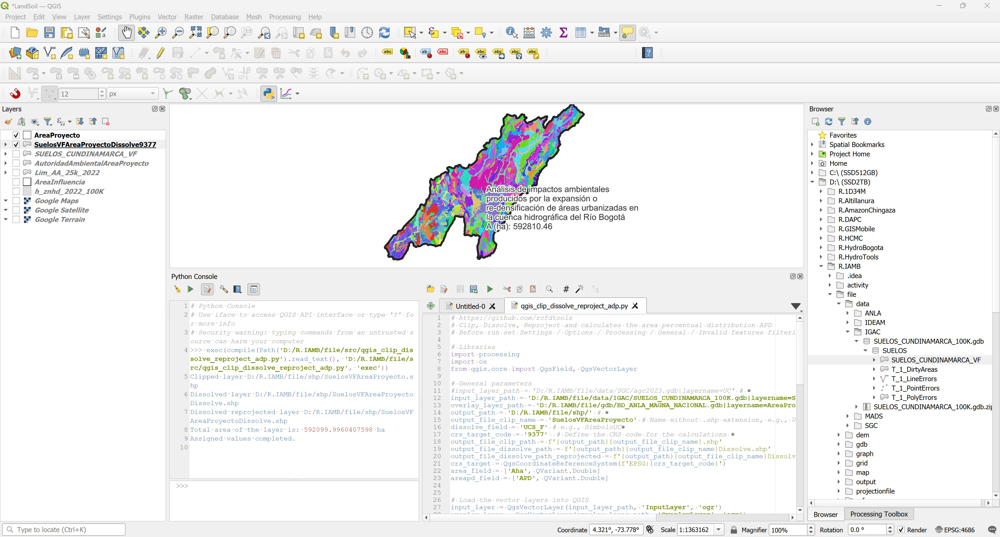</div>
<div align="center">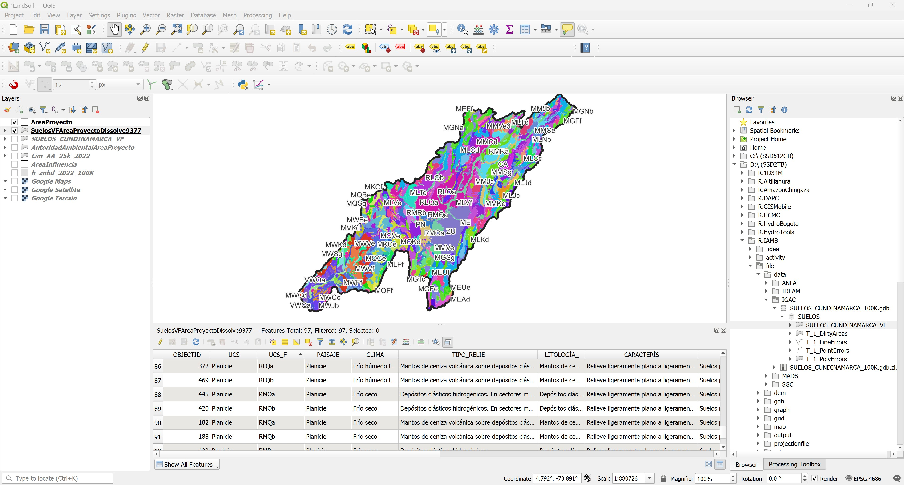</div>

> Tenga en cuenta que debido a las escalas de digitalización y versión, el límite espacial del mapa de suelos de Cundinamarca puede no cubrir completamente el área del proyecto.

Cree una gráfica de barras representando las diferentes unidades de suelo, podrá observar que _RLQa_ correspondiente a _Mantos de ceniza volcánica sobre depósitos clásticos hidrogénicos_, es la mayor clase con un área de 41043.27 ha, correspondiente al 6.93 % de la superficie de toda la cuenca en estudio.  

> Para ordenar gráficas de barras en orden descendente, desde el menú _Layer / Create Layer / Create Virtual Layer..._, agregue la capa _SuelosVFAreaProyecto.shp_ y reordene los identificadores de objeto con la instrucción SQL = _select * from SuelosVFAreaProyectoDissolve9377 order by Aha desc_

<div align="center">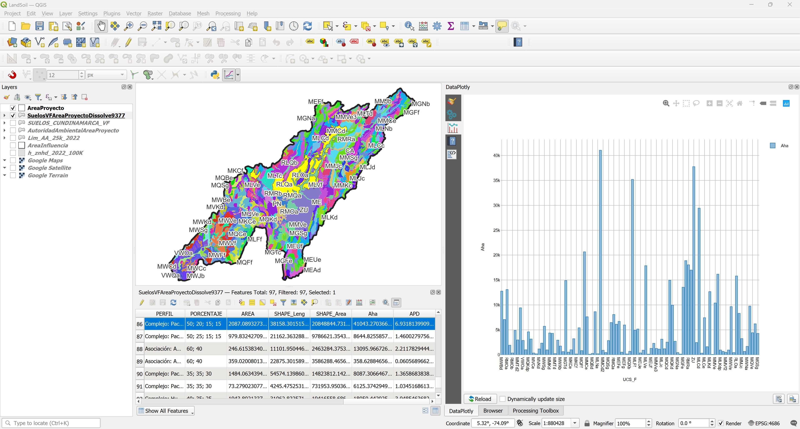</div>

Suelos presentes en la zona de estudio (Tabla sin `TIPO_RELIE`, `LITOLOGÍA`_, `CARACTERÍS`, `CARACTER_1`, `PERFIL`):

| UCS_F   | UCS                   | PAISAJE               | CLIMA                         | COMPONENTE                                                                           | PORCENTAJE            | Aha        | APD       |
|:--------|:----------------------|:----------------------|:------------------------------|:-------------------------------------------------------------------------------------|:----------------------|------------|-----------|
| CA      | Cuerpo de agua        | Cuerpo de agua        | Cuerpo de agua                | Cuerpo de agua                                                                       | Cuerpo de agua        | 5422.21    | 0.915759  |
| ME      | Misceláneo erosionado | Misceláneo erosionado | Misceláneo erosionado         | Misceláneo erosionado                                                                | Misceláneo erosionado | 337.273    | 0.0569622 |
| MEAc    | Montaña               | Montaña               | Extremadamente frío húmedo    | Asociación: Typic Dystrocryepts; Typic Cryaquents                                    | 60; 35                | 186.792    | 0.0315474 |
| MEAd    | Montaña               | Montaña               | Extremadamente frío húmedo    | Asociación: Typic Dystrocryepts; Typic Cryaquents                                    | 60; 35                | 1010.36    | 0.17064   |
| MEFe    | Montaña               | Montaña               | Extremadamente frío húmedo    | Complejo: Typic Dystrocryepts; Humic Dystrocryepts                                   | 45; 25                | 6700.52    | 1.13165   |
| MEFf    | Montaña               | Montaña               | Extremadamente frío húmedo    | Complejo: Typic Dystrocryepts; Humic Dystrocryepts                                   | 45; 25                | 531.52     | 0.0897686 |
| MEFg    | Montaña               | Montaña               | Extremadamente frío húmedo    | Complejo: Typic Dystrocryepts; Humic Dystrocryepts                                   | 45; 25                | 5979.37    | 1.00986   |
| MEUe    | Montaña               | Montaña               | Extremadamente frío húmedo    | Complejo: Lithic Melanocryands; Lithic Cryofolists                                   | 55; 40                | 372.986    | 0.0629938 |
| MEUf    | Montaña               | Montaña               | Extremadamente frío húmedo    | Complejo: Lithic Melanocryands; Lithic Cryofolists                                   | 55; 40                | 1285.4     | 0.217092  |
| MGFe    | Montaña               | Montaña               | Muy frío muy húmedo           | Asociación: Humic Dystrudepts; Andic Dystrudepts; Humic Lithic; Dystrudepts          | 40; 30; 20            | 13556.8    | 2.28961   |
| MGFf    | Montaña               | Montaña               | Muy frío muy húmedo           | Asociación: Humic Dystrudepts; Andic Dystrudepts; Humic Lithic; Dystrudepts          | 40; 30; 20            | 18888.7    | 3.19012   |
| MGNa    | Montaña               | Montaña               | Muy frío muy húmedo           | Asociación: Typic Udorthents; Typic Humaquepts                                       | 50; 30                | 449.213    | 0.0758677 |
| MGNb    | Montaña               | Montaña               | Muy frío muy húmedo           | Asociación: Typic Udorthents; Typic Humaquepts                                       | 50; 30                | 146.846    | 0.0248009 |
| MGSg    | Montaña               | Montaña               | Muy frío muy húmedo           | Asociación: Humic Lithic Dystrudepts; Andic Dystrudepts                              | 60; 30                | 4286.29    | 0.723913  |
| MGTc    | Montaña               | Montaña               | Muy frío muy húmedo           | Asociación: Typic Hapludands; Pachic Melanudands; Humic Lithic Dystrudepts           | 30; 30; 30            | 643.912    | 0.108751  |
| MGTd    | Montaña               | Montaña               | Muy frío muy húmedo           | Asociación: Typic Hapludands; Pachic Melanudands; Humic Lithic Dystrudepts           | 30; 30; 30            | 14897.1    | 2.51598   |
| MKCe    | Montaña               | Montaña               | Frío muy húmedo               | Grupo Indiferenciado: Andic Dystrudepts; Typic Hapludands; Typic Udorthents          | 35; 35; 15            | 1002.97    | 0.169393  |
| MKCf    | Montaña               | Montaña               | Frío muy húmedo               | Grupo Indiferenciado: Andic Dystrudepts; Typic Hapludands; Typic Udorthents          | 35; 35; 15            | 154.886    | 0.0261588 |
| MLCc    | Montaña               | Montaña               | Frío húmedo                   | Complejo: Humic Dystrudepts; Typic Argiudolls; Typic Hapludands; Thaptic Hapludands  | 30; 30; 20; 20        | 2470.76    | 0.417288  |
| MLCd    | Montaña               | Montaña               | Frío húmedo                   | Complejo: Humic Dystrudepts; Typic Argiudolls; Typic Hapludands; Thaptic Hapludands  | 30; 30; 20; 20        | 29428      | 4.97011   |
| MLCe    | Montaña               | Montaña               | Frío húmedo                   | Complejo: Humic Dystrudepts; Typic Argiudolls; Typic Hapludands; Thaptic Hapludands  | 30; 30; 20; 20        | 7443.2     | 1.25708   |
| MLFf    | Montaña               | Montaña               | Frío húmedo                   | Asociación: Humic Lithic Dystrudepts; Humic Dystrudepts                              | 65; 30                | 4921.11    | 0.831127  |
| MLJb    | Montaña               | Montaña               | Frío húmedo                   | Asociación: Typic Melanudands; Pachic Melanudands                                    | 50; 40                | 1138.54    | 0.192288  |
| MLJc    | Montaña               | Montaña               | Frío húmedo                   | Asociación: Typic Melanudands; Pachic Melanudands                                    | 50; 40                | 3134.88    | 0.529452  |
| MLJd    | Montaña               | Montaña               | Frío húmedo                   | Asociación: Typic Melanudands; Pachic Melanudands                                    | 50; 40                | 1209.32    | 0.204243  |
| MLKc    | Montaña               | Montaña               | Frío húmedo                   | Complejo: Pachic Melanudands; Typic Hapludands; Andic Dystrudepts                    | 35; 35; 30            | 1625.72    | 0.274568  |
| MLKd    | Montaña               | Montaña               | Frío húmedo                   | Complejo: Pachic Melanudands; Typic Hapludands; Andic Dystrudepts                    | 35; 35; 30            | 12673.8    | 2.14049   |
| MLKdp   | Montaña               | Montaña               | Frío húmedo                   | Complejo: Pachic Melanudands; Typic Hapludands; Andic Dystrudepts                    | 35; 35; 30            | 959.053    | 0.161975  |
| MLNa    | Montaña               | Montaña               | Frío húmedo                   | Consociación: Humic Dystrudepts; Fluvaquentic Humaquepts                             | 75; 25                | 203.273    | 0.0343308 |
| MLNb    | Montaña               | Montaña               | Frío húmedo                   | Consociación: Humic Dystrudepts; Fluvaquentic Humaquepts                             | 75; 25                | 112.441    | 0.0189903 |
| MLSg    | Montaña               | Montaña               | Frío muy húmedo               | Consociación: Typic Eutrudepts; Typic Hapludands                                     | 70; 20                | 17001.9    | 2.87146   |
| MLTc    | Montaña               | Montaña               | Frío húmedo                   | Asociación: Typic Hapludands; Andic Dystrudepts                                      | 50; 45                | 3166.14    | 0.534731  |
| MLTd    | Montaña               | Montaña               | Frío húmedo                   | Asociación: Typic Hapludands; Andic Dystrudepts                                      | 50; 45                | 9434.67    | 1.59343   |
| MLVe    | Montaña               | Montaña               | Frío húmedo                   | Asociación: Humic Lithic Eutrudepts; Typic Placudands; Dystric Eutrudepts            | 35; 25; 25            | 17873      | 3.01858   |
| MLVe2   | Montaña               | Montaña               | Frío húmedo                   | Asociación: Humic Lithic Eutrudepts; Typic Placudands; Dystric Eutrudepts            | 35; 25; 25            | 464.445    | 0.0784403 |
| MLVf    | Montaña               | Montaña               | Frío húmedo                   | Asociación: Humic Lithic Eutrudepts; Typic Placudands; Dystric Eutrudepts            | 35; 25; 25            | 35188.9    | 5.94308   |
| MMCd    | Montaña               | Montaña               | Frío seco                     | Asociación: Humic Dystrudepts; Typic Hapludalfs                                      | 60; 40                | 20660.9    | 3.48942   |
| MMCd2   | Montaña               | Montaña               | Frío seco                     | Asociación: Humic Dystrudepts; Typic Hapludalfs                                      | 60; 40                | 901.992    | 0.152338  |
| MMCe    | Montaña               | Montaña               | Frío seco                     | Asociación: Humic Dystrudepts; Typic Hapludalfs                                      | 60; 40                | 7627.99    | 1.28829   |
| MMCe2   | Montaña               | Montaña               | Frío seco                     | Asociación: Humic Dystrudepts; Typic Hapludalfs                                      | 60; 40                | 6473.73    | 1.09335   |
| MMJb    | Montaña               | Montaña               | Frío seco                     | Asociación: Humic Dystrustepts; Typic Haplustalfs; Typic Dystrustepts                | 35; 35; 20            | 450.896    | 0.076152  |
| MMJc    | Montaña               | Montaña               | Frío seco                     | Asociación: Humic Dystrustepts; Typic Haplustalfs; Typic Dystrustepts                | 35; 35; 20            | 3250.13    | 0.548915  |
| MMKc    | Montaña               | Montaña               | Frío seco                     | Asociación: Typic Haplustalfs; Ultic Haplustalfs; Typic Haplustepts                  | 40; 40; 20            | 984.915    | 0.166343  |
| MMKd    | Montaña               | Montaña               | Frío seco                     | Asociación: Typic Haplustalfs; Ultic Haplustalfs; Typic Haplustepts                  | 40; 40; 20            | 4381.1     | 0.739925  |
| MMSg    | Montaña               | Montaña               | Frío seco                     | Consociación: Humic Dystrustepts; Typic Ustorthents                                  | 70; 20                | 689.951    | 0.116526  |
| MMTd    | Montaña               | Montaña               | Frío seco                     | Consociación: Lithic Hapludands; Inceptic Hapludalfs                                 | 75; 15                | 235.436    | 0.0397628 |
| MMTd2   | Montaña               | Montaña               | Frío seco                     | Consociación: Lithic Hapludands; Inceptic Hapludalfs                                 | 75; 15                | 2978.68    | 0.50307   |
| MMVe    | Montaña               | Montaña               | Frío seco                     | Asociación: Typic Haplustepts; Lithic Ustorthents                                    | 50; 35                | 10398.2    | 1.75615   |
| MMVe2   | Montaña               | Montaña               | Frío seco                     | Asociación: Typic Haplustepts; Lithic Ustorthents                                    | 50; 35                | 916.265    | 0.154748  |
| MMVe3   | Montaña               | Montaña               | Frío seco                     | Asociación: Typic Haplustepts; Lithic Ustorthents                                    | 50; 35                | 1272.69    | 0.214946  |
| MMVf    | Montaña               | Montaña               | Frío seco                     | Asociación: Typic Haplustepts; Lithic Ustorthents                                    | 50; 35                | 16176      | 2.73197   |
| MMVf2   | Montaña               | Montaña               | Frío seco                     | Asociación: Typic Haplustepts; Lithic Ustorthents                                    | 50; 35                | 499.392    | 0.0843424 |
| MMVf3   | Montaña               | Montaña               | Frío seco                     | Asociación: Typic Haplustepts; Lithic Ustorthents                                    | 50; 35                | 69.5846    | 0.0117522 |
| MQBd    | Montaña               | Montaña               | Medio húmedo                  | Complejo: Dystric Eutrudepts; Humic Eutrudepts                                       | 60; 40                | 273.126    | 0.0461283 |
| MQBe    | Montaña               | Montaña               | Medio húmedo                  | Complejo: Dystric Eutrudepts; Humic Eutrudepts                                       | 60; 40                | 2305.66    | 0.389403  |
| MQCd    | Montaña               | Montaña               | Medio húmedo                  | Asociación: Typic Udorthents; Typic Melanudands                                      | 50; 25                | 2529.62    | 0.427228  |
| MQCe    | Montaña               | Montaña               | Medio húmedo                  | Asociación: Typic Udorthents; Typic Melanudands                                      | 50; 25                | 14963.5    | 2.52718   |
| MQFf    | Montaña               | Montaña               | Medio muy húmedo              | Consociación: Typic Hapludands; Lithic Udorthents                                    | 75; 20                | 839.191    | 0.141731  |
| MQKd    | Montaña               | Montaña               | Medio húmedo                  | Complejo: Humic Eutrudepts; Typic Eutrudepts; Typic Udipsamments                     | 50; 35; 15            | 9947.53    | 1.68004   |
| MQKdp   | Montaña               | Montaña               | Medio húmedo                  | Complejo: Humic Eutrudepts; Typic Eutrudepts; Typic Udipsamments                     | 50; 35; 15            | 4606.79    | 0.778042  |
| MQSg    | Montaña               | Montaña               | Medio húmedo                  | Asociación: Typic Udorthents; Typic Eutrudepts                                       | 60; 25                | 2854.38    | 0.482077  |
| MQVe    | Montaña               | Montaña               | Medio húmedo                  | Asociación: Typic Udorthents; Lithic Hapludolls; Humic Eutrudepts                    | 50; 20; 20            | 4430.17    | 0.748213  |
| MQVf    | Montaña               | Montaña               | Medio húmedo                  | Asociación: Typic Udorthents; Lithic Hapludolls; Humic Eutrudepts                    | 50; 20; 20            | 6212.09    | 1.04916   |
| MQXb    | Montaña               | Montaña               | Medio húmedo                  | Asociación: Humic Hapludults; Typic Hapludalfs                                       | 65; 35                | 696.943    | 0.117707  |
| MVCe    | Montaña               | Montaña               | Medio húmedo                  | Consociación: Oxic Dystrudepts; Typic Dystrudepts                                    | 65; 35                | 353.326    | 0.0596734 |
| MVKd    | Montaña               | Montaña               | Cálido húmedo                 | Asociación: Typic Dystrudepts; Typic Udorthents                                      | 55; 35                | 1169.45    | 0.197508  |
| MWBd    | Montaña               | Montaña               | Cálido seco                   | Consociación: Humic Dystrustepts; Typic Calciustolls                                 | 75; 25                | 12775.6    | 2.15768   |
| MWBe    | Montaña               | Montaña               | Cálido seco                   | Consociación: Humic Dystrustepts; Typic Calciustolls                                 | 75; 25                | 7079.88    | 1.19572   |
| MWCc    | Montaña               | Montaña               | Cálido seco                   | Asociación: Lithic Ustorthents; Entic Haplustolls                                    | 60; 30                | 3222.75    | 0.544291  |
| MWCd    | Montaña               | Montaña               | Cálido seco                   | Asociación: Lithic Ustorthents; Entic Haplustolls                                    | 60; 30                | 4311.84    | 0.728229  |
| MWCe    | Montaña               | Montaña               | Cálido seco                   | Asociación: Lithic Ustorthents; Entic Haplustolls                                    | 60; 30                | 2943.67    | 0.497158  |
| MWFe    | Montaña               | Montaña               | Cálido seco                   | Consociación: Lithic Ustorthents; Entic Haplustolls                                  | 70; 30                | 1926.91    | 0.325436  |
| MWFf    | Montaña               | Montaña               | Cálido seco                   | Consociación: Lithic Ustorthents; Entic Haplustolls                                  | 70; 30                | 4891.7     | 0.826161  |
| MWJb    | Montaña               | Montaña               | Cálido seco                   | Asociación: Typic Calciustolls; Entic Haplustolls                                    | 60; 40                | 9777.11    | 1.65126   |
| MWJc    | Montaña               | Montaña               | Cálido seco                   | Asociación: Typic Calciustolls; Entic Haplustolls                                    | 60; 40                | 688.576    | 0.116294  |
| MWKd    | Montaña               | Montaña               | Cálido seco                   | Asociación: Entic Haplustolls; Typic Ustorthents                                     | 60; 40                | 2339.91    | 0.395189  |
| MWNa    | Montaña               | Montaña               | Cálido seco                   | Asociación: Typic Ustorthents; Typic Calciustepts                                    | 50; 40                | 1688.84    | 0.285229  |
| MWSg    | Montaña               | Montaña               | Cálido seco                   | Consociación: Lithic Ustorthents; Humic Dystrustepts                                 | 70; 25                | 5728.68    | 0.967519  |
| MWVd    | Montaña               | Montaña               | Cálido seco                   | Asociación: Typic Dystrustepts; Lithic Ustorthents                                   | 50; 40                | 955.677    | 0.161405  |
| MWVe    | Montaña               | Montaña               | Cálido seco                   | Asociación: Typic Dystrustepts; Lithic Ustorthents                                   | 50; 40                | 9665.73    | 1.63245   |
| MWVf    | Montaña               | Montaña               | Cálido seco                   | Asociación: Typic Dystrustepts; Lithic Ustorthents                                   | 50; 40                | 8320.47    | 1.40525   |
| MWXb    | Montaña               | Montaña               | Cálido seco                   | Consociación: Typic Ustorthents; Typic Calciustolls                                  | 70; 20                | 1758.1     | 0.296927  |
| MWXd    | Montaña               | Montaña               | Cálido seco                   | Consociación: Typic Ustorthents; Typic Calciustolls                                  | 70; 20                | 538.923    | 0.091019  |
| PN      | Pantanos              | Pantanos              | Pantanos                      | Pantanos                                                                             | Pantanos              | 172.271    | 0.0290949 |
| RLOa    | Planicie              | Planicie              | Frío húmedo transicional seco | Asociación: Typic Endoaquepts; Aeric Endoaquepts; Thaptic Hapludands                 | 40; 30; 20            | 15810.9    | 2.67032   |
| RLQa    | Planicie              | Planicie              | Frío húmedo transicional seco | Complejo: Pachic Melanudands; Andic Dystrudepts; Aeric Endoaquepts; Aquic Hapludands | 50; 20; 15; 15        | 41043.3    | 6.93181   |
| RLQb    | Planicie              | Planicie              | Frío húmedo transicional seco | Complejo: Pachic Melanudands; Andic Dystrudepts; Aeric Endoaquepts; Aquic Hapludands | 50; 25; 15; 15        | 8644.83    | 1.46003   |
| RMOa    | Planicie              | Planicie              | Frío seco                     | Asociación: Aeric Epiaquents; Fluvaquentic Endoaquepts                               | 60; 40                | 13096      | 2.21178   |
| RMOb    | Planicie              | Planicie              | Frío seco                     | Asociación: Aeric Epiaquents; Fluvaquentic Endoaquepts                               | 60; 40                | 358.629    | 0.060569  |
| RMQa    | Planicie              | Planicie              | Frío seco                     | Complejo: Pachic Haplustands; Humic Haplustands; Fluventic Dystrustepts              | 35; 35; 30            | 8087.31    | 1.36587   |
| RMQb    | Planicie              | Planicie              | Frío seco                     | Complejo: Pachic Haplustands; Humic Haplustands; Fluventic Dystrustepts              | 35; 35; 30            | 6125.37    | 1.03452   |
| RMRa    | Planicie              | Planicie              | Frío seco                     | Complejo: Humic Dystrustepts; Typic Haplustalfs; Fluvaquentic Endoaquepts            | 40; 35; 25            | 18050.4    | 3.04855   |
| RMRb    | Planicie              | Planicie              | Frío seco                     | Complejo: Humic Dystrustepts; Typic Haplustalfs; Fluvaquentic Endoaquepts            | 40; 35; 25            | 2717.61    | 0.458979  |
| VWOa    | Valle                 | Valle                 | Cálido seco                   | Asociación: Typic Ustipsamments; Typic Calciusterts                                  | 60; 25                | 2872.59    | 0.485153  |
| VWQa    | Valle                 | Valle                 | Cálido seco                   | Complejo: Typic Haplustepts; Mollic Ustifluvents; Aridic Haplustepts                 | 35; 35; 30            | 5169.2     | 0.873029  |
| VWQb    | Valle                 | Valle                 | Cálido seco                   | Complejo: Typic Haplustepts; Mollic Ustifluvents; Aridic Haplustepts                 | 35; 35; 30            | 132.135    | 0.0223164 |
| ZU      | Zona urbana           | Zona urbana           | Zona urbana                   | Zona urbana                                                                          | Zona urbana           | 37753.1    | 6.37613   |


4. Con la herramienta de estadísticas por categorías, cree tablas y gráficos de barras representando las diferentes variables categóricas presentes en la capa de suelos dentro de la zona de estudio. 

Por paisaje, montaña presenta la mayor área.  
<div align="center">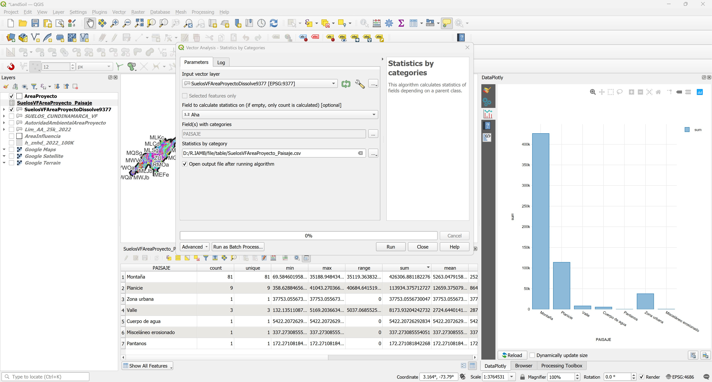</div><br>
<div align="center">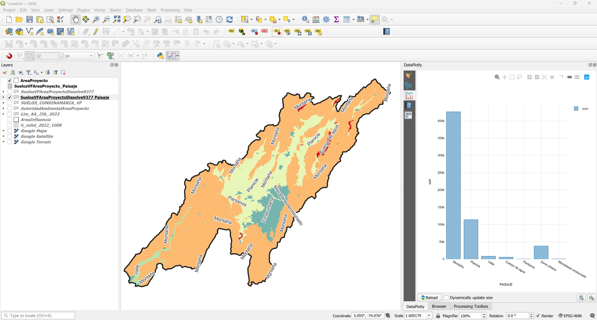</div><br>

:pencil2:**Tarea:** Homologue y cargue el análisis realizado en la capa _Suelo_ del modelo ANLA.

<div align="center">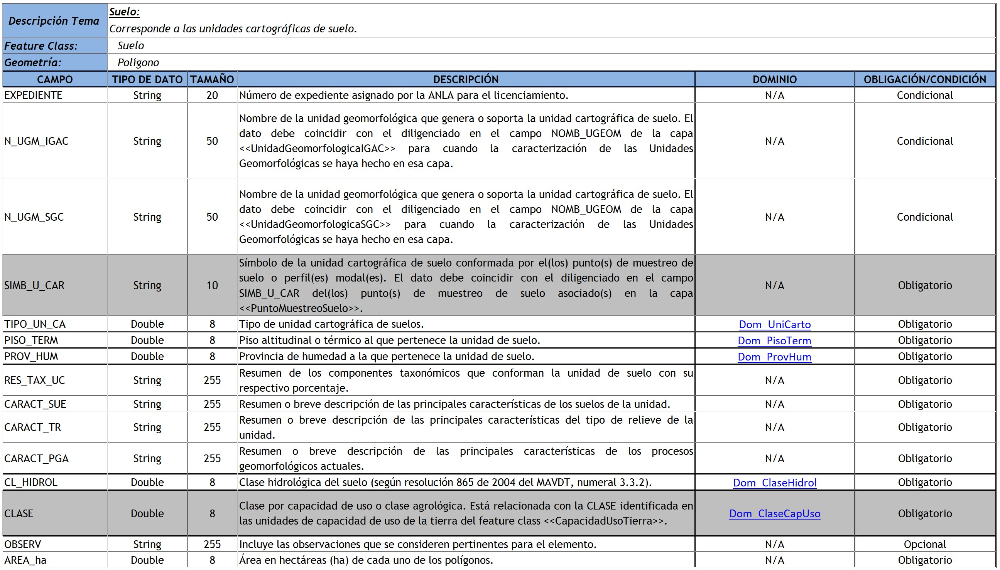</div>


## 2. Vocación de uso

El mapa de Vocación de Uso de las tierras del IGAC del año 2013, se determina mediante matrices de decisión que incluyen indicadores e índices de su estado. En los atributos geográficos considerados se encuentra el clima y la pendiente. Entre los de los suelos sobresalen la erosión, humedad, granulometría, pedregosidad, profundidad efectiva, fertilidad y salinidad. Esta clasificación comprende 5 clases: agrícola, ganadera, agroforestal, forestal y de conservación/recuperación. En cada una se establece el uso principal que debe tener. Este producto es generado por la Subdirección de Agrología del Instituto Geográfico Agustín Codazzi - IGAC, para el territorio nacional, el cual fue publicado en la obra Suelos y Tierras de Colombia 2016 a escala 1:100.000.

El objetivo principal de la vocación es la determinación del uso más apropiado que puede soportar cada uno de los suelos del país, propendiendo por una producción sostenible y sin deterioro de los recursos naturales. Son dos niveles categóricos los tenidos en cuenta en el presente estudio; el primero corresponde a la vocación general de uso de la tierra y, el segundo, como subdivisión del primero, hace referencia a los usos principales recomendados.

**Estirpe**: con la finalidad de establecer el mejor uso de las tierras, se analizan y evalúan una serie de características biofísicas estables en el tiempo y en el espacio; que influyen en la selección y desempeño de los usos agropecuarios y forestales, principalmente, con requerimientos implícitos de protección y conservación de los recursos naturales. Por tanto, para la determinación del uso más apropiado que puede soportar cada uno de los suelos, se tienen en cuenta algunas de sus propiedades, difícilmente modificables por el hombre en un corto y mediano plazo que ejercen fuerte influencia en las actividades productivas antrópicas; estos criterios de determinación del uso principal para cada uno de los suelos hacen referencia a factores climáticos, pendiente, erosión, factores de humedad, pedregosidad y factores intrínsecos al suelo como la profundidad efectiva, grupo textural, fertilidad, salinidad, porcentaje de saturación de sodio, aluminio y carbono orgánico. A partir de la anterior información y estableciendo combinación de indicadores; se generan los índices del estado de las tierras, los cuales permiten tipificar como están conformadas y cuáles son sus calidades, obteniendo así, los índices de impacto con los cuales se puede medir el grado de deterioro que presenta cada una de las unidades de tierra. Los indicadores e índices a tener en cuenta en el proceso de evaluación están referidos a factores climáticos (precipitación, temperatura, distribución de las lluvias), factores del relieve como la pendiente y geomorfología, factores externos a los suelos como la erosión, la humedad (drenaje natural e inundaciones y encharcamientos) y la pedregosidad (porcentaje de fragmentos en superficie) y factores intrínsecos al suelo (profundidad efectiva, grupo textural, fertilidad, salinidad, porcentaje de saturación de sodio, de aluminio, de carbono orgánico y fragmentos de roca en el suelo); obteniendo como resultado la vocación subdividida en cinco (5) clases las cuales se dividen a su vez en treinta y cinco (35) subclases: (Agrícola: Cultivos transitorios intensivos de clima cálido, Cultivos transitorios intensivos de clima medio, Cultivos transitorios intensivos de clima frío, Cultivos transitorios semi intensivos de clima cálido, Cultivos transitorios semi intensivos de clima medio, Cultivos transitorios semi intensivos de clima frío, Cultivos permanentes intensivos de clima cálido, Cultivos permanentes intensivos de clima medio, Cultivos permanentes intensivos de clima frío, Cultivos permanentes semi intensivos de clima cálido, Cultivos permanentes semi intensivos de clima medio, Cultivos permanentes semi intensivos de clima frío); (Ganadera: Pastoreo intensivo de clima cálido, Pastoreo intensivo de clima medio, Pastoreo intensivo de clima frío, Pastoreo semi intensivo de clima cálido, Pastoreo semi intensivo de clima medio, Pastoreo semi intensivo de clima frío, Pastoreo extensivo de clima cálido, Pastoreo extensivo de clima medio, Pastoreo extensivo de clima frío, Pastoreo extensivo de clima muy frío); (Agroforestal: Agrosilvícola con cultivos transitorios, Agrosilvícola con cultivos permanentes, Agrosilvopastoril con cultivos transitorios, Agrosilvopastoril con cultivos permanentes, Silvopastoril); (Forestal: Producción de clima cálido, Producción de clima medio, Producción de clima frío, Producción de clima muy frío, Protección – producción); (Conservación: Protección, Humedales, Conservación y recuperación).

Este mapa puede ser obtenido de https://www.colombiaenmapas.gov.co/ ingresando la cadena de búsqueda _Vocación de Uso. Territorio Nacional_.

Servicio: https://www.colombiaenmapas.gov.co/?u=0&t=43&servicio=7301

<div align="center">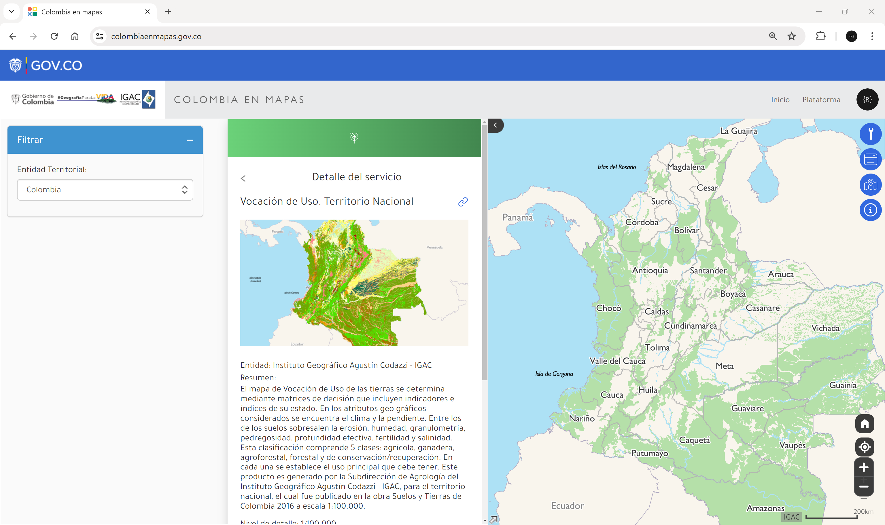</div>

:pencil2:**Tarea:** Descargue, procese y analice este mapa para el área de proyecto.


## 3. Conflictos de uso

El mapa de conflictos de uso de las tierras del IGAC del año 2016, resulta de las discrepancias entre el uso que hace la población del medio natural y el que debería tener, de acuerdo con sus potencialidades y restricciones ambientales. El IGAC, a través de la Subdirección de Agrología, ha venido investigando durante los últimos 25 años, los criterios y metodologías tendientes a establecer el uso y las prácticas de manejo que deben tener los suelos y tierras del país, buscando su productividad sostenible en función de la oferta y demanda ambientales. Su mayor dedicación se ha concentrado en aspectos agrícolas, ganaderos, agroforestales, forestales y de conservación/recuperación de suelos y aguas. Este producto es generado por la Subdirección de Agrología del Instituto Geográfico Agustín Codazzi - IGAC, para el territorio nacional, el cual fue publicado en la obra Suelos y Tierras de Colombia 2016 a escala 1:100.000.

Este mapa puede ser obtenido de https://www.colombiaenmapas.gov.co/ ingresando la cadena de búsqueda _Conflictos de uso de la tierra año 2012. Territorio nacional_.

Servicio: https://www.colombiaenmapas.gov.co/?u=0&t=43&servicio=1652


<div align="center">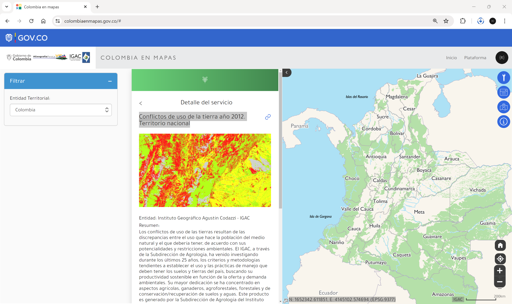</div>

:pencil2:**Tarea:** Descargue, procese, homologue y cargue el análisis requerido en la capa _ConflictoUsoSuelo_ del modelo ANLA.

<div align="center">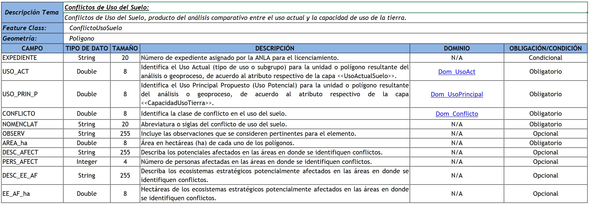</div>


## 4. Uso actual del suelo

Corresponde al uso que se le está dando actualmente al suelo y está directamente relacionado con la cobertura de la tierra. Este análisis puede ser realizado a partir de unidades prediales combinando con la información del registro 1 de catastro, en los que se encuentra la destinación económica.

* Clase complementaria: [Análisis de destinaciones económicas IGAC (creación de dominios)](https://github.com/rcfdtools/R.SIGE/blob/main/activity/LandUseIGAC/Readme.md)
* Predios nacionales año 2020: https://github.com/rcfdtools/R.GISMobile
* [Registro 1 catastral Cundinamarca a 20231231](../../file/data/IGAC/25_Cundinamarca_Registro1_20231231.zip).

:pencil2:**Tarea:** Descargue, procese, homologue y cargue el análisis requerido en la capa _UsoActualSuelo_ del modelo ANLA.

<div align="center">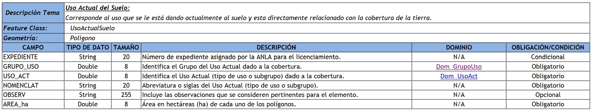</div>


## 5. Capacidad de uso de tierra

El mapa de _Capacidad de uso de las tierras de la República de Colombia a escala 1:100.000_ del Instituto Geográfico Agustín Codazzi - IGAC, contiene la Clasificación por Capacidad de Uso está basada en la interpretación de las Unidades Cartográficas que integran el mapa de suelos del país (escala 1:100.000). La interpretación busca establecer las restricciones y potencialidades biofísicas de las tierras. Los criterios para evaluarlas y sus rangos de variación se adaptaron al país; a partir de la clasificación originada en los Estados Unidos; a través de la experiencia proporcionada durante más de cinco décadas de aplicación. La clasificación propende por la utilización correcta de las tierras del país y; al estar espacializada; constituye un criterio imprescindible en los planes de ordenamiento territorial; en la toma de decisiones con el fin de reducir su uso irracional y en la planificación de sus recursos naturales. Dado que el producto integra varios insumos, se visualiza la fecha de insumo correspondiente al más reciente utilizado durante su elaboración.

Servicio: https://www.colombiaenmapas.gov.co/?u=0&t=43&servicio=1776

<div align="center">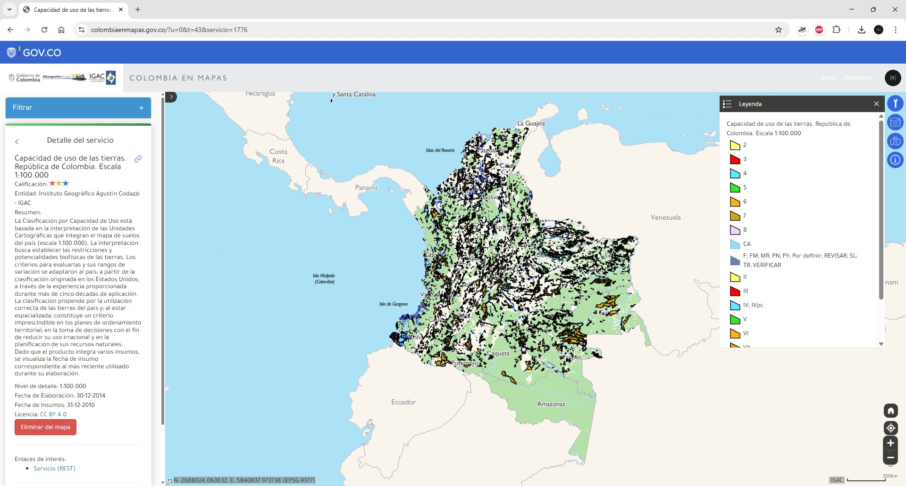</div>

:pencil2:**Tarea:** Descargue, procese, homologue y cargue el análisis requerido en la capa _CapacidadUsoTierra_ del modelo ANLA.

<div align="center">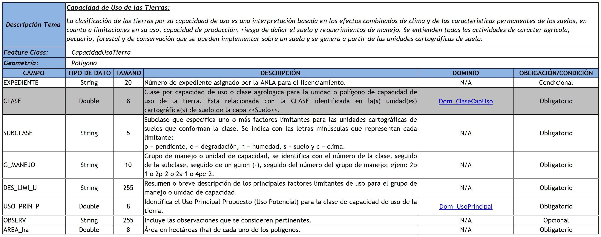</div>


## 6. Suelos en áreas de humedales

El mapa de _Suelos en las áreas de influencia de los humedales de Colombia - Región Andina_, es un producto resultado de la ejecución del contrato 13-13-014-091PS, firmado entre el Instituto Geográfico Agustín Codazzi (IGAC) y el Instituto Humboldt, en el marco del convenio 005 (13-014) entre el Instituto Humboldt y el Fondo Adaptación. Muestra las unidades de capacidad de uso de tierras generadas para los suelos de los humedales de la región Andina, mediante el levantamiento semidetallado del suelo en las áreas de influencia de los humedales de Colombia en 2015.

* Servicio: https://www.colombiaenmapas.gov.co/?u=0&t=43&servicio=805
* Entidad: Instituto de Investigación de Recursos Biológicos Alexander von Humboldt - IvAH
* Nivel de detalle: 1:25.000
* Fecha de Elaboración: 29-11-2016
* Fecha de Insumos: 30-12-2015
* Licencia: CC BY 4.0

<div align="center">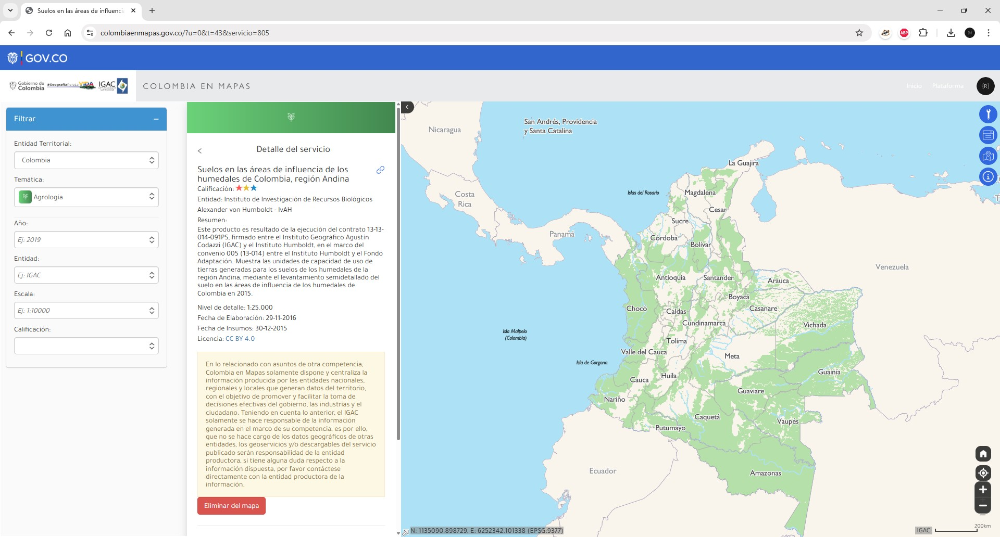</div>

:pencil2:**Tarea:** Descargue, procese y analice este mapa para el área de proyecto.


## 7. Estudio de zonas de páramo

Según el artículo 4 de la Ley 1930 de 2018 o Ley de páramos, el Ministerio de Ambiente y Desarrollo Sostenible debe realizar la delimitación de los páramos con base en el área de referencia generada por el Instituto de Investigación de Recursos Biológicos Alexander von Humboldt a escala 1:25.000. En este ejercicio, realizaremos la delimitación a partir de una cota específica utilizando el modelo digital de elevación ESA Copernicus y evaluaremos su correspondencia con el mapa de Complejos de páramos de Colombia del IvAH.

El Instituto Humboldt es una entidad colombiana, vinculada al Ministerio de Ambiente y Desarrollo Sostenible, regida por el derecho privado, que investiga acerca de la biodiversidad y de las relaciones entre esta y el bienestar humano.[^1]

Constituido en diciembre de 1993, mediante la Ley 99, comenzó operaciones en enero de 1995 en Villa de Leyva, Boyacá. En la actualidad el Claustro de San Agustín es una de las tres sedes del Instituto, donde se almacenan las Colecciones Biológicas que soportan el inventario nacional de la biodiversidad, parte de las cuales fueron heredadas del antiguo Inderena. Las otras sedes del Instituto están en Bogotá, D. C. (Venado de Oro, Calle 72 y Calle 28) y el Laboratorio de Biología Molecular y Banco de Tejidos, en Palmira, Valle, en las instalaciones del Centro Internacional de Agricultura Tropical (Ciat). Adicionalmente, el Instituto tiene investigadores en campo en los sitios donde se llevan a cabo los proyectos de investigación y de profesionales en distintas locaciones del país, vinculados a través de teletrabajo.

Para garantizar la operación institucional, el Instituto recibe recursos públicos de fuentes diversas como el Presupuesto General de la Nación, el Sistema General de Regalías y el Fondo Nacional Ambiental (Fonam), entre otros. Así mismo, gestiona proyectos de investigación y gestión de cooperación internacional, municipios y empresas privadas.

**Complejos de páramos de Colombia**: esta información corresponde a la actualización de los límites cartográficos de los Complejos de Páramos de Colombia, a escala 1:100.000, con criterios y variables unificados para el país. Las principales variables consideradas para la actualización del límite fueron: Temperatura promedio anual, geo-sistemas de alta montaña, modelos potenciales de presencia de fauna y flora, integridad ecológica e imágenes de satélite de alta resolución.

Desde el portal de datos abiertos del [SIAC](https://siac-datosabiertos-mads.hub.arcgis.com/search?q=otl), descargue la capa de [Páramos delimitados Junio 2020 - SIAC](https://siac-datosabiertos-mads.hub.arcgis.com/datasets/9631ed8c44274baa824e6277276de48f/about), guarde y descomprima en la carpeta [/data/IvAH](../../file/data/IvAH).

<div align="center">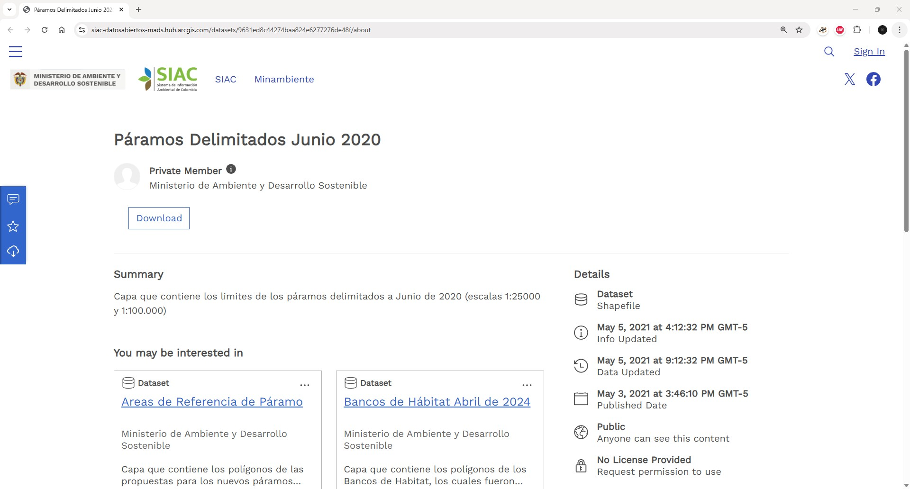</div>

:pencil2:**Tarea:** Descargue, procese y analice este mapa para el área de proyecto.


## 8. Ecosistemas

* Servicio: https://www.colombiaenmapas.gov.co/?u=0&t=2&servicio=1454
* Entidad: Ministerio de Ambiente y Desarrollo Sostenible
* Resumen: El mapa Áreas de Importancia Especial y de Ecosistemas Estratégicos ilustra las 37 áreas de páramo delimitadas en el país mediante las leyes 1450 de 2011 y 1753 de 2015, que fueron ratificadas por la Ley 1930 de 2018. Asimismo, el mapa ilustra las zonas en reservas forestales de Ley 2ª de 1959 que abarcan una superficie total de 65.280.321 ha, y que fueron establecidas para el desarrollo de la economía forestal y protección de los suelos, las aguas y la vida silvestre. Por otra parte, también se ilustran los ecosistemas de humedales reconocidos por el Ministerio de Ambiente y Desarrollo Sostenible. Se representan los 12 sitios designados como Humedales de Importancia Internacional de la Convención Ramsar con más de un millón de hectáreas reconocidas, destacando el primer complejo urbano de Humedales Altoandinos de Latinoamérica ubicado en Bogotá declarado en 2018 (Ministerio de Ambiente y Desarrollo Sostenible, 2021).
* Fecha de Elaboración: 30-12-2021
* Fecha de Insumos: 30-12-2021

<div align="center">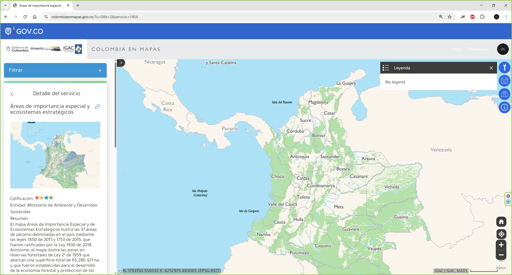</div>

:pencil2:**Tarea:** Descargue, procese y analice este mapa para el área de proyecto.


## Referencias

* [Mapa Digital de Suelos del Departamento de Cundinamarca, República de Colombia. Escala 1:100.000. Año 2001.](https://metadatos.icde.gov.co/geonetwork/srv/api/records/f7c184ea-8abb-45a5-9cf2-1f88981760b6)
* https://www.colombiaenmapas.gov.co/
* https://geoportal.igac.gov.co/contenido/datos-abiertos-agrologia
* https://www.datos.gov.co/dataset/vocaciondeusoterritorionacional/ip25-k55k/about_data
* [Páramos delimitados Junio 2020 - SIAC](https://siac-datosabiertos-mads.hub.arcgis.com/datasets/9631ed8c44274baa824e6277276de48f/about)


##

_R.IAMB es de uso libre para fines académicos, conoce nuestra licencia, cláusulas, condiciones de uso y como referenciar los contenidos publicados en este repositorio, dando [clic aquí](../../LICENSE.md)._

_¡Encontraste útil este repositorio!, apoya su difusión marcando este repositorio con una ⭐ o síguenos dando clic en el botón Follow de [rcfdtools](https://github.com/rcfdtools) en GitHub._


| [◄ Anterior](../Geology/Readme.md) | [:house: Inicio](../../README.md) | [:beginner: Ayuda / Colabora](https://github.com/rcfdtools/R.IAMB/discussions/1) | [Siguiente ►](../RemoteSensingDL/Readme.md) |
|------------------------------------|-----------------------------------|----------------------------------------------------------------------------------|---------------------------------------------|

[^1]: Cohen, K.M., Finney, S.C., Gibbard, P.L. y Fan, J.-X. (2013; actualizado) The ICS International Chronostratigraphic Chart. Episodes 36: 199-204. 
 

