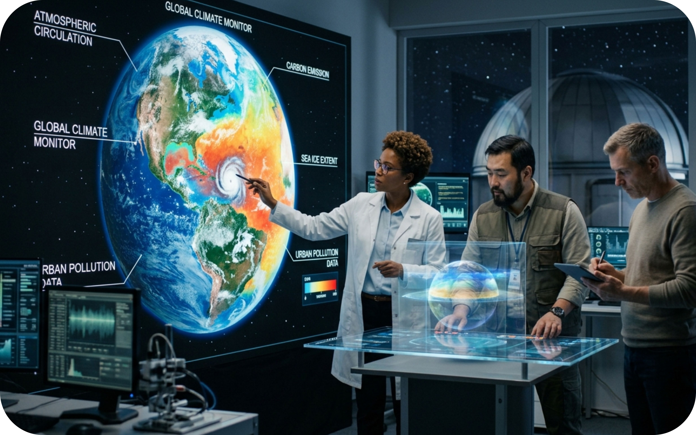

## :large_blue_circle: Módulo 3 - Estudios ambientales - Análisis aplicado

**Objetivo**: Aplicar los conceptos y habilidades computacionales obtenidas en los módulos 1 y 2 para el análisis ambiental de la zona de proyecto utilizando SIG. Cada estudiante investiga y realiza de forma autónoma los análisis requeridos, utilizando como apoyo talleres guía realizados en otros cursos de [rcfdtools](https://github.com/rcfdtools).

El análisis ambiental es un proceso técnico, sistemático y multidisciplinario que evalúa los efectos que un proyecto, actividad, política pública o plan puede tener sobre el medio ambiente. Su finalidad es prevenir, minimizar o compensar impactos negativos en el entorno natural, social y económico, asegurando que el desarrollo territorial se lleve a cabo de forma sostenible. 

# 3.1. Guía general de investigación
Keywords: `research` `applied-research` `population` `weather-series` `reservoir` `dam` `ndvi` `isoline` `era5` `natural-hazard`

Guía con descripción de actividades de investigación aplicada a realizar por cada estudiante.

 Generado con: <a href="https://gemini.google.com/app/c4b76a216d00c4c1">https://gemini.google.com</a>  

## Objetivos

* Aplicar conceptos y habilidades de análisis geográfico.
* Investigar y analizar con herramientas SIG de uso libre, algunos de los componentes aplicados en estudios ambientales.

## Requerimientos

Archivos, actividades previas, lecturas y herramientas requeridas para el desarrollo de esta actividad:

| Requerimiento                                                                                                 | Descripción                                                                                        |
|:--------------------------------------------------------------------------------------------------------------|:---------------------------------------------------------------------------------------------------|
| [:toolbox:Herramienta](https://qgis.org/)                                                                     | QGIS 4.0 o superior.                                                                               |
| [:package:magna_origen_nacional.zip](../../file/data/ANLA/magna_origen_nacional.zip)                             | Geodatabase ANLA Magna Origen Nacional.                                                            |
| [:date:diccionario_datos_geograficos_anla.xlsx](../../file/data/ANLA/diccionario_datos_geograficos_anla.xlsx) | Diccionario de datos geográficos ANLA.                                                             |

## 1. Investigaciones aplicadas

Tomando como referencia las guías de otros cursos y repositorios de [rcfdtools](https://github.com/rcfdtools), desarrolle en software libre las siguientes actividades: 

| Actividad                                                                      | Descripción                                                                                                                                                                                                                                                                                                                                                                                                                                                                                                                                                                                                                                                                                                                                                                                                                                                                                                                                                            | Referencia                                                                                                                                                                                                                                                                                                                                                                                                                                                                                                                                                                                                                                                                                                                                        |
|--------------------------------------------------------------------------------|------------------------------------------------------------------------------------------------------------------------------------------------------------------------------------------------------------------------------------------------------------------------------------------------------------------------------------------------------------------------------------------------------------------------------------------------------------------------------------------------------------------------------------------------------------------------------------------------------------------------------------------------------------------------------------------------------------------------------------------------------------------------------------------------------------------------------------------------------------------------------------------------------------------------------------------------------------------------|---------------------------------------------------------------------------------------------------------------------------------------------------------------------------------------------------------------------------------------------------------------------------------------------------------------------------------------------------------------------------------------------------------------------------------------------------------------------------------------------------------------------------------------------------------------------------------------------------------------------------------------------------------------------------------------------------------------------------------------------------|
| 3.1. Estudio poblacional: censos, proyecciones y demanda de servicios públicos | Conocimiento de la población y de sus dinámicas, ya que son el eje articulador de todos los procesos de desarrollo, teniendo como soporte físico el territorio. Utilizando los datos de población proyectada, crear una representación visual de su crecimiento y la demanda de servicios públicos domiciliarios.                                                                                                                                                                                                                                                                                                                                                                                                                                                                                                                                                                                                                                                      | [SIGE / Estudio poblacional: censos y proyecciones.](https://github.com/rcfdtools/R.SIGE/blob/main/activity/Population/Readme.md)  [SIGE / Representación geográfica de población, densidad poblacional, espacio público efectivo (EPE) y demanda de servicios públicos.](https://github.com/rcfdtools/R.SIGE/blob/main/activity/PopulationGIS/Readme.md)                                                                                                                                                                                                                                                                                                                                                                                 |
| 3.2. Tablas de registro climatológico                                          | Para la creación de los mapas requeridos interpolados de variables climatológicas, es necesario a partir de las estaciones seleccionadas para la zona de estudio, obtener las series de valores discretos de precipitación total mensual, temperatura máxima diaria, temperatura mínima diaria y evaporación total diaria. Para la validación o el contraste de información terrestre, se pueden obtener datos satelitales de precipitación diaria total, temperatura y evapotranspiración sobre las localizaciones específicas de la red climatológica utilizada. A partir de la información recopilada y validada para la red estaciones a usar en la zona de estudio y la conformación de series a partir de datos satelitales en las localizaciones específicas de la red, se correlacionan estos datos para evaluar si existe correspondencia y homogeneidad entre ellos.  ANLA: Atmósfera - RegistrosCalidadAireTB, Clima - RegistrosEstMeteorologicaTB. | [LTWB / Obtención y unión de series de datos discretos climatológicos de estaciones terrestres.](https://github.com/rcfdtools/R.LTWB/blob/main/activity/CNEStationDatasetDownload/Readme.md)  [LTWB / Obtención de series de datos discretos climatológicos satelitales y correlación con datos terrestres.](https://github.com/rcfdtools/R.LTWB/blob/main/activity/RemoteSensing/Readme.md)                                                                                                                                                                                                                                                                                                                                              |
| 3.3. Digitalización de vectores - Perfiles y pendientes ponderadas de cauces   | Tomado como referencia los vectores de la red hidrográfica, la red vial y la base predial y utilizando como mapa base la imágen satelital mundial de ESRI o Google, realice la digitalización de los tramos de drenaje del Río Bogotá y sus afleuntes principales: Rio Sisga, Rio Siecha, Río Neusa, Río Teusaca, Río Frío, Río Chicú, Río Tunjuelo, Río Subachoque o Bojacá, Río Soacha y Río Muña. Cree perfiles detallados de cada río utilizando diferentes DEM satelitales y compare sus diferencias.                                                                                                                                                                                                                                                                                                                                                                                                                                                             | [SIGE / Digitalización de vectores: drenajes, vías y predios.](https://github.com/rcfdtools/R.SIGE/blob/main/activity/Digitizing/Readme.md)  [SIGE / Perfiles de muestreo en red hidrográfica y vías principales.](https://github.com/rcfdtools/R.SIGE/blob/main/activity/DEMProfile/Readme.md)  [DAPC / Mapas e imágenes / Modelos digitales de elevación DEM - Red de interconexión energética 3D.](https://github.com/rcfdtools/R.DAPC/blob/main/activity/M02A03b/Readme.md)  [HydroBogota / Estudio de amenazas hidráulicas en la llanura de inundación de la cuenca del Río Bogotá - Cundinamarca - Colombia - Suramérica.](https://github.com/rcfdtools/R.HydroBogota/blob/main/file/hec/HECRAS_Model0/Model0.xlsx) |
| 3.4. Estudio geográfico de embalses o reservorios                              | A partir del modelo de terreno ESA Copernicus, identifique dentro de la zona de estudio, un área hidrográfica que permita crear un embalse, presente los siguientes elementos y análisis: punto de localización de pantalla de presa, linea de corona para una presa de al menos 5 metros de altura, curva de nivel de cierre y polígono de superficie o extensión máxima de lámina de agua, cálculo de curvas de elevación almacenamiento y elevación área.                                                                                                                                                                                                                                                                                                                                                                                                                                                                                                           | [SIGE / Estudio geográfico de embalses.](https://github.com/rcfdtools/R.SIGE/blob/main/activity/Reservoir/Readme.md)                                                                                                                                                                                                                                                                                                                                                                                                                                                                                                                                                                                                                              |
| 3.5. Índices de vegetación: NDVI, SAVI, MSAVI, TSAVI y otros índices           | Utilizando las imágenes satelitales obtenidas en este curso, crear con algebra de mapas, mapas de diferencias normalizadas de vegetación NDVI. Recortar hasta el límite de la zona de estudio, reclasificar las vegetaciones en 4 clases (definidas manualmente con cortes en 0.1, 0.23, 0.35 y 1 o hasta el valor máximo). A partir del número de celdas obtenidas en cada clase, calcule áreas y realice un análisis comparativo entre los datos obtenidos entre dos instantes de tiempo, explique las diferencias encontradas. Compare los mapas de vegetación obtenidos con el mapa de usos potenciales del suelo del IGAC, explique si existe alguna correspondencia en sus límites internos. Cree mapas para índices complementarios.                                                                                                                                                                                                                            | [SIGE / Índices de vegetación: NDVI, SAVI, MSAVI, TSAVI y otros índices.](https://github.com/rcfdtools/R.SIGE/blob/main/activity/RemoteSensingNDVI/Readme.md)                                                                                                                                                                                                                                                                                                                                                                                                                                                                                                                                                                                     |
| 3.6. Generación de mapas ráster interpolados, isolíneas y zonificación térmica | Durante el proceso de análisis climatológico, es necesaria la construcción de mapas continuos e interpolados que representen espacialmente el comportamiento de las diferentes variables requeridas y fenómenos climatológicos asociados a nivel multianual. A partir del modelo digital de elevación ESA Copernicus, crear los mapas de pisos térmicos con clasificación convencional (cortes cada 1000 m.s.n.m) y clasificación Francisco José de Caldas (año 1802, intervalos: 800, 1800, 2800, 3700 y 4700 m.s.n.m).  ANLA: MDPrec, MDTemp, MDPM10Diario, MDPM10Anual, Isoyeta, Isoterma, ZonificacionClimatica.                                                                                                                                                                                                                                                                                                                                           |                                                                                                                                                                                                                                                                                                                                                                                                                                                                                                                                                                                                                                                                                                                                                   |
| 3.7. Análisis hidro-climatológico ERA5 Land Monthly                            |                                                                                                                                                                                                                                                                                                                                                                                                                                                                                                                                                                                                                                                                                                                                                                                                                                                                                                                                                                        |                                                                                                                                                                                                                                                                                                                                                                                                                                                                                                                                                                                                                                                                                                                                                   |
| 3.8. Análisis de amenazas naturales                                            |                                                                                                                                                                                                                                                                                                                                                                                                                                                                                                                                                                                                                                                                                                                                                                                                                                                                                                                                                                        |                                                                                                                                                                                                                                                                                                                                                                                                                                                                                                                                                                                                                                                                                                                                                   |

##

_R.IAMB es de uso libre para fines académicos, conoce nuestra licencia, cláusulas, condiciones de uso y como referenciar los contenidos publicados en este repositorio, dando [clic aquí](../../LICENSE.md)._

_¡Encontraste útil este repositorio!, apoya su difusión marcando este repositorio con una ⭐ o síguenos dando clic en el botón Follow de [rcfdtools](https://github.com/rcfdtools) en GitHub._

| [◄ Anterior](../CNEStation/Readme.md) | [:house: Inicio](../../README.md) | [:beginner: Ayuda / Colabora](https://github.com/rcfdtools/R.IAMB/discussions/1) |
|---------------------------------------|-----------------------------------|----------------------------------------------------------------------------------|

[^1]:

